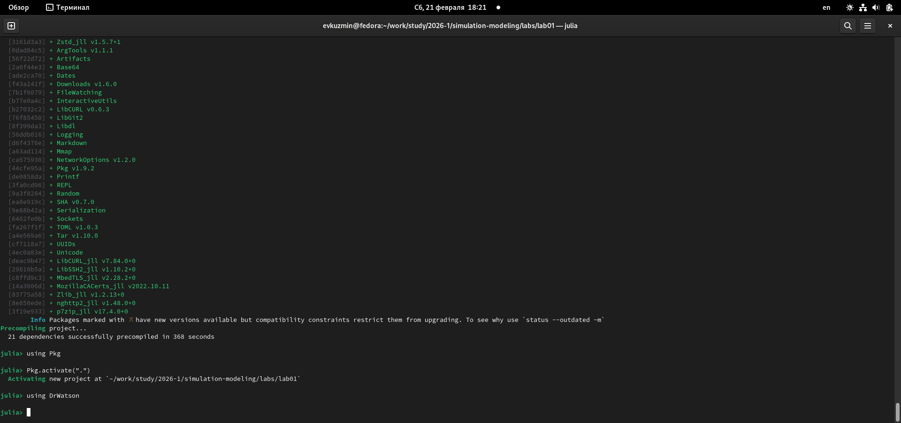
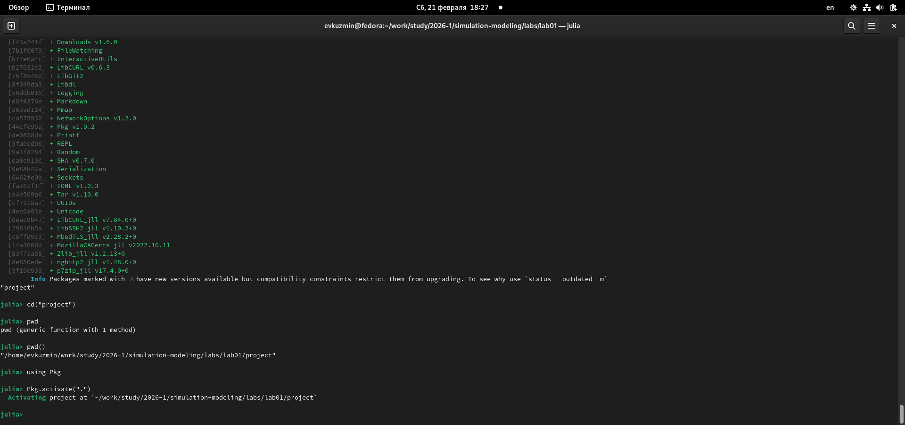

---
## Author
author:
  name: Кузьмин Егор Витальевич
  email: 1132236046@rudn.ru
  affiliation:
    - name: Российский университет дружбы народов
      country: Российская Федерация
      postal-code: 117198
      city: Москва
      address: ул. Миклухо-Маклая, д. 6
## Title
title: Презентация по лабораторной работе №1
date: today
date-format: "YYYY-MM-DD" # Example: 2025-09-06
---

# Информация

## Докладчик

:::::::::::::: {.columns align=center}
::: {.column width="70%"}

  * Кузьмин Егор Витальевич
  * студент группы НФИбд-01-23
  * Российский университет дружбы народов им. П. Лумумбы

:::
::::::::::::::

# Вводная часть

## Цель работы

- Освоить подготовку научной презентации на основе результатов лабораторной работы  
- Научиться оформлять материалы исследования в формате Markdown  
- Получить навыки генерации итоговых файлов презентации  

---

## Актуальность

- Представление результатов исследований является обязательным этапом научной работы  
- Презентация позволяет кратко и наглядно донести основные идеи  
- Использование Markdown упрощает подготовку материалов  
- Автоматическая генерация форматов экономит время  

---

## Объект исследования

- Процесс подготовки научной презентации  
- Инструменты генерации презентаций из текстового описания  
- Форматы вывода: HTML, PDF  

---

## Задачи работы

- Подготовить структуру презентации  
- Описать содержание исследования  
- Добавить иллюстрации выполнения работы  
- Сгенерировать итоговую презентацию  

---

## Материалы и инструменты

- Операционная система Linux  
- Markdown / Quarto  
- Git для управления версиями  
- Терминал для выполнения команд  

---

## Подготовка окружения

На данном этапе выполнялась настройка среды и проверка установленных компонентов.

### 2. Подготовка рабочей директории проекта

После проверки установки Julia была открыта рабочая директория проекта моделирования.  
Проверено наличие каталогов проекта и корректность их структуры.

Результат отображения рабочей директории представлен на рисунке.

---

### 3. Проверка состояния окружения проекта

Далее была выполнена активация окружения проекта Julia и проверка установленных пакетов.  
Это позволило убедиться, что окружение корректно настроено и содержит необходимые зависимости.

Результат проверки окружения показан на следующем рисунке.

---

### 4. Проверка установки DrWatson

Была проведена проверка установленных пакетов через Pkg.using

---

### 5. Проверка структуры проекта и файлов

Дополнительно была проведена проверка расположения файлов проекта, каталогов и изображений, используемых в отчёте.

На рисунке ниже представлена структура проекта.

---

## Выводы

В результате выполнения лабораторной работы были изучены основы математического моделирования и структура проекта моделирования в среде Julia. Освоены навыки:

- работы с терминалом,
- активации окружения проекта,
- проверки установленных пакетов,
- организации структуры каталогов,
- подготовки отчёта в системе Quarto.

Полученные знания могут быть использованы при дальнейшем изучении численных методов, решении дифференциальных уравнений и разработке моделей динамических систем.
