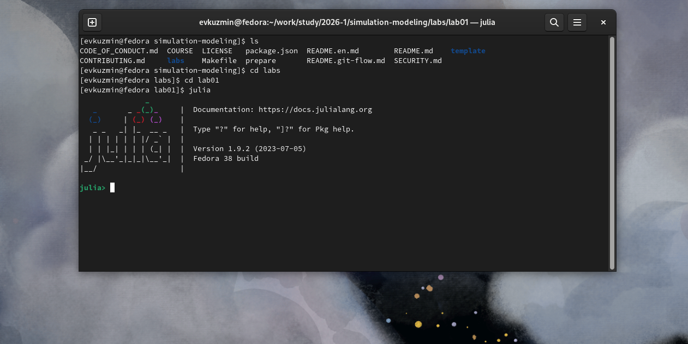
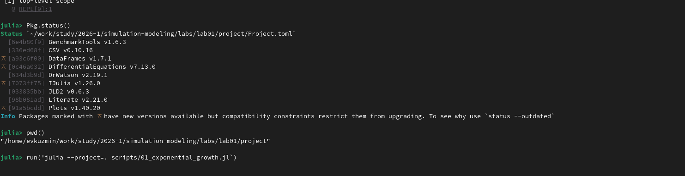

---
## Author
author:
  name: Егор Витальевич Кузьмин
  email: 1132236046@rudn.ru
  affiliation:
    - name: Российский университет дружбы народов
      country: Российская Федерация
      postal-code: 117198
      city: Москва
      address: ул. Миклухо-Маклая, д. 6

## Title
title: "Отчет по лабораторной работе №1"
---

# Цель работы

Целью лабораторной работы является изучение основ математического моделирования динамических процессов на примере модели экспоненциального роста, освоение структуры проекта моделирования, получение навыков работы с окружением Julia, подключением библиотек и подготовкой отчёта с использованием Quarto.

Дополнительно целью является знакомство со стандартной организацией каталогов проекта, практическое применение команд терминала Linux и формирование отчётной документации по результатам выполнения лабораторной работы.

---

## Постановка задачи

В рамках лабораторной работы необходимо:

1. Подготовить рабочую структуру проекта моделирования.
2. Активировать окружение проекта Julia.
3. Проверить наличие необходимых пакетов.
4. Создать и подготовить отчёт.
5. Зафиксировать этапы выполнения с помощью скриншотов.
6. Описать теоретические основы модели.
7. Сформулировать выводы по выполненной работе.

---

## Теоретические сведения

Экспоненциальный рост является одной из базовых моделей математического моделирования. Он описывает процессы, при которых скорость изменения величины пропорциональна её текущему значению.

Модель задаётся дифференциальным уравнением:

$$
\frac{du}{dt} = a u
$$

где:

- $u(t)$ — значение функции во времени,
- $a$ — коэффициент роста,
- $u(0)=u_0$ — начальное значение.

Решение уравнения имеет вид:

$$
u(t) = u_0 e^{at}
$$

Такая модель применяется для описания:

- роста численности популяции,
- накопления капитала,
- радиоактивного распада (при отрицательном коэффициенте),
- распространения процессов в физике и биологии.

---

## Описание структуры проекта

Проект моделирования организован в виде набора каталогов:

- `project/` — окружение Julia и зависимости,
- `scripts/` — файлы моделирования,
- `data/` — результаты вычислений,
- `plots/` — построенные графики,
- `report/` — отчёт и изображения.

Такая структура соответствует рекомендациям по организации проектов научных вычислений и позволяет удобно управлять зависимостями и результатами работы.

---

## Ход выполнения работы

### 1. Проверка установленной среды Julia

На начальном этапе была выполнена проверка установленной среды Julia и её готовности к работе.  
Открыт терминал, запущена Julia, подтверждена корректность установки и доступность интерпретатора.

Данный этап подтверждает возможность выполнения дальнейших вычислений и работы с проектом моделирования.

---

### 2. Подготовка рабочей директории проекта

После проверки установки Julia была открыта рабочая директория проекта моделирования.  
Проверено наличие каталогов проекта и корректность их структуры.

Результат отображения рабочей директории представлен на рисунке.

---

### 3. Проверка состояния окружения проекта

Далее была выполнена активация окружения проекта Julia и проверка установленных пакетов.  
Это позволило убедиться, что окружение корректно настроено и содержит необходимые зависимости.

Результат проверки окружения показан на следующем рисунке.

---

### 4. Проверка установки DrWatson

Была проведена проверка установленных пакетов через Pkg.using

---

### 5. Проверка структуры проекта и файлов

Дополнительно была проведена проверка расположения файлов проекта, каталогов и изображений, используемых в отчёте.

На рисунке ниже представлена структура проекта.

---

## Выводы

В результате выполнения лабораторной работы были изучены основы математического моделирования и структура проекта моделирования в среде Julia. Освоены навыки:

- работы с терминалом,
- активации окружения проекта,
- проверки установленных пакетов,
- организации структуры каталогов,
- подготовки отчёта в системе Quarto.

Полученные знания могут быть использованы при дальнейшем изучении численных методов, решении дифференциальных уравнений и разработке моделей динамических систем.

---

## Список литературы

1. Учебно-методические материалы по дисциплине «Математическое моделирование».
2. Документация языка Julia — https://julialang.org
3. Документация пакета DifferentialEquations.jl
4. Документация Quarto — https://quarto.org

