---
## Author
author:
  name: Кузьмин Егор Витальевич
  email: 1132236046@rudn.ru
  affiliation:
    - name: Российский университет дружбы народов
      country: Российская Федерация
      postal-code: 117198
      city: Москва
      address: ул. Миклухо-Маклая, д. 6
## Title
title: Презентация по лабораторной работе №1
date: today
date-format: "YYYY-MM-DD" # Example: 2025-09-06
---

# Информация

## Докладчик

:::::::::::::: {.columns align=center}
::: {.column width="70%"}

  * Кузьмин Егор Витальевич
  * студент группы НФИбд-01-23
  * Российский университет дружбы народов им. П. Лумумбы

:::
::::::::::::::

# Раздел 2

## 2. Вводная часть

---

## 2.1 Цель работы

Освоить методологию литературного и воспроизводимого программирования для создания имитационных моделей.

В рамках лабораторной работы требовалось:

- реализовать модели **SIR** и **Лотки–Вольтерры** на языке Julia;
- выполнить численное решение систем ОДУ;
- сгенерировать графики и провести анализ результатов;
- исследовать влияние параметров моделей;
- интегрировать результаты в Quarto-отчёт.

---

## 2.2 Задачи

- подготовить проект Julia и активировать окружение;
- реализовать базовую модель **SIR**;
- выполнить исследование модели **SIR** при изменении параметра $\beta$;
- реализовать базовую модель **Лотки–Вольтерры**;
- выполнить исследование модели **Лотки–Вольтерры** при изменении параметра $\alpha$;
- построить графики и получить численные характеристики;
- оформить результаты в виде отчёта и презентации.

---

## 2.3 Используемые инструменты

В работе применялись:

- **Julia**
- **DifferentialEquations.jl**
- **Plots.jl**
- **DataFrames.jl**
- **DrWatson.jl**
- **Quarto**

Структура проекта включала каталоги:

- `scripts/`
- `plots/`
- `data/`
- `notebooks/`
- `report/`

---

# Раздел 3

## 3. Теоретическое введение

---

## 3.1 Модель SIR — система уравнений

Модель SIR описывает распространение инфекции в замкнутой популяции.

Популяция делится на три группы:

- $S$ — восприимчивые;
- $I$ — инфицированные;
- $R$ — выздоровевшие.

Система уравнений:

$$
\frac{dS}{dt} = - \beta c \frac{I}{N} S
$$

$$
\frac{dI}{dt} = \beta c \frac{I}{N} S - \gamma I
$$

$$
\frac{dR}{dt} = \gamma I
$$

Параметры базовой модели:

- $\beta = 0.05$
- $c = 10$
- $\gamma = 0.25$

Базовое репродуктивное число:

$$
R_0 = \frac{\beta c}{\gamma} = 2.0
$$

---

## 3.2 Модель Лотки–Вольтерры — система уравнений

Модель Лотки–Вольтерры описывает взаимодействие популяций жертв и хищников.

Система уравнений:

$$
\frac{dx}{dt} = \alpha x - \beta xy
$$

$$
\frac{dy}{dt} = \delta xy - \gamma y
$$

где:

- $\alpha$ — скорость размножения жертв;
- $\beta$ — интенсивность поедания жертв;
- $\delta$ — коэффициент конверсии пищи в прирост хищников;
- $\gamma$ — смертность хищников.

Для базовых параметров:

- $\alpha = 0.1$
- $\beta = 0.02$
- $\delta = 0.01$
- $\gamma = 0.3$

Нетривиальное равновесие:

$$
x^* = \frac{\gamma}{\delta} = 30, \qquad
y^* = \frac{\alpha}{\beta} = 5
$$

---

# Раздел 4

## 4. Выполнение лабораторной работы

---

## 4.1 Подготовка проекта

На первом этапе был выполнен запуск среды Julia и активация проекта.

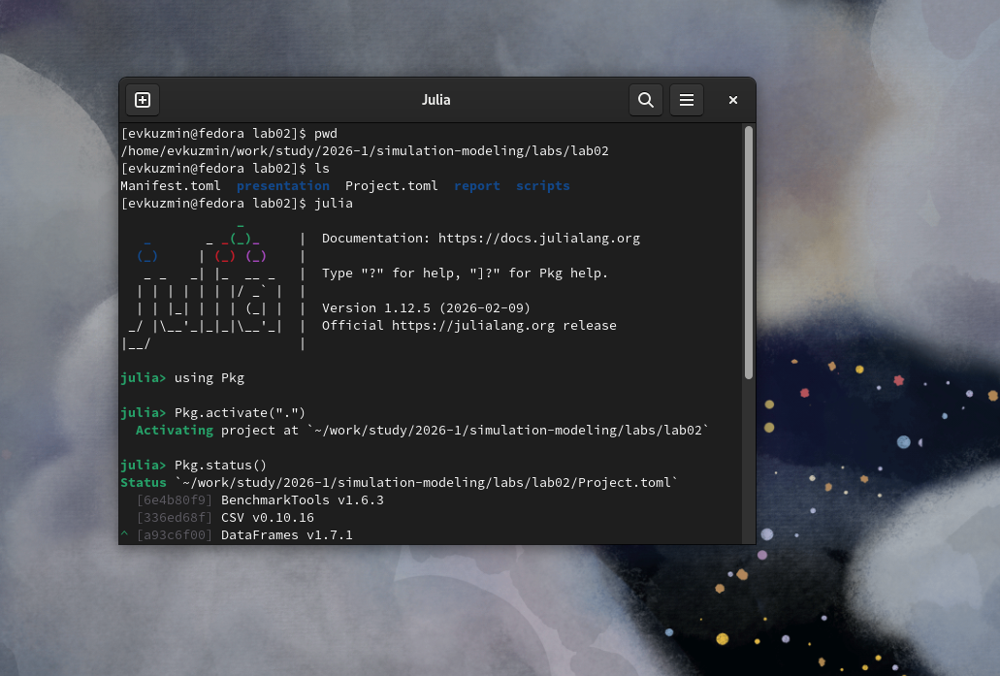

---

## 4.2 Проверка установленных пакетов

После активации проекта была выполнена проверка подключённых зависимостей.

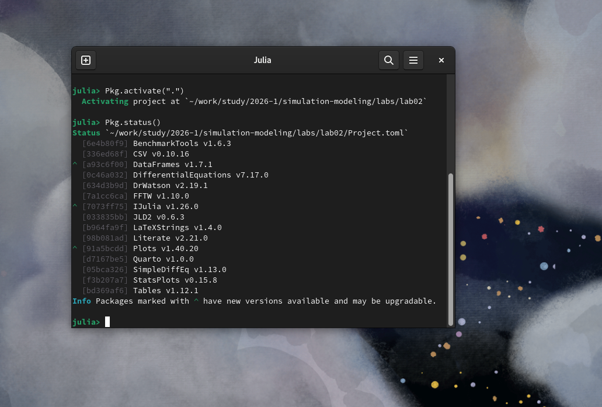

---

## 4.3 Реализация базовой модели SIR

Был подготовлен скрипт с функцией правой части системы ОДУ, начальными условиями и параметрами модели.

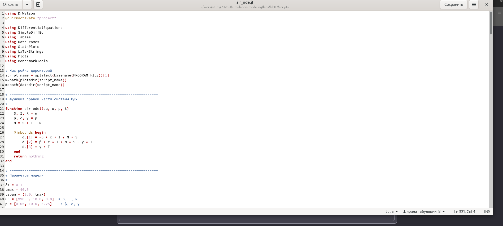

---

## 4.4 Запуск модели SIR

После подготовки скрипта был выполнен запуск модели SIR с активированным окружением проекта.

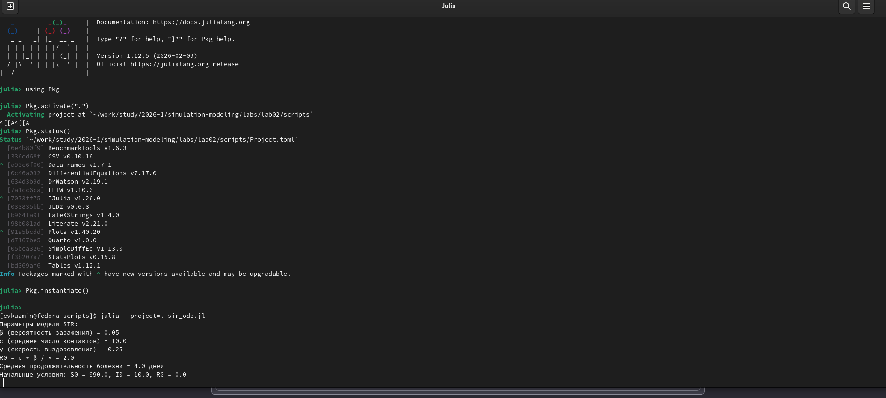

---

## 4.5 Численные результаты модели SIR

В результате выполнения программы были получены численные характеристики эпидемического процесса.

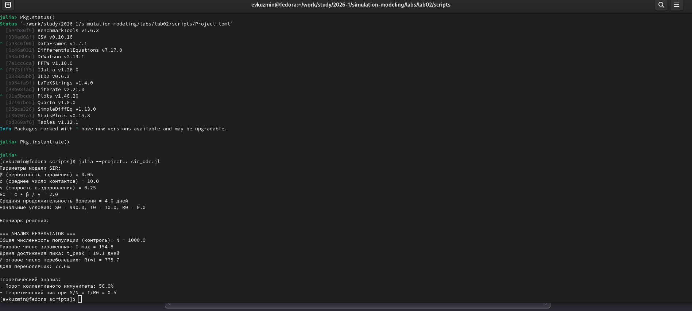

Основные результаты:

- $R_0 = 2.0$
- пик заражённых: $I_{\max} \approx 154.8$
- время достижения пика: $t \approx 19.1$
- итоговая доля переболевших: $77.6\%$

---

## 4.6 Генерация производных файлов проекта

После расчётов была выполнена генерация производных файлов проекта с помощью `tangle.jl`.

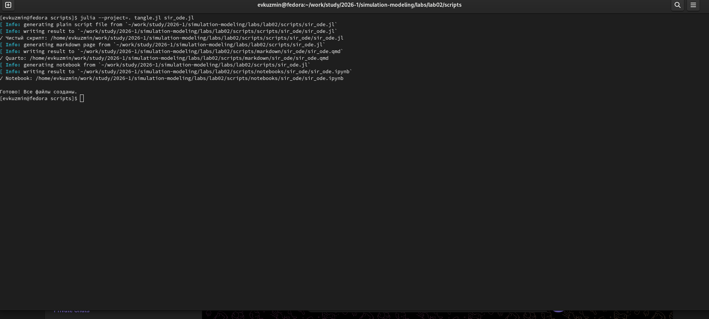

---

## 4.7 Проверка структуры проекта

Была проверена структура каталогов проекта и наличие созданных графиков.

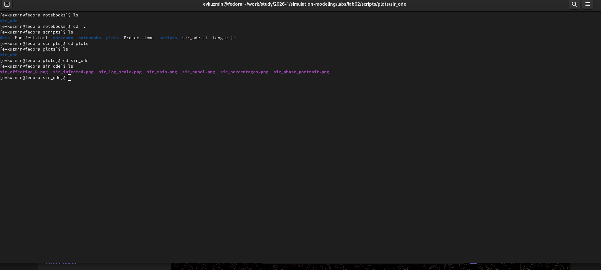

---

## 4.8 Проверка каталогов notebooks и markdown

Также была проверена корректность формирования производных каталогов проекта.

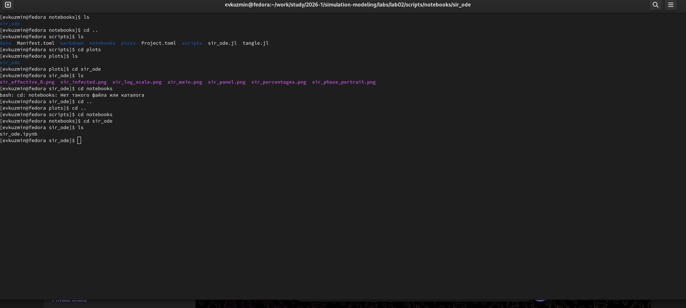

---

## 4.9 Эффективное репродуктивное число в модели SIR

Для анализа развития эпидемии был построен график эффективного репродуктивного числа.

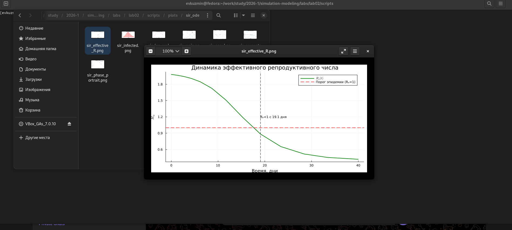

Из графика видно, что в начале моделирования $R_e > 1$, а затем, по мере уменьшения числа восприимчивых, значение $R_e$ падает ниже единицы, и эпидемия затухает.

---

## 4.10 Модель SIR при изменении параметров

Для анализа чувствительности модели была подготовлена модифицированная версия программы с несколькими значениями параметра $\beta$.

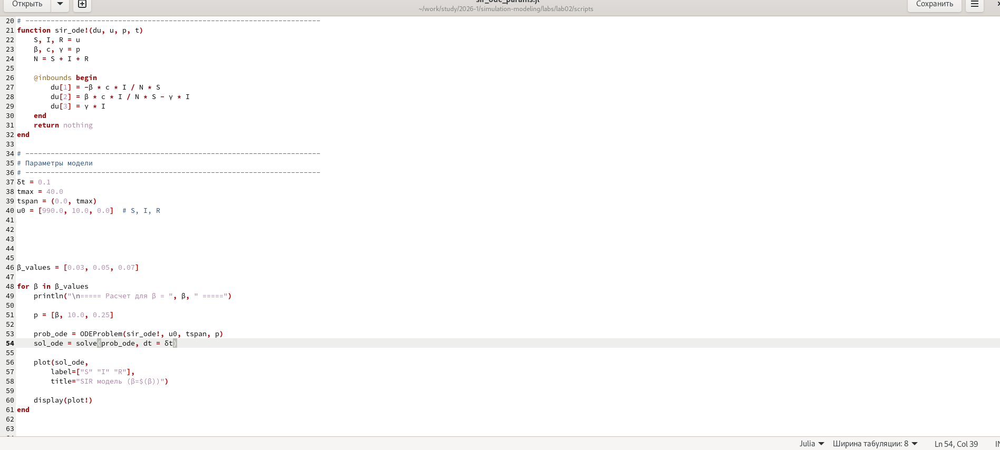

---

## 4.11 Результаты расчётов для разных значений β

После запуска модифицированной модели были получены численные характеристики для нескольких значений $\beta$.

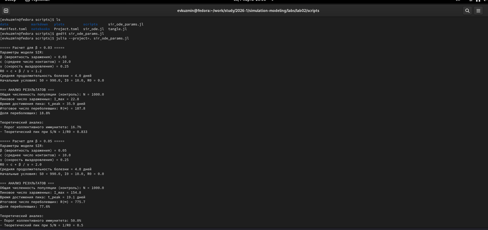

---

## 4.12 Итоговые результаты модели SIR с набором параметров

На заключительном этапе анализа модели SIR были выведены итоговые численные результаты для полного набора параметров.

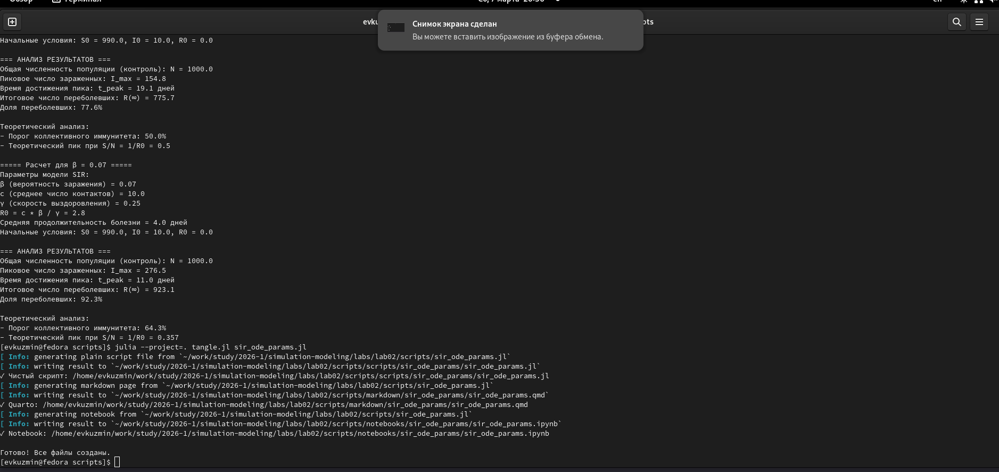

---

## 4.13 Реализация модели Лотки–Вольтерры

После выполнения модели Лотки–Вольтерры были выведены основные статистики и характеристики системы.

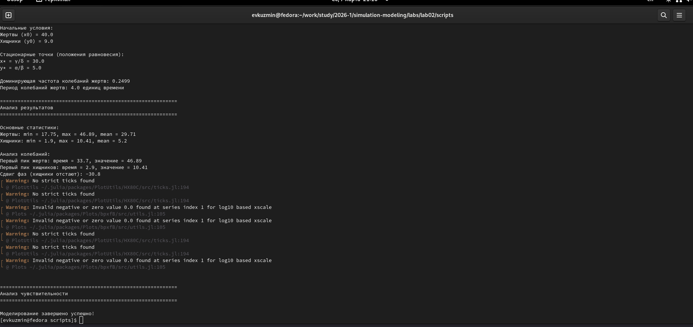

Основные результаты:

- $x^* = 30.0$
- $y^* = 5.0$
- частота колебаний: $\approx 0.2499$
- период колебаний: $\approx 4.0$

---

## 4.14 Особенности построения графиков модели Лотки–Вольтерры

При построении части графиков появились предупреждения, связанные с логарифмическим масштабом и делениями осей.

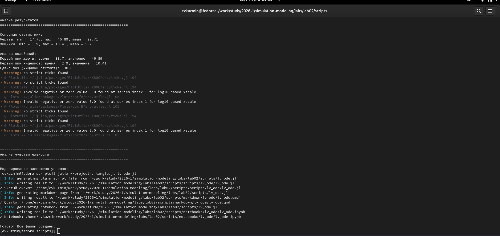

Эти сообщения не повлияли на итоговые результаты моделирования.

---

## 4.15 Итоговый запуск модели Лотки–Вольтерры с набором параметров

На следующем слайде показан итоговый вывод программы после исследования влияния параметра $\alpha$.

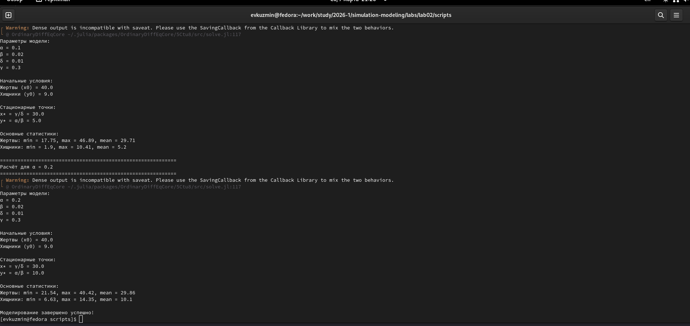

---

# Раздел 5

## 5. Результаты

---

## 5.1 Ключевые графики модели SIR

На следующем рисунке приведена сводная панель графиков модели SIR.

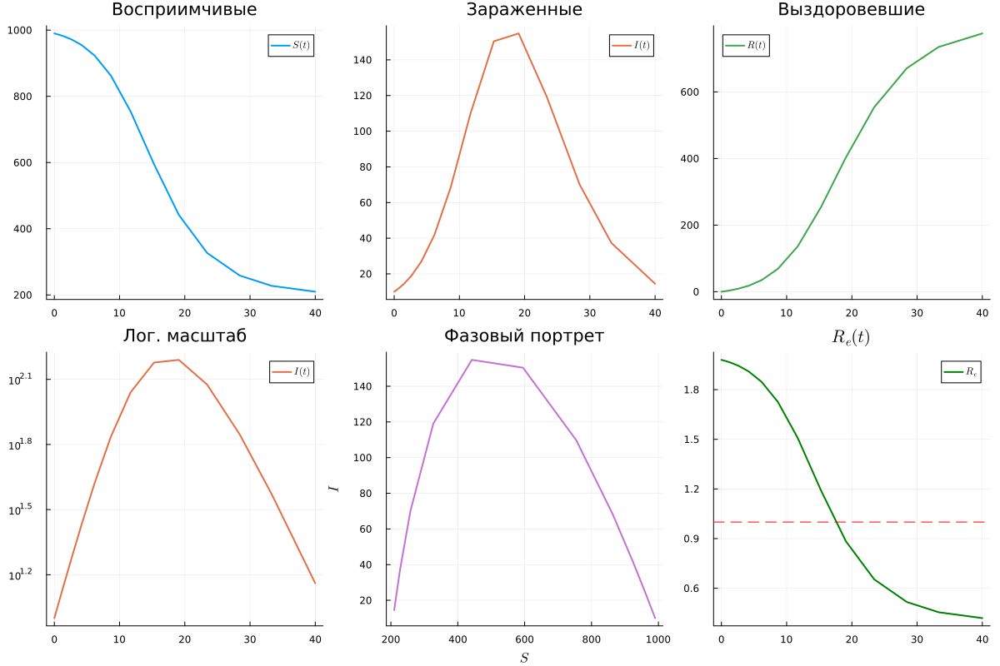

Она включает:

- $S(t)$
- $I(t)$
- $R(t)$
- логарифмический график
- фазовый портрет
- $R_e(t)$

---

## 5.2 Динамика эпидемии SIR

График показывает изменение численности восприимчивых, инфицированных и выздоровевших.

Основные особенности:

- монотонное уменьшение $S(t)$;
- колоколообразная кривая $I(t)$;
- монотонный рост $R(t)$.

---

## 5.3 Фазовый портрет и эффективное репродуктивное число

Для дополнительного анализа были рассмотрены фазовый портрет и график $R_e(t)$.

:::: columns
::: column

::: 
::: column

:::
::::

Эти графики позволяют проследить траекторию развития эпидемии и момент перехода к затуханию процесса.

---

## 5.4 Влияние параметра β в модели SIR

Для трёх значений параметра заражения были построены отдельные графики.

:::: columns
::: column
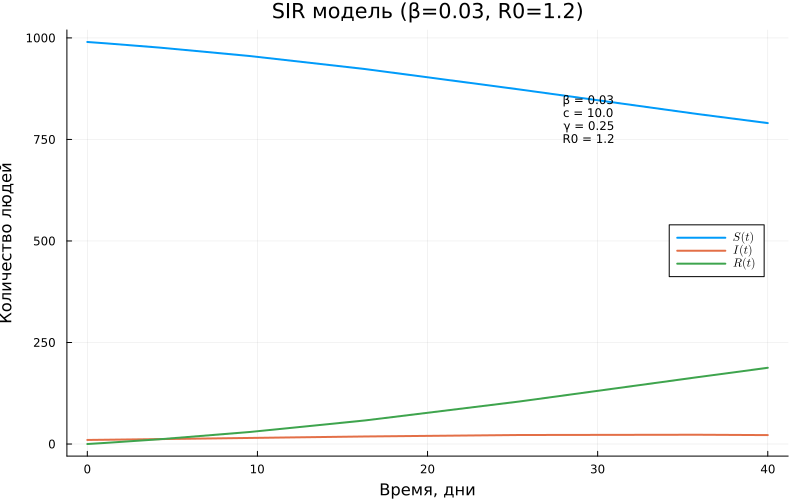
:::
::: column
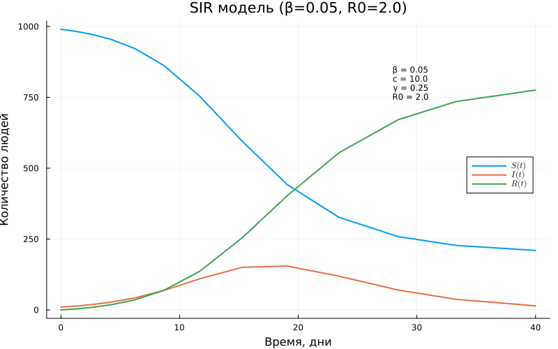
:::
::: column
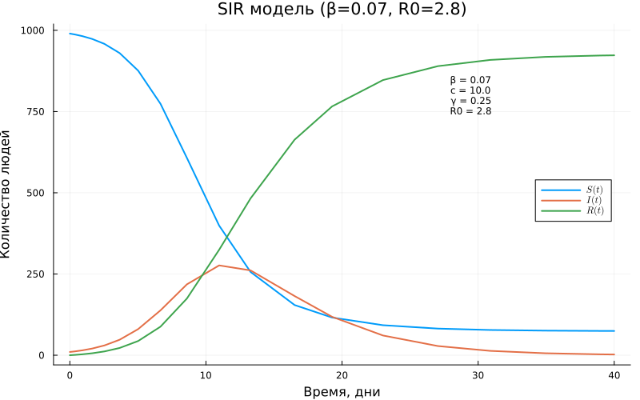
:::
::::

Из сравнения видно, что увеличение $\beta$ приводит к более быстрому развитию эпидемии и росту максимального числа инфицированных.

---

## 5.5 Ключевые графики модели Лотки–Вольтерры

Ниже приведена сводная панель графиков модели Лотки–Вольтерры.

Сводная панель содержит:

- динамику популяций;
- фазовый портрет;
- производные;
- спектральный анализ;
- относительные изменения.

---

## 5.6 Динамика популяций и фазовый портрет

Для базовой модели были отдельно рассмотрены графики динамики популяций и фазовый портрет.

:::: columns
::: column

:::
::: column

:::
::::

Замкнутая траектория фазового портрета подтверждает циклический характер системы.

---

## 5.7 Дополнительные графики модели Лотки–Вольтерры

Были также рассмотрены графики производных, относительных изменений и спектра.

:::: columns
::: column

:::
::: column

:::
::::

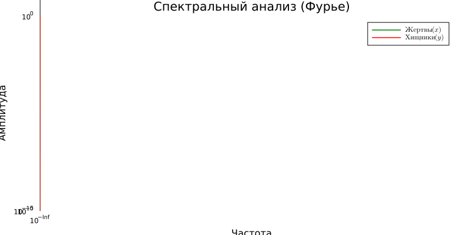

Спектральный анализ подтверждает наличие доминирующей частоты колебаний.

---

## 5.8 Влияние параметра α на поведение системы

Для анализа чувствительности модели Лотки–Вольтерры были построены графики при разных значениях $\alpha$.

:::: columns
::: column
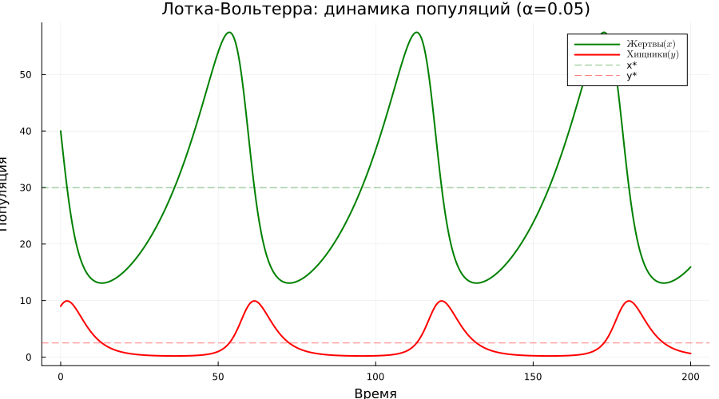
:::
::: column
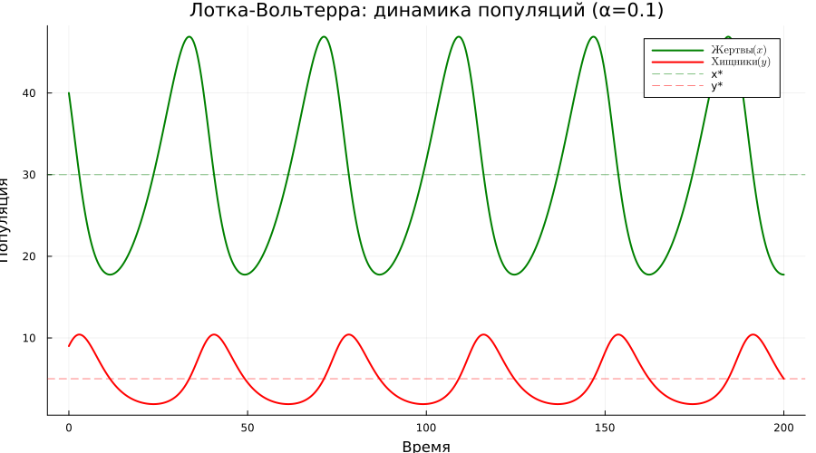
:::
::: column
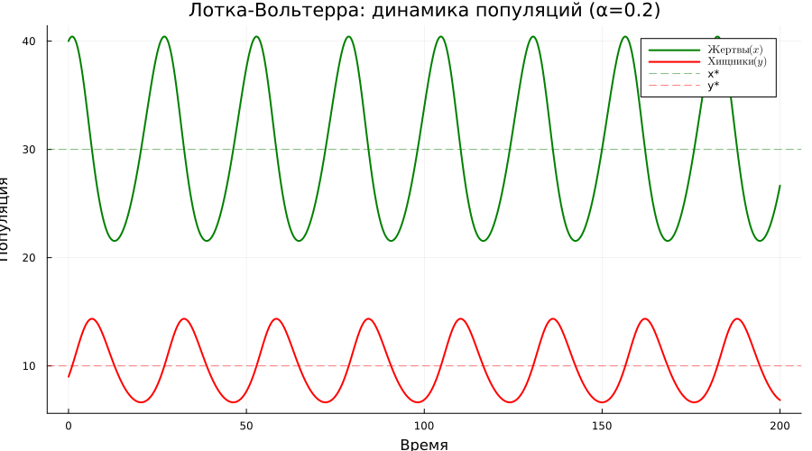
:::
::::

Увеличение $\alpha$ приводит к более быстрому восстановлению популяции жертв и изменению амплитуды колебаний.

---

## 5.9 Фазовые портреты при разных значениях α

Изменение параметра $\alpha$ влияет не только на динамику численностей, но и на форму фазовых траекторий.

:::: columns
::: column
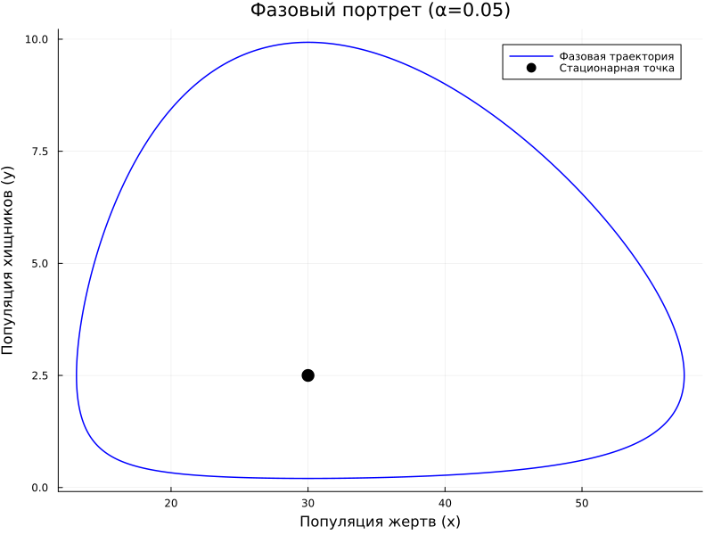
:::
::: column
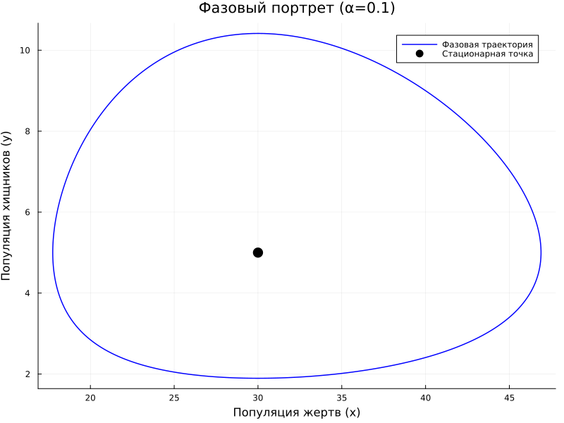
:::
::: column
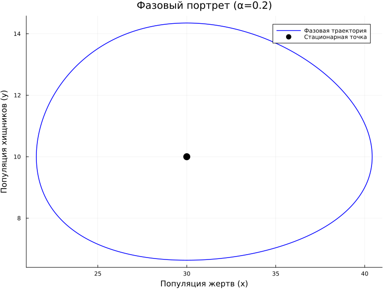
:::
::::

---

## 5.10 Ключевые числовые результаты

**Модель SIR:**

- $R_0 = 2.0$
- $I_{\max} = 154.8$
- пик на $19.1$ день
- переболело $77.6\%$

**Модель Лотки–Вольтерры:**

- равновесие $(30, 5)$
- период $\approx 4.0$
- доминирующая частота $\approx 0.2499$
- циклическое поведение подтверждено графиками и фазовым портретом

---

## 5.11 Выводы

В ходе лабораторной работы:

- реализованы и исследованы модели **SIR** и **Лотки–Вольтерры**;
- выполнено численное моделирование;
- построены графики динамики систем;
- выполнен анализ чувствительности параметров;
- результаты интегрированы в Quarto-отчёт и презентацию.

Модель **SIR** показала развитие эпидемического процесса и влияние параметра заражения на высоту и положение эпидемического пика.

Модель **Лотки–Вольтерры** продемонстрировала циклическое взаимодействие популяций жертв и хищников и влияние параметра роста жертв на характер колебаний.

---

## Спасибо за внимание
