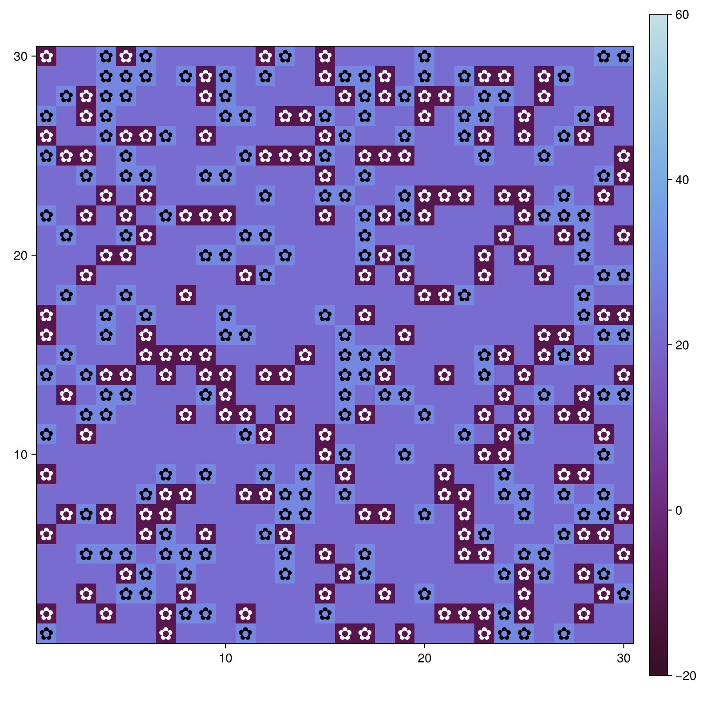
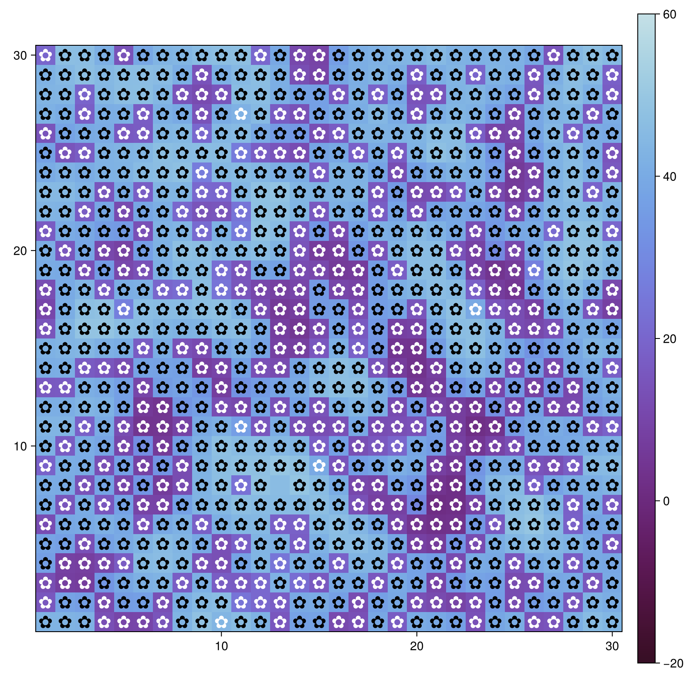
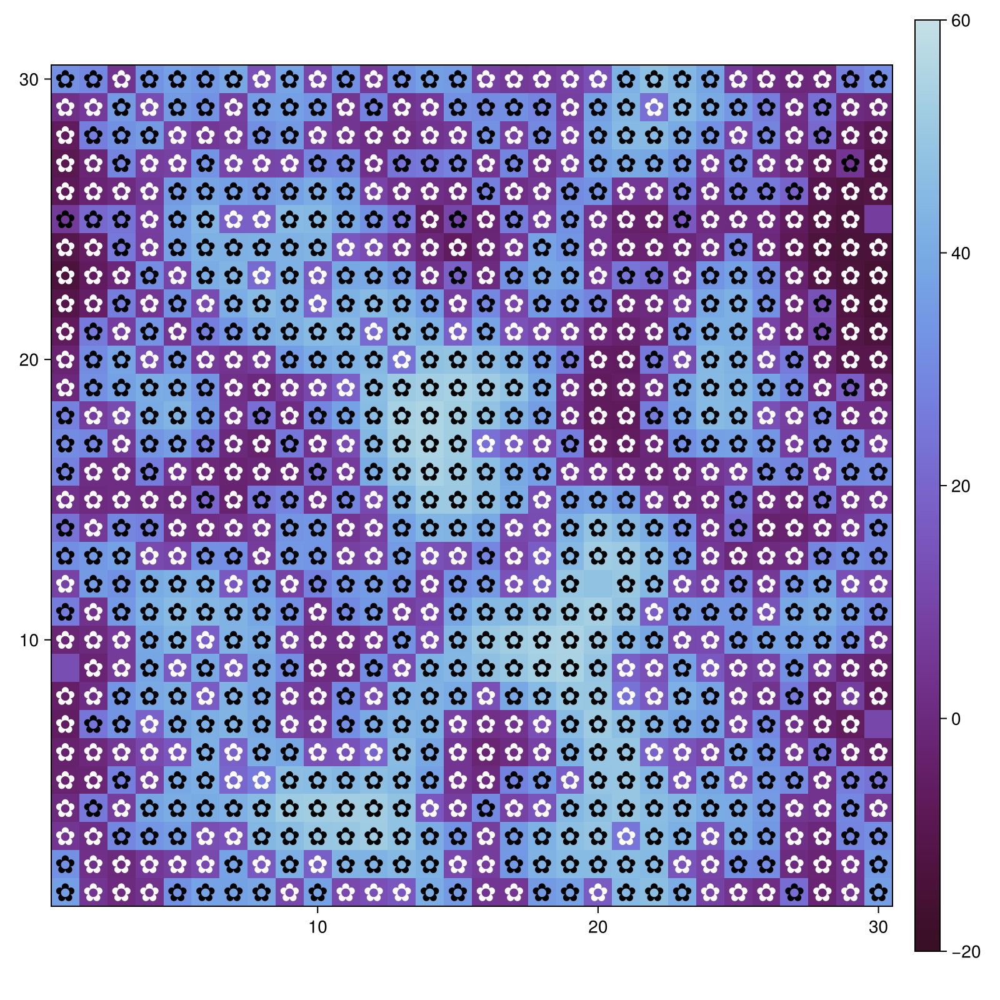
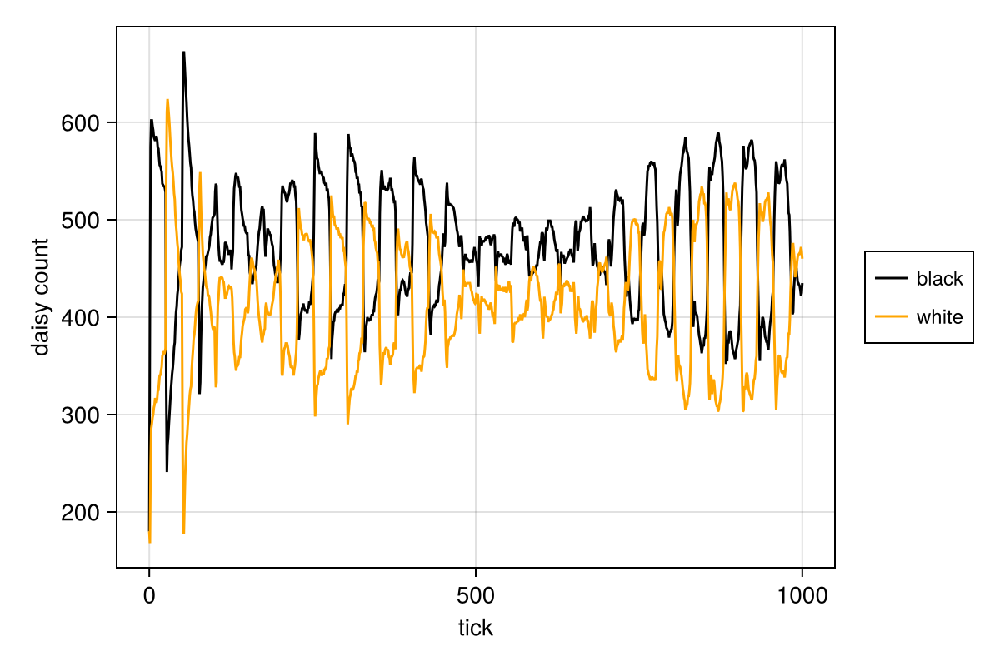
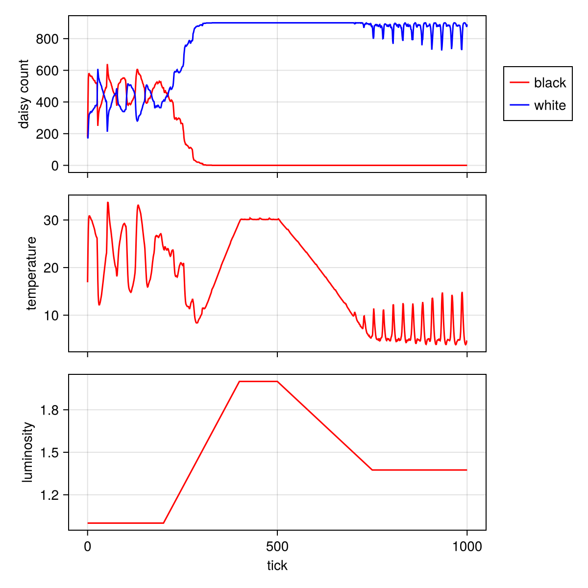
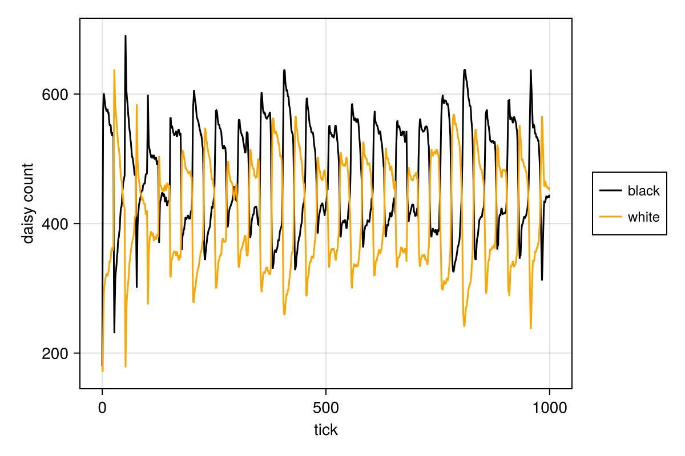
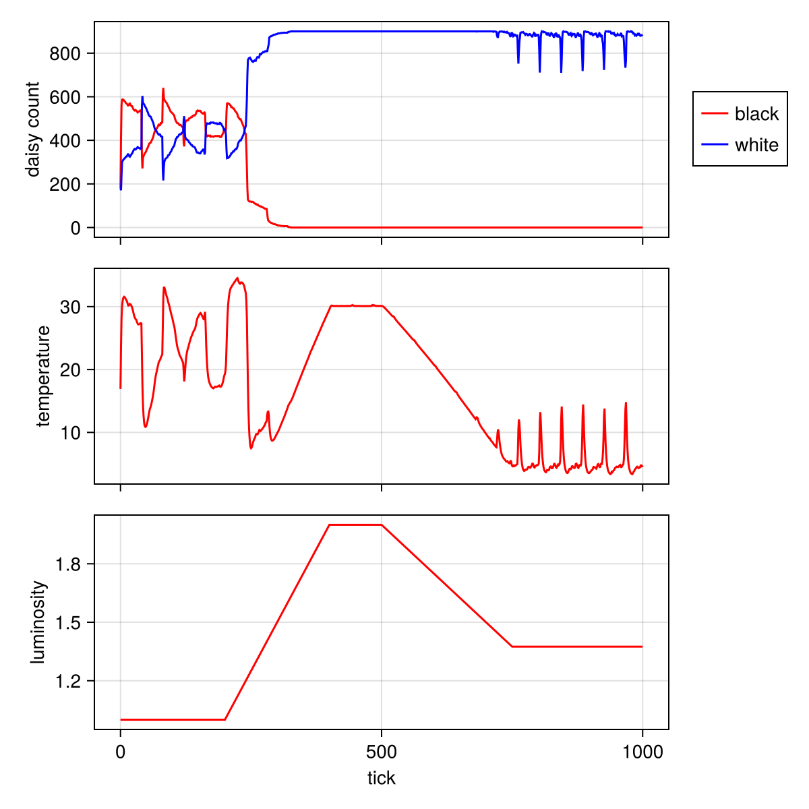
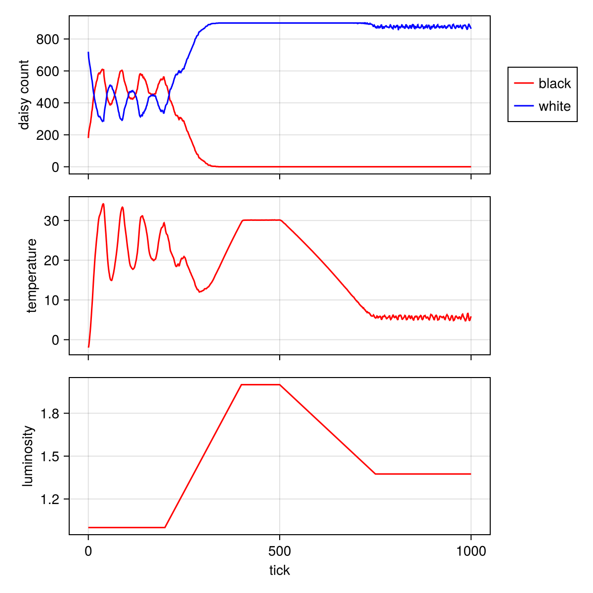

---
## Author
author:
  name: Кузьмин Егор Витальевич
  email: 1132236046@rudn.ru
  affiliation:
    - name: Российский университет дружбы народов
      country: Российская Федерация
      postal-code: 117198
      city: Москва
      address: ул. Миклухо-Маклая, д. 6

## Title
title: Презентация по лабораторной работе №3
date: today
---

# Информация

## Докладчик

:::::::::::::: {.columns align=center}
::: {.column width="70%"}

- Кузьмин Егор Витальевич  
- студент группы НФИбд-01-23  
- РУДН  

:::
::::::::::::::

---

# Цель работы

Изучение агентного моделирования и модели Daisyworld, а также исследование влияния параметров на поведение системы.

В рамках работы требовалось:

- реализовать модель Daisyworld;
- выполнить визуализацию и анимацию;
- исследовать динамику системы;
- провести параметрический анализ;
- оформить результаты с использованием Literate.jl и Quarto.

---

# Теоретические сведения

## Модель Daisyworld

Модель описывает систему с двумя типами маргариток:

- чёрные — нагревают поверхность;
- белые — охлаждают поверхность.

Температура влияет на рост растений, а растения — на температуру.

→ возникает **механизм саморегуляции**

---

# Визуализация модели

## Эволюция системы

---

# Анализ визуализации

- начальное состояние — хаотичное распределение  
- затем формируются температурные зоны  
- система приходит к устойчивому состоянию  

→ проявляется **самоорганизация**

---

# Динамика численности

---

# Анализ динамики

- в начале — резкие колебания  
- затем — стабилизация  
- популяции не исчезают  

→ система поддерживает баланс

---

# Влияние светимости

---

# Анализ светимости

- при росте светимости увеличивается температура  
- доминируют белые маргаритки  
- чёрные уменьшаются  

→ система адаптируется к внешним условиям

---

# Параметрическое исследование

## Примеры конфигураций

---

# Анализ параметров

- изменение начальных условий влияет на динамику  
- изменение возраста влияет на устойчивость  
- система всё равно стремится к равновесию  

---

# Динамика при параметрах

---

# Анализ

- графики отличаются для разных параметров  
- но сохраняется общий характер поведения  
- колебания остаются ограниченными  

---

# Светимость (параметры)

---

# Итоговый анализ

- система устойчива к изменениям параметров  
- присутствует саморегуляция  
- глобальное поведение формируется из локальных взаимодействий  

---

# Выводы

В ходе работы:

- реализована модель Daisyworld  
- проведено моделирование  
- исследовано влияние параметров  
- подтверждена саморегуляция системы  

Модель демонстрирует:

- устойчивость  
- адаптацию  
- нелинейное поведение  

---

# Спасибо за внимание
