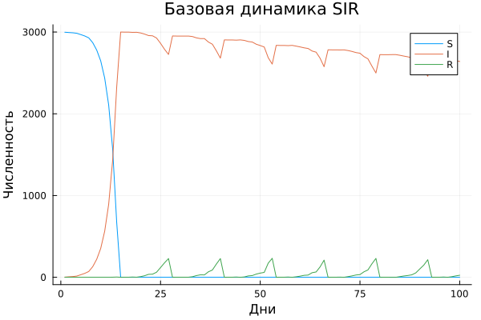
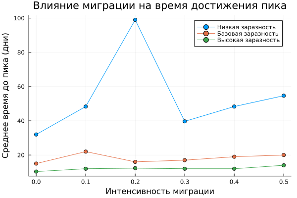
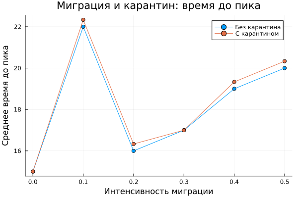

---
## Author
author:
  name: Кузьмин Егор Витальевич
  email: 1132236046@rudn.ru
  affiliation:
    - name: Российский университет дружбы народов
      country: Российская Федерация
      postal-code: 117198
      city: Москва
      address: ул. Миклухо-Маклая, д. 6

## Title
title: Презентация по лабораторной работе №3
date: today
---

# Информация

## Докладчик

:::::::::::::: {.columns align=center}
::: {.column width="70%"}

- Кузьмин Егор Витальевич  
- студент группы НФИбд-01-23  
- РУДН  

:::
::::::::::::::

## Цель работы

- реализация модели SIR  
- анализ параметров  
- исследование эпидемического порога  
- влияние миграции и гетерогенности  
- оптимизация параметров  

---

## Постановка задачи

- реализовать агентную модель  
- провести вычислительные эксперименты  
- проанализировать динамику  
- оформить literate-версию  
- выполнить дополнительные задания  

---

## Модель SIR

Состояния:

- S — восприимчивые  
- I — инфицированные  
- R — выздоровевшие  

Процессы:

- заражение  
- выздоровление  
- перемещение  

---

## Агентный подход

- каждый человек — агент  
- взаимодействия локальные  
- глобальная динамика возникает из взаимодействий  

---

## Используемые технологии

- Julia  
- Agents.jl  
- DataFrames.jl  
- Plots.jl  
- Literate.jl  

---

## Базовая динамика

- рост инфицированных  
- достижение пика  
- постепенное снижение  

---

## Вывод по базовой модели

- классическая эпидемическая кривая  
- пик зависит от параметров  
- система стремится к равновесию  

---

# Дополнительные задания

---

## Доп. задание 1 — базовая динамика

- наблюдается стандартная SIR-кривая  
- пик инфицированных достигается при максимальном контакте  

---

## Доп. задание 1 — вывод

- модель корректно воспроизводит эпидемию  
- динамика соответствует теории  

---

## Доп. задание 2 — порог эпидемии

- горизонтальная линия — 5%  
- вертикальная — теоретический порог  

---

## Доп. задание 2 — вывод

- существует критическое значение β  
- при R₀ < 1 эпидемия не развивается  
- при R₀ > 1 возникает вспышка  

---

## Доп. задание 3 — гетерогенность

- разные города имеют разные β  

---

## Доп. задание 3 — суммарная динамика

- суммарная кривая становится сложнее  

---

## Доп. задание 3 — вывод

- неоднородность усиливает различия  
- усложняет прогнозирование  
- может увеличивать пик  

---

## Доп. задание 4 — миграция

- распространение между городами  

---

## Доп. задание 4 — время пика

- выше миграция → быстрее пик  

---

## Доп. задание 4 — вывод

- миграция ускоряет распространение  
- влияет на динамику эпидемии  

---

## Доп. задание 5 — карантин

- сравнение сценариев  

---

## Доп. задание 5 — время пика

---

## Доп. задание 5 — вывод

- карантин снижает пик  
- замедляет распространение  
- эффективен при высоких значениях β  

---

## Доп. задание 6 — оптимизация

- подбор параметров  
- ограничение пика  

---

## Доп. задание 6 — вывод

- можно минимизировать последствия  
- возможно управление эпидемией  

---

# Общие выводы

- модель SIR успешно реализована  
- параметры критически влияют на динамику  
- гетерогенность усложняет модель  
- миграция усиливает распространение  
- карантин эффективен  
- оптимизация позволяет снижать последствия  

---

## Практическое значение

- моделирование эпидемий  
- принятие управленческих решений  
- прогнозирование сценариев  

---

## Спасибо за внимание
