---
author:
  name: Егор Витальевич Кузьмин
  email: 1132236046@rudn.ru
  affiliation:
    - name: Российский университет дружбы народов
      country: Российская Федерация
      postal-code: 117198
      city: Москва
      address: ул. Миклухо-Маклая, д. 6
bibliography: references.bib
title: "Отчет по лабораторной работе №4"
monofont: "DejaVu Sans Mono"
format:
  pdf:
    pdf-engine: xelatex
---

# Цель работы

Целью лабораторной работы является изучение реализации эпидемиологической модели SIR в агентном подходе, исследование влияния параметров на динамику распространения инфекции, освоение литературного программирования с использованием пакета Literate.jl, а также выполнение дополнительных вычислительных экспериментов, связанных с порогом эпидемии, гетерогенностью, миграцией, карантинными мерами и оптимизацией параметров модели.

# Постановка задачи

В ходе выполнения лабораторной работы требовалось:

1. реализовать базовую модель SIR в агентном подходе;
2. выполнить запуск скриптов в обычном формате;
3. оформить решения в literate-стиле;
4. сгенерировать notebook и документацию Quarto;
5. выполнить параметрические исследования;
6. проанализировать влияние миграции;
7. исследовать эффекты карантинных мер;
8. решить задачу оптимизации параметров;
9. оформить результаты в виде отчёта.

# Теоретические сведения

## Агентное моделирование

Агентное моделирование представляет систему как совокупность взаимодействующих агентов. Каждый агент описывается собственным состоянием и набором правил поведения. Глобальная динамика системы формируется как результат большого числа локальных взаимодействий.

## Модель SIR

Модель SIR описывает распространение инфекционного заболевания через три состояния агента:

- S — восприимчивый;
- I — инфицированный;
- R — выздоровевший.

В агентной постановке каждый человек задаётся отдельным агентом. В рассматриваемой лабораторной работе учитываются заражение, выздоровление, повторное заражение, смертность и перемещение агентов между городами.

# Выполнение работы

## Инициализация проекта

На первом этапе была выполнена активация проекта, проверка установленных библиотек Julia и подготовка первого рабочего файла.

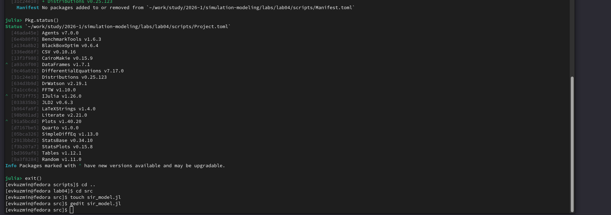

На рисунке показан этап инициализации проекта. Видно, что окружение Julia активировано корректно и доступны необходимые библиотеки для выполнения лабораторной работы.

---

## Базовый скрипт модели SIR

### Обычная версия

Для начала была подготовлена и выполнена обычная версия первого скрипта, реализующего базовую динамику модели SIR.

Листинг 4.1. Обычная версия базового скрипта  
sir_run_basic.jl

```md
using DrWatson
@quickactivate "project"

using Agents, DataFrames, Plots
using JLD2

include(srcdir("sir_model.jl"))

# Параметры эксперимента
params = Dict(
    :Ns => [1000, 1000, 1000],
    :β_und => [0.5, 0.5, 0.5],
    :β_det => [0.05, 0.05, 0.05],
    :infection_period => 14,
    :detection_time => 7,
    :death_rate => 0.02,
    :reinfection_probability => 0.1,
    :Is => [0, 0, 1],
    :seed => 42,
    :n_steps => 100,
)

# Инициализация модели
model = initialize_sir(; params...)

# Подготовка массивов для хранения данных
times = Int[]
S_vals = Int[]
I_vals = Int[]
R_vals = Int[]
total_vals = Int[]

# Запуск симуляции вручную
for step = 1:params[:n_steps]
    Agents.step!(model, 1)
    push!(times, step)
    push!(S_vals, susceptible_count(model))
    push!(I_vals, infected_count(model))
    push!(R_vals, recovered_count(model))
    push!(total_vals, total_count(model))
end

# Создаём DataFrame для удобства (опционально)
agent_df = DataFrame(
    time = times,
    susceptible = S_vals,
    infected = I_vals,
    recovered = R_vals,
)

model_df = DataFrame(
    time = times,
    total = total_vals,
)

# Визуализация
plot(
    agent_df.time,
    agent_df.susceptible,
    label = "Восприимчивые",
    xlabel = "Дни",
    ylabel = "Количество",
)
plot!(agent_df.time, agent_df.infected, label = "Инфицированные")
plot!(agent_df.time, agent_df.recovered, label = "Выздоровевшие")
plot!(agent_df.time, model_df.total, label = "Всего (включая умерших)", linestyle = :dash)

savefig(plotsdir("sir_basic_dynamics.png"))

# Сохранение данных
@save datadir("sir_basic_agent.jld2") agent_df
@save datadir("sir_basic_model.jld2") model_df
```

### Выполнение и генерация literate-версии

После запуска обычной версии была сформирована literate-версия и сгенерированы производные файлы: чистый код, notebook и Quarto-документация.

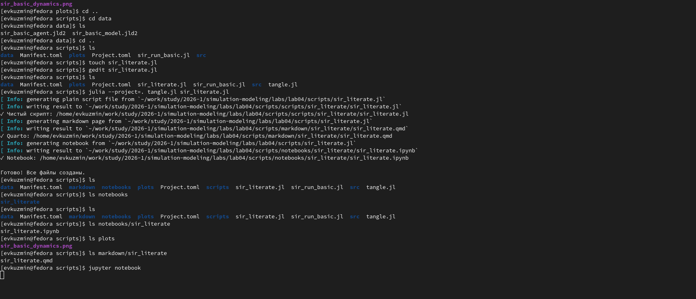

На рисунке показан этап выполнения первого скрипта и генерации literate-артефактов. Также видна проверка того, что необходимые файлы были созданы.

### Notebook literate-версии первого скрипта

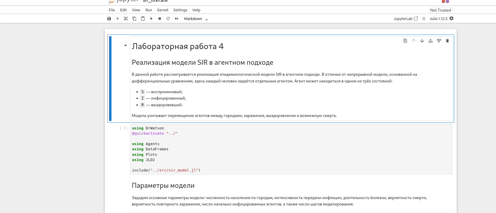

На рисунке представлен notebook, полученный из literate-версии первого скрипта. Это подтверждает корректность преобразования исходного файла в формат документации.

### Результат выполнения базовой модели


На рисунке представлена динамика числа восприимчивых, инфицированных и выздоровевших агентов в базовой модели. В начале моделирования число инфицированных растёт, затем после достижения максимума начинает уменьшаться. Одновременно сокращается число восприимчивых агентов и увеличивается число выздоровевших, что соответствует классической интерпретации модели SIR.


### Literate-версия базового скрипта

Листинг 4.2. Literate-версия базового скрипта  
sir_literate.jl

```md
# # Лабораторная работа 4
# ## Реализация модели SIR в агентном подходе
#
# В данной работе рассматривается реализация эпидемиологической модели SIR
# в агентном подходе. В отличие от непрерывной модели, основанной на
# дифференциальных уравнениях, здесь каждый человек задаётся отдельным агентом.
# Агент может находиться в одном из трёх состояний:
#
# - `S` — восприимчивый;
# - `I` — инфицированный;
# - `R` — выздоровевший.
#
# Модель учитывает перемещение агентов между городами, заражение,
# выздоровление и возможную смерть.

using DrWatson
@quickactivate "../"

using Agents
using DataFrames
using Plots
using JLD2

include("../src/sir_model.jl")

# ## Параметры модели
#
# Зададим основные параметры модели: численность населения по городам,
# интенсивность передачи инфекции, длительность болезни, вероятность смерти,
# вероятность повторного заражения, число начально инфицированных агентов,
# а также число шагов моделирования.

params = Dict(
    :Ns => [1000, 1000, 1000],
    :β_und => [0.5, 0.5, 0.5],
    :β_det => [0.05, 0.05, 0.05],
    :infection_period => 14,
    :detection_time => 7,
    :death_rate => 0.02,
    :reinfection_probability => 0.1,
    :Is => [0, 0, 1],
    :seed => 42,
    :n_steps => 100,
)

# ## Инициализация модели
#
# Создадим экземпляр модели с выбранными параметрами.

model = initialize_sir(; params...)

# ## Подготовка структур для сбора результатов
#
# На каждом шаге моделирования будем сохранять:
#
# - номер шага;
# - число восприимчивых;
# - число инфицированных;
# - число выздоровевших;
# - общее число агентов.

times = Int[]
S_vals = Int[]
I_vals = Int[]
R_vals = Int[]
total_vals = Int[]

# ## Проведение моделирования
#
# Запустим модель на заданное число шагов и на каждом шаге сохраним текущие
# значения основных характеристик.

for step = 1:params[:n_steps]
    Agents.step!(model, 1)
    push!(times, step)
    push!(S_vals, susceptible_count(model))
    push!(I_vals, infected_count(model))
    push!(R_vals, recovered_count(model))
    push!(total_vals, total_count(model))
end

# ## Формирование таблиц результатов
#
# Для удобства дальнейшего анализа оформим полученные данные в виде таблиц.

agent_df = DataFrame(
    time = times,
    susceptible = S_vals,
    infected = I_vals,
    recovered = R_vals,
)

model_df = DataFrame(
    time = times,
    total = total_vals,
)

# ## Визуализация результатов
#
# Построим график изменения численности групп во времени.

plot(
    agent_df.time,
    agent_df.susceptible,
    label = "Восприимчивые",
    xlabel = "Дни",
    ylabel = "Количество",
)
plot!(agent_df.time, agent_df.infected, label = "Инфицированные")
plot!(agent_df.time, agent_df.recovered, label = "Выздоровевшие")
plot!(agent_df.time, model_df.total, label = "Всего (включая умерших)", linestyle = :dash)

savefig(plotsdir("sir_basic_dynamics_literate.png"))

# ## Сохранение результатов
#
# Сохраним таблицы результатов в файлы формата JLD2.

@save datadir("sir_basic_agent_literate.jld2") agent_df
@save datadir("sir_basic_model_literate.jld2") model_df

# ## Вывод
#
# В результате моделирования были получены временные ряды по числу
# восприимчивых, инфицированных и выздоровевших агентов, а также построен
# график динамики эпидемического процесса.
```

---

## Параметризованная версия базового скрипта

Следующим этапом была подготовлена параметризованная literate-версия первого скрипта.

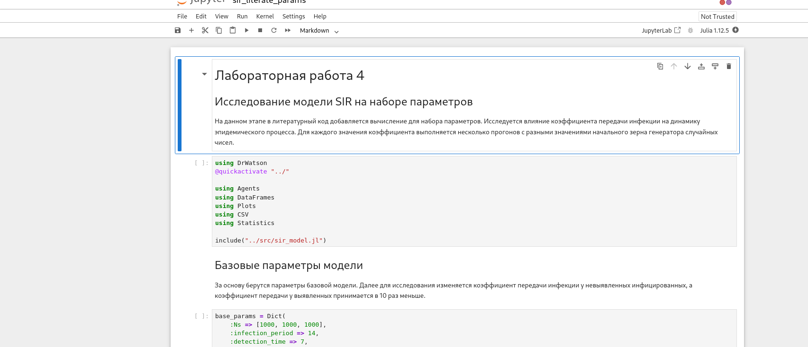

На рисунке показан notebook параметризованной версии первого скрипта.

### Результаты параметризованной версии

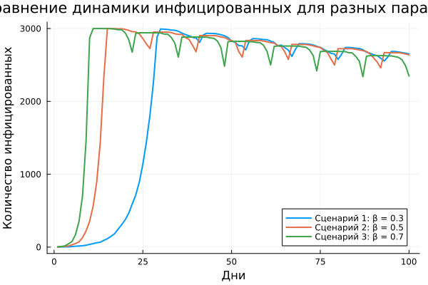

На рисунке сравниваются сценарии по доле инфицированных. Видно, что более высокий коэффициент заражения ускоряет развитие эпидемии и увеличивает максимум числа инфицированных.

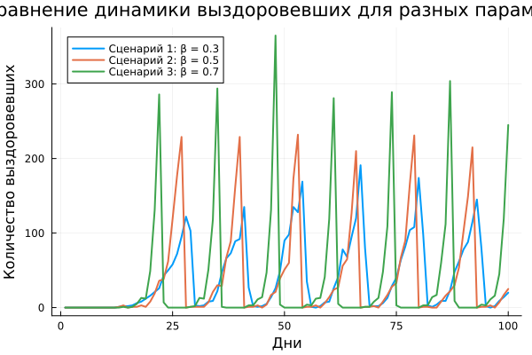

На рисунке показана динамика выздоровевших для различных параметров. При более интенсивном распространении инфекции число выздоровевших также растёт быстрее.

Листинг 4.3. Параметризованная literate-версия базового скрипта  
sir_literate_params.jl

```md
# # Лабораторная работа 4
# ## Реализация модели SIR в агентном подходе
# ## Версия с набором параметров
#
# В данной версии рассматривается не один запуск модели, а несколько
# сценариев с различными параметрами распространения инфекции.
# Это позволяет сравнить динамику эпидемического процесса во времени
# для разных значений коэффициента передачи инфекции.

using DrWatson
@quickactivate "../"

using Agents
using DataFrames
using Plots
using JLD2

include("../src/sir_model.jl")

# ## Базовые параметры модели
#
# Зададим параметры, которые будут одинаковыми для всех сценариев.

base_params = Dict(
    :Ns => [1000, 1000, 1000],
    :infection_period => 14,
    :detection_time => 7,
    :death_rate => 0.02,
    :reinfection_probability => 0.1,
    :Is => [0, 0, 1],
    :seed => 42,
    :n_steps => 100,
)

# ## Набор параметров
#
# Рассмотрим несколько сценариев с разными значениями коэффициента
# передачи инфекции у невыявленных инфицированных. Для выявленных
# инфицированных коэффициент передачи примем в 10 раз меньше.

param_sets = [
    (name = "Сценарий 1: β = 0.3", β_und = [0.3, 0.3, 0.3], β_det = [0.03, 0.03, 0.03]),
    (name = "Сценарий 2: β = 0.5", β_und = [0.5, 0.5, 0.5], β_det = [0.05, 0.05, 0.05]),
    (name = "Сценарий 3: β = 0.7", β_und = [0.7, 0.7, 0.7], β_det = [0.07, 0.07, 0.07]),
]

# ## Функция запуска одного сценария
#
# Для каждого набора параметров выполняется отдельное моделирование
# и сохраняются временные ряды основных характеристик.

function run_scenario(base_params, β_und, β_det, scenario_name)
    params = Dict(
        :Ns => base_params[:Ns],
        :β_und => β_und,
        :β_det => β_det,
        :infection_period => base_params[:infection_period],
        :detection_time => base_params[:detection_time],
        :death_rate => base_params[:death_rate],
        :reinfection_probability => base_params[:reinfection_probability],
        :Is => base_params[:Is],
        :seed => base_params[:seed],
        :n_steps => base_params[:n_steps],
    )

    model = initialize_sir(; params...)

    times = Int[]
    S_vals = Int[]
    I_vals = Int[]
    R_vals = Int[]
    total_vals = Int[]

    for step = 1:params[:n_steps]
        Agents.step!(model, 1)
        push!(times, step)
        push!(S_vals, susceptible_count(model))
        push!(I_vals, infected_count(model))
        push!(R_vals, recovered_count(model))
        push!(total_vals, total_count(model))
    end

    agent_df = DataFrame(
        time = times,
        susceptible = S_vals,
        infected = I_vals,
        recovered = R_vals,
        scenario = fill(scenario_name, length(times)),
    )

    model_df = DataFrame(
        time = times,
        total = total_vals,
        scenario = fill(scenario_name, length(times)),
    )

    return agent_df, model_df
end

# ## Выполнение моделирования для всех наборов параметров
#
# Запустим модель для каждого сценария и объединим результаты
# в общие таблицы.

all_agent_df = DataFrame()
all_model_df = DataFrame()

for p in param_sets
    agent_df, model_df = run_scenario(base_params, p.β_und, p.β_det, p.name)
    append!(all_agent_df, agent_df)
    append!(all_model_df, model_df)
end

# ## Просмотр результатов
#
# Выведем первые строки объединённой таблицы.

first(all_agent_df, 10)

# ## Визуализация результатов
#
# Построим сравнительный график числа инфицированных для всех сценариев.

plot(
    xlabel = "Дни",
    ylabel = "Количество инфицированных",
    title = "Сравнение динамики инфицированных для разных параметров",
)

for p in param_sets
    subset_df = all_agent_df[all_agent_df.scenario .== p.name, :]
    plot!(
        subset_df.time,
        subset_df.infected,
        label = p.name,
        lw = 2,
    )
end

savefig(plotsdir("sir_literate_params_infected.png"))

# ## Дополнительный график
#
# Построим также сравнительный график числа выздоровевших.

plot(
    xlabel = "Дни",
    ylabel = "Количество выздоровевших",
    title = "Сравнение динамики выздоровевших для разных параметров",
)

for p in param_sets
    subset_df = all_agent_df[all_agent_df.scenario .== p.name, :]
    plot!(
        subset_df.time,
        subset_df.recovered,
        label = p.name,
        lw = 2,
    )
end

savefig(plotsdir("sir_literate_params_recovered.png"))

# ## Сохранение результатов
#
# Сохраним объединённые результаты в файлы формата JLD2.

@save datadir("sir_literate_params_agent.jld2") all_agent_df
@save datadir("sir_literate_params_model.jld2") all_model_df

# ## Вывод
#
# В результате были выполнены несколько прогонов модели SIR
# для различных значений коэффициента передачи инфекции.
# Это позволило сравнить динамику числа инфицированных и выздоровевших
# агентов во времени для разных сценариев развития эпидемии.
```

---

## Скрипт параметрического исследования коэффициента заражения

Во втором скрипте реализуется перебор значений коэффициента заражения β и вычисление ключевых характеристик эпидемического процесса.

### Обычная версия

Листинг 4.4. Обычная версия скрипта параметрического исследования  
sir_scan_beta.jl

```md
using DrWatson
@quickactivate "project"

using Agents, DataFrames, Plots, CSV, Random
using Statistics

include(srcdir("sir_model.jl"))

# Функция запуска одного эксперимента и возврата метрик
function run_experiment(p)
# Создаём β_und и β_det на основе скалярного beta
beta = p[:beta]
β_und = fill(beta, 3)
β_det = fill(beta / 10, 3)

# Инициализация модели
model = initialize_sir(;
Ns = p[:Ns],
β_und = β_und,
β_det = β_det,
infection_period = p[:infection_period],
detection_time = p[:detection_time],
death_rate = p[:death_rate],
reinfection_probability = p[:reinfection_probability],
Is = p[:Is],
seed = p[:seed],
n_steps = p[:n_steps],
)

# Доля инфицированных в текущий момент
infected_fraction(model) =
count(a.status == :I for a in allagents(model)) / nagents(model)

peak_infected = 0.0

# Основной цикл моделирования
for step = 1:p[:n_steps]
# Ручной безопасный шаг по агентам
agent_ids = collect(allids(model))
for id in agent_ids
agent = try
model[id]
catch
nothing
end

if agent !== nothing
sir_agent_step!(agent, model)
end
end

frac = infected_fraction(model)
if frac > peak_infected
peak_infected = frac
end
end

# Итоговые метрики
final_infected = infected_fraction(model)
final_recovered = count(a.status == :R for a in allagents(model)) / nagents(model)
total_deaths = sum(p[:Ns]) - nagents(model)

return (
peak = peak_infected,
final_inf = final_infected,
final_rec = final_recovered,
deaths = total_deaths,
)
end

# Диапазон значений beta
beta_range = 0.1:0.1:1.0

# Набор значений seed для повторных прогонов
seeds = [42, 43, 44]

# Формирование списка параметров
params_list = []

for b in beta_range
for s in seeds
push!(
params_list,
Dict(
:beta => b,
:Ns => [1000, 1000, 1000],
:infection_period => 14,
:detection_time => 7,
:death_rate => 0.02,
:reinfection_probability => 0.1,
:Is => [0, 0, 1],
:seed => s,
:n_steps => 100,
),
)
end
end

# Запуск всех экспериментов
results = []

for params in params_list
data = run_experiment(params)
push!(results, merge(params, Dict(pairs(data))))
println("Завершён эксперимент с beta = $(params[:beta]), seed = $(params[:seed])")
end

# Сохраняем результаты всех прогонов
df = DataFrame(results)
CSV.write(datadir("beta_scan_all.csv"), df)

# Усреднение результатов по одинаковым значениям beta
grouped = combine(
groupby(df, [:beta]),
:peak => mean => :mean_peak,
:final_inf => mean => :mean_final_inf,
:deaths => mean => :mean_deaths,
)

# Построение итогового графика
plot(
grouped.beta,
grouped.mean_peak,
label = "Пик эпидемии",
xlabel = "Коэффициент заразности β",
ylabel = "Доля инфицированных",
marker = :circle,
linewidth = 2,
)

plot!(
grouped.beta,
grouped.mean_final_inf,
label = "Конечная доля инфицированных",
marker = :square,
)

plot!(
grouped.beta,
grouped.mean_deaths ./ 3000,
label = "Доля умерших",
marker = :diamond,
)

savefig(plotsdir("beta_scan.png"))

println("Результаты сохранены в data/beta_scan_all.csv и plots/beta_scan.png")
```

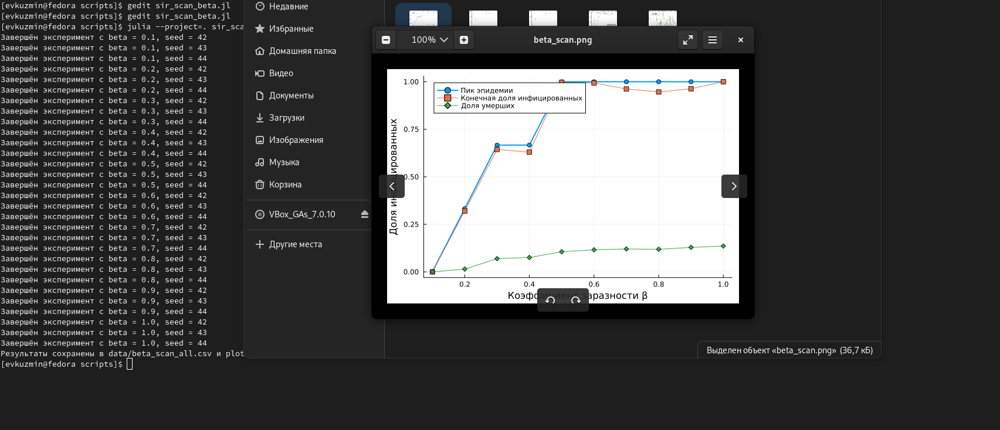

На рисунке показан запуск второго скрипта в обычной версии.

### Notebook literate-версии

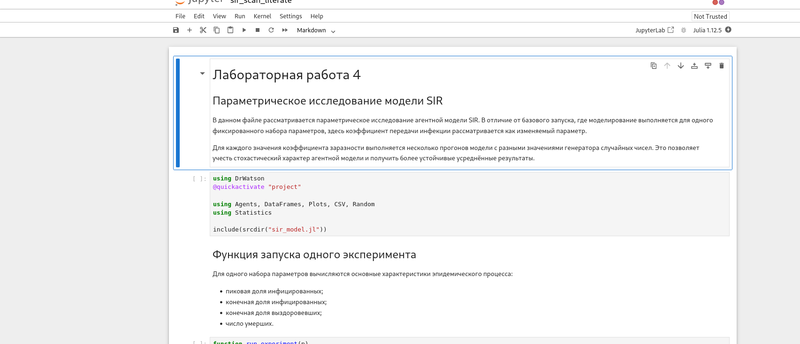

На рисунке представлен notebook literate-версии второго скрипта.

### Генерация notebook и документации

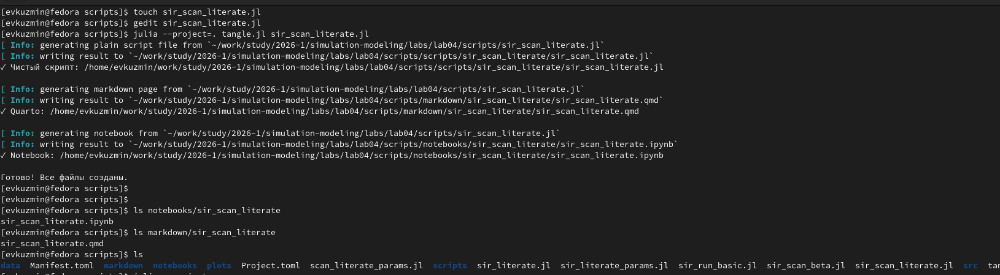
На рисунке показан этап генерации notebook и Quarto-документации для literate-версии второго скрипта.

### Таблица результатов

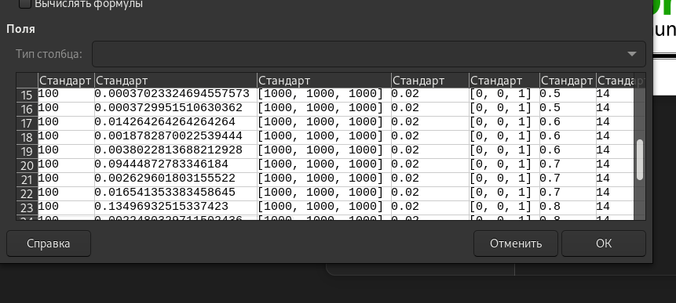

На рисунке представлена таблица результатов параметрического исследования. Она содержит значения β и соответствующие показатели: пик эпидемии, конечную долю инфицированных, долю выздоровевших и число умерших.

### Результат параметрического исследования


На рисунке показано влияние коэффициента заражения на основные характеристики эпидемии. С ростом β увеличиваются пик эпидемии, конечная доля инфицированных и смертность. Это соответствует ожидаемой интерпретации: более высокая заразность приводит к более интенсивному развитию эпидемического процесса.

### Literate-версия второго скрипта

Листинг 4.5. Literate-версия скрипта параметрического исследования  
sir_scan_literate.jl

```md
# # Лабораторная работа 4
# ## Параметрическое исследование модели SIR
#
# В данном файле рассматривается параметрическое исследование агентной
# модели SIR. В отличие от базового запуска, где моделирование выполняется
# для одного фиксированного набора параметров, здесь коэффициент передачи
# инфекции рассматривается как изменяемый параметр.
#
# Для каждого значения коэффициента заразности выполняется несколько
# прогонов модели с разными значениями генератора случайных чисел. Это
# позволяет учесть стохастический характер агентной модели и получить
# более устойчивые усреднённые результаты.

using DrWatson
@quickactivate "project"

using Agents, DataFrames, Plots, CSV, Random
using Statistics

include(srcdir("sir_model.jl"))

# ## Функция запуска одного эксперимента
#
# Для одного набора параметров вычисляются основные характеристики
# эпидемического процесса:
#
# - пиковая доля инфицированных;
# - конечная доля инфицированных;
# - конечная доля выздоровевших;
# - число умерших.

function run_experiment(p)
# Создаём β_und и β_det на основе скалярного beta
beta = p[:beta]
β_und = fill(beta, 3)
β_det = fill(beta / 10, 3)

# Инициализация модели
model = initialize_sir(;
Ns = p[:Ns],
β_und = β_und,
β_det = β_det,
infection_period = p[:infection_period],
detection_time = p[:detection_time],
death_rate = p[:death_rate],
reinfection_probability = p[:reinfection_probability],
Is = p[:Is],
seed = p[:seed],
n_steps = p[:n_steps],
)

# Функция для вычисления текущей доли инфицированных
infected_fraction(model) =
count(a.status == :I for a in allagents(model)) / nagents(model)

peak_infected = 0.0

# Основной цикл моделирования
for step = 1:p[:n_steps]
# Выполняем безопасный ручной шаг по всем агентам
agent_ids = collect(allids(model))
for id in agent_ids
agent = try
model[id]
catch
nothing
end

if agent !== nothing
sir_agent_step!(agent, model)
end
end

frac = infected_fraction(model)
if frac > peak_infected
peak_infected = frac
end
end

# Итоговые характеристики
final_infected = infected_fraction(model)
final_recovered = count(a.status == :R for a in allagents(model)) / nagents(model)
total_deaths = sum(p[:Ns]) - nagents(model)

return (
peak = peak_infected,
final_inf = final_infected,
final_rec = final_recovered,
deaths = total_deaths,
)
end

# ## Диапазон параметров
#
# Рассматриваются значения коэффициента передачи инфекции от 0.1 до 1.0
# с шагом 0.1. Для каждого значения выполняются три прогона модели
# с различными значениями seed.

beta_range = 0.1:0.1:1.0
seeds = [42, 43, 44]

# ## Формирование списка параметров
#
# Для каждого значения beta и каждого значения seed создаётся отдельный
# набор параметров.

params_list = []

for b in beta_range
for s in seeds
push!(
params_list,
Dict(
:beta => b,
:Ns => [1000, 1000, 1000],
:infection_period => 14,
:detection_time => 7,
:death_rate => 0.02,
:reinfection_probability => 0.1,
:Is => [0, 0, 1],
:seed => s,
:n_steps => 100,
),
)
end
end

# ## Запуск экспериментов
#
# Для каждого набора параметров выполняется моделирование, а затем
# результаты сохраняются в общий массив.

results = []

for params in params_list
data = run_experiment(params)
push!(results, merge(params, Dict(pairs(data))))
println("Завершён эксперимент с beta = $(params[:beta]), seed = $(params[:seed])")
end

# ## Сохранение результатов
#
# Все результаты отдельных прогонов сохраняются в таблицу и записываются
# в CSV-файл.

df = DataFrame(results)
CSV.write(datadir("beta_scan_all.csv"), df)

# ## Усреднение по повторам
#
# Для каждого значения beta вычисляются усреднённые значения основных
# характеристик эпидемии.

grouped = combine(
groupby(df, [:beta]),
:peak => mean => :mean_peak,
:final_inf => mean => :mean_final_inf,
:deaths => mean => :mean_deaths,
)

# ## Построение графика
#
# Построим график зависимости усреднённых характеристик эпидемии
# от коэффициента заразности beta.

plot(
grouped.beta,
grouped.mean_peak,
label = "Пик эпидемии",
xlabel = "Коэффициент заразности β",
ylabel = "Доля инфицированных",
marker = :circle,
linewidth = 2,
)

plot!(
grouped.beta,
grouped.mean_final_inf,
label = "Конечная доля инфицированных",
marker = :square,
)

plot!(
grouped.beta,
grouped.mean_deaths ./ 3000,
label = "Доля умерших",
marker = :diamond,
)

savefig(plotsdir("beta_scan.png"))

println("Результаты сохранены в data/beta_scan_all.csv и plots/beta_scan.png")

# ## Вывод
#
# В результате параметрического исследования были получены усреднённые
# характеристики эпидемического процесса для различных значений
# коэффициента передачи инфекции. Это позволяет оценить влияние параметра
# beta на интенсивность распространения инфекции, конечную долю заболевших
# и смертность.
```

---

## Параметризованная версия второго скрипта

На следующем этапе была подготовлена параметрическая версия второго скрипта, а также сгенерированы notebook и qmd-файлы.

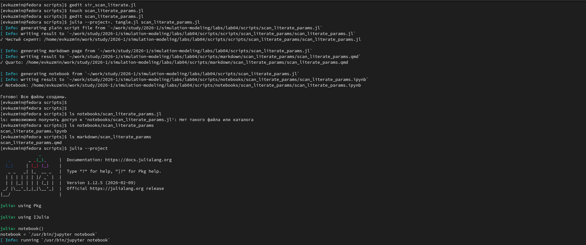

На рисунке показан этап подготовки параметризованной версии второго скрипта.

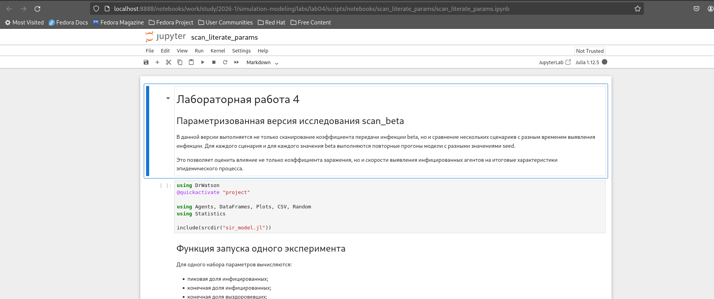

На рисунке представлен notebook параметризованной версии второго скрипта.

### Результаты параметризованного исследования

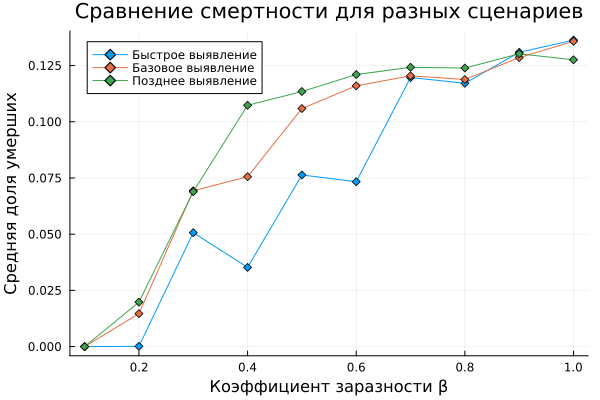

На рисунке показана зависимость средней доли умерших от коэффициента заражения для нескольких сценариев. Видно, что различия между сценариями усиливаются при росте заразности.

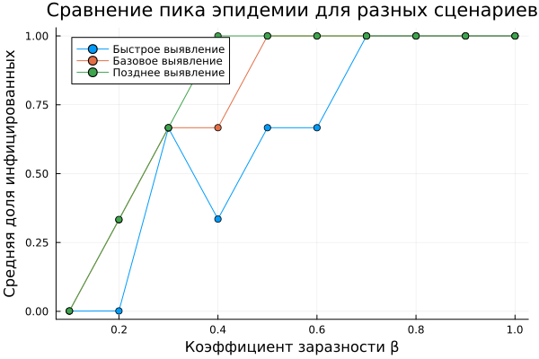

На рисунке сравниваются значения средней пиковой доли инфицированных в различных сценариях. Это позволяет оценить влияние дополнительных условий моделирования на развитие эпидемии.

Листинг 4.6. Параметризованная версия скрипта параметрического исследования  
scan_literate_params.jl

```md
# # Лабораторная работа 4
# ## Параметризованная версия исследования scan_beta
#
# В данной версии выполняется не только сканирование коэффициента передачи
# инфекции beta, но и сравнение нескольких сценариев с разным временем
# выявления инфекции. Для каждого сценария и для каждого значения beta
# выполняются повторные прогоны модели с разными значениями seed.
#
# Это позволяет оценить влияние не только коэффициента заражения, но и
# скорости выявления инфицированных агентов на итоговые характеристики
# эпидемического процесса.

using DrWatson
@quickactivate "project"

using Agents, DataFrames, Plots, CSV, Random
using Statistics

include(srcdir("sir_model.jl"))

# ## Функция запуска одного эксперимента
#
# Для одного набора параметров вычисляются:
#
# - пиковая доля инфицированных;
# - конечная доля инфицированных;
# - конечная доля выздоровевших;
# - число умерших.

function run_experiment(p)
beta = p[:beta]
β_und = fill(beta, 3)
β_det = fill(beta / 10, 3)

model = initialize_sir(;
Ns = p[:Ns],
β_und = β_und,
β_det = β_det,
infection_period = p[:infection_period],
detection_time = p[:detection_time],
death_rate = p[:death_rate],
reinfection_probability = p[:reinfection_probability],
Is = p[:Is],
seed = p[:seed],
n_steps = p[:n_steps],
)

infected_fraction(model) =
count(a.status == :I for a in allagents(model)) / nagents(model)

peak_infected = 0.0

for step = 1:p[:n_steps]
agent_ids = collect(allids(model))
for id in agent_ids
agent = try
model[id]
catch
nothing
end

if agent !== nothing
sir_agent_step!(agent, model)
end
end

frac = infected_fraction(model)
if frac > peak_infected
peak_infected = frac
end
end

final_infected = infected_fraction(model)
final_recovered = count(a.status == :R for a in allagents(model)) / nagents(model)
total_deaths = sum(p[:Ns]) - nagents(model)

return (
peak = peak_infected,
final_inf = final_infected,
final_rec = final_recovered,
deaths = total_deaths,
)
end

# ## Набор сценариев
#
# Рассматриваются три сценария:
#
# - быстрое выявление;
# - базовое выявление;
# - позднее выявление.

scenario_sets = [
(name = "Быстрое выявление", detection_time = 5),
(name = "Базовое выявление", detection_time = 7),
(name = "Позднее выявление", detection_time = 10),
]

# ## Диапазон значений beta и набор значений seed

beta_range = 0.1:0.1:1.0
seeds = [42, 43, 44]

# ## Формирование списка параметров

params_list = []

for scenario in scenario_sets
for b in beta_range
for s in seeds
push!(
params_list,
Dict(
:scenario => scenario.name,
:beta => b,
:Ns => [1000, 1000, 1000],
:infection_period => 14,
:detection_time => scenario.detection_time,
:death_rate => 0.02,
:reinfection_probability => 0.1,
:Is => [0, 0, 1],
:seed => s,
:n_steps => 100,
),
)
end


# ## Запуск всех экспериментов

results = []

for params in params_list
data = run_experiment(params)
push!(results, merge(params, Dict(pairs(data))))
println("Сценарий = $(params[:scenario]), beta = $(params[:beta]), seed = $(params[:seed])")
end

# ## Сохранение всех прогонов

df = DataFrame(results)
CSV.write(datadir("beta_scan_scenarios_all.csv"), df)

# ## Усреднение результатов
#
# Выполним усреднение по каждому сценарию и каждому значению beta.

grouped = combine(
groupby(df, [:scenario, :beta]),
:peak => mean => :mean_peak,
:final_inf => mean => :mean_final_inf,
:final_rec => mean => :mean_final_rec,
:deaths => mean => :mean_deaths,
)

CSV.write(datadir("beta_scan_scenarios_grouped.csv"), grouped)

# ## Построение графика пика эпидемии
#
# На одном графике сравним усреднённый пик эпидемии для всех сценариев.

plot(
xlabel = "Коэффициент заразности β",
ylabel = "Средняя доля инфицированных",
title = "Сравнение пика эпидемии для разных сценариев",
linewidth = 2,
)

for scenario in scenario_sets
subset_df = grouped[grouped.scenario .== scenario.name, :]
plot!(
subset_df.beta,
subset_df.mean_peak,
label = scenario.name,
marker = :circle,
)
end

savefig(plotsdir("beta_scan_scenarios_peak.png"))

# ## Построение графика смертности
#
# Дополнительно сравним долю умерших в зависимости от beta.

plot(
xlabel = "Коэффициент заразности β",
ylabel = "Средняя доля умерших",
title = "Сравнение смертности для разных сценариев",
linewidth = 2,
)

for scenario in scenario_sets
subset_df = grouped[grouped.scenario .== scenario.name, :]
plot!(
subset_df.beta,
subset_df.mean_deaths ./ 3000,
label = scenario.name,
marker = :diamond,
)
end

savefig(plotsdir("beta_scan_scenarios_deaths.png"))

println("Результаты сохранены в data/beta_scan_scenarios_all.csv")
println("Усреднённые результаты сохранены в data/beta_scan_scenarios_grouped.csv")
println("Графики сохранены в plots/beta_scan_scenarios_peak.png и plots/beta_scan_scenarios_deaths.png")

# ## Вывод
#
# В результате были получены и усреднены данные для нескольких сценариев
# с разным временем выявления инфекции. Это позволило сравнить влияние
# параметра detection_time на пик эпидемии и смертность при различных
# значениях коэффициента заражения beta.
```

---

## Скрипт исследования миграции

Третий скрипт посвящён исследованию влияния интенсивности миграции на распространение инфекции между городами.

### Обычная версия

Листинг 4.7. Обычная версия скрипта исследования миграции  
sir_migration_effect.jl

```md
using DrWatson
@quickactivate "project"

using Agents, DataFrames, Plots, CSV, Random
using Statistics

include(srcdir("sir_model.jl"))

# Функция для создания матрицы миграции
function create_migration_matrix(C, intensity)
M = ones(C, C) .* intensity / (C - 1)
for i in 1:C
M[i, i] = 1 - intensity
end
return M
end

# Функция для измерения времени достижения пика
function peak_time(p)
migration_rates = create_migration_matrix(p[:C], p[:migration_intensity])

model = initialize_sir(;
Ns = p[:Ns],
β_und = p[:β_und],
β_det = p[:β_det],
infection_period = p[:infection_period],
detection_time = p[:detection_time],
death_rate = p[:death_rate],
reinfection_probability = p[:reinfection_probability],
Is = p[:Is],
seed = p[:seed],
migration_rates = migration_rates,
)

infected_frac(model) =
count(a.status == :I for a in allagents(model)) / nagents(model)

peak = 0.0
peak_step = 0

for step in 1:p[:n_steps]
agent_ids = collect(allids(model))
for id in agent_ids
agent = try
model[id]
catch
nothing
end

if agent !== nothing
sir_agent_step!(agent, model)
end
end

frac = infected_frac(model)
if frac > peak
peak = frac
peak_step = step
end
end

return (peak_time = peak_step, peak_value = peak)
end

# Диапазон интенсивности миграции
migration_intensities = 0.0:0.1:0.5
seeds = [42, 43, 44]

# Формирование параметров
params_list = []

for mig in migration_intensities
for s in seeds
push!(
params_list,
Dict(
:migration_intensity => mig,
:C => 3,
:Ns => [1000, 1000, 1000],
:β_und => [0.5, 0.5, 0.5],
:β_det => [0.05, 0.05, 0.05],
:infection_period => 14,
:detection_time => 7,
:death_rate => 0.02,
:reinfection_probability => 0.1,
:Is => [1, 0, 0],
:seed => s,
:n_steps => 150,
),
)
end
end

# Запуск экспериментов
results = []

for params in params_list
data = peak_time(params)
push!(results, merge(params, Dict(pairs(data))))
println("Завершён эксперимент с migration_intensity = $(params[:migration_intensity]), seed = $(params[:seed])")
end

# Сохранение всех прогонов
df = DataFrame(results)
CSV.write(datadir("migration_scan_all.csv"), df)

# Усреднение
grouped = combine(
groupby(df, [:migration_intensity]),
:peak_time => mean => :mean_peak_time,
:peak_value => mean => :mean_peak_value,
)

# Визуализация
plot(
grouped.migration_intensity,
grouped.mean_peak_time,
marker = :circle,
xlabel = "Интенсивность миграции",
ylabel = "Время до пика (дни)",
label = "Время пика",
)

plot!(
grouped.migration_intensity,
grouped.mean_peak_value .* 3000,
marker = :square,
label = "Пиковая заболеваемость",
)

savefig(plotsdir("migration_effect.png"))

println("Результаты сохранены в data/migration_scan_all.csv и plots/migration_effect.png")
```

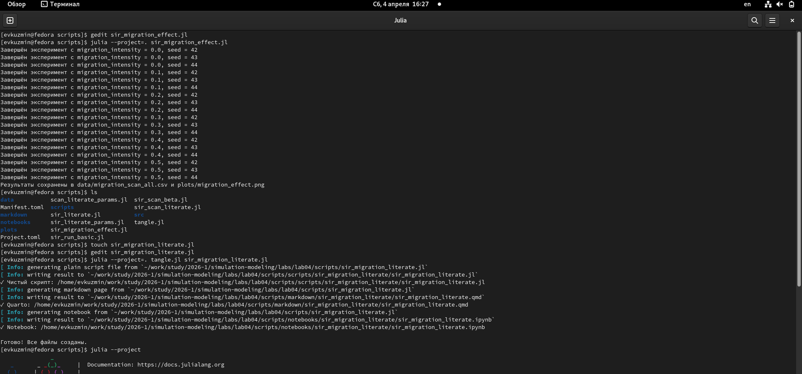

На рисунке показан запуск третьего скрипта и подготовка его literate-версии.

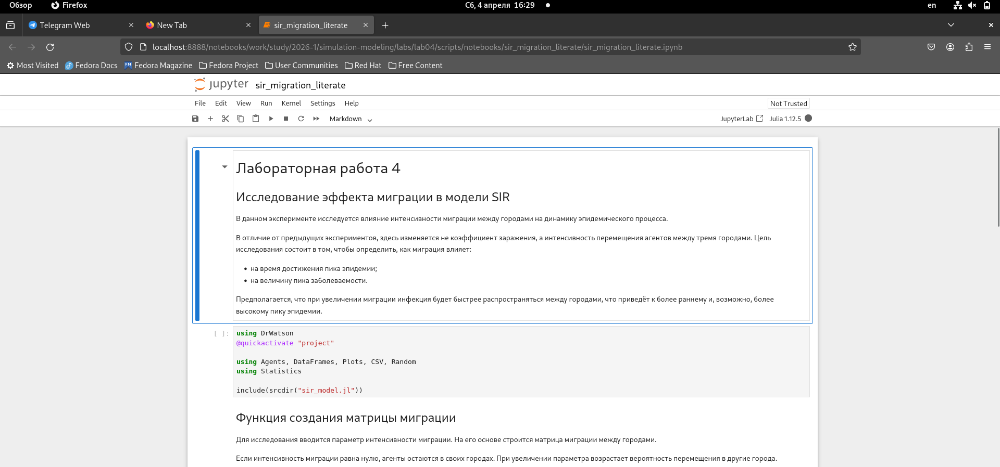

На рисунке представлен notebook literate-версии третьего скрипта.

### Результат исследования миграции

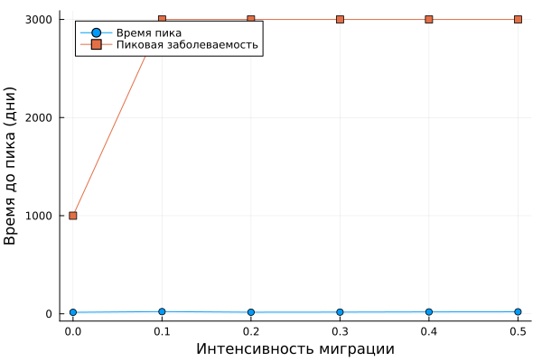

На рисунке показано влияние миграции на время достижения пика и на величину пика. При увеличении миграции инфекция распространяется между городами быстрее, что приводит к ускорению эпидемического процесса.

### Literate-версия

Листинг 4.8. Literate-версия скрипта исследования миграции  
sir_migration_literate.jl

```md
# # Лабораторная работа 4
# ## Исследование эффекта миграции в модели SIR
#
# В данном эксперименте исследуется влияние интенсивности миграции
# между городами на динамику эпидемического процесса.
#
# В отличие от предыдущих экспериментов, здесь изменяется не коэффициент
# заражения, а интенсивность перемещения агентов между тремя городами.
# Цель исследования состоит в том, чтобы определить, как миграция влияет:
#
# - на время достижения пика эпидемии;
# - на величину пика заболеваемости.
#
# Предполагается, что при увеличении миграции инфекция будет быстрее
# распространяться между городами, что приведёт к более раннему и,
# возможно, более высокому пику эпидемии.

using DrWatson
@quickactivate "project"

using Agents, DataFrames, Plots, CSV, Random
using Statistics

include(srcdir("sir_model.jl"))

# ## Функция создания матрицы миграции
#
# Для исследования вводится параметр интенсивности миграции.
# На его основе строится матрица миграции между городами.
#
# Если интенсивность миграции равна нулю, агенты остаются в своих городах.
# При увеличении параметра возрастает вероятность перемещения в другие города.

function create_migration_matrix(C, intensity)
M = ones(C, C) .* intensity / (C - 1)
for i in 1:C
M[i, i] = 1 - intensity
end
return M
end

# ## Функция измерения времени достижения пика
#
# Для каждого набора параметров выполняется моделирование, после чего
# определяются:
#
# - момент времени, когда доля инфицированных достигает максимума;
# - значение этого максимума.

function peak_time(p)
migration_rates = create_migration_matrix(p[:C], p[:migration_intensity])

model = initialize_sir(;
Ns = p[:Ns],
β_und = p[:β_und],
β_det = p[:β_det],
infection_period = p[:infection_period],
detection_time = p[:detection_time],
death_rate = p[:death_rate],
reinfection_probability = p[:reinfection_probability],
Is = p[:Is],
seed = p[:seed],
migration_rates = migration_rates,
)

infected_frac(model) =
count(a.status == :I for a in allagents(model)) / nagents(model)

peak = 0.0
peak_step = 0

for step in 1:p[:n_steps]
agent_ids = collect(allids(model))
for id in agent_ids
agent = try
model[id]
catch
nothing
end

if agent !== nothing
sir_agent_step!(agent, model)
end
end

frac = infected_frac(model)
if frac > peak
peak = frac
peak_step = step
end
end

return (peak_time = peak_step, peak_value = peak)
end

# ## Диапазон значений интенсивности миграции
#
# Рассматриваются значения интенсивности миграции от 0.0 до 0.5
# с шагом 0.1. Для каждого значения выполняются три прогона модели
# с различными значениями генератора случайных чисел.

migration_intensities = 0.0:0.1:0.5
seeds = [42, 43, 44]

# ## Формирование списка параметров
#
# Для каждого значения интенсивности миграции и каждого значения seed
# создаётся отдельный набор параметров.

params_list = []

for mig in migration_intensities
for s in seeds
push!(
params_list,
Dict(
:migration_intensity => mig,
:C => 3,
:Ns => [1000, 1000, 1000],
:β_und => [0.5, 0.5, 0.5],
:β_det => [0.05, 0.05, 0.05],
:infection_period => 14,
:detection_time => 7,
:death_rate => 0.02,
:reinfection_probability => 0.1,
:Is => [1, 0, 0],
:seed => s,
:n_steps => 150,
),
)
end
end

# ## Запуск экспериментов
#
# Для каждого набора параметров выполняется отдельное моделирование,
# а результаты сохраняются в общий массив.

results = []

for params in params_list
data = peak_time(params)
push!(results, merge(params, Dict(pairs(data))))
println("Завершён эксперимент с migration_intensity = $(params[:migration_intensity]), seed = $(params[:seed])")
end

# ## Сохранение результатов
#
# Результаты всех прогонов сохраняются в CSV-файл для последующего анализа.

df = DataFrame(results)
CSV.write(datadir("migration_scan_all.csv"), df)

# ## Усреднение результатов
#
# Для каждого значения интенсивности миграции вычисляются средние значения:
#
# - времени достижения пика;
# - величины пика заболеваемости.

grouped = combine(
groupby(df, [:migration_intensity]),
:peak_time => mean => :mean_peak_time,
:peak_value => mean => :mean_peak_value,
)

# ## Визуализация результатов
#
# Построим график зависимости времени до пика и величины пика
# от интенсивности миграции.

plot(
grouped.migration_intensity,
grouped.mean_peak_time,
marker = :circle,
xlabel = "Интенсивность миграции",
ylabel = "Значение показателя",
label = "Время пика",
)

plot!(
grouped.migration_intensity,
grouped.mean_peak_value .* 3000,
marker = :square,
label = "Пиковая заболеваемость",
)

savefig(plotsdir("migration_effect.png"))

println("Результаты сохранены в data/migration_scan_all.csv и plots/migration_effect.png")

# ## Вывод
#
# В результате моделирования была исследована зависимость времени
# достижения пика эпидемии и величины пика заболеваемости от интенсивности
# миграции между городами.
#
# Увеличение интенсивности миграции приводит к более быстрому распространению
# инфекции между городами, что, как правило, сокращает время до достижения
# пика эпидемии и увеличивает величину этого пика.
```

---

## Параметризованная версия скрипта миграции

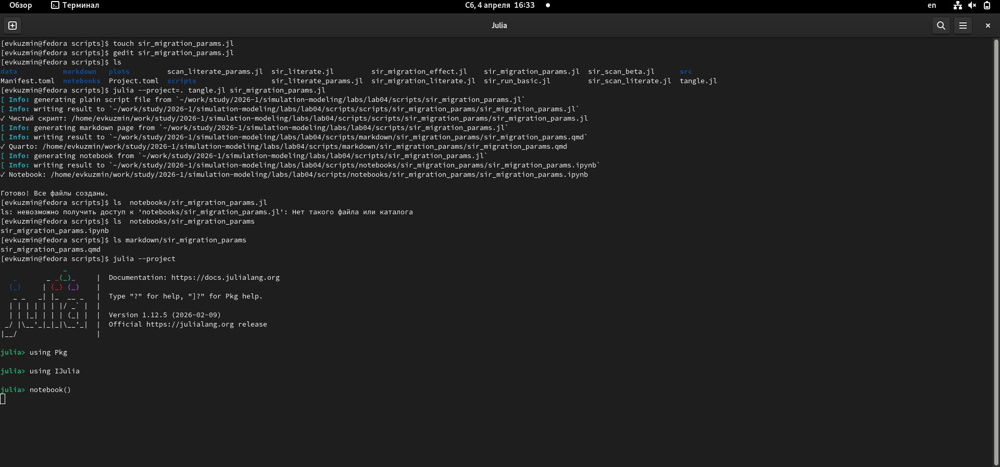

На рисунке показан этап создания параметрической версии третьего скрипта.

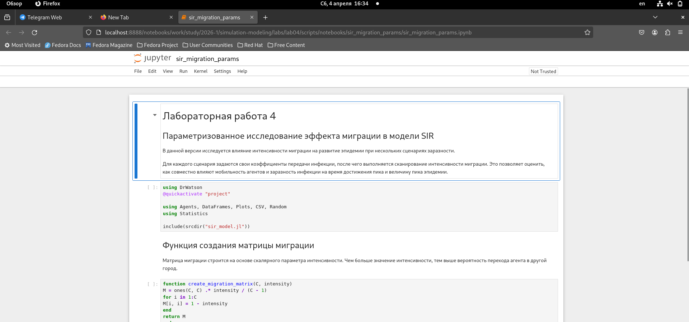

На рисунке показан notebook параметрической версии третьего скрипта.

### Результаты параметризованного исследования миграции


На рисунке представлена зависимость времени достижения пика от интенсивности миграции в разных сценариях. Это позволяет сравнить скорость распространения инфекции при различных условиях.

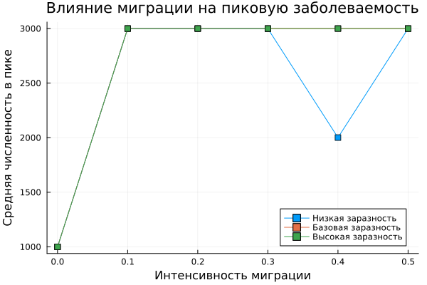

На рисунке показано, как в разных сценариях меняется величина пика эпидемии. Рост миграции, как правило, способствует более быстрому перемешиванию популяции и усилению распространения инфекции.

Листинг 4.9. Параметризованная версия скрипта исследования миграции  
sir_migration_params.jl

```md
# # Лабораторная работа 4
# ## Параметризованное исследование эффекта миграции в модели SIR
#
# В данной версии исследуется влияние интенсивности миграции на развитие
# эпидемии при нескольких сценариях заразности.
#
# Для каждого сценария задаются свои коэффициенты передачи инфекции,
# после чего выполняется сканирование интенсивности миграции. Это позволяет
# оценить, как совместно влияют мобильность агентов и заразность инфекции
# на время достижения пика и величину пика эпидемии.

using DrWatson
@quickactivate "project"

using Agents, DataFrames, Plots, CSV, Random
using Statistics

include(srcdir("sir_model.jl"))

# ## Функция создания матрицы миграции
#
# Матрица миграции строится на основе скалярного параметра интенсивности.
# Чем больше значение интенсивности, тем выше вероятность перехода агента
# в другой город.

function create_migration_matrix(C, intensity)
M = ones(C, C) .* intensity / (C - 1)
for i in 1:C
M[i, i] = 1 - intensity
end
return M
end

# ## Функция измерения характеристик эпидемии
#
# Для заданного набора параметров вычисляются:
#
# - время достижения пика эпидемии;
# - величина пика эпидемии.

function peak_time(p)
migration_rates = create_migration_matrix(p[:C], p[:migration_intensity])

model = initialize_sir(;
Ns = p[:Ns],
β_und = p[:β_und],
β_det = p[:β_det],
infection_period = p[:infection_period],
detection_time = p[:detection_time],
death_rate = p[:death_rate],
reinfection_probability = p[:reinfection_probability],
Is = p[:Is],
seed = p[:seed],
migration_rates = migration_rates,
)

infected_frac(model) =
count(a.status == :I for a in allagents(model)) / nagents(model)

peak = 0.0
peak_step = 0

for step in 1:p[:n_steps]
agent_ids = collect(allids(model))
for id in agent_ids
agent = try
model[id]
catch
nothing
end

if agent !== nothing
sir_agent_step!(agent, model)
end
end

frac = infected_frac(model)
if frac > peak
peak = frac
peak_step = step
end
end

return (peak_time = peak_step, peak_value = peak)
end

# ## Набор сценариев
#
# Рассматриваются три сценария:
#
# - низкая заразность;
# - базовая заразность;
# - высокая заразность.
#
# Для выявленных инфицированных коэффициент заражения принимается
# в 10 раз меньше, чем для невыявленных.

scenario_sets = [
(name = "Низкая заразность", β_und = [0.3, 0.3, 0.3], β_det = [0.03, 0.03, 0.03]),
(name = "Базовая заразность", β_und = [0.5, 0.5, 0.5], β_det = [0.05, 0.05, 0.05]),
(name = "Высокая заразность", β_und = [0.7, 0.7, 0.7], β_det = [0.07, 0.07, 0.07]),
]

# ## Диапазон значений миграции
#
# Для каждого сценария исследуются значения интенсивности миграции
# от 0.0 до 0.5 с шагом 0.1.

migration_intensities = 0.0:0.1:0.5
seeds = [42, 43, 44]

# ## Формирование списка параметров
#
# Для каждого сценария, каждого значения миграции и каждого значения seed
# создаётся отдельный набор параметров.

params_list = []

for scenario in scenario_sets
for mig in migration_intensities
for s in seeds
push!(
params_list,
Dict(
:scenario => scenario.name,
:migration_intensity => mig,
:C => 3,
:Ns => [1000, 1000, 1000],
:β_und => scenario.β_und,
:β_det => scenario.β_det,
:infection_period => 14,
:detection_time => 7,
:death_rate => 0.02,
:reinfection_probability => 0.1,
:Is => [1, 0, 0],
:seed => s,
:n_steps => 150,
),
)
end
end
end

# ## Запуск экспериментов
#
# Для всех наборов параметров выполняется моделирование.

results = []

for params in params_list
data = peak_time(params)
push!(results, merge(params, Dict(pairs(data))))
println("Сценарий = $(params[:scenario]), migration = $(params[:migration_intensity]), seed = $(params[:seed])")
end

# ## Сохранение результатов
#
# Сохраним полные результаты всех прогонов.

df = DataFrame(results)
CSV.write(datadir("migration_scenarios_all.csv"), df)

# ## Усреднение результатов
#
# Усредним результаты по одинаковым значениям сценария и интенсивности миграции.

grouped = combine(
groupby(df, [:scenario, :migration_intensity]),
:peak_time => mean => :mean_peak_time,
:peak_value => mean => :mean_peak_value,
)

CSV.write(datadir("migration_scenarios_grouped.csv"), grouped)

# ## Построение графика времени до пика
#
# На графике сравнивается время достижения пика эпидемии
# для разных сценариев.

plot(
xlabel = "Интенсивность миграции",
ylabel = "Среднее время до пика (дни)",
title = "Влияние миграции на время достижения пика",
linewidth = 2,
)

for scenario in scenario_sets
subset_df = grouped[grouped.scenario .== scenario.name, :]
plot!(
subset_df.migration_intensity,
subset_df.mean_peak_time,
label = scenario.name,
marker = :circle,
)
end

savefig(plotsdir("migration_scenarios_peak_time.png"))

# ## Построение графика пикового числа инфицированных
#
# На графике сравнивается величина пика эпидемии для разных сценариев.

plot(
xlabel = "Интенсивность миграции",
ylabel = "Средняя численность в пике",
title = "Влияние миграции на пиковую заболеваемость",
linewidth = 2,
)

for scenario in scenario_sets
subset_df = grouped[grouped.scenario .== scenario.name, :]
plot!(
subset_df.migration_intensity,
subset_df.mean_peak_value .* 3000,
label = scenario.name,
marker = :square,
)
end

savefig(plotsdir("migration_scenarios_peak_value.png"))

println("Результаты сохранены в data/migration_scenarios_all.csv")
println("Усреднённые результаты сохранены в data/migration_scenarios_grouped.csv")
println("Графики сохранены в plots/migration_scenarios_peak_time.png и plots/migration_scenarios_peak_value.png")

# ## Вывод
#
# В результате были исследованы несколько сценариев с различной заразностью
# инфекции при разных значениях интенсивности миграции. Это позволило оценить,
# как совместное изменение мобильности агентов и коэффициента передачи инфекции
# влияет на скорость развития эпидемии и величину её пика.
```

---

## Скрипт оптимизации параметров модели

Четвёртый скрипт решает задачу оптимизации параметров модели SIR.

### Обычная версия

Листинг 4.10. Обычная версия скрипта оптимизации  
sir_optimize_parameters.jl

```md
using DrWatson
@quickactivate "project"

using BlackBoxOptim, Random, Statistics
using Agents
using JLD2

include(srcdir("sir_model.jl"))

function cost_fast(x)
infected_frac(model) =
count(a.status == :I for a in allagents(model)) / nagents(model)

dead_count(model) = 1500 - nagents(model)

peak_vals = Float64[]
dead_vals = Float64[]

for rep in 1:2
model = initialize_sir(;
Ns = [500, 500, 500],
β_und = fill(x[1], 3),
β_det = fill(x[1] / 10, 3),
infection_period = 10,
detection_time = round(Int, x[2]),
death_rate = x[3],
reinfection_probability = 0.1,
Is = [0, 0, 1],
seed = 42 + rep,
n_steps = 50,
)

peak_infected = 0.0

for step in 1:50
Agents.step!(model, 1)
frac = infected_frac(model)
if frac > peak_infected
peak_infected = frac
end
end

push!(peak_vals, peak_infected)
push!(dead_vals, dead_count(model) / 1500)
end

mean_peak = mean(peak_vals)
mean_dead = mean(dead_vals)

return mean_peak + mean_dead
end

result = bboptimize(
cost_fast;
Method = :random_search,
SearchRange = [
(0.1, 1.0),
(3.0, 14.0),
(0.01, 0.1),
],
NumDimensions = 3,
MaxTime = 20,
TraceMode = :silent,
)

best = best_candidate(result)
fitness = best_fitness(result)

println("Оптимальные параметры:")
println("β_und = $(best[1])")
println("Время выявления = $(round(Int, best[2])) дней")
println("Смертность = $(best[3])")

println("Значение целевой функции: $(fitness)")

save(
datadir("optimization_fast_result.jld2"),
Dict(
"best" => best,
"fitness" => fitness,
),
)
```

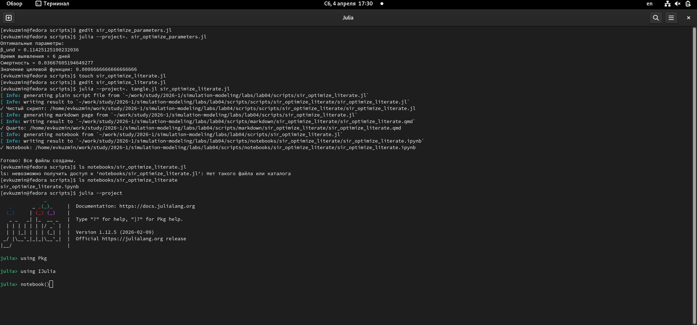

На рисунке показан запуск четвёртого скрипта и создание его literate-версии.

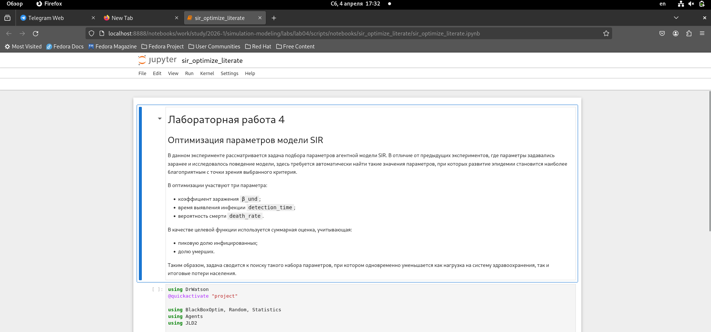

На рисунке представлен notebook literate-версии четвёртого скрипта.

### Literate-версия

Листинг 4.11. Literate-версия скрипта оптимизации

sir_optimize_literate.jl

```md
# # Лабораторная работа 4
# ## Оптимизация параметров модели SIR
#
# В данном эксперименте рассматривается задача подбора параметров
# агентной модели SIR. В отличие от предыдущих экспериментов, где
# параметры задавались заранее и исследовалось поведение модели,
# здесь требуется автоматически найти такие значения параметров,
# при которых развитие эпидемии становится наиболее благоприятным
# с точки зрения выбранного критерия.
#
# В оптимизации участвуют три параметра:
#
# - коэффициент заражения `β_und`;
# - время выявления инфекции `detection_time`;
# - вероятность смерти `death_rate`.
#
# В качестве целевой функции используется суммарная оценка,
# учитывающая:
#
# - пиковую долю инфицированных;
# - долю умерших.
#
# Таким образом, задача сводится к поиску такого набора параметров,
# при котором одновременно уменьшается как нагрузка на систему
# здравоохранения, так и итоговые потери населения.

using DrWatson
@quickactivate "project"

using BlackBoxOptim, Random, Statistics
using Agents
using JLD2

include(srcdir("sir_model.jl"))

# ## Целевая функция
#
# Целевая функция принимает вектор параметров `x`, где:
#
# - `x[1]` — коэффициент заражения `β_und`;
# - `x[2]` — время выявления инфекции;
# - `x[3]` — вероятность смерти.
#
# Для уменьшения влияния случайности результат усредняется
# по нескольким прогонам модели.

function cost_fast(x)
infected_frac(model) =
count(a.status == :I for a in allagents(model)) / nagents(model)

dead_count(model) = 1500 - nagents(model)

peak_vals = Float64[]
dead_vals = Float64[]

for rep in 1:2
model = initialize_sir(;
Ns = [500, 500, 500],
β_und = fill(x[1], 3),
β_det = fill(x[1] / 10, 3),
infection_period = 10,
detection_time = round(Int, x[2]),
death_rate = x[3],
reinfection_probability = 0.1,
Is = [0, 0, 1],
seed = 42 + rep,
n_steps = 50,
)

peak_infected = 0.0

for step in 1:50
Agents.step!(model, 1)
frac = infected_frac(model)
if frac > peak_infected
peak_infected = frac
end
end

push!(peak_vals, peak_infected)
push!(dead_vals, dead_count(model) / 1500)
end

mean_peak = mean(peak_vals)
mean_dead = mean(dead_vals)

return mean_peak + mean_dead
end

# ## Запуск оптимизации
#
# Для поиска оптимальных значений используется алгоритм случайного поиска.
# Он работает быстрее более сложных многокритериальных методов и подходит
# для облегчённой демонстрационной версии модели.

result = bboptimize(
cost_fast;
Method = :random_search,
SearchRange = [
(0.1, 1.0),
(3.0, 14.0),
(0.01, 0.1),
],
NumDimensions = 3,
MaxTime = 20,
TraceMode = :silent,
)

# ## Извлечение результатов
#
# После завершения оптимизации извлекаются найденные параметры
# и значение целевой функции.

best = best_candidate(result)
fitness = best_fitness(result)

println("Оптимальные параметры:")
println("β_und = $(best[1])")
println("Время выявления = $(round(Int, best[2])) дней")
println("Смертность = $(best[3])")

println("Значение целевой функции: $(fitness)")

# ## Сохранение результатов
#
# Сохраним найденные параметры и значение целевой функции
# для последующего использования.

save(
datadir("optimization_fast_result.jld2"),
Dict(
"best" => best,
"fitness" => fitness,
),
)

# ## Вывод
#
# В результате оптимизации были найдены параметры модели,
# обеспечивающие минимальное значение целевой функции.
# Это означает, что алгоритм подобрал такое сочетание
# коэффициента заражения, времени выявления инфекции и вероятности смерти,
# при котором модель демонстрирует наиболее благоприятный сценарий
# в рамках заданных ограничений поиска.
```

---

## Параметризованная версия скрипта оптимизации

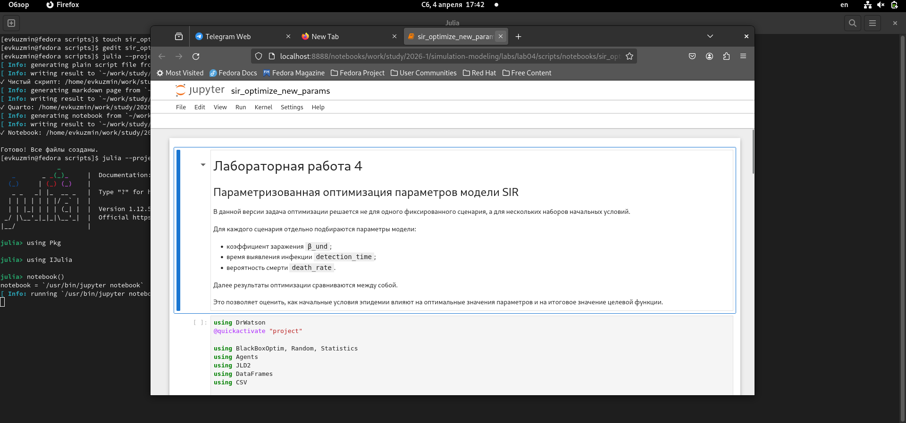

На рисунке показан этап генерации артефактов для параметризованной версии четвёртого скрипта.

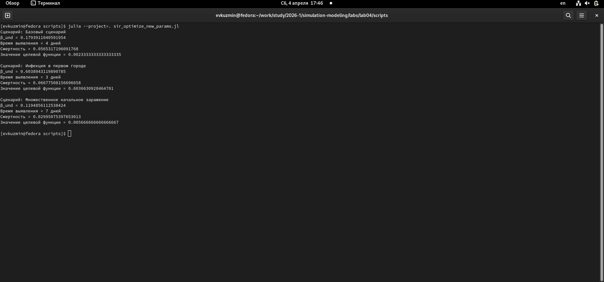

На рисунке показан запуск параметризованной версии четвёртого скрипта.

### Параметризованная версия

Листинг 4.12. Параметризованная версия скрипта оптимизации  
sir_optimize_new_params.jl

```md
# # Лабораторная работа 4
# ## Параметризованная оптимизация параметров модели SIR
#
# В данной версии задача оптимизации решается не для одного фиксированного
# сценария, а для нескольких наборов начальных условий.
#
# Для каждого сценария отдельно подбираются параметры модели:
#
# - коэффициент заражения `β_und`;
# - время выявления инфекции `detection_time`;
# - вероятность смерти `death_rate`.
#
# Далее результаты оптимизации сравниваются между собой.
#
# Это позволяет оценить, как начальные условия эпидемии влияют на оптимальные
# значения параметров и на итоговое значение целевой функции.

using DrWatson
@quickactivate "project"

using BlackBoxOptim, Random, Statistics
using Agents
using JLD2
using DataFrames
using CSV

include(srcdir("sir_model.jl"))

# ## Набор сценариев
#
# Рассматриваются три сценария:
#
# - базовый сценарий с одним начально инфицированным в третьем городе;
# - сценарий с одним начально инфицированным в первом городе;
# - сценарий с большим числом начально инфицированных агентов.

scenario_sets = [
(name = "Базовый сценарий", Is = [0, 0, 1], Ns = [500, 500, 500]),
(name = "Инфекция в первом городе", Is = [1, 0, 0], Ns = [500, 500, 500]),
(name = "Множественное начальное заражение", Is = [5, 0, 0], Ns = [500, 500, 500]),
]

# ## Функция построения целевой функции
#
# Для каждого сценария строится собственная целевая функция, чтобы оптимизация
# выполнялась с учётом заданных начальных условий.

function make_cost_function(scenario)
    function cost_fast(x)
        infected_frac(model) =
            count(a.status == :I for a in allagents(model)) / nagents(model)

        total_population = sum(scenario.Ns)
        dead_count(model) = total_population - nagents(model)

        peak_vals = Float64[]
        dead_vals = Float64[]

        for rep in 1:2
            model = initialize_sir(;
                Ns = scenario.Ns,
                β_und = fill(x[1], 3),
                β_det = fill(x[1] / 10, 3),
                infection_period = 10,
                detection_time = round(Int, x[2]),
                death_rate = x[3],
                reinfection_probability = 0.1,
                Is = scenario.Is,
                seed = 42 + rep,
                n_steps = 50,
            )

            peak_infected = 0.0

            for step in 1:50
                Agents.step!(model, 1)
                frac = infected_frac(model)
                if frac > peak_infected
                    peak_infected = frac
                end
            end

            push!(peak_vals, peak_infected)
            push!(dead_vals, dead_count(model) / total_population)
        end

        mean_peak = mean(peak_vals)
        mean_dead = mean(dead_vals)

        return mean_peak + mean_dead
    end

    return cost_fast
end

# ## Проведение оптимизации для всех сценариев
#
# Для каждого сценария отдельно запускается оптимизация и сохраняются
# найденные параметры.

results = DataFrame(
    scenario = String[],
    beta_und = Float64[],
    detection_time = Int[],
    death_rate = Float64[],
    fitness = Float64[],
)

for scenario in scenario_sets
    cost_fun = make_cost_function(scenario)

    result = bboptimize(
        cost_fun;
        Method = :random_search,
        SearchRange = [
            (0.1, 1.0),
            (3.0, 14.0),
            (0.01, 0.1),
        ],
        NumDimensions = 3,
        MaxTime = 20,
        TraceMode = :silent,
    )

    best = best_candidate(result)
    fitness = best_fitness(result)

    push!(
        results,
        (
            scenario.name,
            best[1],
            round(Int, best[2]),
            best[3],
            fitness,
        ),
    )

    println("Сценарий: $(scenario.name)")
    println("β_und = $(best[1])")
    println("Время выявления = $(round(Int, best[2])) дней")
    println("Смертность = $(best[3])")
    println("Значение целевой функции = $(fitness)")
    println()
end

# ## Просмотр итоговой таблицы

results

# ## Сохранение результатов
#
# Сохраним таблицу со всеми сценариями.

CSV.write(datadir("optimization_scenarios.csv"), results)

save(
    datadir("optimization_scenarios.jld2"),
    Dict("results" => results),
)

# ## Вывод
#
# В результате были получены оптимальные параметры модели для нескольких
# сценариев начальных условий. Это позволило сравнить, как различное
# начальное распределение инфекции влияет на оптимальный набор параметров
# и на значение целевой функции.
```

---

## Скрипт комплексной визуализации результатов

Пятый скрипт используется для построения составного рисунка по уже рассчитанным данным.

### Обычная версия и literate-версия

Листинг 4.13. Скрипт комплексной визуализации  
sir_visualize_dynamics.jl


```md
using DrWatson
@quickactivate "project"

using Agents, DataFrames, Plots, CSV

include(srcdir("sir_model.jl"))

# Загружаем результаты сканирования
df = CSV.read(datadir("beta_scan_all.csv"), DataFrame)

# Первый график: пик и конечная доля инфицированных
p1 = plot(
    df.beta,
    df.peak,
    label = "Пик",
    xlabel = "β",
    ylabel = "Доля инфицированных",
)

plot!(
    p1,
    df.beta,
    df.final_inf,
    label = "Конечная",
)

# Второй график: число умерших
p2 = plot(
    df.beta,
    df.deaths,
    xlabel = "β",
    ylabel = "Число умерших",
    label = "Умершие",
)

# Третий график: доля выздоровевших
p3 = plot(
    df.beta,
    df.final_rec,
    xlabel = "β",
    ylabel = "Доля выздоровевших",
    label = "Выздоровевшие",
)

# Составной график
plot(
    p1,
    p2,
    p3,
    layout = (3, 1),
    size = (800, 900),
)

savefig(plotsdir("comprehensive_analysis.png"))
```

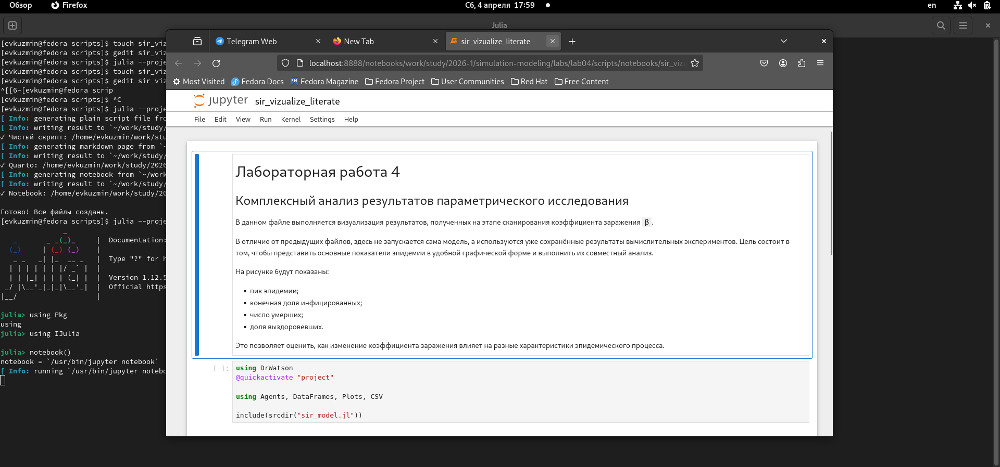

На рисунке показан этап выполнения пятого скрипта и генерации для него notebook и literate-версии.

### Результат комплексного анализа

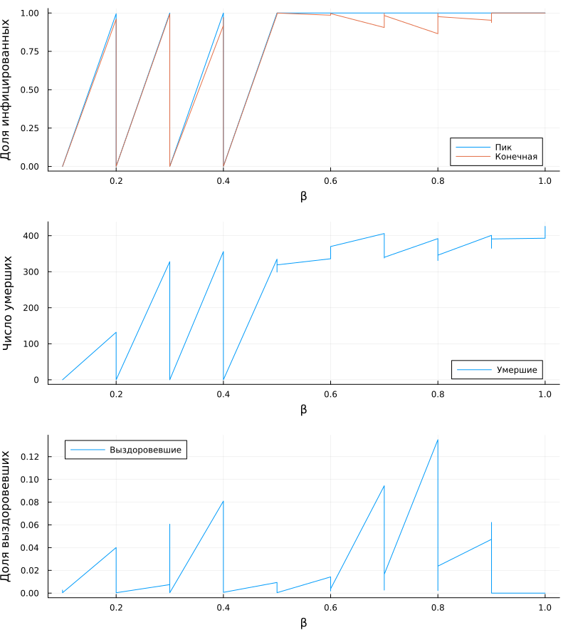

На рисунке объединены несколько итоговых зависимостей: пик эпидемии, конечная доля инфицированных, число умерших и доля выздоровевших. Такой составной график позволяет одновременно анализировать несколько ключевых характеристик модели.

Листинг 4.14. Literate-версия скрипта комплексной визуализации  
sir_visualize_literate.jl

```md
# # Лабораторная работа 4
# ## Комплексный анализ результатов параметрического исследования
#
# В данном файле выполняется визуализация результатов, полученных
# на этапе сканирования коэффициента заражения `β`.
#
# В отличие от предыдущих файлов, здесь не запускается сама модель,
# а используются уже сохранённые результаты вычислительных экспериментов.
# Цель состоит в том, чтобы представить основные показатели эпидемии
# в удобной графической форме и выполнить их совместный анализ.
#
# На рисунке будут показаны:
#
# - пик эпидемии;
# - конечная доля инфицированных;
# - число умерших;
# - доля выздоровевших.
#
# Это позволяет оценить, как изменение коэффициента заражения влияет
# на разные характеристики эпидемического процесса.

using DrWatson
@quickactivate "project"

using Agents, DataFrames, Plots, CSV

include(srcdir("sir_model.jl"))

# ## Загрузка результатов
#
# Считаем ранее сохранённую таблицу результатов параметрического
# исследования из CSV-файла.

df = CSV.read(datadir("beta_scan_all.csv"), DataFrame)

# ## Построение первого графика
#
# На первом графике отображаются:
#
# - пик эпидемии;
# - конечная доля инфицированных.
#
# Это позволяет сравнить максимальный масштаб вспышки
# и итоговый уровень распространения инфекции.

p1 = plot(
    df.beta,
    df.peak,
    label = "Пик",
    xlabel = "β",
    ylabel = "Доля инфицированных",
)

plot!(
    p1,
    df.beta,
    df.final_inf,
    label = "Конечная",
)

# ## Построение второго графика
#
# На втором графике отображается число умерших
# в зависимости от коэффициента заражения.

p2 = plot(
    df.beta,
    df.deaths,
    xlabel = "β",
    ylabel = "Число умерших",
    label = "Умершие",
)

# ## Построение третьего графика
#
# На третьем графике отображается доля выздоровевших
# в зависимости от коэффициента заражения.

p3 = plot(
    df.beta,
    df.final_rec,
    xlabel = "β",
    ylabel = "Доля выздоровевших",
    label = "Выздоровевшие",
)

# ## Формирование составного рисунка
#
# Объединим три графика в один составной рисунок
# для совместного анализа результатов.

plot(
    p1,
    p2,
    p3,
    layout = (3, 1),
    size = (800, 900),
)

savefig(plotsdir("comprehensive_analysis.png"))

# ## Вывод
#
# В результате был построен составной рисунок, отражающий влияние
# коэффициента заражения `β` на основные характеристики эпидемии.
# Совместный анализ этих графиков позволяет оценить не только
# интенсивность вспышки, но и её последствия с точки зрения
# смертности и выздоровления.
```

# Дополнительные задания

## Дополнительные задания 1–3

Дополнительные задания 1–3 объединены в один скрипт, так как они связаны с базовой динамикой модели, исследованием порога эпидемии и анализом гетерогенности коэффициента заражения.

Листинг 5.1. Скрипт дополнительных заданий 1–3  
extra_1_2_3.jl

```md
# # Дополнительные задания 1–3
# ## Базовый уровень, исследование порога и эффект гетерогенности
#
# В данном файле объединены три дополнительных задания:
#
# - базовый запуск модели и вычисление базового репродуктивного числа;
# - исследование эпидемического порога;
# - анализ эффекта гетерогенности по городам.
#
# Такое объединение удобно, поскольку все три задания связаны
# с параметром заражения `β` и с анализом общей динамики модели SIR.

using DrWatson
@quickactivate "project"

using Agents, DataFrames, Plots, CSV, Statistics
using JLD2

include(srcdir("sir_model.jl"))

function main()

# ## 1. Базовый уровень
#
# Сначала выполним запуск модели с параметрами по умолчанию,
# построим график динамики численности `S`, `I`, `R`
# и вычислим базовое репродуктивное число:
#
# $$ R_0 = \frac{\beta}{\gamma}, \quad \gamma = \frac{1}{infection\_period}. $$

params_basic = Dict(
    :Ns => [1000, 1000, 1000],
    :β_und => [0.5, 0.5, 0.5],
    :β_det => [0.05, 0.05, 0.05],
    :infection_period => 14,
    :detection_time => 7,
    :death_rate => 0.02,
    :reinfection_probability => 0.1,
    :Is => [0, 0, 1],
    :seed => 42,
    :n_steps => 100,
)

model = initialize_sir(; params_basic...)

times = Int[]
S_vals = Int[]
I_vals = Int[]
R_vals = Int[]

for step in 1:params_basic[:n_steps]
    Agents.step!(model, 1)
    push!(times, step)
    push!(S_vals, susceptible_count(model))
    push!(I_vals, infected_count(model))
    push!(R_vals, recovered_count(model))
end

basic_df = DataFrame(
    time = times,
    susceptible = S_vals,
    infected = I_vals,
    recovered = R_vals,
)

γ = 1 / params_basic[:infection_period]
R0 = params_basic[:β_und][1] / γ

p_basic = plot(
    basic_df.time,
    basic_df.susceptible,
    label = "S",
    xlabel = "Дни",
    ylabel = "Численность",
    title = "Базовая динамика SIR",
)
plot!(p_basic, basic_df.time, basic_df.infected, label = "I")
plot!(p_basic, basic_df.time, basic_df.recovered, label = "R")
savefig(p_basic, plotsdir("extra_1_basic_sir.png"))

println("Базовое репродуктивное число R0 = $(round(R0, digits=3))")

# ## 2. Исследование порога
#
# Теперь исследуем, при каком минимальном значении `β`
# возникает эпидемия, то есть пик числа инфицированных превышает 5%
# от общей численности популяции.
#
# Полученный результат сравнивается с теоретическим порогом:
#
# $$ R_0 = 1 \Rightarrow \beta = \gamma. $$

beta_range = 0.05:0.05:1.0
threshold_beta = nothing
threshold_peak = nothing
population_total = sum(params_basic[:Ns])

threshold_results = DataFrame(
    beta = Float64[],
    peak_fraction = Float64[],
)

for beta in beta_range
    model_thr = initialize_sir(;
        Ns = params_basic[:Ns],
        β_und = fill(beta, 3),
        β_det = fill(beta / 10, 3),
        infection_period = params_basic[:infection_period],
        detection_time = params_basic[:detection_time],
        death_rate = params_basic[:death_rate],
        reinfection_probability = params_basic[:reinfection_probability],
        Is = params_basic[:Is],
        seed = params_basic[:seed],
        n_steps = params_basic[:n_steps],
    )

    peak_fraction = 0.0

    for step in 1:params_basic[:n_steps]
        Agents.step!(model_thr, 1)
        frac = infected_count(model_thr) / population_total
        if frac > peak_fraction
            peak_fraction = frac
        end
    end

    push!(threshold_results, (beta, peak_fraction))

    if threshold_beta === nothing && peak_fraction > 0.05
        threshold_beta = beta
        threshold_peak = peak_fraction
    end
end

theoretical_beta = γ

p_threshold = plot(
    threshold_results.beta,
    threshold_results.peak_fraction,
    label = "Пиковая доля I",
    xlabel = "β",
    ylabel = "Доля инфицированных",
    title = "Исследование порога эпидемии",
)
hline!(p_threshold, [0.05], label = "Порог 5%")
vline!(p_threshold, [theoretical_beta], label = "Теоретический порог R₀ = 1")
savefig(p_threshold, plotsdir("extra_2_threshold.png"))

println("Теоретический порог beta = $(round(theoretical_beta, digits=3))")
if threshold_beta !== nothing
    println("Найденный порог beta = $(threshold_beta), пик = $(round(threshold_peak, digits=3))")
else
    println("В диапазоне beta порог не найден")
end

CSV.write(datadir("extra_2_threshold_results.csv"), threshold_results)

# ## 3. Эффект гетерогенности
#
# На этом этапе зададим разные коэффициенты заражения для разных городов
# и посмотрим, как это влияет на общую динамику и на динамику в каждом городе.
#
# Здесь используются значения:
#
# - город 1: `β = 0.2`
# - город 2: `β = 0.5`
# - город 3: `β = 0.8`

params_hetero = Dict(
    :Ns => [1000, 1000, 1000],
    :β_und => [0.2, 0.5, 0.8],
    :β_det => [0.02, 0.05, 0.08],
    :infection_period => 14,
    :detection_time => 7,
    :death_rate => 0.02,
    :reinfection_probability => 0.1,
    :Is => [0, 0, 1],
    :seed => 42,
    :n_steps => 100,
)

model_hetero = initialize_sir(; params_hetero...)

hetero_total = DataFrame(
    time = Int[],
    infected = Int[],
)

hetero_city = DataFrame(
    time = Int[],
    city = Int[],
    infected = Int[],
)

for step in 1:params_hetero[:n_steps]
    Agents.step!(model_hetero, 1)

    push!(hetero_total, (step, infected_count(model_hetero)))

    for city in 1:3
        city_inf = count(a.status == :I && a.pos == city for a in allagents(model_hetero))
        push!(hetero_city, (step, city, city_inf))
    end
end

p_total = plot(
    hetero_total.time,
    hetero_total.infected,
    label = "Общая динамика I",
    xlabel = "Дни",
    ylabel = "Число инфицированных",
    title = "Гетерогенность: общая динамика",
)
savefig(p_total, plotsdir("extra_3_heterogeneity_total.png"))

p_city = plot(
    xlabel = "Дни",
    ylabel = "Число инфицированных",
    title = "Гетерогенность: динамика по городам",
)
for city in 1:3
    subdf = hetero_city[hetero_city.city .== city, :]
    plot!(p_city, subdf.time, subdf.infected, label = "Город $city")
end
savefig(p_city, plotsdir("extra_3_heterogeneity_by_city.png"))

CSV.write(datadir("extra_3_heterogeneity_total.csv"), hetero_total)
CSV.write(datadir("extra_3_heterogeneity_by_city.csv"), hetero_city)

save(datadir("extra_1_basic_result.jld2"), Dict(
    "R0" => R0,
    "basic_df" => basic_df,
    "threshold_beta" => threshold_beta,
    "threshold_peak" => threshold_peak,
))

# ## Вывод
#
# В результате выполнения дополнительных заданий 1–3 были:
#
# - получены базовые траектории `S`, `I`, `R`;
# - вычислено базовое репродуктивное число `R₀`;
# - найден порог эпидемии по параметру `β`;
# - исследовано влияние гетерогенности коэффициента заражения между городами.
#
# Это позволило сопоставить теоретические характеристики модели
# с наблюдаемой динамикой и оценить влияние неоднородности параметров
# на развитие эпидемии.

end

main()
```


На рисунке показан запуск скрипта, объединяющего дополнительные задания 1–3.

### Базовая динамика


На рисунке показана базовая динамика системы SIR для дополнительных заданий. Видно, что эпидемический процесс проходит стадию роста, достигает пика и затем затухает за счёт уменьшения числа восприимчивых и накопления выздоровевших.

### Исследование порога

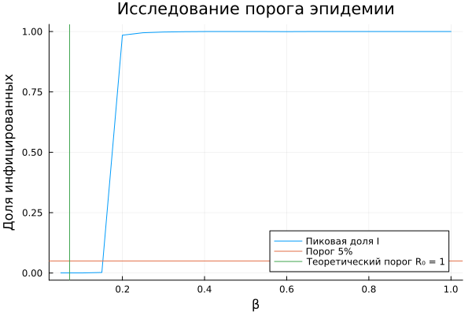

На рисунке  показано исследование эпидемического порога. Горизонтальная линия соответствует уровню 5% популяции, а вертикальная — теоретическому порогу R_0 = 1. Сравнение позволяет сопоставить теоретические оценки и наблюдаемые результаты моделирования.

### Гетерогенность

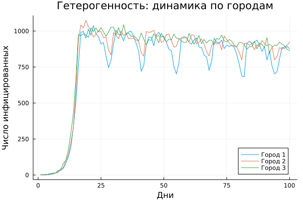

На рисунке показаны траектории числа инфицированных в отдельных городах при различных значениях β. Более высокая заразность в отдельном городе приводит к более интенсивному локальному развитию эпидемии.

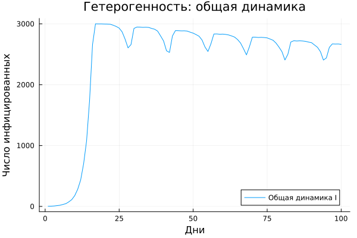

На рисунке представлена общая динамика инфицированных при гетерогенных параметрах. Введение неоднородности делает поведение системы более сложным по сравнению с однородным случаем.

---

## Дополнительные задания 4–5

Задания 4 и 5 объединены в один скрипт, так как обе постановки связаны с миграцией и ограничением перемещений между городами.

Листинг 5.2. Скрипт дополнительных заданий 4–5  
extra_4_5.jl

```md
# # Дополнительные задания 4–5
# ## Миграция и карантинные меры
#
# В данном файле объединены два дополнительных задания:
#
# - исследование влияния интенсивности миграции на распространение инфекции;
# - оценка эффективности карантинных мер.
#
# В первой части рассматривается, как изменение интенсивности перемещения
# агентов между городами влияет на скорость развития эпидемии.
# Во второй части вводится простая модель карантина: если доля инфицированных
# в городе превышает заданный порог, миграция из него прекращается.

using DrWatson
@quickactivate "project"

using Agents, DataFrames, Plots, CSV, Statistics
using JLD2

include(srcdir("sir_model.jl"))

# ## Функция построения матрицы миграции
#
# Матрица миграции создаётся по параметру интенсивности.
# Чем выше интенсивность, тем выше вероятность перехода агента
# из одного города в другой.

function create_migration_matrix(C, intensity)
    M = ones(C, C) .* intensity / (C - 1)
    for i in 1:C
        M[i, i] = 1 - intensity
    end
    return M
end

# ## Миграция без карантина
#
# Для заданного набора параметров вычисляются:
#
# - момент времени, когда достигается пик эпидемии;
# - величина этого пика.
#
# Здесь используется исходная модель миграции без ограничений.

function peak_time_without_quarantine(p)
    migration_rates = create_migration_matrix(p[:C], p[:migration_intensity])

    model = initialize_sir(;
        Ns = p[:Ns],
        β_und = p[:β_und],
        β_det = p[:β_det],
        infection_period = p[:infection_period],
        detection_time = p[:detection_time],
        death_rate = p[:death_rate],
        reinfection_probability = p[:reinfection_probability],
        Is = p[:Is],
        seed = p[:seed],
        migration_rates = migration_rates,
    )

    infected_frac(model) =
        count(a.status == :I for a in allagents(model)) / nagents(model)

    peak = 0.0
    peak_step = 0

    for step in 1:p[:n_steps]
        agent_ids = collect(allids(model))
        for id in agent_ids
            agent = try
                model[id]
            catch
                nothing
            end
            if agent !== nothing
                sir_agent_step!(agent, model)
            end
        end

        frac = infected_frac(model)
        if frac > peak
            peak = frac
            peak_step = step
        end
    end

    return (peak_time = peak_step, peak_value = peak)
end

# ## Миграция с карантином
#
# В этом варианте используется простая карантинная мера:
# если доля инфицированных в городе превышает заданный порог,
# миграция из этого города обнуляется.

function peak_time_with_quarantine(p)
    migration_rates = create_migration_matrix(p[:C], p[:migration_intensity])

    model = initialize_sir(;
        Ns = p[:Ns],
        β_und = p[:β_und],
        β_det = p[:β_det],
        infection_period = p[:infection_period],
        detection_time = p[:detection_time],
        death_rate = p[:death_rate],
        reinfection_probability = p[:reinfection_probability],
        Is = p[:Is],
        seed = p[:seed],
        migration_rates = copy(migration_rates),
    )

    infected_frac(model) =
        count(a.status == :I for a in allagents(model)) / nagents(model)

    peak = 0.0
    peak_step = 0

    quarantine_threshold = p[:quarantine_threshold]
    quarantined_cities = falses(p[:C])

    for step in 1:p[:n_steps]
        for city in 1:p[:C]
            city_population = count(a.pos == city for a in allagents(model))
            city_infected = count(a.status == :I && a.pos == city for a in allagents(model))

            if city_population > 0
                city_frac = city_infected / city_population
                if city_frac > quarantine_threshold && !quarantined_cities[city]
                    model.migration_rates[city, :] .= 0.0
                    model.migration_rates[city, city] = 1.0
                    quarantined_cities[city] = true
                end
            end
        end

        agent_ids = collect(allids(model))
        for id in agent_ids
            agent = try
                model[id]
            catch
                nothing
            end
            if agent !== nothing
                sir_agent_step!(agent, model)
            end
        end

        frac = infected_frac(model)
        if frac > peak
            peak = frac
            peak_step = step
        end
    end

    return (peak_time = peak_step, peak_value = peak)
end

function main()

# ## Формирование набора параметров
#
# Рассматриваются значения интенсивности миграции от 0.0 до 0.5
# с шагом 0.1. Для каждого значения выполняются три прогона модели
# с разными значениями генератора случайных чисел.

    migration_intensities = 0.0:0.1:0.5
    seeds = [42, 43, 44]

    params_list = []

    for mig in migration_intensities
        for s in seeds
            push!(
                params_list,
                Dict(
                    :migration_intensity => mig,
                    :C => 3,
                    :Ns => [1000, 1000, 1000],
                    :β_und => [0.5, 0.5, 0.5],
                    :β_det => [0.05, 0.05, 0.05],
                    :infection_period => 14,
                    :detection_time => 7,
                    :death_rate => 0.02,
                    :reinfection_probability => 0.1,
                    :Is => [1, 0, 0],
                    :seed => s,
                    :n_steps => 150,
                    :quarantine_threshold => 0.1,
                ),
            )
        end
    end

# ## Запуск экспериментов
#
# Для каждого набора параметров выполняются два расчёта:
#
# - без карантина;
# - с карантином.
#
# Затем результаты сохраняются в общую таблицу.

    results = DataFrame(
        migration_intensity = Float64[],
        seed = Int[],
        mode = String[],
        peak_time = Float64[],
        peak_value = Float64[],
    )

    for params in params_list
        res_no_q = peak_time_without_quarantine(params)
        push!(results, (
            params[:migration_intensity],
            params[:seed],
            "Без карантина",
            res_no_q.peak_time,
            res_no_q.peak_value,
        ))

        res_q = peak_time_with_quarantine(params)
        push!(results, (
            params[:migration_intensity],
            params[:seed],
            "С карантином",
            res_q.peak_time,
            res_q.peak_value,
        ))

        println("Завершён эксперимент: migration = $(params[:migration_intensity]), seed = $(params[:seed])")
    end

# ## Сохранение результатов
#
# Полная таблица результатов сохраняется в CSV-файл.

    CSV.write(datadir("extra_4_5_results.csv"), results)

# ## Усреднение результатов
#
# Для каждого значения интенсивности миграции и для каждого режима
# (с карантином и без карантина) вычисляются средние значения:
#
# - времени до пика;
# - величины пика.

    grouped = combine(
        groupby(results, [:migration_intensity, :mode]),
        :peak_time => mean => :mean_peak_time,
        :peak_value => mean => :mean_peak_value,
    )

# ## Построение графика времени до пика
#
# На первом графике сравнивается время достижения пика эпидемии
# при наличии и отсутствии карантина.

    p_time = plot(
        xlabel = "Интенсивность миграции",
        ylabel = "Среднее время до пика",
        title = "Миграция и карантин: время до пика",
    )

    for mode in unique(grouped.mode)
        subdf = grouped[grouped.mode .== mode, :]
        plot!(p_time, subdf.migration_intensity, subdf.mean_peak_time, label = mode, marker = :circle)
    end
    savefig(p_time, plotsdir("extra_4_5_peak_time.png"))

# ## Построение графика величины пика
#
# На втором графике сравнивается средняя величина пика
# для режимов с карантином и без карантина.

    p_peak = plot(
        xlabel = "Интенсивность миграции",
        ylabel = "Средняя пиковая доля инфицированных",
        title = "Миграция и карантин: величина пика",
    )

    for mode in unique(grouped.mode)
        subdf = grouped[grouped.mode .== mode, :]
        plot!(p_peak, subdf.migration_intensity, subdf.mean_peak_value, label = mode, marker = :square)
    end
    savefig(p_peak, plotsdir("extra_4_5_peak_value.png"))

# ## Сохранение итоговых данных
#
# Для удобства дальнейшего использования сохраним результаты и
# усреднённую таблицу в формате JLD2.

    save(datadir("extra_4_5_results.jld2"), Dict(
        "results" => results,
        "grouped" => grouped,
    ))
end

main()

# ## Вывод
#
# В результате выполнения дополнительных заданий 4–5 было исследовано
# влияние интенсивности миграции на скорость распространения инфекции,
# а также оценена эффективность карантинных мер.
#
# Сравнение режимов с карантином и без карантина позволяет определить,
# насколько ограничение миграции при росте заболеваемости помогает
# замедлить развитие эпидемии и снизить пиковую нагрузку.
```

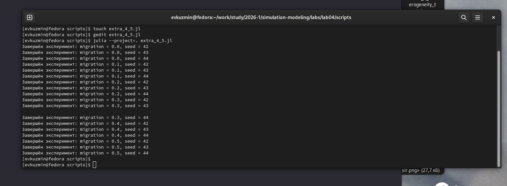

На рисунке показан запуск скрипта дополнительных заданий 4–5.

### Влияние миграции и карантина на время до пика


На рисунке показано, как меняется среднее время достижения пика при различных значениях миграции. Сравнение режимов с карантином и без карантина позволяет оценить, насколько ограничение перемещений замедляет развитие эпидемии.

### Влияние миграции и карантина на величину пика

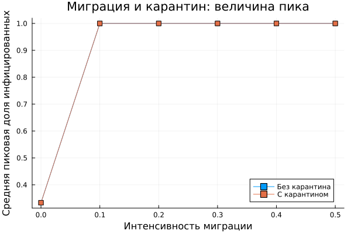

На рисунке показана зависимость величины пика эпидемии от интенсивности миграции для режимов с карантином и без карантина. Это позволяет оценить эффективность карантинных мер по снижению максимальной нагрузки.

---

## Дополнительное задание 6

В дополнительном задании 6 решалась задача оптимизации параметров модели при ограничении на пиковую долю инфицированных.

Листинг 5.3. Скрипт дополнительного задания 6  
extra_6.jl

```md
# # Дополнительное задание 6
# ## Оптимизация параметров модели SIR
#
# В данном эксперименте решается задача оптимизации параметров модели.
# Требуется подобрать такие значения параметров, при которых:
#
# - общее число умерших минимально;
# - пик заболеваемости не превышает 30% от общей численности популяции.
#
# В качестве настраиваемых параметров рассматриваются:
#
# - коэффициент заражения `β_und`;
# - время выявления инфекции `detection_time`;
# - вероятность смерти `death_rate`.
#
# Для ускорения вычислений используется облегчённая версия модели
# с уменьшенным числом агентов, числом шагов и количеством повторов.

using DrWatson
@quickactivate "project"

using BlackBoxOptim, Random, Statistics
using Agents
using JLD2
using DataFrames
using CSV
using Plots

include(srcdir("sir_model.jl"))

# ## Целевая функция
#
# Функция принимает вектор параметров `x`, где:
#
# - `x[1]` — коэффициент заражения `β_und`;
# - `x[2]` — время выявления инфекции;
# - `x[3]` — вероятность смерти.
#
# Для каждого набора параметров выполняется несколько прогонов модели.
# Основной целевой величиной является доля умерших.
#
# Если при этом пик заболеваемости превышает 30% популяции,
# к целевой функции добавляется штраф.

function cost_with_constraint(x)
    infected_frac(model) =
        count(a.status == :I for a in allagents(model)) / nagents(model)

    total_population = 1500
    dead_frac(model) = (total_population - nagents(model)) / total_population

    peak_vals = Float64[]
    dead_vals = Float64[]

    for rep in 1:2
        model = initialize_sir(;
            Ns = [500, 500, 500],
            β_und = fill(x[1], 3),
            β_det = fill(x[1] / 10, 3),
            infection_period = 10,
            detection_time = round(Int, x[2]),
            death_rate = x[3],
            reinfection_probability = 0.1,
            Is = [0, 0, 1],
            seed = 42 + rep,
            n_steps = 50,
        )

        peak_infected = 0.0

        for step in 1:50
            Agents.step!(model, 1)
            frac = infected_frac(model)
            if frac > peak_infected
                peak_infected = frac
            end
        end

        push!(peak_vals, peak_infected)
        push!(dead_vals, dead_frac(model))
    end

    mean_peak = mean(peak_vals)
    mean_dead = mean(dead_vals)

    penalty = 0.0
    if mean_peak > 0.30
        penalty = 10.0 * (mean_peak - 0.30)
    end

    return mean_dead + penalty
end

function main()

# ## Запуск оптимизации
#
# Используется алгоритм случайного поиска, который хорошо подходит
# для быстрой демонстрационной оптимизации и работает устойчиво.

    result = bboptimize(
        cost_with_constraint;
        Method = :random_search,
        SearchRange = [
            (0.1, 1.0),
            (3.0, 14.0),
            (0.01, 0.1),
        ],
        NumDimensions = 3,
        MaxTime = 20,
        TraceMode = :silent,
    )

# ## Извлечение найденных параметров
#
# После завершения оптимизации извлекаются найденные параметры
# и значение целевой функции.

    best = best_candidate(result)
    fitness = best_fitness(result)

    println("Оптимальные параметры:")
    println("β_und = $(best[1])")
    println("Время выявления = $(round(Int, best[2])) дней")
    println("Смертность = $(best[3])")
    println("Значение целевой функции = $(fitness)")

# ## Проверочный прогон
#
# Для найденных параметров выполним отдельный прогон модели,
# чтобы оценить фактический пик заболеваемости и долю умерших.

    model_check = initialize_sir(;
        Ns = [500, 500, 500],
        β_und = fill(best[1], 3),
        β_det = fill(best[1] / 10, 3),
        infection_period = 10,
        detection_time = round(Int, best[2]),
        death_rate = best[3],
        reinfection_probability = 0.1,
        Is = [0, 0, 1],
        seed = 123,
        n_steps = 50,
    )

    times = Int[]
    infected_vals = Float64[]
    dead_vals = Float64[]

    total_population = 1500
    peak_check = 0.0

    for step in 1:50
        Agents.step!(model_check, 1)

        current_infected = infected_count(model_check) / total_population
        current_dead = (total_population - total_count(model_check)) / total_population

        push!(times, step)
        push!(infected_vals, current_infected)
        push!(dead_vals, current_dead)

        if current_infected > peak_check
            peak_check = current_infected
        end
    end

    check_df = DataFrame(
        time = times,
        infected_fraction = infected_vals,
        dead_fraction = dead_vals,
    )

    println("Проверочный пик заболеваемости = $(round(peak_check, digits=3))")
    println("Порог 30% соблюдён: $(peak_check <= 0.30)")

# ## Построение графика проверочного прогона
#
# На графике отображаются:
#
# - доля инфицированных;
# - доля умерших;
# - горизонтальная линия ограничения 30%.

    p = plot(
        check_df.time,
        check_df.infected_fraction,
        label = "Доля инфицированных",
        xlabel = "Дни",
        ylabel = "Доля",
        title = "Проверка оптимального решения",
    )

    plot!(p, check_df.time, check_df.dead_fraction, label = "Доля умерших")
    hline!(p, [0.30], label = "Ограничение 30%")

    savefig(p, plotsdir("extra_6_optimization_check.png"))

# ## Сохранение результатов
#
# Сохраним найденные параметры, значение целевой функции
# и результаты проверочного прогона.

    CSV.write(datadir("extra_6_check.csv"), check_df)

    save(
        datadir("extra_6_optimization_result.jld2"),
        Dict(
            "best" => best,
            "fitness" => fitness,
            "peak_check" => peak_check,
            "check_df" => check_df,
        ),
    )

end

main()

# ## Вывод
#
# В результате оптимизации были найдены такие значения параметров модели,
# при которых минимизируется доля умерших с учётом ограничения на пик
# заболеваемости. Проверочный прогон позволяет убедиться, что найденное
# решение удовлетворяет условию по уровню эпидемического пика.
```

### Проверка найденного оптимального решения

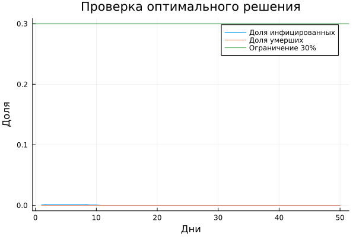{width=85%}

На рисунке показана проверка найденного оптимального решения. Горизонтальная линия соответствует ограничению на пиковую долю инфицированных. По графику можно оценить, удовлетворяет ли найденное решение заданному ограничению.

# Итоговые выводы

В ходе выполнения лабораторной работы была реализована агентная модель SIR и проведено её подробное исследование.

В работе были выполнены:

- построение базовой модели;
- подготовка обычных и literate-версий скриптов;
- генерация notebook и Quarto-документации;
- параметрические исследования коэффициента заражения;
- анализ миграции между городами;
- решение задачи оптимизации параметров;
- выполнение дополнительных заданий, связанных с порогом эпидемии, гетерогенностью, карантинными мерами и ограниченной оптимизацией.

Полученные результаты показывают, что агентная модель SIR позволяет исследовать широкий круг эпидемиологических сценариев. Изменение параметров модели существенно влияет на время достижения пика, число инфицированных, число умерших и характер распространения инфекции между городами.


# Список литературы

::: {#refs}
:::
