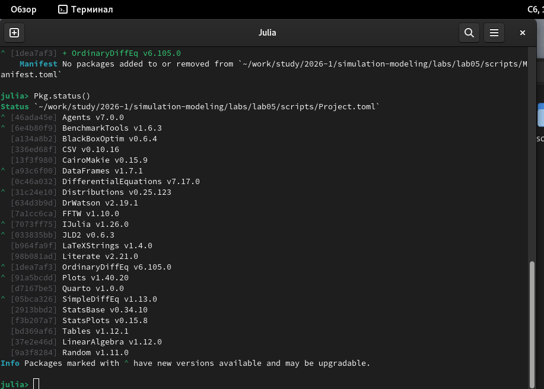
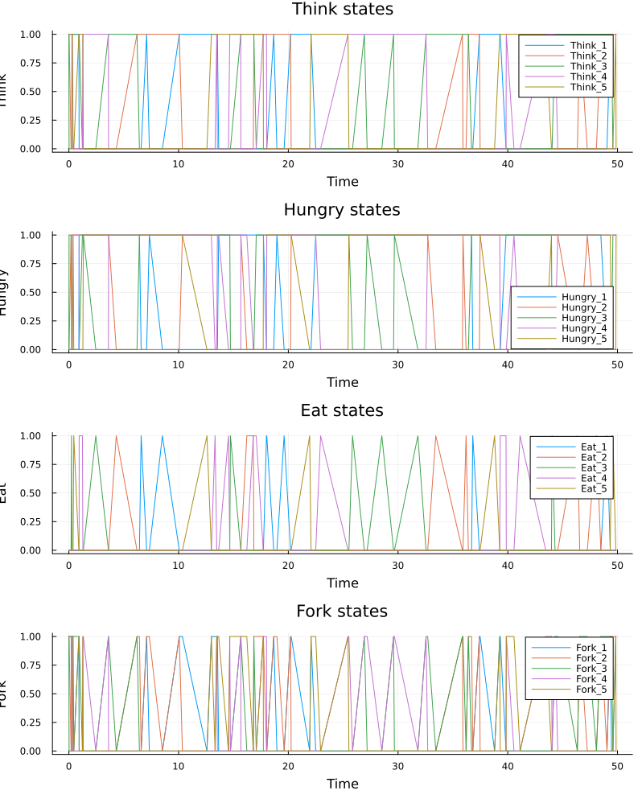
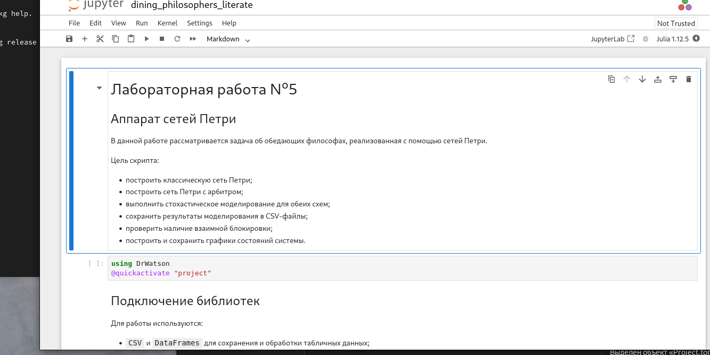
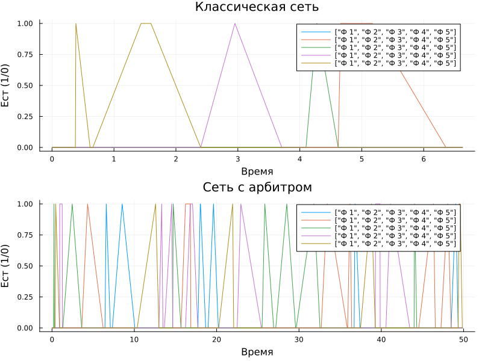
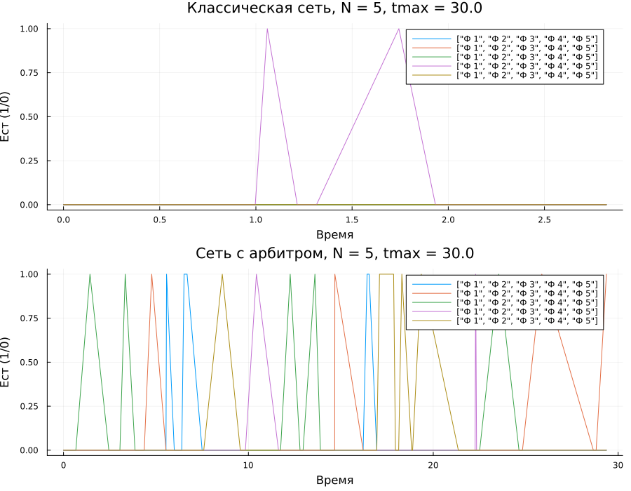

---
## Author
author:
  name: Кузьмин Егор Витальевич
  email: 1132236046@rudn.ru
  affiliation:
    - name: Российский университет дружбы народов
      country: Российская Федерация
      postal-code: 117198
      city: Москва
      address: ул. Миклухо-Маклая, д. 6

## Title
title: Презентация по лабораторной работе №5
date: today
---

# Информация

## Докладчик

:::::::::::::: {.columns align=center}
::: {.column width="70%"}

- Кузьмин Егор Витальевич  
- студент группы НФИбд-01-23  
- РУДН  

:::
::::::::::::

## Цель работы

Целью лабораторной работы является изучение аппарата сетей Петри на примере задачи об обедающих философах, а также освоение подготовки обычных, literate- и параметризованных версий скриптов на Julia с последующей генерацией notebook и Quarto-документации.

## Постановка задачи

В ходе выполнения работы требовалось:

- подготовить исходный модуль модели сети Петри;
- реализовать и запустить базовый скрипт моделирования;
- оформить решения в literate-стиле;
- сгенерировать notebook и Quarto-документацию;
- выполнить параметрические эксперименты;
- построить анимацию маркировки сети;
- подготовить итоговый сравнительный отчёт.

## Теоретические сведения. Сети Петри

Сеть Петри представляет собой двудольный ориентированный граф, состоящий из позиций, переходов и дуг. Текущее состояние системы задаётся маркировкой, то есть распределением фишек по позициям.

Переход может сработать только в том случае, если во всех входных позициях имеется достаточное число фишек. После срабатывания перехода фишки из входных позиций изымаются, а в выходные позиции добавляются.

Сети Петри особенно удобны для моделирования дискретных процессов, параллелизма, синхронизации и конкуренции за ресурсы.

## Теоретические сведения. Задача об обедающих философах

В задаче об обедающих философах каждый участник может находиться в состоянии размышления, ожидания или приёма пищи. Для перехода к еде философу необходимо получить доступ сразу к двум вилкам, которые являются разделяемыми ресурсами.

В классической постановке возможна взаимная блокировка, если философы одновременно начнут захватывать ресурсы. Для устранения этой проблемы используется модель с арбитром, ограничивающим одновременный доступ к вилкам.

## Подготовка проекта и исходной модели

На первом этапе была выполнена проверка окружения Julia и подготовлен исходный модуль `src/DiningPhilosophers.jl`, содержащий:

- описание структуры сети Петри;
- функции построения классической сети;
- функции построения сети с арбитром;
- процедуры стохастического моделирования;
- функции определения deadlock;
- средства визуализации результатов.

{width=0.72\textwidth}

## Первый скрипт: базовое моделирование

Первый скрипт выполняет построение двух моделей: классической сети и сети с арбитром. Для каждой модели выполняется стохастическая симуляция, сохраняются CSV-файлы, строятся графики и проверяется наличие взаимной блокировки.

{width=0.78\textwidth}

В результате были получены графики динамики состояний философов и ресурсов во времени.

## Результаты базового моделирования

{width=0.82\textwidth}

На графике для классической сети видно, как система может приходить к конфликту за ресурсы. Поскольку дополнительного механизма координации нет, возможна взаимная блокировка.

## Сеть с арбитром

{width=0.82\textwidth}

Введение арбитра ограничивает одновременный доступ философов к ресурсам. Благодаря этому система работает устойчивее и вероятность возникновения deadlock снижается.

## Literate-версия и notebook первого скрипта

После проверки обычной версии был подготовлен literate-файл, из которого были сгенерированы чистый код, notebook и Quarto-документация.

{width=0.8\textwidth}

Это позволило объединить код, пояснения и документацию в одном исходном файле.

## Параметризованная версия первого скрипта

В параметризованной версии моделирование выполнялось для нескольких наборов параметров, что позволило сравнить поведение системы при разном числе философов и разной длительности моделирования.

{width=0.78\textwidth}

Для отчёта были отобраны показательные результаты, чтобы не перегружать документ большим числом однотипных графиков.

## Второй скрипт: анимация маркировки сети

Во втором скрипте строилась анимация изменения маркировки сети Петри во времени. На каждом кадре показывается текущее число фишек в позициях сети, что позволяет наглядно проследить развитие процесса.

{width=0.78\textwidth}

Анимация особенно удобна для визуального анализа того, как меняются состояния философов и доступность ресурсов.

## Третий скрипт: итоговый сравнительный отчёт

Третий скрипт использует ранее сохранённые результаты и строит итоговый сравнительный график по состоянию `Eat_i` для классической сети и сети с арбитром.

{width=0.82\textwidth}

Этот рисунок позволяет наглядно сравнить две модели и показать, что вариант с арбитром обеспечивает более устойчивую работу системы.

## Параметризованный итоговый отчёт

Для трёх наборов параметров были построены отдельные сравнительные рисунки, каждый из которых содержал две панели: классическую сеть и сеть с арбитром.

{width=0.8\textwidth}

Параметризованный анализ подтвердил, что преимущество сети с арбитром сохраняется и при изменении числа философов и времени моделирования.

## Особенности оформления работы

В ходе подготовки отчёта были сформированы:

- обычные версии скриптов;
- literate-версии;
- параметризованные версии;
- notebook-файлы;
- Quarto-документация;
- итоговый PDF-отчёт.

Дополнительно была решена проблема отображения русского текста в листингах PDF, что позволило сохранить русские комментарии в коде и корректно вывести их в итоговом документе.

## Итоговые выводы

В ходе лабораторной работы был изучен аппарат сетей Петри и реализована модель задачи об обедающих философах в нескольких вариантах.

Основные результаты работы:

- подготовлен исходный модуль модели сети Петри;
- реализованы три основных скрипта и их literate-версии;
- выполнены параметрические исследования;
- построена анимация маркировки сети;
- подтверждено, что классическая сеть может приводить к deadlock;
- показано, что введение арбитра делает систему более устойчивой.

## Спасибо за внимание
