# Цель работы

Целью лабораторной работы является изучение аппарата сетей Петри на примере задачи обедающих философов, освоение построения обычных и literate-версий скриптов на Julia, генерации производных артефактов в формате Jupyter Notebook и Quarto, а также выполнение параметризованных вычислительных экспериментов и анализ полученных результатов.

# Постановка задачи

В ходе выполнения лабораторной работы требовалось:

1. создать рабочий каталог проекта и установить необходимые пакеты Julia;
2. подготовить исходный модуль модели сети Петри;
3. выполнить базовый скрипт моделирования задачи обедающих философов;
4. оформить первый скрипт в literate-стиле и сгенерировать notebook и Quarto-документацию;
5. подготовить параметризованную версию первого скрипта;
6. создать скрипт построения анимации и его literate- и параметризованную версии;
7. создать итоговый отчётный скрипт сравнения классической сети и сети с арбитром;
8. подготовить literate- и параметризованную версии итогового отчётного скрипта;
9. интегрировать результаты, скриншоты и графики в единый отчёт Quarto.

# Теоретические сведения

## Аппарат сетей Петри

Сеть Петри представляет собой двудольный ориентированный граф, состоящий из позиций, переходов и дуг. Текущее состояние системы задаётся маркировкой, то есть распределением фишек по позициям. Переход может сработать только тогда, когда во всех его входных позициях имеется достаточное число фишек. После срабатывания перехода фишки из входных позиций изымаются, а в выходные позиции добавляются. Такой аппарат удобен для описания дискретных процессов, конкуренции за ресурсы, синхронизации и параллельного выполнения действий.

Позиции в сети Петри интерпретируются как состояния или как наличие некоторых ресурсов. Переходы соответствуют действиям или событиям, изменяющим состояние системы. Дуги определяют отношения между позициями и переходами. Наличие фишек в позициях показывает текущее состояние моделируемого объекта. Именно благодаря такому представлению можно удобно описывать ситуации, в которых несколько процессов конкурируют за одни и те же ресурсы и могут блокировать друг друга.

Одним из важнейших свойств сетей Петри является возможность исследования достижимости состояний, ограниченности, безопасности и живости системы. Для задач, связанных с распределением ресурсов, особенно важно анализировать возможность возникновения deadlock, то есть тупикового состояния, в котором дальнейшее выполнение системы становится невозможным.

## Задача об обедающих философах

В качестве демонстрационного примера в практикуме рассматривается классическая задача об обедающих философах. Каждый философ может находиться в состоянии размышления, ожидания или приёма пищи. Для перехода в состояние еды необходимо получить доступ к двум вилкам, которые являются разделяемыми ресурсами. В классической постановке возможна взаимная блокировка, если все философы одновременно начнут захватывать ресурсы.

Эта задача особенно удобна для моделирования с помощью сетей Петри, поскольку позволяет наглядно показать конкуренцию за ресурсы, чередование состояний и возможность возникновения тупика. В лабораторной работе рассматриваются две реализации этой задачи. В первой используется классическая схема без дополнительного механизма координации. Во второй вводится специальный арбитр, который ограничивает одновременный доступ философов к вилкам и тем самым снижает риск взаимной блокировки.

## Литературное программирование и Quarto

В работе использовался подход литературного программирования, при котором код сопровождается поясняющим текстом и служит одновременно и программой, и документацией. Из одного literate-файла затем генерируются чистый Julia-скрипт, Jupyter Notebook и документация Quarto. Такой подход повышает читаемость программы и объединяет код с пояснениями в одном источнике.

Quarto использует расширенный синтаксис Markdown и подходит для подготовки отчётов в формате PDF. При использовании `xelatex` и шрифтов с поддержкой кириллицы возможно корректно формировать PDF-документы, в которых одновременно присутствуют русский текст, математические обозначения, листинги и вставленные иллюстрации.

# Выполнение работы

## Инициализация проекта

На первом этапе была выполнена активация проекта, установка и проверка доступности необходимых пакетов Julia. Для работы использовались стандартные средства экосистемы Julia, а также библиотеки `DrWatson`, `CSV`, `DataFrames`, `Plots` и `OrdinaryDiffEq`. Этот этап подтверждает, что окружение подготовлено корректно и может быть использовано для дальнейшего моделирования.

{width=88%}

На рисунке показан этап подготовки окружения Julia. Видно, что необходимые библиотеки доступны, а структура проекта готова к дальнейшей работе.

## Исходный модуль модели сети Петри

На следующем этапе был подготовлен исходный модуль `src/DiningPhilosophers.jl`, содержащий описание структуры сети Петри, функции построения классической сети и сети с арбитром, процедуры стохастического моделирования, проверку deadlock и функции визуализации.

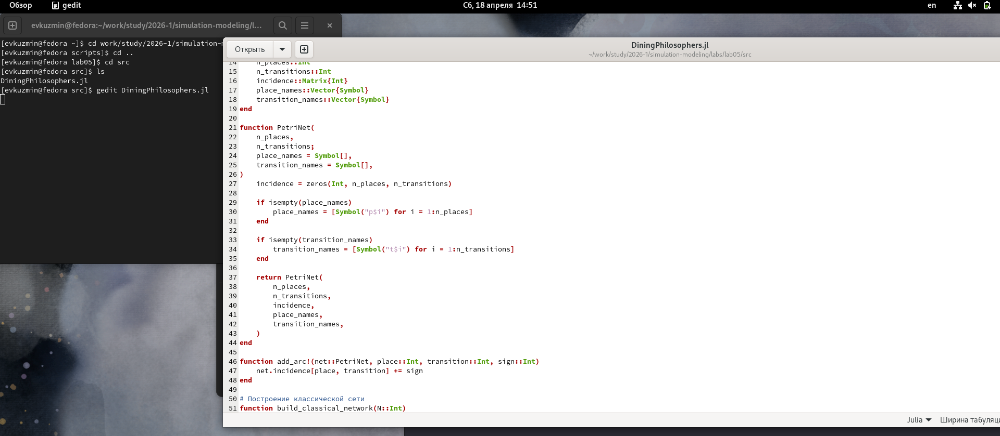{width=88%}

На рисунке показан этап редактирования исходного модуля модели в текстовом редакторе.

Листинг 5.1. Исходный модуль модели сети Петри  
`src/DiningPhilosophers.jl`

```julia
module DiningPhilosophers

using OrdinaryDiffEq
using Plots
using DataFrames
using Random, LinearAlgebra

export build_classical_network, build_arbiter_network
export simulate_ode, simulate_stochastic
export detect_deadlock, plot_marking_evolution

# Определение простой структуры PetriNet
struct PetriNet
    n_places::Int
    n_transitions::Int
    incidence::Matrix{Int}
    place_names::Vector{Symbol}
    transition_names::Vector{Symbol}
end

function PetriNet(
    n_places,
    n_transitions;
    place_names = Symbol[],
    transition_names = Symbol[],
)
    incidence = zeros(Int, n_places, n_transitions)

    if isempty(place_names)
        place_names = [Symbol("p$i") for i = 1:n_places]
    end

    if isempty(transition_names)
        transition_names = [Symbol("t$i") for i = 1:n_transitions]
    end

    return PetriNet(
        n_places,
        n_transitions,
        incidence,
        place_names,
        transition_names,
    )
end

function add_arc!(net::PetriNet, place::Int, transition::Int, sign::Int)
    net.incidence[place, transition] += sign
end

# Построение классической сети
function build_classical_network(N::Int)
    n_places = 4N
    n_transitions = 3N
    net = PetriNet(n_places, n_transitions)

    for i = 1:N
        net.place_names[i] = Symbol("Think_$i")
        net.place_names[N + i] = Symbol("Hungry_$i")
        net.place_names[2N + i] = Symbol("Eat_$i")
        net.place_names[3N + i] = Symbol("Fork_$i")
    end

    for i = 1:N
        net.transition_names[i] = Symbol("GetLeft_$i")
        net.transition_names[N + i] = Symbol("GetRight_$i")
        net.transition_names[2N + i] = Symbol("PutForks_$i")
    end

    for i = 1:N
        think = i
        hungry = N + i
        eat = 2N + i
        left_fork = 3N + i
        right_fork = 3N + (i % N + 1)

        get_left = i
        get_right = N + i
        put_forks = 2N + i

        add_arc!(net, think, get_left, -1)
        add_arc!(net, left_fork, get_left, -1)
        add_arc!(net, hungry, get_left, +1)

        add_arc!(net, hungry, get_right, -1)
        add_arc!(net, right_fork, get_right, -1)
        add_arc!(net, eat, get_right, +1)

        add_arc!(net, eat, put_forks, -1)
        add_arc!(net, think, put_forks, +1)
        add_arc!(net, left_fork, put_forks, +1)
        add_arc!(net, right_fork, put_forks, +1)
    end

    u0 = zeros(Float64, n_places)
    for i = 1:N
        u0[i] = 1.0       # Think_i
        u0[3N + i] = 1.0  # Fork_i
    end

    return net, u0, net.place_names
end

# Построение сети с арбитром
function build_arbiter_network(N::Int)
    n_places = 4N + 1
    n_transitions = 3N
    net = PetriNet(n_places, n_transitions)

    for i = 1:N
        net.place_names[i] = Symbol("Think_$i")
        net.place_names[N + i] = Symbol("Hungry_$i")
        net.place_names[2N + i] = Symbol("Eat_$i")
        net.place_names[3N + i] = Symbol("Fork_$i")
    end

    net.place_names[4N + 1] = :Arbiter

    for i = 1:N
        net.transition_names[i] = Symbol("GetLeft_$i")
        net.transition_names[N + i] = Symbol("GetRight_$i")
        net.transition_names[2N + i] = Symbol("PutForks_$i")
    end

    arbiter_idx = 4N + 1

    for i = 1:N
        think = i
        hungry = N + i
        eat = 2N + i
        left_fork = 3N + i
        right_fork = 3N + (i % N + 1)

        get_left = i
        get_right = N + i
        put_forks = 2N + i

        add_arc!(net, think, get_left, -1)
        add_arc!(net, left_fork, get_left, -1)
        add_arc!(net, arbiter_idx, get_left, -1)
        add_arc!(net, hungry, get_left, +1)

        add_arc!(net, hungry, get_right, -1)
        add_arc!(net, right_fork, get_right, -1)
        add_arc!(net, eat, get_right, +1)

        add_arc!(net, eat, put_forks, -1)
        add_arc!(net, think, put_forks, +1)
        add_arc!(net, left_fork, put_forks, +1)
        add_arc!(net, right_fork, put_forks, +1)
        add_arc!(net, arbiter_idx, put_forks, +1)
    end

    u0 = zeros(Float64, n_places)
    for i = 1:N
        u0[i] = 1.0
        u0[3N + i] = 1.0
    end
    u0[arbiter_idx] = N - 1

    return net, u0, net.place_names
end

# Детерминированное моделирование (ODE)
function vectorfield(net::PetriNet, rates = ones(net.n_transitions))
    function f!(du, u, params, t)
        a = zeros(net.n_transitions)

        for j = 1:net.n_transitions
            rate = rates[j]
            prod = rate

            for i = 1:net.n_places
                if net.incidence[i, j] < 0
                    prod *= u[i]^(-net.incidence[i, j])
                end
            end

            a[j] = prod
        end

        du .= net.incidence * a
    end

    return f!
end

function simulate_ode(net::PetriNet, u0::Vector{Float64}, tmax::Float64; saveat = 0.1)
    f = vectorfield(net)
    prob = ODEProblem(f, u0, (0.0, tmax))
    sol = solve(prob, Tsit5(), saveat = saveat)

    df = DataFrame(time = sol.t)
    for i = 1:net.n_places
        df[!, String(net.place_names[i])] = sol[i, :]
    end

    return df
end

# Стохастическое моделирование (алгоритм Гиллеспи)
function simulate_stochastic(
    net::PetriNet,
    u0::Vector{Float64},
    tmax::Float64;
    rates = ones(net.n_transitions),
    rng = Random.GLOBAL_RNG,
)
    u = copy(u0)
    t = 0.0

    times = [t]
    states = [copy(u)]

    while t < tmax
        a = zeros(net.n_transitions)

        for j = 1:net.n_transitions
            rate = rates[j]
            prod = rate

            for i = 1:net.n_places
                if net.incidence[i, j] < 0
                    prod *= u[i]^(-net.incidence[i, j])
                end
            end

            a[j] = prod
        end

        a0 = sum(a)
        if a0 == 0
            break
        end

        dt = -log(rand(rng)) / a0
        r = rand(rng) * a0

        cumsum_prob = 0.0
        chosen = 1
        for j = 1:net.n_transitions
            cumsum_prob += a[j]
            if r <= cumsum_prob
                chosen = j
                break
            end
        end

        for i = 1:net.n_places
            u[i] += net.incidence[i, chosen]
        end

        t += dt

        if t <= tmax
            push!(times, t)
            push!(states, copy(u))
        end
    end

    df = DataFrame(time = times)
    for i = 1:net.n_places
        df[!, String(net.place_names[i])] = [s[i] for s in states]
    end

    return df
end

# Обнаружение deadlock
function detect_deadlock(df::DataFrame, net::PetriNet; tol = 1e-6)
    u_last = [df[end, String(net.place_names[i])] for i = 1:net.n_places]

    for j = 1:net.n_transitions
        can_fire = true

        for i = 1:net.n_places
            if net.incidence[i, j] < 0 && u_last[i] < -net.incidence[i, j] - tol
                can_fire = false
                break
            end
        end

        if can_fire
            return false
        end
    end

    return true
end

# Визуализация
function plot_marking_evolution(df::DataFrame, N::Int)
    plots = []

    for group in ["Think", "Hungry", "Eat", "Fork"]
        p = plot(
            xlabel = "Time",
            ylabel = group,
            title = "$group states",
        )

        for i = 1:N
            col = "$(group)_$i"
            if col in names(df)
                plot!(df.time, df[!, col], label = "$(group)_$i")
            end
        end

        push!(plots, p)
    end

    return plot(plots..., layout = (4, 1), size = (800, 1000))
end

end # module
```

Подготовленный модуль является основой всей лабораторной работы. Именно в нём определяются элементы сети Петри, начальная маркировка, функции создания классической сети и сети с арбитром, а также процедуры стохастической симуляции и визуализации результатов.

## Базовый скрипт моделирования

### Обычная версия

Первый скрипт `scripts/dining_philosophers.jl` выполняет построение двух моделей: классической сети Петри и сети Петри с арбитром. Для каждой из них запускается стохастическая симуляция, результаты сохраняются в CSV-файлы, проверяется наличие взаимной блокировки и строятся графики динамики состояний.

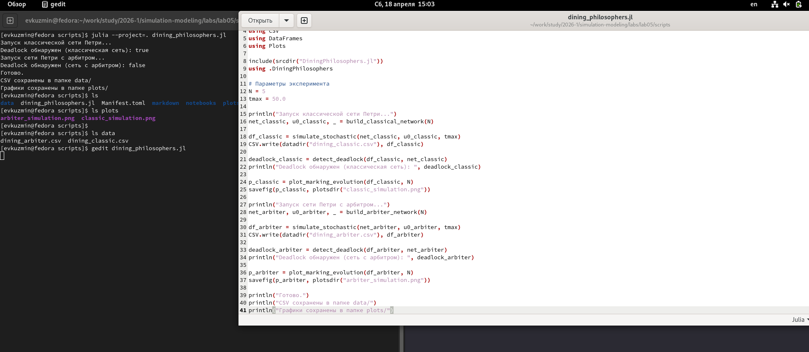{width=88%}

На рисунке показан процесс подготовки обычной версии первого скрипта.

Листинг 5.2. Обычная версия первого скрипта  
`scripts/dining_philosophers.jl`

```julia
using DrWatson
@quickactivate "project"

using CSV
using DataFrames
using Plots

include(srcdir("DiningPhilosophers.jl"))
using .DiningPhilosophers

# Параметры эксперимента
N = 5
tmax = 50.0

println("Запуск классической сети Петри...")
net_classic, u0_classic, _ = build_classical_network(N)

df_classic = simulate_stochastic(net_classic, u0_classic, tmax)
CSV.write(datadir("dining_classic.csv"), df_classic)

deadlock_classic = detect_deadlock(df_classic, net_classic)
println("Deadlock обнаружен (классическая сеть): ", deadlock_classic)

p_classic = plot_marking_evolution(df_classic, N)
savefig(p_classic, plotsdir("classic_simulation.png"))

println("Запуск сети Петри с арбитром...")
net_arbiter, u0_arbiter, _ = build_arbiter_network(N)

df_arbiter = simulate_stochastic(net_arbiter, u0_arbiter, tmax)
CSV.write(datadir("dining_arbiter.csv"), df_arbiter)

deadlock_arbiter = detect_deadlock(df_arbiter, net_arbiter)
println("Deadlock обнаружен (сеть с арбитром): ", deadlock_arbiter)

p_arbiter = plot_marking_evolution(df_arbiter, N)
savefig(p_arbiter, plotsdir("arbiter_simulation.png"))

println("Готово.")
println("CSV сохранены в папке data/")
println("Графики сохранены в папке plots/")
```

### Выполнение скрипта и результаты

После запуска первого скрипта были получены CSV-файлы с временными рядами и графики для двух вариантов сети.

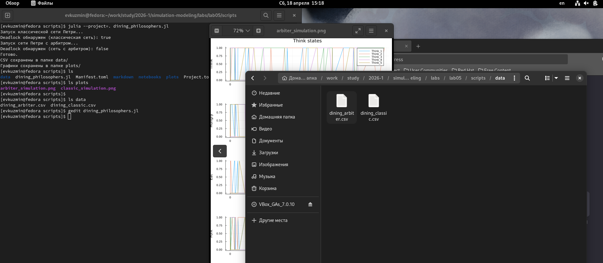{width=88%}

На рисунке показан запуск первого скрипта и формирование выходных данных.

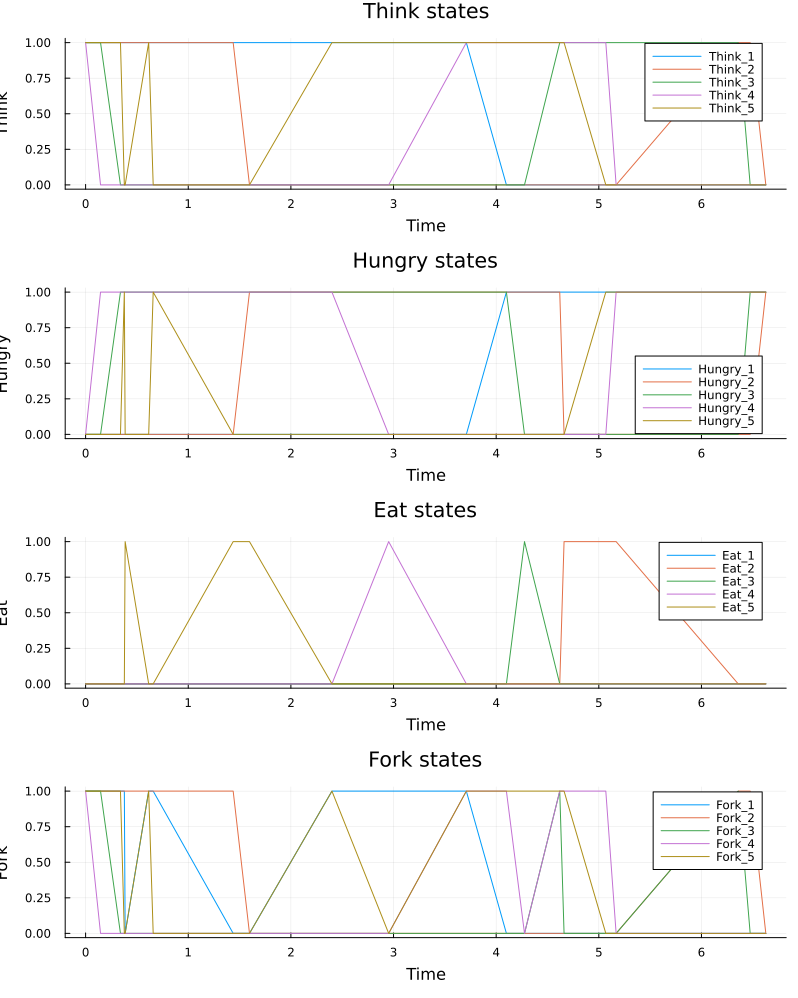{width=88%}

На рисунке представлена динамика состояний классической сети Петри. Видно, как философы переходят между состояниями размышления, ожидания и приёма пищи. Для классической схемы возможна взаимная блокировка, поскольку философы конкурируют за один и тот же набор ресурсов без дополнительной координации.

{width=88%}

На рисунке представлена динамика состояний сети Петри с арбитром. Введение арбитра ограничивает одновременный доступ к ресурсам и тем самым снижает вероятность возникновения deadlock.

Сравнение двух графиков показывает, что наличие дополнительного управляющего элемента делает работу системы более устойчивой. В классической сети возможна ситуация, в которой философы начинают блокировать друг друга при захвате вилок, тогда как в сети с арбитром система сохраняет способность к дальнейшему развитию.

### Literate-версия первого скрипта

После проверки обычной версии скрипт был переписан в literate-формате. В такой версии текст поясняет этапы моделирования, а строки кода остаются исполняемыми.

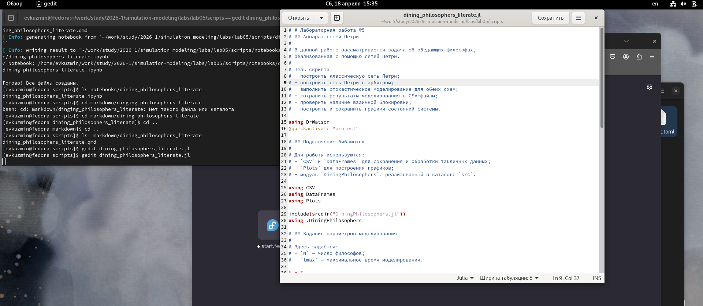{width=88%}

Листинг 5.3. Literate-версия первого скрипта  
`scripts/dining_philosophers_literate.jl`

```julia
# # Лабораторная работа №5
# ## Аппарат сетей Петри
#
# В данной работе рассматривается задача об обедающих философах,
# реализованная с помощью сетей Петри.
#
# Цель скрипта:
# - построить классическую сеть Петри;
# - построить сеть Петри с арбитром;
# - выполнить стохастическое моделирование для обеих схем;
# - сохранить результаты моделирования в CSV-файлы;
# - проверить наличие взаимной блокировки;
# - построить и сохранить графики состояний системы.

using DrWatson
@quickactivate "project"

# ## Подключение библиотек
#
# Для работы используются:
# - `CSV` и `DataFrames` для сохранения и обработки табличных данных;
# - `Plots` для построения графиков;
# - модуль `DiningPhilosophers`, реализованный в каталоге `src`.

using CSV
using DataFrames
using Plots

include(srcdir("DiningPhilosophers.jl"))
using .DiningPhilosophers

# ## Задание параметров моделирования
#
# Здесь задаётся:
# - `N` — число философов;
# - `tmax` — максимальное время моделирования.

N = 5
tmax = 50.0

# ## Классическая сеть Петри
#
# Сначала строится классическая модель задачи об обедающих философах.
# Затем выполняется стохастическая симуляция, сохраняются результаты
# и проверяется наличие deadlock.

println("Запуск классической сети Петри...")

net_classic, u0_classic, _ = build_classical_network(N)

df_classic = simulate_stochastic(net_classic, u0_classic, tmax)
CSV.write(datadir("dining_classic.csv"), df_classic)

deadlock_classic = detect_deadlock(df_classic, net_classic)
println("Deadlock обнаружен (классическая сеть): ", deadlock_classic)

p_classic = plot_marking_evolution(df_classic, N)
savefig(p_classic, plotsdir("classic_simulation.png"))

# ## Сеть Петри с арбитром
#
# Во второй модели используется дополнительный управляющий элемент —
# арбитр. Он ограничивает число философов, которые одновременно могут
# начать захват ресурсов, и тем самым снижает вероятность тупика.

println("Запуск сети Петри с арбитром...")

net_arbiter, u0_arbiter, _ = build_arbiter_network(N)

df_arbiter = simulate_stochastic(net_arbiter, u0_arbiter, tmax)
CSV.write(datadir("dining_arbiter.csv"), df_arbiter)

deadlock_arbiter = detect_deadlock(df_arbiter, net_arbiter)
println("Deadlock обнаружен (сеть с арбитром): ", deadlock_arbiter)

p_arbiter = plot_marking_evolution(df_arbiter, N)
savefig(p_arbiter, plotsdir("arbiter_simulation.png"))

# ## Итоги выполнения
#
# После завершения работы скрипта:
# - в каталоге `data/` будут сохранены CSV-файлы с результатами моделирования;
# - в каталоге `plots/` будут сохранены графики для двух вариантов сети.
#
# Эти материалы далее можно использовать в отчёте и при сравнении
# классической схемы с моделью, содержащей арбитра.

println("Готово.")
println("CSV сохранены в папке data/")
println("Графики сохранены в папке plots/")
```

### Notebook literate-версии первого скрипта

Далее из literate-версии были сгенерированы чистый код, Jupyter Notebook и документация Quarto.

{width=88%}

На рисунке представлен notebook, полученный из literate-версии первого скрипта. Это подтверждает корректность автоматического преобразования одного исходного файла в разные форматы документации.

## Параметризованная версия первого скрипта

Следующим этапом была подготовлена параметризованная версия первого скрипта. В ней выполняется серия запусков для нескольких наборов параметров, что позволяет проследить влияние числа философов и времени моделирования на поведение системы.

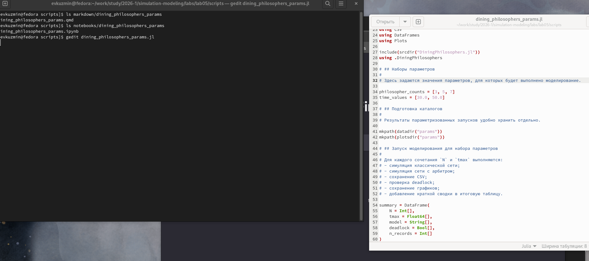{width=88%}

Листинг 5.4. Параметризованная версия первого скрипта  
`scripts/dining_philosophers_params.jl`

```julia
# # Лабораторная работа №5
# ## Аппарат сетей Петри: параметризованная версия
#
# В этой версии выполняется моделирование задачи об обедающих философах
# не для одного набора значений, а для нескольких параметров.
#
# Рассматриваются разные значения:
# - числа философов `N`;
# - времени моделирования `tmax`.
#
# Для каждого набора параметров строятся:
# - классическая сеть Петри;
# - сеть Петри с арбитром.
#
# Далее выполняется стохастическая симуляция, сохраняются таблицы с результатами,
# проверяется наличие deadlock и строятся графики.

using DrWatson
@quickactivate "project"

# ## Подключение библиотек

using CSV
using DataFrames
using Plots

include(srcdir("DiningPhilosophers.jl"))
using .DiningPhilosophers

# ## Наборы параметров
#
# Здесь задаются значения параметров, для которых будет выполнено моделирование.

philosopher_counts = [3, 5, 7]
time_values = [30.0, 50.0]

# ## Подготовка каталогов
#
# Результаты параметризованных запусков удобно хранить отдельно.

mkpath(datadir("params"))
mkpath(plotsdir("params"))

# ## Запуск моделирования для набора параметров
#
# Для каждого сочетания `N` и `tmax` выполняются:
# - симуляция классической сети;
# - симуляция сети с арбитром;
# - сохранение CSV;
# - проверка deadlock;
# - сохранение графиков;
# - добавление краткой сводки в итоговую таблицу.

summary = DataFrame(
    N = Int[],
    tmax = Float64[],
    model = String[],
    deadlock = Bool[],
    n_records = Int[]
)

for N in philosopher_counts
    for tmax in time_values
        println("="^60)
        println("Параметры: N = $N, tmax = $tmax")

        # ### Классическая сеть Петри

        println("Запуск классической сети Петри...")
        net_classic, u0_classic, _ = build_classical_network(N)

        df_classic = simulate_stochastic(net_classic, u0_classic, tmax)

        classic_csv = datadir("params", "classic_N$(N)_t$(Int(round(tmax))).csv")
        CSV.write(classic_csv, df_classic)

        deadlock_classic = detect_deadlock(df_classic, net_classic)
        println("Deadlock обнаружен (классическая сеть): ", deadlock_classic)

        p_classic = plot_marking_evolution(df_classic, N)
        classic_plot = plotsdir("params", "classic_N$(N)_t$(Int(round(tmax))).png")
        savefig(p_classic, classic_plot)

        push!(summary, (
            N,
            tmax,
            "classic",
            deadlock_classic,
            nrow(df_classic)
        ))

        # ### Сеть Петри с арбитром

        println("Запуск сети Петри с арбитром...")
        net_arbiter, u0_arbiter, _ = build_arbiter_network(N)

        df_arbiter = simulate_stochastic(net_arbiter, u0_arbiter, tmax)

        arbiter_csv = datadir("params", "arbiter_N$(N)_t$(Int(round(tmax))).csv")
        CSV.write(arbiter_csv, df_arbiter)

        deadlock_arbiter = detect_deadlock(df_arbiter, net_arbiter)
        println("Deadlock обнаружен (сеть с арбитром): ", deadlock_arbiter)

        p_arbiter = plot_marking_evolution(df_arbiter, N)
        arbiter_plot = plotsdir("params", "arbiter_N$(N)_t$(Int(round(tmax))).png")
        savefig(p_arbiter, arbiter_plot)

        push!(summary, (
            N,
            tmax,
            "arbiter",
            deadlock_arbiter,
            nrow(df_arbiter)
        ))
    end
end

# ## Сохранение итоговой таблицы
#
# В итоговой таблице фиксируется:
# - число философов;
# - время моделирования;
# - тип модели;
# - наличие deadlock;
# - число сохранённых состояний.

summary_file = datadir("params", "summary_dining_philosophers.csv")
CSV.write(summary_file, summary)

println("="^60)
println("Итоговая таблица:")
println(summary)

# ## Итог
#
# После выполнения параметризованной версии:
# - в `data/params/` сохраняются CSV-файлы по каждому запуску;
# - в `plots/params/` сохраняются соответствующие графики;
# - в `data/params/summary_dining_philosophers.csv` сохраняется сводная таблица.
#
# Это позволяет сравнить поведение классической сети и сети с арбитром
# для разных параметров моделирования.

println("Готово.")
println("Параметризованные CSV сохранены в папке data/params/")
println("Параметризованные графики сохранены в папке plots/params/")
println("Сводка сохранена в файле: ", summary_file)
```

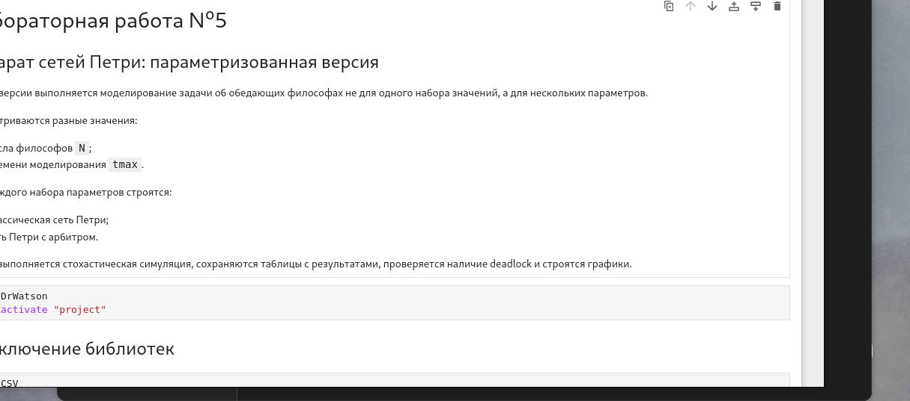{width=88%}

На рисунке показан notebook параметризованной версии первого скрипта. Этот этап подтверждает, что параметризованный literate-файл также корректно преобразуется в notebook и может быть выполнен в интерактивном режиме.

В параметризованной версии моделирование выполнялось для нескольких значений числа философов и времени моделирования. Это позволило сравнить поведение системы при увеличении числа участников и оценить, как изменяется устойчивость сети при более сложных конфигурациях.

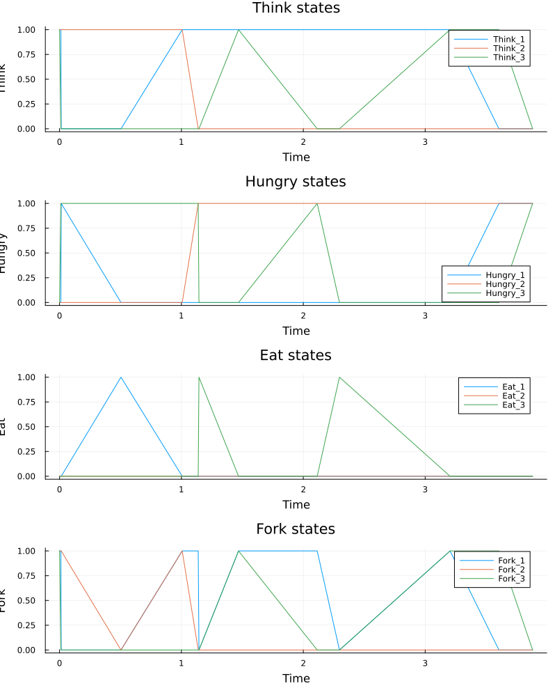{width=88%}

```julia
На рисунке показан результат моделирования классической сети для параметров `N = 4` и `tmax = 20`. Уже в этом случае сохраняется возможность конфликта за ресурсы.
# # Лабораторная работа №5
# ## Аппарат сетей Петри: параметризованная версия
#
# В этой версии выполняется моделирование задачи об обедающих философах
# не для одного набора значений, а для нескольких параметров.
#
# Рассматриваются разные значения:
# - числа философов `N`;
# - времени моделирования `tmax`.
#
# Для каждого набора параметров строятся:
# - классическая сеть Петри;
# - сеть Петри с арбитром.
#
# Далее выполняется стохастическая симуляция, сохраняются таблицы с результатами,
# проверяется наличие deadlock и строятся графики.

using DrWatson
@quickactivate "project"

# ## Подключение библиотек

using CSV
using DataFrames
using Plots

include(srcdir("DiningPhilosophers.jl"))
using .DiningPhilosophers

# ## Наборы параметров
#
# Здесь задаются значения параметров, для которых будет выполнено моделирование.

philosopher_counts = [3, 5, 7]
time_values = [30.0, 50.0]

# ## Подготовка каталогов
#
# Результаты параметризованных запусков удобно хранить отдельно.

mkpath(datadir("params"))
mkpath(plotsdir("params"))

# ## Запуск моделирования для набора параметров
#
# Для каждого сочетания `N` и `tmax` выполняются:
# - симуляция классической сети;
# - симуляция сети с арбитром;
# - сохранение CSV;
# - проверка deadlock;
# - сохранение графиков;
# - добавление краткой сводки в итоговую таблицу.

summary = DataFrame(
    N = Int[],
    tmax = Float64[],
    model = String[],
    deadlock = Bool[],
    n_records = Int[]
)

for N in philosopher_counts
    for tmax in time_values
        println("="^60)
        println("Параметры: N = $N, tmax = $tmax")

        # ### Классическая сеть Петри

        println("Запуск классической сети Петри...")
        net_classic, u0_classic, _ = build_classical_network(N)

        df_classic = simulate_stochastic(net_classic, u0_classic, tmax)

        classic_csv = datadir("params", "classic_N$(N)_t$(Int(round(tmax))).csv")
        CSV.write(classic_csv, df_classic)

        deadlock_classic = detect_deadlock(df_classic, net_classic)
        println("Deadlock обнаружен (классическая сеть): ", deadlock_classic)

        p_classic = plot_marking_evolution(df_classic, N)
        classic_plot = plotsdir("params", "classic_N$(N)_t$(Int(round(tmax))).png")
        savefig(p_classic, classic_plot)

        push!(summary, (
            N,
            tmax,
            "classic",
            deadlock_classic,
            nrow(df_classic)
        ))

        # ### Сеть Петри с арбитром

        println("Запуск сети Петри с арбитром...")
        net_arbiter, u0_arbiter, _ = build_arbiter_network(N)

        df_arbiter = simulate_stochastic(net_arbiter, u0_arbiter, tmax)

        arbiter_csv = datadir("params", "arbiter_N$(N)_t$(Int(round(tmax))).csv")
        CSV.write(arbiter_csv, df_arbiter)

        deadlock_arbiter = detect_deadlock(df_arbiter, net_arbiter)
        println("Deadlock обнаружен (сеть с арбитром): ", deadlock_arbiter)

        p_arbiter = plot_marking_evolution(df_arbiter, N)
        arbiter_plot = plotsdir("params", "arbiter_N$(N)_t$(Int(round(tmax))).png")
        savefig(p_arbiter, arbiter_plot)

        push!(summary, (
            N,
            tmax,
            "arbiter",
            deadlock_arbiter,
            nrow(df_arbiter)
        ))
    end
end

# ## Сохранение итоговой таблицы
#
# В итоговой таблице фиксируется:
# - число философов;
# - время моделирования;
# - тип модели;
# - наличие deadlock;
# - число сохранённых состояний.

summary_file = datadir("params", "summary_dining_philosophers.csv")
CSV.write(summary_file, summary)

println("="^60)
println("Итоговая таблица:")
println(summary)

# ## Итог
#
# После выполнения параметризованной версии:
# - в `data/params/` сохраняются CSV-файлы по каждому запуску;
# - в `plots/params/` сохраняются соответствующие графики;
# - в `data/params/summary_dining_philosophers.csv` сохраняется сводная таблица.
#
# Это позволяет сравнить поведение классической сети и сети с арбитром
# для разных параметров моделирования.

println("Готово.")
println("Параметризованные CSV сохранены в папке data/params/")
println("Параметризованные графики сохранены в папке plots/params/")
println("Сводка сохранена в файле: ", summary_file)
```

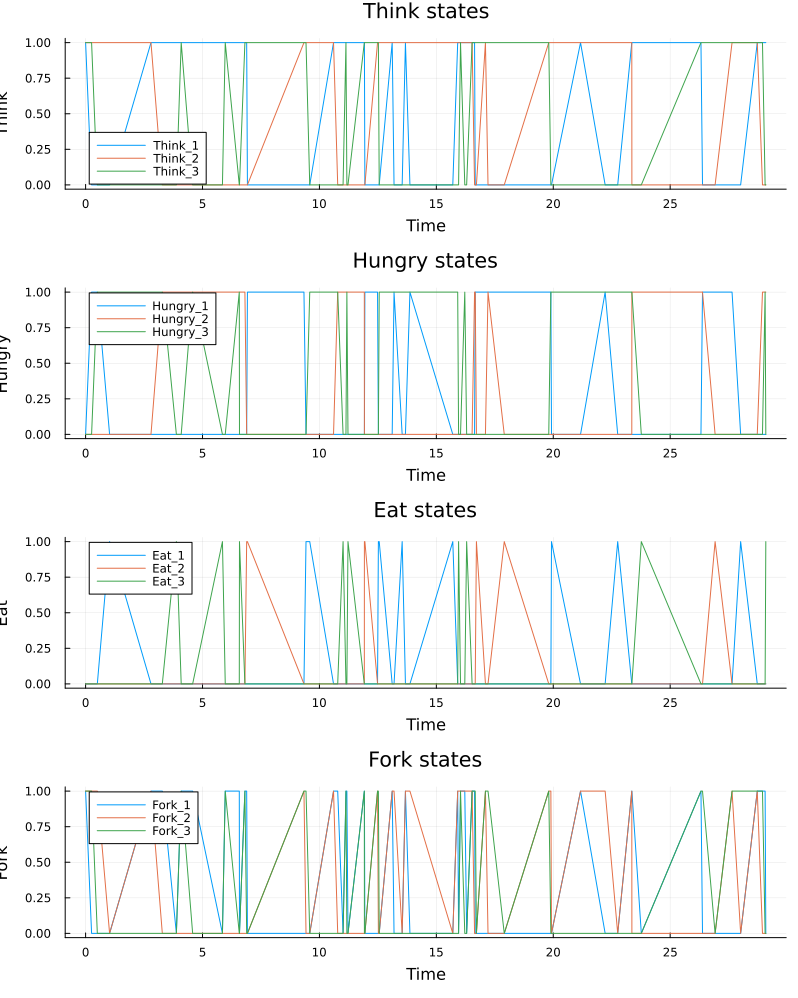{width=88%}

На рисунке показан соответствующий результат для сети с арбитром. Вариант с арбитром демонстрирует более устойчивую динамику.

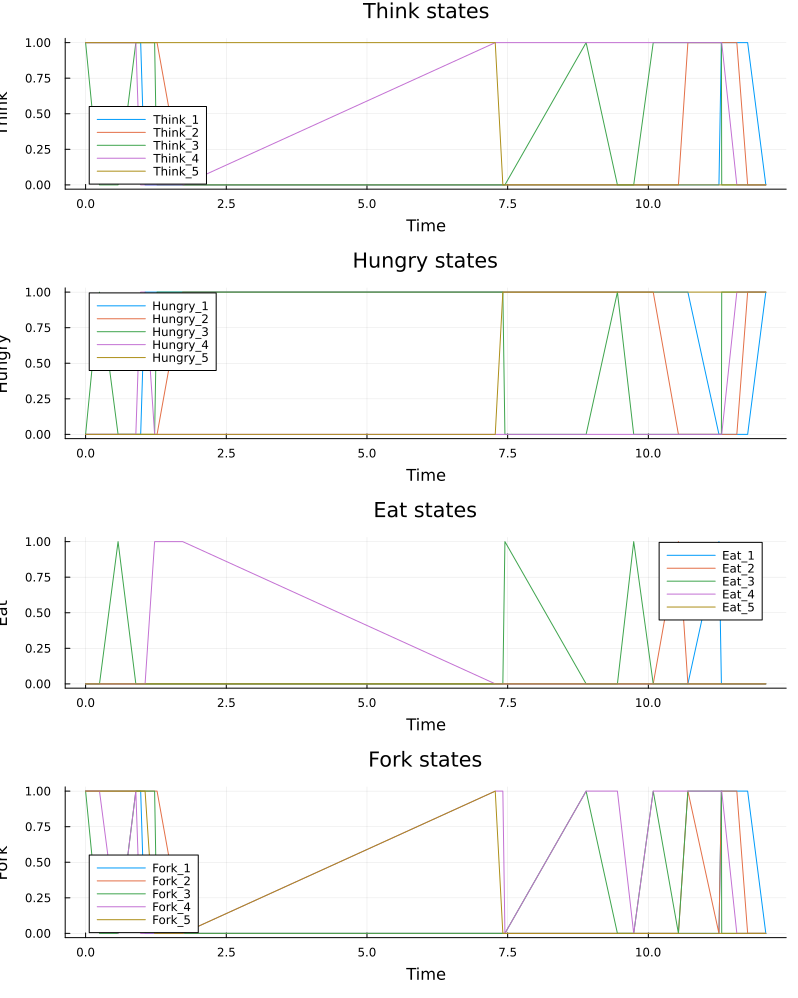{width=88%}

На рисунке приведён ещё один пример параметризованного запуска классической сети.

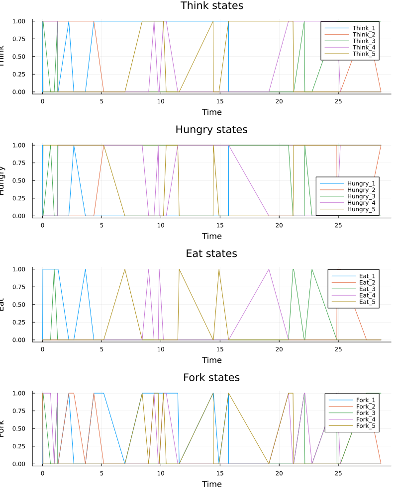{width=88%}

На рисунке приведён соответствующий запуск сети с арбитром.

## Скрипт построения анимации

### Обычная версия

Второй скрипт предназначен для построения анимации изменения маркировки сети Петри во времени. Для базовой версии использовалась классическая сеть с небольшим числом философов, что делает анимацию более наглядной.

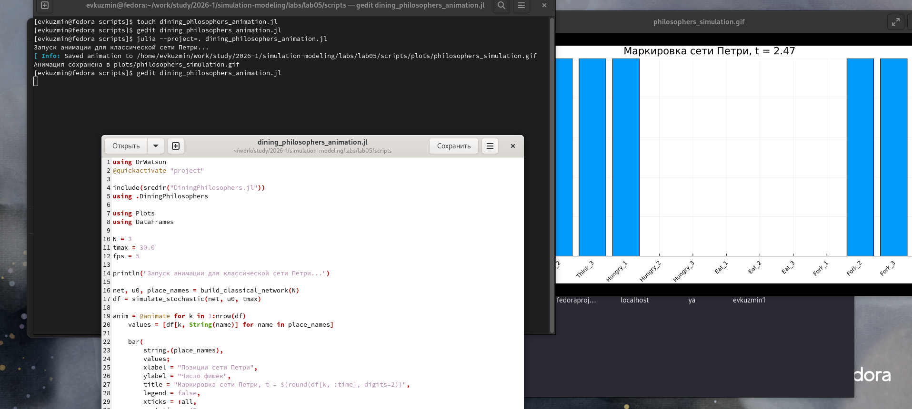{width=88%}

На рисунке показаны подготовка и выполнение второго скрипта.

Листинг 5.5. Обычная версия второго скрипта  
`scripts/dining_philosophers_animation.jl`

```julia
using DrWatson
@quickactivate "project"

include(srcdir("DiningPhilosophers.jl"))
using .DiningPhilosophers

using Plots
using DataFrames

N = 3
tmax = 30.0
fps = 5

println("Запуск анимации для классической сети Петри...")

net, u0, place_names = build_classical_network(N)
df = simulate_stochastic(net, u0, tmax)

anim = @animate for k in 1:nrow(df)
    values = [df[k, String(name)] for name in place_names]

    bar(
        string.(place_names),
        values;
        xlabel = "Позиции сети Петри",
        ylabel = "Число фишек",
        title = "Маркировка сети Петри, t = $(round(df[k, :time], digits=2))",
        legend = false,
        xticks = :all,
        xrotation = 45,
        size = (1000, 500)
    )
end

gif(anim, plotsdir("philosophers_simulation.gif"), fps = fps)

println("Анимация сохранена в plots/philosophers_simulation.gif")
```


В ходе выполнения скрипта был сформирован GIF-файл с анимацией изменения маркировки. Следует отметить, что в HTML-версии Quarto такие файлы отображаются как полноценная анимация, а в PDF, как правило, показывается только первый кадр. Поэтому сами GIF-файлы рассматривались как отдельные результаты, а в основной PDF-отчёт включались скриншоты и пояснения.

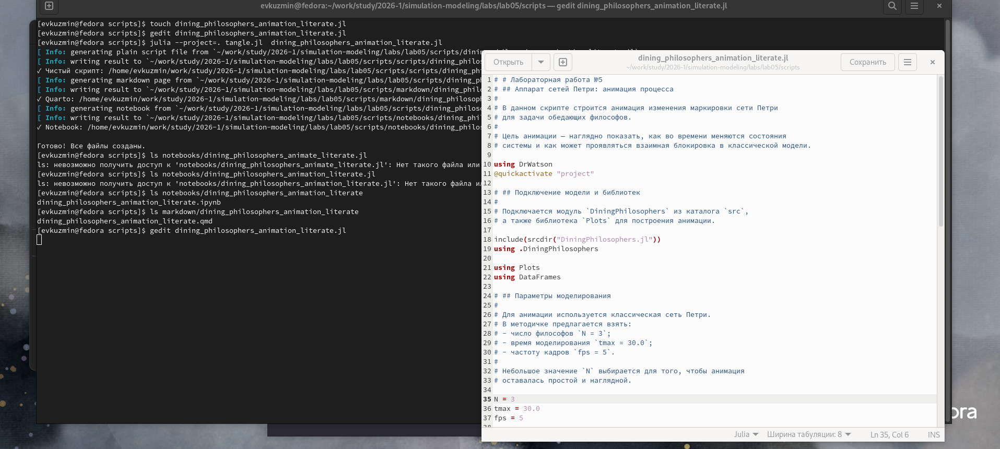{width=88%}

### Literate-версия второго скрипта

{width=88%}

Листинг 5.6. Literate-версия второго скрипта  
`scripts/dining_philosophers_animation_literate.jl`

```julia
# # Лабораторная работа №5
# ## Аппарат сетей Петри: анимация процесса
#
# В данном скрипте строится анимация изменения маркировки сети Петри
# для задачи обедающих философов.
#
# Цель анимации — наглядно показать, как во времени меняются состояния
# системы и как может проявляться взаимная блокировка в классической модели.

using DrWatson
@quickactivate "project"

# ## Подключение модели и библиотек
#
# Подключается модуль `DiningPhilosophers` из каталога `src`,
# а также библиотека `Plots` для построения анимации.

include(srcdir("DiningPhilosophers.jl"))
using .DiningPhilosophers

using Plots
using DataFrames

# ## Параметры моделирования
#
# Для анимации используется классическая сеть Петри.
# В методичке предлагается взять:
# - число философов `N = 3`;
# - время моделирования `tmax = 30.0`;
# - частоту кадров `fps = 5`.
#
# Небольшое значение `N` выбирается для того, чтобы анимация
# оставалась простой и наглядной.

N = 3
tmax = 30.0
fps = 5

println("Запуск анимации для классической сети Петри...")

# ## Построение сети и запуск симуляции
#
# Сначала создаётся классическая сеть Петри.
# Затем выполняется стохастическая симуляция,
# результаты которой используются для создания кадров анимации.

net, u0, place_names = build_classical_network(N)
df = simulate_stochastic(net, u0, tmax)

# ## Построение анимации
#
# Каждый кадр анимации представляет собой столбчатую диаграмму,
# показывающую текущее число фишек в каждой позиции сети.
# Таким образом можно наглядно проследить изменение маркировки во времени.

anim = @animate for k in 1:nrow(df)
    values = [df[k, String(name)] for name in place_names]

    bar(
        string.(place_names),
        values;
        xlabel = "Позиции сети Петри",
        ylabel = "Число фишек",
        title = "Маркировка сети Петри, t = $(round(df[k, :time], digits=2))",
        legend = false,
        xticks = :all,
        xrotation = 45,
        size = (1000, 500)
    )
end

# ## Сохранение результата
#
# Итогом работы является GIF-файл, который сохраняется
# в каталог `plots/`.

gif(anim, plotsdir("philosophers_simulation.gif"), fps = fps)

println("Анимация сохранена в plots/philosophers_simulation.gif")

# ## Интерпретация
#
# Анимация позволяет увидеть, как фишки перемещаются между позициями,
# то есть как философы переходят между состояниями Think, Hungry и Eat.
# Если на последних кадрах маркировка перестаёт изменяться,
# это указывает на возникновение deadlock в классической модели.
```

### Notebook literate-версии второго скрипта

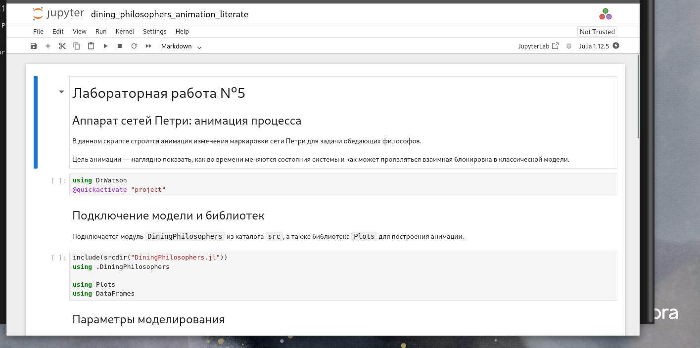{width=88%}

На рисунке показан notebook, сгенерированный из literate-версии второго скрипта.

Анимационный сценарий позволил сделать поведение сети более наглядным. На каждом кадре показывается текущее число фишек в позициях, поэтому можно по шагам отследить, как система переходит из одного состояния в другое и как меняется доступность ресурсов.

## Параметризованная версия второго скрипта

Для анимационного сценария была подготовлена параметризованная версия, создающая ограниченное число GIF-файлов для нескольких наборов параметров. Такой подход позволяет сохранить наглядность и одновременно избежать избыточного числа результатов.

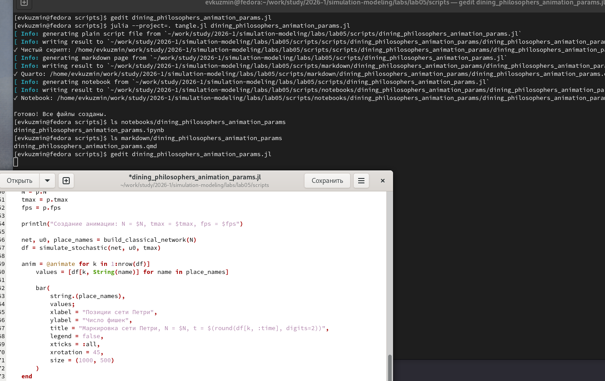{width=88%}

Листинг 5.7. Параметризованная версия второго скрипта  
`scripts/dining_philosophers_animation_params.jl`

```julia
# ## Аппарат сетей Петри: параметризованная анимация
#
# В данном скрипте строятся анимации изменения маркировки сети Петри
# для задачи обедающих философов.
#
# В отличие от базовой версии, здесь рассматриваются три набора параметров.
# Для каждого набора создаётся отдельный GIF-файл.
#
# Это позволяет наглядно сравнить поведение системы
# при разном числе философов и разной длительности моделирования.

using DrWatson
@quickactivate "project"

# ## Подключение модели и библиотек
#
# Подключается модуль `DiningPhilosophers` из каталога `src`,
# а также библиотека `Plots` для построения анимации.

include(srcdir("DiningPhilosophers.jl"))
using .DiningPhilosophers

using Plots
using DataFrames

# ## Наборы параметров
#
# Для анимации выбираются три набора параметров.
# Это позволяет не перегружать проект большим числом GIF-файлов
# и при этом провести небольшое сравнение.

param_sets = [
    (N = 3, tmax = 20.0, fps = 5),
    (N = 4, tmax = 25.0, fps = 5),
    (N = 5, tmax = 30.0, fps = 5),
]

println("Запуск параметризованной генерации GIF-анимаций...")

# ## Построение анимаций
#
# Для каждого набора параметров:
# - создаётся классическая сеть Петри;
# - выполняется стохастическая симуляция;
# - по полученным данным строится анимация;
# - результат сохраняется в папку `plots/`.

for p in param_sets
    N = p.N
    tmax = p.tmax
    fps = p.fps

    println("Создание анимации: N = $N, tmax = $tmax, fps = $fps")

    net, u0, place_names = build_classical_network(N)
    df = simulate_stochastic(net, u0, tmax)

    anim = @animate for k in 1:nrow(df)
        values = [df[k, String(name)] for name in place_names]

        bar(
            string.(place_names),
            values;
            xlabel = "Позиции сети Петри",
            ylabel = "Число фишек",
            title = "Маркировка сети Петри, N = $N, t = $(round(df[k, :time], digits=2))",
            legend = false,
            xticks = :all,
            xrotation = 45,
            size = (1000, 500)
        )
    end

    filename = "philosophers_simulation_N$(N)_t$(Int(round(tmax))).gif"
    gif(anim, plotsdir(filename), fps = fps)

    println("Сохранено: ", plotsdir(filename))
end

# ## Результат
#
# После выполнения скрипта в папке `plots/` будут созданы три GIF-файла:
# - для `N = 4`, `tmax = 20`;
# - для `N = 5`, `tmax = 25`;
# - для `N = 6`, `tmax = 30`.
#
# Каждая анимация показывает изменение маркировки сети Петри во времени.
# Это позволяет визуально сравнить динамику системы
# для разных параметров моделирования.

println("Готово. Созданы 3 GIF-файла в папке plots/")
```

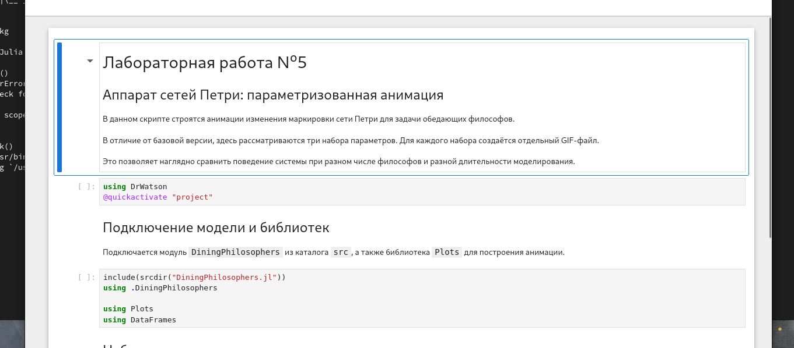{width=88%}

На рисунке показан notebook параметризованной версии второго скрипта. Здесь подтверждается корректность генерации нескольких анимационных сценариев из одного literate-источника.

## Итоговый отчётный скрипт

### Обычная версия

Третий скрипт выполняет итоговое сравнение классической сети Петри и сети с арбитром по одному ключевому показателю — числу философов, находящихся в состоянии `Eat_i`. Он не запускает моделирование заново, а использует ранее сохранённые CSV-файлы и строит объединённый итоговый график.

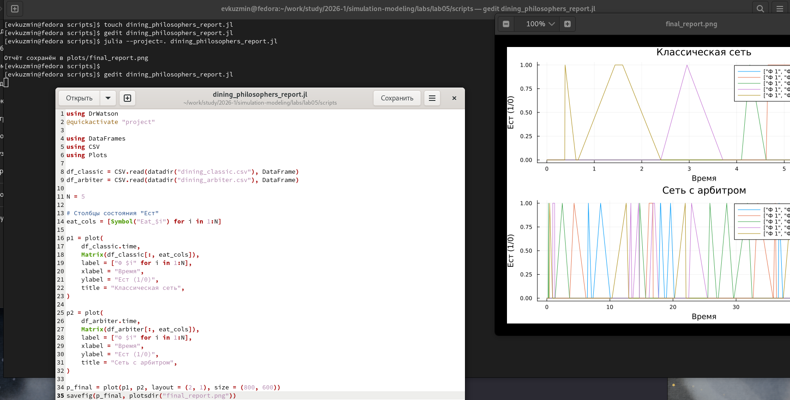{width=88%}

Листинг 5.8. Обычная версия третьего скрипта  
`scripts/dining_philosophers_report.jl`

```julia
using DrWatson
@quickactivate "project"

using DataFrames
using CSV
using Plots

df_classic = CSV.read(datadir("dining_classic.csv"), DataFrame)
df_arbiter = CSV.read(datadir("dining_arbiter.csv"), DataFrame)

N = 5

# Столбцы состояния "Ест"
eat_cols = [Symbol("Eat_$i") for i in 1:N]

p1 = plot(
    df_classic.time,
    Matrix(df_classic[:, eat_cols]),
    label = ["Ф $i" for i in 1:N],
    xlabel = "Время",
    ylabel = "Ест (1/0)",
    title = "Классическая сеть",
)

p2 = plot(
    df_arbiter.time,
    Matrix(df_arbiter[:, eat_cols]),
    label = ["Ф $i" for i in 1:N],
    xlabel = "Время",
    ylabel = "Ест (1/0)",
    title = "Сеть с арбитром",
)

p_final = plot(p1, p2, layout = (2, 1), size = (800, 600))
savefig(p_final, plotsdir("final_report.png"))

println("Отчёт сохранён в plots/final_report.png")
```

{width=88%}

На рисунке сравниваются две модели по состоянию `Eat_i`. Для классической сети через некоторое время линии могут опускаться к нулю и переставать изменяться, что соответствует возникновению deadlock. Для сети с арбитром линии продолжают изменяться, что указывает на отсутствие взаимной блокировки и на более устойчивую работу системы.

Именно этот итоговый график позволяет наглядно показать, ради чего в модель вводился арбитр. Без дополнительного управляющего механизма система может потерять активность, тогда как в улучшенном варианте возможность продолжения работы сохраняется.

### Literate-версия третьего скрипта

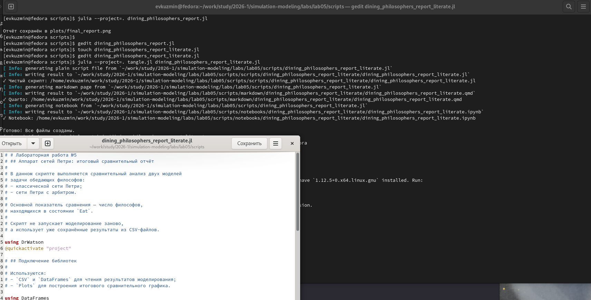{width=88%}

Листинг 5.9. Literate-версия третьего скрипта  
`scripts/dining_philosophers_report_literate.jl`

```julia
# # Лабораторная работа №5
# ## Аппарат сетей Петри: итоговый сравнительный отчёт
#
# В данном скрипте выполняется сравнительный анализ двух моделей
# задачи обедающих философов:
# - классической сети Петри;
# - сети Петри с арбитром.
#
# Основной показатель сравнения — число философов,
# находящихся в состоянии `Eat`.
#
# Скрипт не запускает моделирование заново,
# а использует уже сохранённые результаты из CSV-файлов.

using DrWatson
@quickactivate "project"

# ## Подключение библиотек
#
# Используются:
# - `CSV` и `DataFrames` для чтения результатов моделирования;
# - `Plots` для построения итогового сравнительного графика.

using DataFrames
using CSV
using Plots

# ## Загрузка входных данных
#
# Загружаются CSV-файлы, сформированные ранее скриптом
# `dining_philosophers.jl`.
#
# Если этих файлов нет, скрипт завершится ошибкой,
# поэтому сначала должны быть выполнены основные эксперименты.

df_classic = CSV.read(datadir("dining_classic.csv"), DataFrame)
df_arbiter = CSV.read(datadir("dining_arbiter.csv"), DataFrame)

# ## Задание числа философов
#
# В рассматриваемом примере используется `N = 5`.
# Это соответствует исходной постановке эксперимента.

N = 5

# ## Выбор столбцов состояния `Eat`
#
# Из таблиц извлекаются столбцы `Eat_i`,
# показывающие, находится ли философ в состоянии приёма пищи
# в каждый момент времени.

eat_cols = [Symbol("Eat_$i") for i in 1:N]

# ## Построение графика для классической сети
#
# На первом графике отображается динамика состояния `Eat`
# для философов в классической сети Петри.

p1 = plot(
    df_classic.time,
    Matrix(df_classic[:, eat_cols]),
    label = ["Ф $i" for i in 1:N],
    xlabel = "Время",
    ylabel = "Ест (1/0)",
    title = "Классическая сеть",
)

# ## Построение графика для сети с арбитром
#
# На втором графике отображается динамика состояния `Eat`
# для сети Петри с арбитром.

p2 = plot(
    df_arbiter.time,
    Matrix(df_arbiter[:, eat_cols]),
    label = ["Ф $i" for i in 1:N],
    xlabel = "Время",
    ylabel = "Ест (1/0)",
    title = "Сеть с арбитром",
)

# ## Формирование итогового рисунка
#
# Два построенных графика объединяются в один рисунок
# с двумя панелями, расположенными друг под другом.

p_final = plot(p1, p2, layout = (2, 1), size = (800, 600))

# ## Сохранение результата
#
# Итоговый сравнительный график сохраняется в папку `plots/`
# под именем `final_report.png`.

savefig(p_final, plotsdir("final_report.png"))

println("Отчёт сохранён в plots/final_report.png")

# ## Интерпретация результата
#
# В классической сети возможно появление deadlock:
# через некоторое время линии `Eat_i` могут опуститься до нуля
# и больше не изменяться, что означает прекращение доступа философов к еде.
#
# В сети с арбитром линии `Eat_i` продолжают изменяться во времени,
# что указывает на отсутствие взаимной блокировки
# и более устойчивую работу системы.
#
# Таким образом, итоговый график служит наглядным сравнением
# эффективности двух подходов.
```

### Notebook literate-версии третьего скрипта

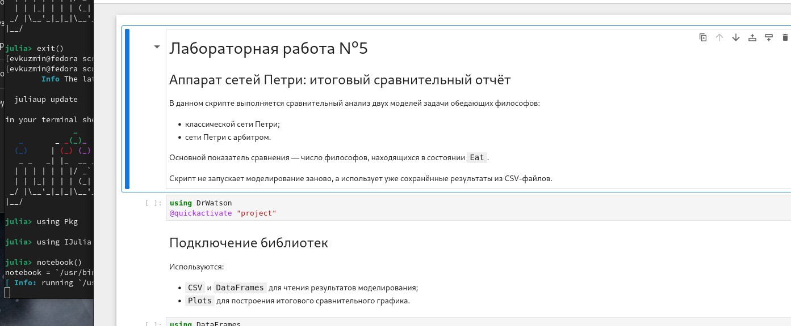{width=88%}

На рисунке показан notebook, полученный из literate-версии третьего скрипта.

## Параметризованная версия итогового отчётного скрипта

На завершающем этапе была подготовлена параметризованная версия итогового отчётного скрипта. Для трёх наборов параметров строились отдельные сравнительные рисунки, каждый из которых содержал две панели: классическую сеть и сеть с арбитром.

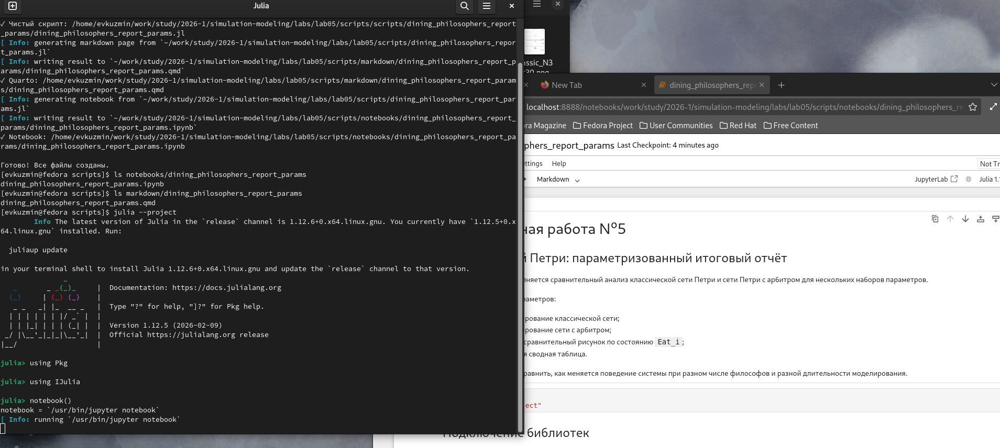{width=88%}

Листинг 5.10. Параметризованная версия третьего скрипта  
`scripts/dining_philosophers_report_params.jl`

```julia
# # Лабораторная работа №5
# ## Аппарат сетей Петри: параметризованный итоговый отчёт
#
# В данном скрипте выполняется сравнительный анализ классической сети Петри
# и сети Петри с арбитром для нескольких наборов параметров.
#
# Для каждого набора параметров:
# - запускается моделирование классической сети;
# - запускается моделирование сети с арбитром;
# - строится итоговый сравнительный рисунок по состоянию `Eat_i`;
# - сохраняется краткая сводная таблица.
#
# Таким образом можно сравнить, как меняется поведение системы
# при разном числе философов и разной длительности моделирования.

using DrWatson
@quickactivate "project"

# ## Подключение библиотек
#
# Используются:
# - `CSV` и `DataFrames` для сохранения табличных результатов;
# - `Plots` для построения итоговых сравнительных рисунков;
# - модуль `DiningPhilosophers` из каталога `src`.

using DataFrames
using CSV
using Plots

include(srcdir("DiningPhilosophers.jl"))
using .DiningPhilosophers

# ## Наборы параметров
#
# Рассматриваются три набора параметров.
# Для каждого набора будет создан один итоговый рисунок,
# содержащий две панели:
# - классическая сеть;
# - сеть с арбитром.

param_sets = [
    (N = 4, tmax = 20.0),
    (N = 5, tmax = 30.0),
    (N = 6, tmax = 40.0),
]

# ## Итоговая сводная таблица
#
# В таблице будут зафиксированы:
# - число философов;
# - время моделирования;
# - тип модели;
# - наличие deadlock;
# - число записей в результирующей таблице.

summary = DataFrame(
    N = Int[],
    tmax = Float64[],
    model = String[],
    deadlock = Bool[],
    n_records = Int[],
)

println("Запуск параметризованного построения итоговых отчётов...")

# ## Основной цикл по параметрам
#
# Для каждого набора параметров сначала моделируются обе сети,
# затем строится сравнительный рисунок по состоянию `Eat_i`
# и сохраняется в папку `plots/`.

for p in param_sets
    N = p.N
    tmax = p.tmax

    println("="^60)
    println("Параметры: N = $N, tmax = $tmax")

    # ### Классическая сеть

    net_classic, u0_classic, _ = build_classical_network(N)
    df_classic = simulate_stochastic(net_classic, u0_classic, tmax)

    classic_csv = datadir("dining_classic_N$(N)_t$(Int(round(tmax))).csv")
    CSV.write(classic_csv, df_classic)

    deadlock_classic = detect_deadlock(df_classic, net_classic)

    push!(summary, (
        N,
        tmax,
        "classic",
        deadlock_classic,
        nrow(df_classic),
    ))

    # ### Сеть с арбитром

    net_arbiter, u0_arbiter, _ = build_arbiter_network(N)
    df_arbiter = simulate_stochastic(net_arbiter, u0_arbiter, tmax)

    arbiter_csv = datadir("dining_arbiter_N$(N)_t$(Int(round(tmax))).csv")
    CSV.write(arbiter_csv, df_arbiter)

    deadlock_arbiter = detect_deadlock(df_arbiter, net_arbiter)

    push!(summary, (
        N,
        tmax,
        "arbiter",
        deadlock_arbiter,
        nrow(df_arbiter),
    ))

    # ### Построение итогового рисунка
    #
    # Из обеих таблиц извлекаются столбцы `Eat_i`,
    # после чего строится один сравнительный рисунок
    # с двумя панелями.

    eat_cols = [Symbol("Eat_$i") for i in 1:N]

    p1 = plot(
        df_classic.time,
        Matrix(df_classic[:, eat_cols]),
        label = ["Ф $i" for i in 1:N],
        xlabel = "Время",
        ylabel = "Ест (1/0)",
        title = "Классическая сеть, N = $N, tmax = $tmax",
    )

    p2 = plot(
        df_arbiter.time,
        Matrix(df_arbiter[:, eat_cols]),
        label = ["Ф $i" for i in 1:N],
        xlabel = "Время",
        ylabel = "Ест (1/0)",
        title = "Сеть с арбитром, N = $N, tmax = $tmax",
    )

    p_final = plot(p1, p2, layout = (2, 1), size = (900, 700))

    report_name = "final_report_N$(N)_t$(Int(round(tmax))).png"
    savefig(p_final, plotsdir(report_name))

    println("Сохранён рисунок: ", plotsdir(report_name))
end

# ## Сохранение сводной таблицы

summary_file = datadir("summary_dining_philosophers_report.csv")
CSV.write(summary_file, summary)

println("="^60)
println("Итоговая таблица:")
println(summary)

# ## Итог
#
# После выполнения скрипта:
# - в папке `plots/` будут сохранены 3 итоговых рисунка;
# - в папке `data/` будут сохранены CSV-файлы по каждому запуску;
# - в папке `data/` будет сохранена сводная таблица.
#
# Каждый итоговый рисунок содержит две панели и показывает,
# как меняется состояние `Eat_i` в классической сети
# и в сети с арбитром.
#
# Если в классической модели линии `Eat_i` со временем падают к нулю
# и больше не изменяются, это означает deadlock.
# Если в модели с арбитром линии продолжают изменяться,
# это подтверждает более устойчивую работу системы.

println("Готово.")
println("Сводная таблица сохранена в: ", summary_file)
println("Итоговые рисунки сохранены в папке plots/")
```

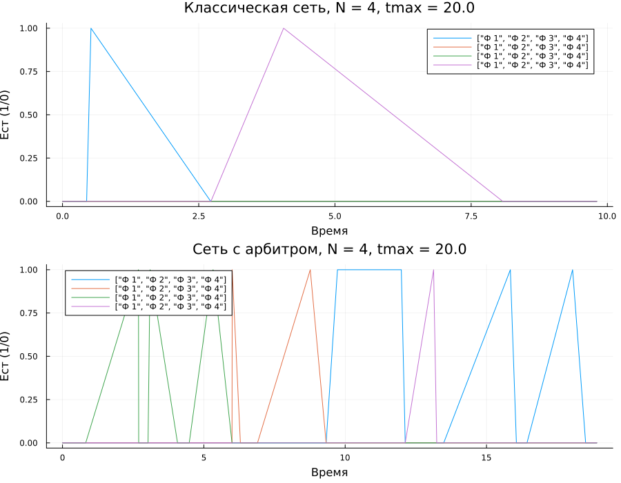{width=88%}

На рисунке приведено сравнение двух моделей при параметрах `N = 4` и `tmax = 20`. Уже в этом случае видно, что наличие арбитра делает систему более устойчивой по отношению к блокировкам.

{width=88%}

На рисунке показан результат при параметрах `N = 5` и `tmax = 30`. В классической сети вероятность перехода к тупиковому состоянию сохраняется, тогда как в сети с арбитром динамика состояния `Eat_i` остаётся более организованной.

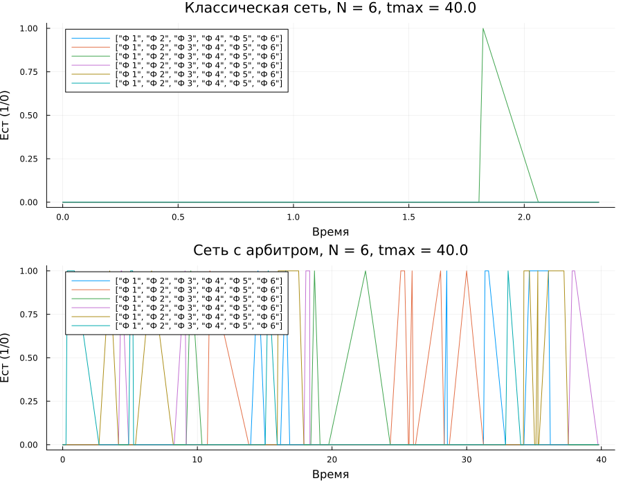{width=88%}

На рисунке показан результат при параметрах `N = 6` и `tmax = 40`. При увеличении числа философов сложность системы возрастает, но введение арбитра по-прежнему поддерживает её живость и снижает вероятность deadlock.

Параметризованная версия отчётного скрипта позволила убедиться, что преимущество сети с арбитром сохраняется не только в одном фиксированном примере, но и в серии запусков с различными значениями числа философов и времени моделирования.

# Итоговые выводы

В ходе выполнения лабораторной работы был изучен аппарат сетей Петри и реализована модель задачи обедающих философов в нескольких вариантах. Были подготовлены обычные, literate- и параметризованные версии трёх основных скриптов: базового сценария моделирования, сценария анимации и итогового сравнительного отчёта. Для всех literate-файлов были успешно сгенерированы чистый код, Jupyter Notebook и Quarto-документация.

Полученные результаты показывают, что классическая сеть Петри может приводить к взаимной блокировке, тогда как добавление арбитра делает поведение системы более устойчивым. Это подтверждается как графиками динамики состояний, так и итоговыми сравнительными отчётами по состоянию `Eat_i`. Параметризованные версии скриптов позволили проследить, как меняется работа системы при увеличении числа философов и времени моделирования.

Дополнительно было показано, что literate-подход удобен не только для документирования кода, но и для организации всей лабораторной работы как единого воспроизводимого процесса. Один и тот же исходный файл может служить базой для генерации кода, notebook и Quarto-документации, что делает оформление результатов более последовательным и аккуратным.

# Список литературы

::: {#refs}
:::
