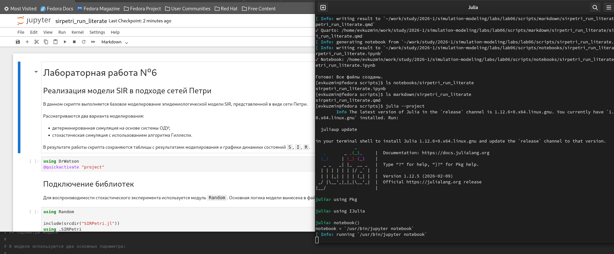
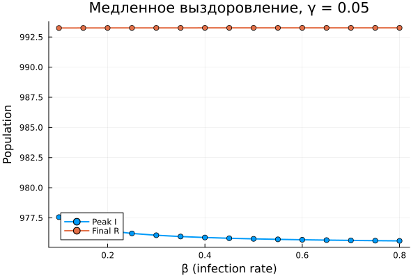
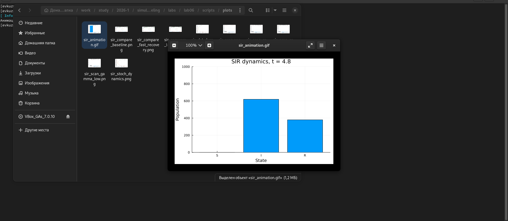
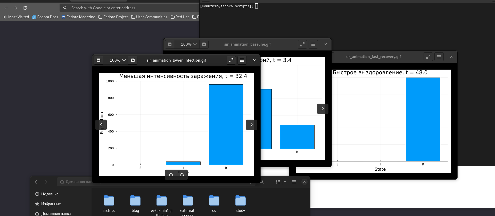
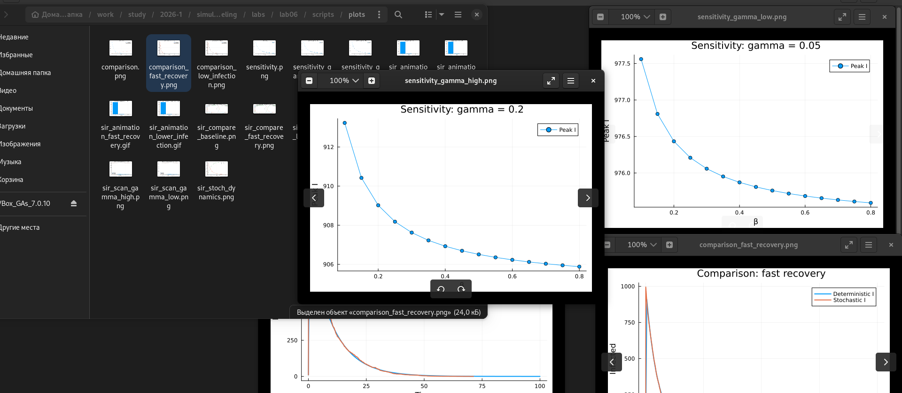

---
## Author
author:
  name: Кузьмин Егор Витальевич
  email: 1132236046@rudn.ru
  affiliation:
    - name: Российский университет дружбы народов
      country: Российская Федерация
      postal-code: 117198
      city: Москва
      address: ул. Миклухо-Маклая, д. 6

## Title
title: Презентация по лабораторной работе №6
date: today
---

# Информация

## Докладчик

:::::::::::::: {.columns align=center}
::: {.column width="70%"}

- Кузьмин Егор Витальевич  
- студент группы НФИбд-01-23  
- РУДН 
:::
::::::::::::

## Цель работы

Цель лабораторной работы — реализовать эпидемиологическую модель SIR в подходе сетей Петри.

В ходе работы были выполнены:

- построение модели SIR;
- детерминированное моделирование;
- стохастическое моделирование;
- сканирование параметра `β`;
- построение GIF-анимации;
- подготовка literate- и параметризованных версий скриптов;
- оформление отчёта и презентации.

## Постановка задачи

В лабораторной работе требовалось пройти полный цикл вычислительного эксперимента:

- реализовать исходный модуль `SIRPetri.jl`;
- выполнить базовый прогон модели;
- исследовать влияние коэффициента заражения `β`;
- построить анимацию динамики `S`, `I`, `R`;
- сформировать итоговые отчётные графики;
- подготовить literate-версии и notebook-файлы;
- выполнить параметризованные эксперименты.

## Теоретические сведения: модель SIR

Модель SIR описывает распространение инфекции в популяции.

В модели выделяются три состояния:

- `S` — восприимчивые;
- `I` — инфицированные;
- `R` — выздоровевшие.

В начале моделирования использовалась начальная маркировка:

```julia
u0 = [990.0, 10.0, 0.0]
```

То есть изначально имеется 990 восприимчивых, 10 инфицированных и 0 выздоровевших индивидов.

## SIR как сеть Петри

В подходе сетей Петри состояния `S`, `I`, `R` рассматриваются как позиции сети.

Процессы заражения и выздоровления задаются переходами:

```text
infection: S + I → I + I
recovery:  I → R
```

Переход `infection` характеризуется коэффициентом заражения `β`.

Переход `recovery` характеризуется коэффициентом выздоровления `γ`.

Таким образом, изменение маркировки сети отражает изменение численности групп населения во времени.

## Подготовка окружения и исходного модуля

На первом этапе было подготовлено окружение Julia и установлены необходимые пакеты.

Использовались:

- `DrWatson`;
- `AlgebraicPetri`;
- `Catlab`;
- `OrdinaryDiffEq`;
- `DataFrames`;
- `CSV`;
- `Plots`;
- `Literate`.

{width=0.76\textwidth}

## Исходный модуль `SIRPetri.jl`

В файле `src/SIRPetri.jl` были реализованы основные функции модели:

- `build_sir_network`;
- `simulate_deterministic`;
- `simulate_stochastic`;
- `plot_sir`;
- `to_graphviz_sir`.

Этот модуль является общей основой для всех последующих скриптов.

Отдельная literate-версия для `src` не создавалась, потому что это библиотечный файл модели.

## Первый скрипт: базовый прогон

Первый скрипт `sirpetri_run.jl` выполняет базовое моделирование.

В нём задаются параметры:

```julia
β = 0.3
γ = 0.1
tmax = 100.0
```

После этого запускаются:

- детерминированная симуляция;
- стохастическая симуляция.

Результаты сохраняются в `data/` и `plots/`.

## Результаты базового прогона

{width=0.72\textwidth}

Детерминированная модель показывает гладкую усреднённую динамику.

Число восприимчивых `S` быстро уменьшается, число выздоровевших `R` растёт, а число инфицированных `I` после распространения инфекции стремится к нулю.

## Стохастическая динамика

{width=0.72\textwidth}

Стохастическая модель показывает один возможный случайный сценарий развития эпидемии.

События заражения и выздоровления происходят дискретно и случайно, поэтому траектория может отличаться от детерминированной, но общий характер процесса сохраняется.

## Literate-версия первого скрипта

После проверки базового скрипта была подготовлена literate-версия `sirpetri_run_literate.jl`.

Из неё были получены:

- обычный `.jl`-файл;
- Jupyter Notebook;
- Quarto-документация.

{width=0.76\textwidth}

## Параметризованная версия первого скрипта

Параметризованная версия первого скрипта рассматривала несколько сценариев:

- базовый сценарий;
- быстрое выздоровление;
- меньшая интенсивность заражения.

Для каждого сценария строился сравнительный график детерминированной и стохастической динамики.

{width=0.74\textwidth}

## Второй скрипт: сканирование параметра β

Второй скрипт `sirpetri_scan_parameters.jl` исследует чувствительность модели к коэффициенту заражения `β`.

Для каждого значения из диапазона:

```julia
β_range = 0.1:0.05:0.8
```

вычислялись:

- `peak_I` — максимальное число инфицированных;
- `final_R` — конечное число выздоровевших.

## Результат сканирования β

{width=0.74\textwidth}

График показывает зависимость `Peak I` и `Final R` от коэффициента заражения `β`.

В выбранном диапазоне параметров почти вся популяция переходит в состояние `R`, поэтому модель находится в области выраженного распространения инфекции.

## Параметризованное сканирование

В параметризованной версии второго скрипта сканирование `β` выполнялось для разных значений `γ`.

Рассматривались:

- медленное выздоровление;
- базовое выздоровление;
- быстрое выздоровление.

{width=0.7\textwidth}

## Влияние коэффициента γ

{width=0.7\textwidth}

Сравнение графиков показывает, что при увеличении `γ` индивиды быстрее покидают состояние `I`.

Из-за этого пик инфицированных становится ниже, а активная фаза эпидемии сокращается.

## Третий скрипт: анимация динамики

Третий скрипт `sirpetri_animate.jl` строит GIF-анимацию детерминированной динамики модели.

Каждый кадр показывает текущее распределение популяции между состояниями:

- `S`;
- `I`;
- `R`.

{width=0.76\textwidth}

## Результат анимации


Анимация показывает, как восприимчивые переходят в инфицированные, а затем в выздоровевшие.

Такой формат делает динамику сети Петри более наглядной, чем статический график.

## Параметризованная анимация

Для анимационного скрипта также была подготовлена параметризованная версия.

Были построены три GIF-анимации:

- базовый сценарий;
- быстрое выздоровление;
- меньшая интенсивность заражения.

{width=0.76\textwidth}

## Четвёртый скрипт: отчётные графики

Четвёртый скрипт `sirpetri_report.jl` не запускает моделирование заново.

Он читает ранее сохранённые CSV-файлы и строит два итоговых графика:

- `comparison.png`;
- `sensitivity.png`.

{width=0.76\textwidth}

## Сравнение моделей

{width=0.72\textwidth}

На графике сравнивается динамика числа инфицированных `I` для детерминированной и стохастической моделей.

Детерминированная модель даёт гладкую кривую, а стохастическая отражает один случайный сценарий.

## График чувствительности

{width=0.72\textwidth}

График показывает зависимость максимального числа инфицированных от коэффициента заражения `β`.

В выбранном диапазоне параметров модель уже находится в области насыщения: почти вся популяция проходит через инфекцию.

## Параметризованная отчётная версия

Параметризованная версия отчётного скрипта строит четыре рисунка двух типов:

- два графика `Comparison`;
- два графика `Sensitivity`.

{width=0.76\textwidth}

Такой набор позволяет сравнить не только динамику во времени, но и чувствительность модели к параметрам.

## Итоговый анализ

В результате экспериментов было показано:

- модель SIR удобно описывается через сеть Петри;
- детерминированный подход даёт гладкую усреднённую динамику;
- стохастический подход показывает один случайный сценарий;
- увеличение `γ` снижает пик инфицированных;
- уменьшение `β` замедляет распространение инфекции;
- параметрические эксперименты помогают оценить чувствительность модели.

## Выводы

В ходе лабораторной работы была реализована модель SIR в подходе сетей Петри.

Были выполнены:

- базовое моделирование;
- сканирование параметра `β`;
- построение GIF-анимации;
- итоговые отчётные графики;
- literate-версии скриптов;
- параметризованные версии;
- генерация notebook и Quarto-документации.

## Спасибо за внимание

