# Цель работы

Целью лабораторной работы является изучение реализации эпидемиологической модели SIR в подходе сетей Петри, выполнение детерминированного и стохастического моделирования, проведение параметрических экспериментов, а также оформление результатов в виде воспроизводимого отчёта с использованием Julia, Literate.jl, Jupyter Notebook и Quarto.

В ходе работы рассматривалась модель распространения инфекции, в которой популяция разбивается на три состояния: восприимчивые, инфицированные и выздоровевшие. Для этой модели были построены обычные скрипты, literate-версии, параметризованные версии, а также итоговые отчётные графики и анимации.

# Постановка задачи

В ходе выполнения лабораторной работы требовалось:

1. подготовить рабочее окружение Julia и проверить наличие необходимых пакетов;
2. реализовать исходный модуль модели `SIRPetri.jl`;
3. выполнить базовый скрипт моделирования SIR-модели;
4. оформить базовый скрипт в literate-стиле и сгенерировать notebook;
5. подготовить параметризованную версию базового скрипта;
6. выполнить скрипт сканирования параметра заражения `β`;
7. оформить скрипт сканирования в literate-стиле и подготовить параметризованную версию;
8. построить GIF-анимацию детерминированной динамики SIR-модели;
9. подготовить literate- и параметризованную версии скрипта анимации;
10. выполнить итоговый отчётный скрипт;
11. подготовить literate- и параметризованную версии отчётного скрипта;
12. включить в отчёт скриншоты выполнения, листинги скриптов, графики и анимации.

# Теоретические сведения

## Аппарат сетей Петри

Сеть Петри представляет собой математическую модель, предназначенную для описания дискретных динамических систем. Она состоит из позиций, переходов и дуг. Позиции отображают состояния системы, переходы соответствуют событиям, а фишки в позициях задают текущее состояние системы, то есть её маркировку.

Переход может сработать только в том случае, если во входных позициях находится достаточное количество фишек. После срабатывания перехода фишки из входных позиций изымаются, а в выходные позиции добавляются. Благодаря этому аппарат сетей Петри удобно использовать для описания процессов, в которых имеются состояния, события и переходы между состояниями.

## Модель SIR

Модель SIR описывает распространение инфекционного заболевания в популяции. В ней рассматриваются три группы:

- `S` — восприимчивые индивиды, которые могут заразиться;
- `I` — инфицированные индивиды, которые уже заражены и могут передавать инфекцию;
- `R` — выздоровевшие индивиды, которые вышли из процесса распространения инфекции.

В подходе сетей Петри эти группы представляются позициями сети. Переход `infection` описывает заражение и имеет вид `S + I → I + I`. Переход `recovery` описывает выздоровление и имеет вид `I → R`.

Начальная маркировка задаётся как:

```julia
u0 = [990.0, 10.0, 0.0]
```

Это означает, что в начале моделирования имеется 990 восприимчивых, 10 инфицированных и 0 выздоровевших индивидов.

## Детерминированная и стохастическая симуляция

В работе используются два варианта моделирования.

Детерминированная симуляция основана на системе обыкновенных дифференциальных уравнений. Она показывает усреднённую динамику изменения численности групп `S`, `I` и `R`.

Стохастическая симуляция основана на алгоритме Гиллеспи. В этом случае события заражения и выздоровления происходят случайно. Поэтому результат представляет собой один возможный сценарий развития эпидемического процесса.

## Литературное программирование и Quarto

Литературное программирование позволяет объединить исполняемый код и поясняющий текст в одном файле. В лабораторной работе literate-файлы использовались как исходники для генерации обычных Julia-скриптов, Jupyter Notebook и Quarto-документации.

Quarto использовался для подготовки итогового отчёта в формате PDF. Для корректного отображения русского текста и листингов применялись шрифты с поддержкой кириллицы и настройки LaTeX-преамбулы.

# Выполнение работы

## Подготовка окружения

На первом этапе была выполнена проверка окружения Julia и установка необходимых пакетов. Для работы использовались пакеты `DrWatson`, `AlgebraicPetri`, `Catlab`, `OrdinaryDiffEq`, `DataFrames`, `CSV`, `Plots`, `Random`, `Literate` и другие зависимости.

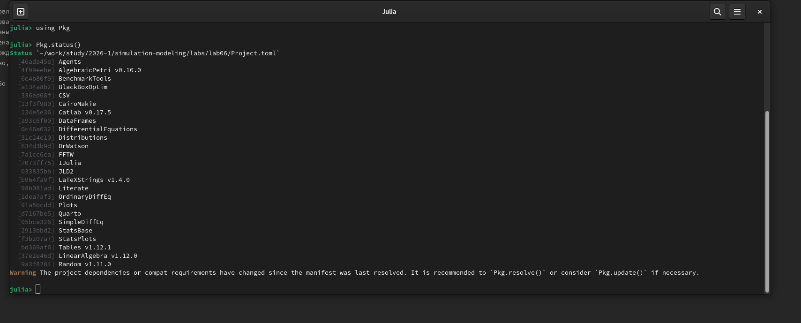{width=88%}

На рисунке показано, что необходимые пакеты Julia установлены и доступны в активированном окружении проекта. Это подтверждает готовность среды к дальнейшему выполнению скриптов лабораторной работы.

## Исходный модуль модели SIR

Основной модуль модели был подготовлен в файле `src/SIRPetri.jl`. В нём описаны функции построения сети Петри, детерминированной симуляции, стохастической симуляции и построения графиков.

Исходный модуль не переводился отдельно в literate-стиль, так как он является библиотечным файлом. Его задача — предоставить функции, которые затем используются в обычных, literate- и параметризованных скриптах.

Листинг 6.1. Исходный модуль модели SIR

`src/SIRPetri.jl`

```julia
module SIRPetri

using AlgebraicPetri
using Catlab.CategoricalAlgebra
using Catlab.Graphics
using OrdinaryDiffEq
using Plots
using DataFrames
using Random

export build_sir_network, simulate_deterministic, simulate_stochastic
export plot_sir, to_graphviz_sir

"""
    build_sir_network(β=0.3, γ=0.1)

Создаёт размеченную сеть Петри для модели SIR.

Возвращает (net::LabelledPetriNet, u0::Vector{Float64},
states::Vector{Symbol})
"""
function build_sir_network(β = 0.3, γ = 0.1)
    states = [:S, :I, :R]

    # Создаём сеть Петри, описывая переходы напрямую
    # Переход infection: S + I → I + I
    # Переход recovery: I → R
    net = LabelledPetriNet(
        states,
        :infection => ([:S, :I] => [:I, :I]),
        :recovery => ([:I] => [:R]),
    )

    # Начальная маркировка: S=990, I=10, R=0
    u0 = [990.0, 10.0, 0.0]

    return net, u0, states
end

"""
    sir_ode(net, rates)

Возвращает функцию правой части ОДУ для сети Петри.

Используется для детерминированной симуляции.
"""
function sir_ode(net, rates = [0.3, 0.1])
    function f!(du, u, p, t)
        S, I, R = u
        β, γ = rates

        # Пропускные способности (закон действующих масс)
        infection_rate = β * S * I
        recovery_rate = γ * I

        # Изменения
        du[1] = -infection_rate
        du[2] = infection_rate - recovery_rate
        du[3] = recovery_rate
    end

    return f!
end

"""
    simulate_deterministic(net, u0, tspan; saveat=0.1, rates=[0.3, 0.1])

Выполняет детерминированную ODE-симуляцию.

Возвращает DataFrame с колонками time, S, I, R.
"""
function simulate_deterministic(net, u0, tspan; saveat = 0.1, rates = [0.3, 0.1])
    f = sir_ode(net, rates)

    prob = ODEProblem(f, u0, tspan)
    sol = solve(prob, Tsit5(), saveat = saveat)

    df = DataFrame(time = sol.t)
    df.S = sol[1, :]
    df.I = sol[2, :]
    df.R = sol[3, :]

    return df
end

"""
    simulate_stochastic(net, u0, tspan; rates=[0.3, 0.1], rng=Random.GLOBAL_RNG)

Стохастическая симуляция (алгоритм Гиллеспи) прямым методом.

Возвращает DataFrame.
"""
function simulate_stochastic(net, u0, tspan; rates = [0.3, 0.1], rng = Random.GLOBAL_RNG)
    u = copy(u0)
    t = 0.0

    times = [t]
    states = [copy(u)]

    β, γ = rates

    while t < tspan[2]
        S, I, R = u

        a_inf = β * S * I
        a_rec = γ * I
        a0 = a_inf + a_rec

        if a0 == 0
            break
        end

        dt = -log(rand(rng)) / a0
        r = rand(rng) * a0

        if r < a_inf
            # Заражение
            u[1] -= 1
            u[2] += 1
        else
            # Выздоровление
            u[2] -= 1
            u[3] += 1
        end

        t += dt

        if t <= tspan[2]
            push!(times, t)
            push!(states, copy(u))
        end
    end

    df = DataFrame(time = times)
    df.S = [s[1] for s in states]
    df.I = [s[2] for s in states]
    df.R = [s[3] for s in states]

    return df
end

"""
    plot_sir(df)

Строит график динамики S, I, R из DataFrame.
"""
function plot_sir(df)
    p = plot(
        df.time,
        [df.S, df.I, df.R],
        label = ["S (Susceptible)" "I (Infected)" "R (Recovered)"],
        xlabel = "Time",
        ylabel = "Population",
        linewidth = 2,
    )

    return p
end

"""
    to_graphviz_sir(net)

Визуализация сети Петри с помощью Graphviz.
"""
function to_graphviz_sir(net)
    return to_graphviz(net, prog = "dot")
end

end # module
```

## Базовый скрипт моделирования

### Обычная версия

Первый скрипт `sirpetri_run.jl` выполняет базовое моделирование SIR-модели. В нём задаются параметры `β = 0.3`, `γ = 0.1` и `tmax = 100.0`. Затем создаётся сеть Петри и выполняются две симуляции: детерминированная и стохастическая.

В результате работы скрипта сохраняются таблицы `sir_det.csv` и `sir_stoch.csv`, а также графики `sir_det_dynamics.png` и `sir_stoch_dynamics.png`.

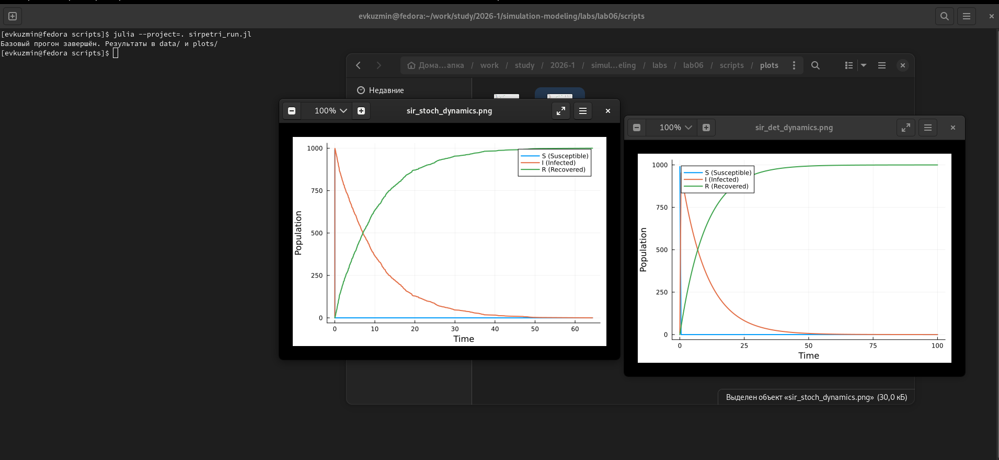{width=88%}

На рисунке показан запуск первого скрипта и получение базовых результатов моделирования.

Листинг 6.2. Обычная версия первого скрипта

`scripts/sirpetri_run.jl`

```julia
using DrWatson
@quickactivate "project"

using Random

include(srcdir("SIRPetri.jl"))
using .SIRPetri

using DataFrames, CSV, Plots

# Параметры
β = 0.3
γ = 0.1
tmax = 100.0

# Создаём сеть
net, u0, states = build_sir_network(β, γ)

# Детерминированная симуляция
df_det = simulate_deterministic(
    net,
    u0,
    (0.0, tmax),
    saveat = 0.5,
    rates = [β, γ],
)

CSV.write(datadir("sir_det.csv"), df_det)

# Стохастическая симуляция
Random.seed!(123)

df_stoch = simulate_stochastic(
    net,
    u0,
    (0.0, tmax),
    rates = [β, γ],
)

CSV.write(datadir("sir_stoch.csv"), df_stoch)

# Графики
p_det = plot_sir(df_det)
savefig(p_det, plotsdir("sir_det_dynamics.png"))

p_stoch = plot_sir(df_stoch)
savefig(p_stoch, plotsdir("sir_stoch_dynamics.png"))

println("Базовый прогон завершён. Результаты в data/ и plots/")
```

{width=88%}

На рисунке представлена детерминированная динамика SIR-модели. Число восприимчивых `S` быстро уменьшается, поскольку они переходят в состояние инфицированных. Число выздоровевших `R` возрастает и со временем приближается к общей численности популяции. Детерминированная модель даёт гладкую усреднённую траекторию.

{width=88%}

На рисунке представлена стохастическая динамика SIR-модели. В отличие от детерминированного случая, события заражения и выздоровления происходят случайным образом. При этом общий характер процесса сохраняется: восприимчивые уменьшаются, выздоровевшие накапливаются, а число инфицированных со временем стремится к нулю.

### Literate-версия первого скрипта

После проверки обычной версии был подготовлен файл `sirpetri_run_literate.jl`. В нём код был дополнен поясняющими комментариями, после чего через `tangle.jl` были сгенерированы обычный скрипт, notebook и Quarto-документация.

{width=88%}

На рисунке показаны создание literate-версии первого скрипта и результат генерации notebook.

Листинг 6.3. Literate-версия первого скрипта

`scripts/sirpetri_run_literate.jl`

```julia
# # Лабораторная работа №6
# ## Реализация модели SIR в подходе сетей Петри
#
# В данном скрипте выполняется базовое моделирование эпидемиологической
# модели SIR, представленной в виде сети Петри.
#
# Рассматриваются два варианта моделирования:
#
# - детерминированная симуляция на основе системы ОДУ;
# - стохастическая симуляция с использованием алгоритма Гиллеспи.
#
# В результате работы скрипта сохраняются таблицы с результатами
# моделирования и графики динамики состояний `S`, `I`, `R`.

using DrWatson
@quickactivate "project"

# ## Подключение библиотек
#
# Для воспроизводимости стохастического эксперимента используется модуль
# `Random`. Основная логика модели вынесена в файл `src/SIRPetri.jl`.

using Random

include(srcdir("SIRPetri.jl"))
using .SIRPetri

using DataFrames, CSV, Plots

# ## Параметры модели
#
# В модели используются два основных параметра:
#
# - `β` — коэффициент заражения;
# - `γ` — коэффициент выздоровления.
#
# Также задаётся максимальное время моделирования `tmax`.

β = 0.3
γ = 0.1
tmax = 100.0

# ## Построение сети Петри
#
# Функция `build_sir_network` создаёт сеть Петри для модели SIR.
# В этой сети позиции соответствуют состояниям:
#
# - `S` — восприимчивые;
# - `I` — инфицированные;
# - `R` — выздоровевшие.
#
# Переход `infection` описывает заражение, а переход `recovery`
# описывает выздоровление.

net, u0, states = build_sir_network(β, γ)

# ## Детерминированная симуляция
#
# Сначала выполняется детерминированное моделирование.
# В этом случае динамика системы описывается системой обыкновенных
# дифференциальных уравнений.
#
# Результат сохраняется в таблицу `data/sir_det.csv`.

df_det = simulate_deterministic(
    net,
    u0,
    (0.0, tmax),
    saveat = 0.5,
    rates = [β, γ],
)

CSV.write(datadir("sir_det.csv"), df_det)

# ## Стохастическая симуляция
#
# Далее выполняется стохастическая симуляция.
# В отличие от детерминированного случая, здесь события заражения
# и выздоровления происходят случайным образом.
#
# Для воспроизводимости результата фиксируется зерно генератора
# случайных чисел.

Random.seed!(123)

df_stoch = simulate_stochastic(
    net,
    u0,
    (0.0, tmax),
    rates = [β, γ],
)

CSV.write(datadir("sir_stoch.csv"), df_stoch)

# ## Построение графиков
#
# Для обеих симуляций строятся графики изменения численности групп
# `S`, `I`, `R` во времени.
#
# Детерминированный график сохраняется в файл
# `plots/sir_det_dynamics.png`.

p_det = plot_sir(df_det)
savefig(p_det, plotsdir("sir_det_dynamics.png"))

# Стохастический график сохраняется в файл
# `plots/sir_stoch_dynamics.png`.

p_stoch = plot_sir(df_stoch)
savefig(p_stoch, plotsdir("sir_stoch_dynamics.png"))

# ## Результат
#
# После выполнения скрипта в каталоге `data/` появляются таблицы:
#
# - `sir_det.csv`;
# - `sir_stoch.csv`.
#
# В каталоге `plots/` появляются графики:
#
# - `sir_det_dynamics.png`;
# - `sir_stoch_dynamics.png`.
#
# Эти результаты используются для анализа различий между
# детерминированным и стохастическим подходами к моделированию SIR.

println("Базовый прогон завершён. Результаты в data/ и plots/")
```

### Параметризованная версия первого скрипта

Параметризованная версия `sirpetri_run_params.jl` расширяет базовый запуск. В ней рассматриваются несколько сценариев: базовый сценарий, быстрое выздоровление и меньшая интенсивность заражения. Для каждого сценария строится сравнительный рисунок, на котором сопоставляются детерминированная и стохастическая динамика.

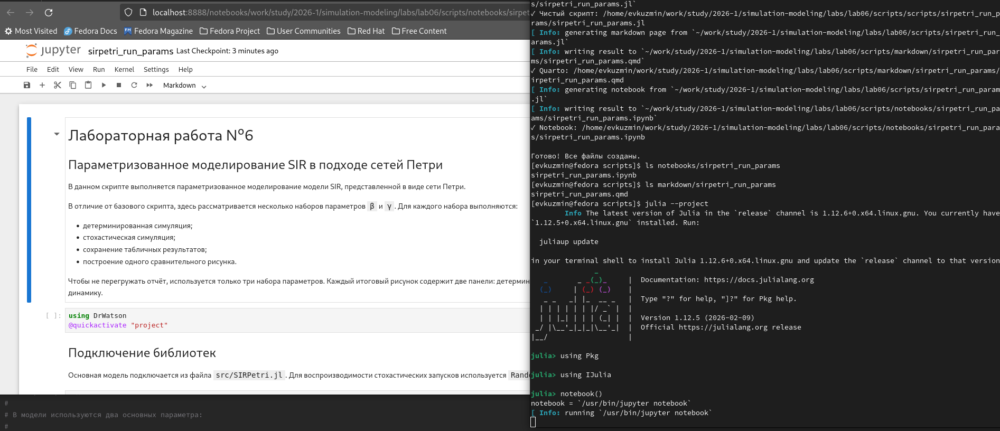{width=88%}

На рисунке показан этап подготовки параметризованной версии первого скрипта и notebook, полученный из literate-файла.

Листинг 6.4. Параметризованная версия первого скрипта

`scripts/sirpetri_run_params.jl`

```julia
# # Лабораторная работа №6
# ## Параметризованное моделирование SIR в подходе сетей Петри
#
# В данном скрипте выполняется параметризованное моделирование модели SIR,
# представленной в виде сети Петри.
#
# В отличие от базового скрипта, здесь рассматривается несколько наборов
# параметров `β` и `γ`. Для каждого набора выполняются:
#
# - детерминированная симуляция;
# - стохастическая симуляция;
# - сохранение табличных результатов;
# - построение одного сравнительного рисунка.
#
# Чтобы не перегружать отчёт, используется только три набора параметров.
# Каждый итоговый рисунок содержит две панели: детерминированную и
# стохастическую динамику.

using DrWatson
@quickactivate "project"

# ## Подключение библиотек
#
# Основная модель подключается из файла `src/SIRPetri.jl`.
# Для воспроизводимости стохастических запусков используется `Random`.

using Random

include(srcdir("SIRPetri.jl"))
using .SIRPetri

using DataFrames, CSV, Plots

# ## Подготовка каталогов
#
# Результаты параметризованных запусков сохраняются отдельно,
# чтобы не смешивать их с базовым прогоном.

mkpath(datadir("params"))
mkpath(plotsdir("params"))

# ## Наборы параметров
#
# Рассматриваются три сценария:
#
# 1. базовый сценарий из методички;
# 2. сценарий с более быстрым выздоровлением;
# 3. сценарий с меньшей интенсивностью заражения.
#
# Такой выбор позволяет сравнить, как параметры `β` и `γ`
# влияют на ход эпидемического процесса.

param_sets = [
    (
        name = "baseline",
        β = 0.3,
        γ = 0.1,
        tmax = 100.0,
        seed = 123,
        description = "Базовый сценарий",
    ),
    (
        name = "fast_recovery",
        β = 0.3,
        γ = 0.3,
        tmax = 100.0,
        seed = 124,
        description = "Более быстрое выздоровление",
    ),
    (
        name = "lower_infection",
        β = 0.1,
        γ = 0.1,
        tmax = 100.0,
        seed = 125,
        description = "Меньшая интенсивность заражения",
    ),
]

# ## Сводная таблица
#
# В сводной таблице фиксируются основные параметры каждого запуска
# и итоговые значения численности групп `S`, `I`, `R`.

summary = DataFrame(
    scenario = String[],
    β = Float64[],
    γ = Float64[],
    tmax = Float64[],
    model = String[],
    final_S = Float64[],
    final_I = Float64[],
    final_R = Float64[],
    n_records = Int[],
)

println("Запуск параметризованного моделирования SIR...")

# ## Основной цикл моделирования
#
# Для каждого набора параметров строится сеть Петри,
# выполняются две симуляции и создаётся один сравнительный рисунок.

for p in param_sets
    println("="^60)
    println("Сценарий: ", p.description)
    println("β = $(p.β), γ = $(p.γ), tmax = $(p.tmax)")

    # ### Построение сети Петри

    net, u0, states = build_sir_network(p.β, p.γ)

    # ### Детерминированная симуляция
    #
    # Детерминированная модель показывает сглаженную усреднённую
    # динамику изменения групп `S`, `I`, `R`.

    df_det = simulate_deterministic(
        net,
        u0,
        (0.0, p.tmax),
        saveat = 0.5,
        rates = [p.β, p.γ],
    )

    det_file = datadir("params", "sir_det_$(p.name).csv")
    CSV.write(det_file, df_det)

    push!(
        summary,
        (
            p.name,
            p.β,
            p.γ,
            p.tmax,
            "deterministic",
            Float64(df_det.S[end]),
            Float64(df_det.I[end]),
            Float64(df_det.R[end]),
            nrow(df_det),
        ),
    )

    # ### Стохастическая симуляция
    #
    # Стохастическая модель показывает один возможный случайный сценарий
    # развития эпидемии. Для воспроизводимости задаётся seed.

    Random.seed!(p.seed)

    df_stoch = simulate_stochastic(
        net,
        u0,
        (0.0, p.tmax),
        rates = [p.β, p.γ],
    )

    stoch_file = datadir("params", "sir_stoch_$(p.name).csv")
    CSV.write(stoch_file, df_stoch)

    push!(
        summary,
        (
            p.name,
            p.β,
            p.γ,
            p.tmax,
            "stochastic",
            Float64(df_stoch.S[end]),
            Float64(df_stoch.I[end]),
            Float64(df_stoch.R[end]),
            nrow(df_stoch),
        ),
    )

    # ### Построение сравнительного рисунка
    #
    # Для каждого сценария сохраняется только один рисунок.
    # В нём слева показана детерминированная симуляция,
    # справа — стохастическая.

    p_det = plot_sir(df_det)
    title!(p_det, "Детерминированная модель")

    p_stoch = plot_sir(df_stoch)
    title!(p_stoch, "Стохастическая модель")

    p_final = plot(
        p_det,
        p_stoch;
        layout = (1, 2),
        size = (1100, 450),
        plot_title = "$(p.description): β=$(p.β), γ=$(p.γ)",
    )

    fig_file = plotsdir("params", "sir_compare_$(p.name).png")
    savefig(p_final, fig_file)

    println("Сохранено:")
    println("  ", det_file)
    println("  ", stoch_file)
    println("  ", fig_file)
end

# ## Сохранение сводной таблицы

summary_file = datadir("params", "sir_params_summary.csv")
CSV.write(summary_file, summary)

println("="^60)
println("Параметризованное моделирование завершено.")
println("Сводная таблица сохранена в: ", summary_file)
println("Итоговые рисунки сохранены в: ", plotsdir("params"))

# ## Итог
#
# После выполнения скрипта создаются:
#
# - CSV-файлы с результатами детерминированных запусков;
# - CSV-файлы с результатами стохастических запусков;
# - сводная таблица `sir_params_summary.csv`;
# - три сравнительных рисунка.
#
# Такой набор результатов позволяет сравнить влияние параметров
# заражения и выздоровления на динамику SIR-модели, не перегружая
# отчёт большим количеством однотипных изображений.
```

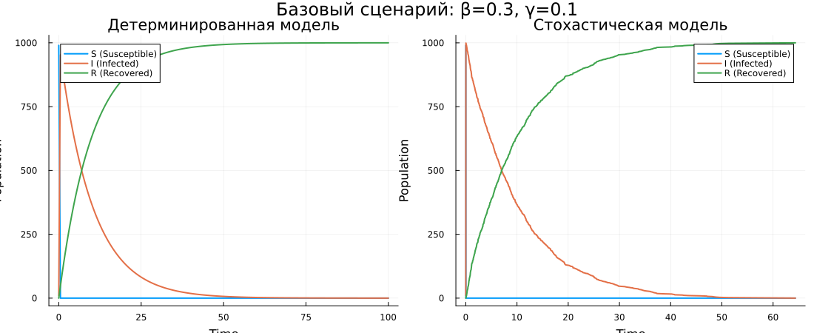{width=88%}

Базовый сценарий показывает стандартную динамику модели SIR. Детерминированная модель даёт гладкую траекторию, а стохастическая модель отражает один случайный сценарий развития эпидемии.

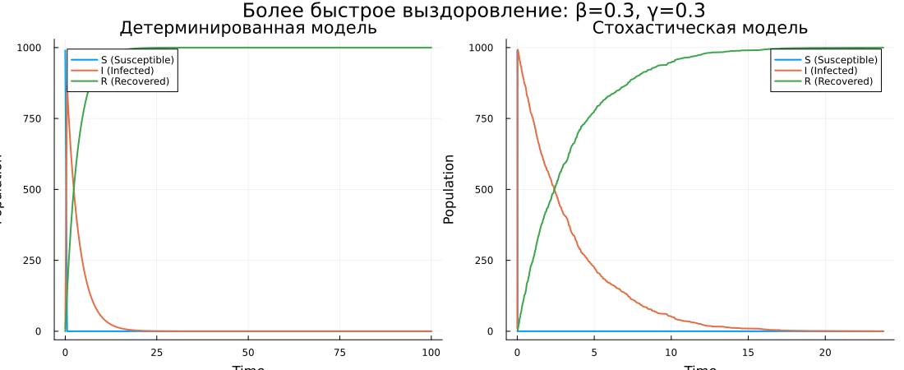{width=88%}

При быстром выздоровлении индивиды быстрее переходят из состояния `I` в состояние `R`. Поэтому активная фаза эпидемии сокращается.

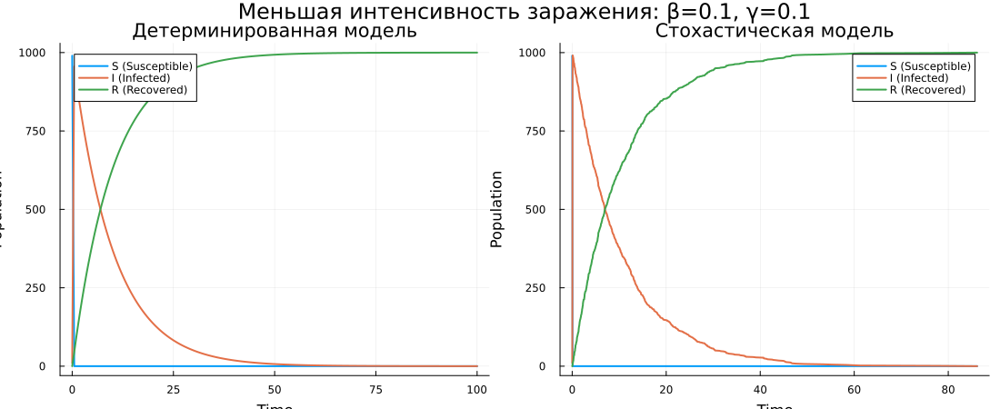{width=88%}

При меньшей интенсивности заражения процесс развивается более плавно. Переход из состояния `S` в состояние `I` происходит медленнее.

## Скрипт сканирования параметра β

### Обычная версия

Второй скрипт `sirpetri_scan_parameters.jl` исследует чувствительность модели к изменению коэффициента заражения `β`. Для каждого значения `β` из диапазона `0.1:0.05:0.8` выполняется детерминированная симуляция при фиксированном `γ = 0.1`.

Для каждого прогона вычисляются максимальное число инфицированных `peak_I` и конечное число выздоровевших `final_R`.

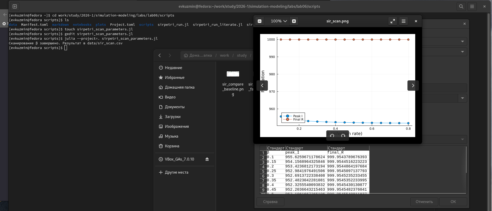{width=88%}

На рисунке показано выполнение скрипта сканирования параметра `β` и сформированный график.

Листинг 6.5. Обычная версия второго скрипта

`scripts/sirpetri_scan_parameters.jl`

```julia
using DrWatson
@quickactivate "project"

include(srcdir("SIRPetri.jl"))
using .SIRPetri

using DataFrames, CSV, Plots

# Диапазон β
β_range = 0.1:0.05:0.8
γ_fixed = 0.1
tmax = 100.0

results = []

for β in β_range
    net, u0, _ = build_sir_network(β, γ_fixed)

    df = simulate_deterministic(
        net,
        u0,
        (0.0, tmax),
        saveat = 0.5,
        rates = [β, γ_fixed],
    )

    peak_I = maximum(df.I)
    final_R = df.R[end]

    push!(results, (β = β, peak_I = peak_I, final_R = final_R))
end

df_scan = DataFrame(results)

CSV.write(datadir("sir_scan.csv"), df_scan)

# График
p = plot(
    df_scan.β,
    [df_scan.peak_I df_scan.final_R],
    label = ["Peak I" "Final R"],
    marker = :circle,
    xlabel = "β (infection rate)",
    ylabel = "Population",
)

savefig(plotsdir("sir_scan.png"))

println("Сканирование β завершено. Результат в data/sir_scan.csv")
```

{width=88%}

На рисунке показана зависимость максимального числа инфицированных `Peak I` и конечного числа выздоровевших `Final R` от коэффициента заражения `β`. В выбранном диапазоне параметров почти вся популяция к концу моделирования переходит в состояние `R`, поэтому график отражает область выраженного распространения инфекции.

### Literate-версия второго скрипта

Для второго скрипта была подготовлена literate-версия `sirpetri_scan_parameters_literate.jl`. Она подробно описывает этапы сканирования параметра, вычисления `peak_I`, вычисления `final_R` и построения графика.

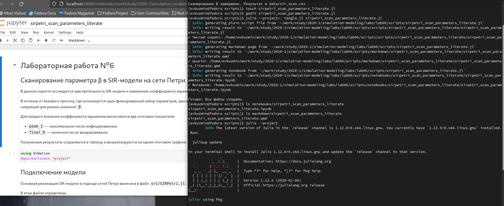{width=88%}

На рисунке показаны подготовка literate-версии второго скрипта и notebook, полученный после генерации.

Листинг 6.6. Literate-версия второго скрипта

`scripts/sirpetri_scan_parameters_literate.jl`

```julia
# # Лабораторная работа №6
# ## Сканирование параметра β в SIR-модели на сети Петри
#
# В данном скрипте исследуется чувствительность SIR-модели к изменению
# коэффициента заражения `β`.
#
# В отличие от базового прогона, где используется один фиксированный набор
# параметров, здесь выполняется серия детерминированных симуляций для разных
# значений `β`.
#
# Для каждого значения коэффициента заражения вычисляются два итоговых
# показателя:
#
# - `peak_I` — максимальное число инфицированных;
# - `final_R` — конечное число выздоровевших.
#
# Полученные результаты сохраняются в таблицу и визуализируются на одном
# итоговом графике.

using DrWatson
@quickactivate "project"

# ## Подключение модели
#
# Основная реализация SIR-модели в подходе сетей Петри вынесена в файл
# `src/SIRPetri.jl`.
#
# В этом файле определены:
#
# - построение сети Петри;
# - детерминированная симуляция;
# - стохастическая симуляция;
# - построение графиков.

include(srcdir("SIRPetri.jl"))
using .SIRPetri

using DataFrames, CSV, Plots

# ## Диапазон значений β
#
# В скрипте задаётся диапазон коэффициента заражения `β`.
# Коэффициент выздоровления `γ` фиксируется.
#
# Таким образом, исследуется влияние только одного параметра — скорости
# заражения.

β_range = 0.1:0.05:0.8
γ_fixed = 0.1
tmax = 100.0

# ## Подготовка массива результатов
#
# Для каждого значения `β` в этот массив будет добавляться запись с тремя
# значениями:
#
# - текущее значение `β`;
# - максимальное число инфицированных `peak_I`;
# - конечное число выздоровевших `final_R`.

results = []

# ## Основной цикл сканирования
#
# Для каждого значения коэффициента заражения выполняются следующие шаги:
#
# 1. строится сеть Петри модели SIR;
# 2. запускается детерминированная симуляция;
# 3. вычисляется пик инфицированных;
# 4. вычисляется конечное число выздоровевших;
# 5. результат добавляется в сводную таблицу.

for β in β_range
    net, u0, _ = build_sir_network(β, γ_fixed)

    df = simulate_deterministic(
        net,
        u0,
        (0.0, tmax),
        saveat = 0.5,
        rates = [β, γ_fixed],
    )

    peak_I = maximum(df.I)
    final_R = df.R[end]

    push!(results, (β = β, peak_I = peak_I, final_R = final_R))
end

# ## Формирование таблицы результатов
#
# После завершения цикла массив результатов преобразуется в `DataFrame`.
#
# Таблица содержит три колонки:
#
# - `β`;
# - `peak_I`;
# - `final_R`.

df_scan = DataFrame(results)

CSV.write(datadir("sir_scan.csv"), df_scan)

# ## Построение итогового графика
#
# На одном графике отображаются две зависимости:
#
# - `Peak I` — максимальное число инфицированных от `β`;
# - `Final R` — конечное число выздоровевших от `β`.
#
# Такой график позволяет увидеть, как увеличение коэффициента заражения
# влияет на масштаб эпидемического процесса.

p = plot(
    df_scan.β,
    [df_scan.peak_I df_scan.final_R],
    label = ["Peak I" "Final R"],
    marker = :circle,
    xlabel = "β (infection rate)",
    ylabel = "Population",
)

savefig(plotsdir("sir_scan.png"))

# ## Итог
#
# После выполнения скрипта создаются два файла:
#
# - `data/sir_scan.csv` — таблица результатов сканирования;
# - `plots/sir_scan.png` — график зависимости `peak_I` и `final_R` от `β`.
#
# Скрипт показывает, как изменение скорости заражения влияет на пик
# инфицированных и итоговое число выздоровевших.

println("Сканирование β завершено. Результат в data/sir_scan.csv")
```

### Параметризованная версия второго скрипта

Параметризованная версия `sirpetri_scan_parameters_params.jl` расширяет сканирование `β`: оно выполняется для трёх значений коэффициента выздоровления `γ`. Это позволяет оценить, как скорость выздоровления влияет на пик инфицированных.

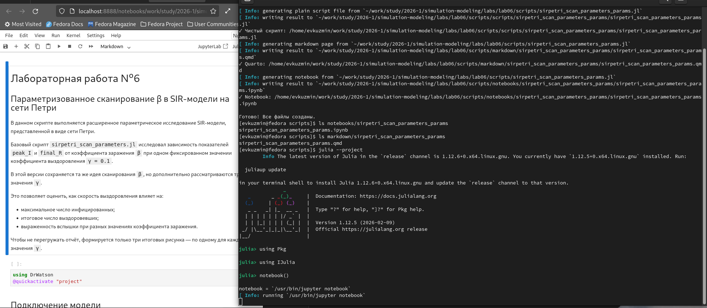{width=88%}

На рисунке показан этап создания параметризованной версии второго скрипта и её notebook.

Листинг 6.7. Параметризованная версия второго скрипта

`scripts/sirpetri_scan_parameters_params.jl`

```julia
# # Лабораторная работа №6
# ## Параметризованное сканирование β в SIR-модели на сети Петри
#
# В данном скрипте выполняется расширенное параметрическое исследование
# SIR-модели, представленной в виде сети Петри.
#
# Базовый скрипт `sirpetri_scan_parameters.jl` исследовал зависимость
# показателей `peak_I` и `final_R` от коэффициента заражения `β` при одном
# фиксированном значении коэффициента выздоровления `γ = 0.1`.
#
# В этой версии сохраняется та же идея сканирования `β`, но дополнительно
# рассматриваются три значения `γ`.
#
# Это позволяет оценить, как скорость выздоровления влияет на:
#
# - максимальное число инфицированных;
# - итоговое число выздоровевших;
# - выраженность вспышки при разных значениях коэффициента заражения.
#
# Чтобы не перегружать отчёт, формируется только три итоговых рисунка —
# по одному для каждого значения `γ`.

using DrWatson
@quickactivate "project"

# ## Подключение модели
#
# Основная реализация модели SIR в подходе сетей Петри подключается из файла
# `src/SIRPetri.jl`.

include(srcdir("SIRPetri.jl"))
using .SIRPetri

using DataFrames, CSV, Plots

# ## Диапазон коэффициента заражения β
#
# Как и в базовом скрипте, коэффициент заражения `β` изменяется в диапазоне
# от `0.1` до `0.8` с шагом `0.05`.

β_range = 0.1:0.05:0.8
tmax = 100.0

# ## Наборы параметров γ
#
# Для сравнения выбраны три значения коэффициента выздоровления:
#
# - `γ = 0.05` — медленное выздоровление;
# - `γ = 0.1` — базовый вариант из методички;
# - `γ = 0.2` — более быстрое выздоровление.
#
# Такой выбор позволяет проверить, как изменение скорости выздоровления
# влияет на результаты сканирования по `β`.

gamma_sets = [
    (
        name = "gamma_low",
        γ = 0.05,
        description = "Медленное выздоровление",
    ),
    (
        name = "gamma_base",
        γ = 0.1,
        description = "Базовое выздоровление",
    ),
    (
        name = "gamma_high",
        γ = 0.2,
        description = "Быстрое выздоровление",
    ),
]

# ## Общая сводная таблица
#
# В эту таблицу будут добавлены результаты всех прогонов.
# Она нужна для последующего анализа и для проверки численных значений.

summary = DataFrame(
    scenario = String[],
    gamma = Float64[],
    β = Float64[],
    peak_I = Float64[],
    final_R = Float64[],
)

println("Запуск параметризованного сканирования β...")

# ## Основной цикл параметрического исследования
#
# Для каждого значения `γ` выполняется отдельное сканирование диапазона `β`.
# Для каждой пары `(β, γ)` запускается детерминированная симуляция SIR-модели.
#
# После каждого запуска вычисляются:
#
# - `peak_I` — максимальное число инфицированных;
# - `final_R` — конечное число выздоровевших.

for scenario in gamma_sets
    println("="^60)
    println("Сценарий: ", scenario.description)
    println("γ = ", scenario.γ)

    results = []

    for β in β_range
        net, u0, _ = build_sir_network(β, scenario.γ)

        df = simulate_deterministic(
            net,
            u0,
            (0.0, tmax),
            saveat = 0.5,
            rates = [β, scenario.γ],
        )

        peak_I = maximum(df.I)
        final_R = df.R[end]

        push!(
            results,
            (
                β = Float64(β),
                peak_I = Float64(peak_I),
                final_R = Float64(final_R),
            ),
        )

        push!(
            summary,
            (
                scenario.name,
                Float64(scenario.γ),
                Float64(β),
                Float64(peak_I),
                Float64(final_R),
            ),
        )
    end

    # ## Таблица для одного сценария
    #
    # Для каждого значения `γ` сохраняется отдельная таблица.
    # Все файлы сохраняются прямо в каталог `data/`.

    df_scan = DataFrame(results)

    csv_file = datadir("sir_scan_$(scenario.name).csv")
    CSV.write(csv_file, df_scan)

    # ## Построение графика
    #
    # Для каждого значения `γ` строится один график зависимости
    # `peak_I` и `final_R` от `β`.
    #
    # Таким образом, всего сохраняется три рисунка.

    p = plot(
        df_scan.β,
        [df_scan.peak_I df_scan.final_R],
        label = ["Peak I" "Final R"],
        marker = :circle,
        xlabel = "β (infection rate)",
        ylabel = "Population",
        title = "$(scenario.description), γ = $(scenario.γ)",
        linewidth = 2,
    )

    fig_file = plotsdir("sir_scan_$(scenario.name).png")
    savefig(p, fig_file)

    println("Сохранено:")
    println("  ", csv_file)
    println("  ", fig_file)
end

# ## Сохранение общей сводной таблицы
#
# В общей таблице объединяются результаты всех трёх сценариев.
# Это удобно для итогового анализа и сравнения.

summary_file = datadir("sir_scan_params_summary.csv")
CSV.write(summary_file, summary)

println("="^60)
println("Параметризованное сканирование завершено.")
println("Сводная таблица сохранена в: ", summary_file)
println("Рисунки сохранены в каталог: ", plotsdir())

# ## Итог
#
# После выполнения скрипта создаются:
#
# - `data/sir_scan_gamma_low.csv`;
# - `data/sir_scan_gamma_base.csv`;
# - `data/sir_scan_gamma_high.csv`;
# - `data/sir_scan_params_summary.csv`;
# - `plots/sir_scan_gamma_low.png`;
# - `plots/sir_scan_gamma_base.png`;
# - `plots/sir_scan_gamma_high.png`.
#
# Такая версия позволяет сравнить влияние коэффициента выздоровления `γ`
# на зависимость пика инфицированных и конечного числа выздоровевших
# от коэффициента заражения `β`.
```

{width=88%}

При медленном выздоровлении инфицированные дольше остаются в состоянии `I`, поэтому пик инфицированных выше.

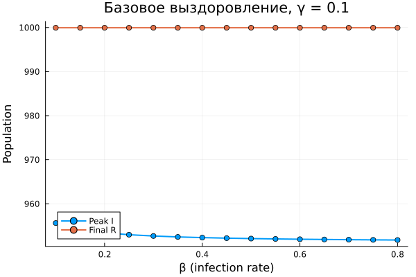{width=88%}

Базовое значение `γ = 0.1` соответствует основному сценарию. По сравнению с медленным выздоровлением пик инфицированных становится ниже.

{width=88%}

При быстром выздоровлении максимальное число инфицированных снижается, поскольку индивиды быстрее покидают состояние `I`.

## Скрипт построения анимации

### Обычная версия

Третий скрипт `sirpetri_animate.jl` строит GIF-анимацию детерминированной динамики SIR-модели. Каждый кадр показывает распределение численности между состояниями `S`, `I` и `R`.

{width=88%}

На рисунке показано выполнение скрипта анимации и сформированный GIF-файл.

Листинг 6.8. Обычная версия третьего скрипта

`scripts/sirpetri_animate.jl`

```julia
using DrWatson
@quickactivate "project"

include(srcdir("SIRPetri.jl"))
using .SIRPetri

using DataFrames, CSV, Plots

# Параметры
β = 0.3
γ = 0.1
tmax = 100.0

# Создаём сеть
net, u0, states = build_sir_network(β, γ)

# Детерминированная симуляция
df = simulate_deterministic(
    net,
    u0,
    (0.0, tmax),
    saveat = 0.2,
    rates = [β, γ],
)

# Анимация динамики S, I, R
anim = @animate for i in 1:nrow(df)
    values = [df.S[i], df.I[i], df.R[i]]

    bar(
        string.(states),
        values,
        ylim = (0, 1000),
        xlabel = "State",
        ylabel = "Population",
        title = "SIR dynamics, t = $(round(df.time[i], digits = 1))",
        legend = false,
    )
end

gif(anim, plotsdir("sir_animation.gif"), fps = 20)

println("Анимация сохранена в plots/sir_animation.gif")
```

GIF-анимация показывает, как во времени меняется распределение популяции между состояниями `S`, `I` и `R`. Сначала большая часть популяции находится в состоянии `S`, затем происходит рост числа инфицированных, после чего индивиды переходят в состояние `R`.

### Literate-версия третьего скрипта

Для скрипта анимации была подготовлена literate-версия `sirpetri_animate_literate.jl`.

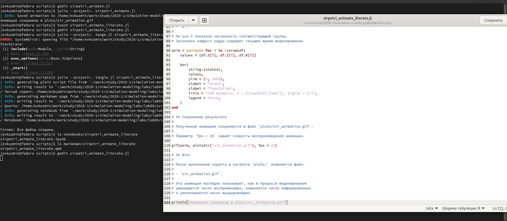{width=88%}

На рисунке показан этап создания literate-версии третьего скрипта.

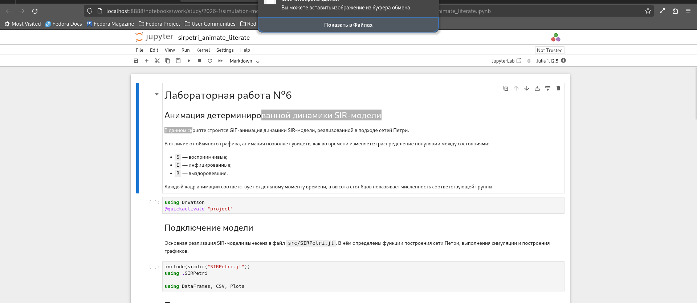{width=88%}

На рисунке показан notebook, сгенерированный из literate-версии третьего скрипта.

Листинг 6.9. Literate-версия третьего скрипта

`scripts/sirpetri_animate_literate.jl`

```julia
# # Лабораторная работа №6
# ## Анимация детерминированной динамики SIR-модели
#
# В данном скрипте строится GIF-анимация динамики SIR-модели,
# реализованной в подходе сетей Петри.
#
# В отличие от обычного графика, анимация позволяет увидеть,
# как во времени изменяется распределение популяции между состояниями:
#
# - `S` — восприимчивые;
# - `I` — инфицированные;
# - `R` — выздоровевшие.
#
# Каждый кадр анимации соответствует отдельному моменту времени,
# а высота столбцов показывает численность соответствующей группы.

using DrWatson
@quickactivate "project"

# ## Подключение модели
#
# Основная реализация SIR-модели вынесена в файл `src/SIRPetri.jl`.
# В нём определены функции построения сети Петри, выполнения симуляции
# и построения графиков.

include(srcdir("SIRPetri.jl"))
using .SIRPetri

using DataFrames, CSV, Plots

# ## Параметры модели
#
# Для построения анимации используются базовые параметры модели:
#
# - `β = 0.3` — коэффициент заражения;
# - `γ = 0.1` — коэффициент выздоровления;
# - `tmax = 100.0` — максимальное время моделирования.
#
# Эти параметры соответствуют базовому сценарию лабораторной работы.

β = 0.3
γ = 0.1
tmax = 100.0

# ## Построение сети Петри
#
# Функция `build_sir_network` создаёт сеть Петри для модели SIR.
#
# В сети используются три позиции:
#
# - `S` — восприимчивые;
# - `I` — инфицированные;
# - `R` — выздоровевшие.
#
# Переход `infection` описывает заражение, а переход `recovery`
# описывает выздоровление.

net, u0, states = build_sir_network(β, γ)

# ## Детерминированная симуляция
#
# Для анимации используется детерминированная симуляция.
# Она даёт плавную динамику изменения численности групп `S`, `I`, `R`
# во времени.
#
# Параметр `saveat = 0.2` задаёт шаг сохранения результата.
# Чем меньше этот шаг, тем больше кадров будет в анимации.

df = simulate_deterministic(
    net,
    u0,
    (0.0, tmax),
    saveat = 0.2,
    rates = [β, γ],
)

# ## Построение анимации
#
# На каждом кадре строится столбчатая диаграмма.
#
# По оси X расположены состояния модели:
#
# - `S`;
# - `I`;
# - `R`.
#
# По оси Y показана численность соответствующей группы.
# Заголовок каждого кадра содержит текущее время моделирования.

anim = @animate for i in 1:nrow(df)
    values = [df.S[i], df.I[i], df.R[i]]

    bar(
        string.(states),
        values,
        ylim = (0, 1000),
        xlabel = "State",
        ylabel = "Population",
        title = "SIR dynamics, t = $(round(df.time[i], digits = 1))",
        legend = false,
    )
end

# ## Сохранение результата
#
# Полученная анимация сохраняется в файл `plots/sir_animation.gif`.
#
# Параметр `fps = 20` задаёт скорость воспроизведения анимации.

gif(anim, plotsdir("sir_animation.gif"), fps = 20)

# ## Итог
#
# После выполнения скрипта в каталоге `plots/` появляется файл:
#
# - `sir_animation.gif`.
#
# Эта анимация наглядно показывает, как в процессе моделирования
# уменьшается число восприимчивых, изменяется число инфицированных
# и увеличивается число выздоровевших.

println("Анимация сохранена в plots/sir_animation.gif")
```

### Параметризованная версия третьего скрипта

Параметризованная версия `sirpetri_animate_params.jl` создаёт несколько GIF-анимаций для разных сценариев: базового сценария, быстрого выздоровления и меньшей интенсивности заражения.

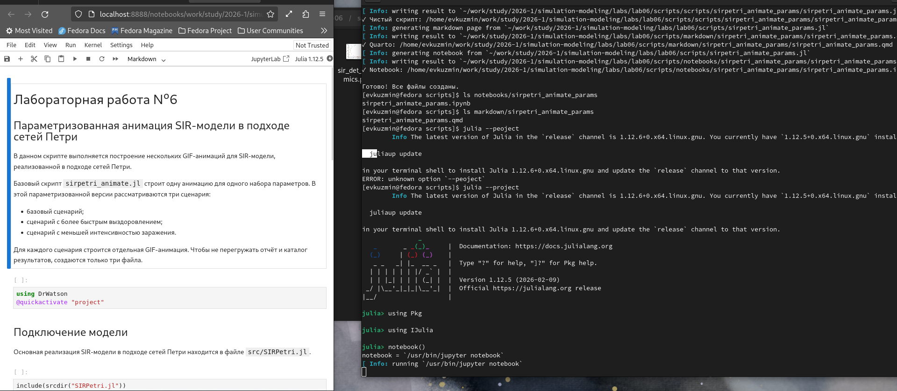{width=88%}

На рисунке показан этап создания параметризованной версии третьего скрипта и её notebook.

{width=88%}

На рисунке показаны результаты выполнения параметризованной версии третьего скрипта.

Листинг 6.10. Параметризованная версия третьего скрипта

`scripts/sirpetri_animate_params.jl`

```julia
# # Лабораторная работа №6
# ## Параметризованная анимация SIR-модели в подходе сетей Петри
#
# В данном скрипте выполняется построение нескольких GIF-анимаций
# для SIR-модели, реализованной в подходе сетей Петри.
#
# Базовый скрипт `sirpetri_animate.jl` строит одну анимацию для одного
# набора параметров. В этой параметризованной версии рассматриваются
# три сценария:
#
# - базовый сценарий;
# - сценарий с более быстрым выздоровлением;
# - сценарий с меньшей интенсивностью заражения.
#
# Для каждого сценария строится отдельная GIF-анимация. Чтобы не
# перегружать отчёт и каталог результатов, создаются только три файла.

using DrWatson
@quickactivate "project"

# ## Подключение модели
#
# Основная реализация SIR-модели в подходе сетей Петри находится
# в файле `src/SIRPetri.jl`.

include(srcdir("SIRPetri.jl"))
using .SIRPetri

using DataFrames, CSV, Plots

# ## Наборы параметров
#
# Для сравнения выбраны три сценария:
#
# 1. базовый вариант из основного скрипта;
# 2. вариант с более быстрым выздоровлением;
# 3. вариант с меньшей интенсивностью заражения.
#
# Такой набор позволяет визуально сравнить, как параметры `β` и `γ`
# влияют на скорость перераспределения популяции между состояниями
# `S`, `I` и `R`.

param_sets = [
    (
        name = "baseline",
        β = 0.3,
        γ = 0.1,
        tmax = 60.0,
        title = "Базовый сценарий",
    ),
    (
        name = "fast_recovery",
        β = 0.3,
        γ = 0.3,
        tmax = 60.0,
        title = "Быстрое выздоровление",
    ),
    (
        name = "lower_infection",
        β = 0.1,
        γ = 0.1,
        tmax = 60.0,
        title = "Меньшая интенсивность заражения",
    ),
]

# ## Сводная таблица
#
# Для каждого сценария дополнительно сохраняется краткая сводка:
#
# - имя сценария;
# - значения параметров `β` и `γ`;
# - максимальное число инфицированных;
# - конечные значения `S`, `I`, `R`;
# - имя созданного GIF-файла.

summary = DataFrame(
    scenario = String[],
    β = Float64[],
    γ = Float64[],
    tmax = Float64[],
    peak_I = Float64[],
    final_S = Float64[],
    final_I = Float64[],
    final_R = Float64[],
    gif_file = String[],
)

println("Запуск параметризованного построения анимаций SIR...")

# ## Основной цикл
#
# Для каждого набора параметров:
#
# 1. строится сеть Петри;
# 2. выполняется детерминированная симуляция;
# 3. создаётся GIF-анимация;
# 4. сохраняется краткая информация о результате.

for params in param_sets
    println("="^60)
    println("Сценарий: ", params.title)
    println("β = $(params.β), γ = $(params.γ), tmax = $(params.tmax)")

    # ### Построение сети Петри

    net, u0, states = build_sir_network(params.β, params.γ)

    # ### Детерминированная симуляция
    #
    # Для анимации используется детерминированный вариант модели,
    # чтобы получить плавную и наглядную динамику.

    df = simulate_deterministic(
        net,
        u0,
        (0.0, params.tmax),
        saveat = 0.2,
        rates = [params.β, params.γ],
    )

    # ### Построение GIF-анимации
    #
    # Каждый кадр показывает текущее распределение популяции между
    # состояниями `S`, `I` и `R`.

    anim = @animate for i in 1:nrow(df)
        values = [df.S[i], df.I[i], df.R[i]]

        bar(
            string.(states),
            values,
            ylim = (0, 1000),
            xlabel = "State",
            ylabel = "Population",
            title = "$(params.title), t = $(round(df.time[i], digits = 1))",
            legend = false,
        )
    end

    gif_path = plotsdir("sir_animation_$(params.name).gif")
    gif(anim, gif_path, fps = 20)

    # ### Сохранение сводной информации

    push!(
        summary,
        (
            params.name,
            Float64(params.β),
            Float64(params.γ),
            Float64(params.tmax),
            Float64(maximum(df.I)),
            Float64(df.S[end]),
            Float64(df.I[end]),
            Float64(df.R[end]),
            gif_path,
        ),
    )

    println("Анимация сохранена в: ", gif_path)
end

# ## Сохранение сводной таблицы
#
# Таблица сохраняется прямо в каталог `data/`.

summary_file = datadir("sir_animation_params_summary.csv")
CSV.write(summary_file, summary)

println("="^60)
println("Параметризованное построение анимаций завершено.")
println("Сводная таблица сохранена в: ", summary_file)

# ## Итог
#
# После выполнения скрипта создаются три GIF-файла:
#
# - `plots/sir_animation_baseline.gif`;
# - `plots/sir_animation_fast_recovery.gif`;
# - `plots/sir_animation_lower_infection.gif`.
#
# Дополнительно создаётся таблица:
#
# - `data/sir_animation_params_summary.csv`.
#
# Эти результаты позволяют визуально сравнить, как изменение параметров
# заражения и выздоровления влияет на ход эпидемического процесса.
```

Базовая анимация показывает стандартную динамику перехода популяции из состояния `S` через состояние `I` в состояние `R`.

При быстром выздоровлении индивиды быстрее переходят в состояние `R`, поэтому фаза активного инфицирования становится короче.

При меньшей интенсивности заражения изменение состояний происходит более плавно и растянуто во времени.

## Итоговый отчётный скрипт

### Обычная версия

Четвёртый скрипт `sirpetri_report.jl` не запускает моделирование заново. Он читает ранее сохранённые CSV-файлы и формирует два итоговых графика: сравнение детерминированной и стохастической динамики и график чувствительности.

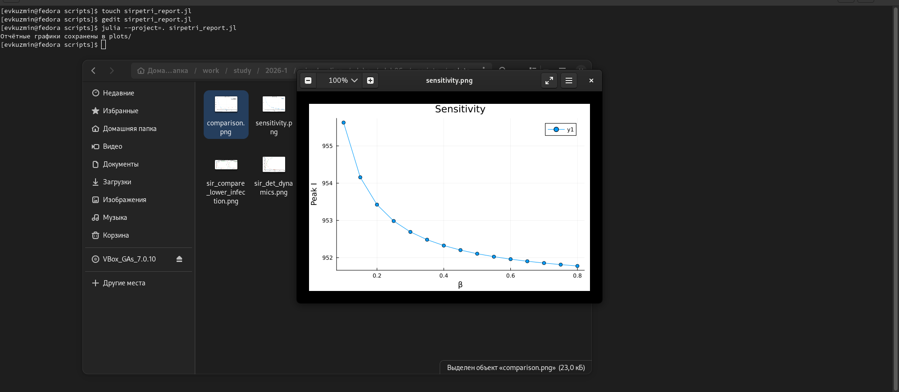{width=88%}

На рисунке показаны выполнение итогового отчётного скрипта и сформированные отчётные графики.

Листинг 6.11. Обычная версия четвёртого скрипта

`scripts/sirpetri_report.jl`

```julia
using DrWatson
@quickactivate "project"

using DataFrames, CSV, Plots

df_det = CSV.read(datadir("sir_det.csv"), DataFrame)
df_stoch = CSV.read(datadir("sir_stoch.csv"), DataFrame)
df_scan = CSV.read(datadir("sir_scan.csv"), DataFrame)

# Сравнение детерминированной и стохастической динамики
p1 = plot(
    df_det.time,
    [df_det.I df_stoch.I[1:length(df_det.time)]],
    label = ["Deterministic I" "Stochastic I"],
    xlabel = "Time",
    ylabel = "Infected",
    title = "Comparison",
)

savefig(plotsdir("comparison.png"))

# Зависимость пика I от β
p2 = plot(
    df_scan.β,
    df_scan.peak_I,
    marker = :circle,
    xlabel = "β",
    ylabel = "Peak I",
    title = "Sensitivity",
)

savefig(plotsdir("sensitivity.png"))

println("Отчётные графики сохранены в plots/")
```

{width=88%}

На рисунке сравнивается динамика числа инфицированных `I` для детерминированной и стохастической моделей. Детерминированная модель даёт сглаженную траекторию, а стохастическая модель отражает случайный сценарий.

{width=88%}

График показывает зависимость максимального числа инфицированных от коэффициента заражения `β`. В выбранном диапазоне параметров модель находится в области выраженного распространения инфекции.

### Literate-версия четвёртого скрипта

Для отчётного скрипта была подготовлена literate-версия `sirpetri_report_literate.jl`.

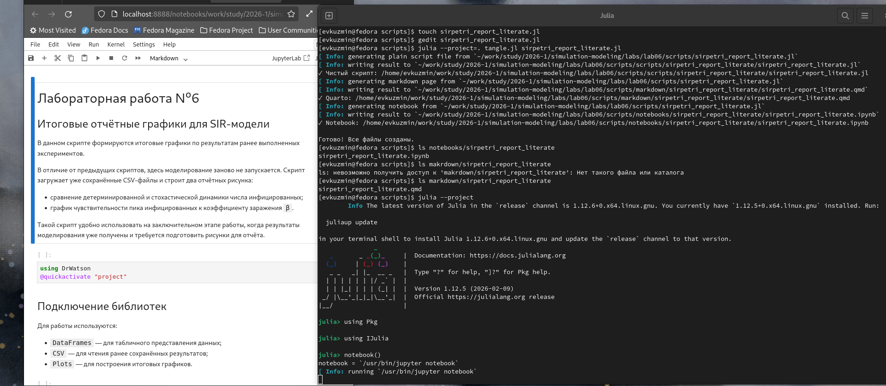{width=88%}

На рисунке показан этап создания literate-версии четвёртого скрипта и notebook.

Листинг 6.12. Literate-версия четвёртого скрипта

`scripts/sirpetri_report_literate.jl`

```julia
# # Лабораторная работа №6
# ## Итоговые отчётные графики для SIR-модели
#
# В данном скрипте формируются итоговые графики по результатам ранее
# выполненных экспериментов.
#
# В отличие от предыдущих скриптов, здесь моделирование заново не запускается.
# Скрипт загружает уже сохранённые CSV-файлы и строит два отчётных рисунка:
#
# - сравнение детерминированной и стохастической динамики числа инфицированных;
# - график чувствительности пика инфицированных к коэффициенту заражения `β`.
#
# Такой скрипт удобно использовать на заключительном этапе работы, когда
# результаты моделирования уже получены и требуется подготовить рисунки
# для отчёта.

using DrWatson
@quickactivate "project"

# ## Подключение библиотек
#
# Для работы используются:
#
# - `DataFrames` — для табличного представления данных;
# - `CSV` — для чтения ранее сохранённых результатов;
# - `Plots` — для построения итоговых графиков.

using DataFrames, CSV, Plots

# ## Загрузка результатов моделирования
#
# На этом этапе загружаются три таблицы:
#
# - `sir_det.csv` — результат детерминированной симуляции;
# - `sir_stoch.csv` — результат стохастической симуляции;
# - `sir_scan.csv` — результат сканирования коэффициента заражения `β`.
#
# Эти файлы были сформированы предыдущими скриптами лабораторной работы.

df_det = CSV.read(datadir("sir_det.csv"), DataFrame)
df_stoch = CSV.read(datadir("sir_stoch.csv"), DataFrame)
df_scan = CSV.read(datadir("sir_scan.csv"), DataFrame)

# ## Сравнение детерминированной и стохастической динамики
#
# Первый итоговый график сравнивает изменение числа инфицированных `I`
# в детерминированной и стохастической версиях модели.
#
# Детерминированная модель даёт гладкую траекторию, так как она основана
# на системе обыкновенных дифференциальных уравнений.
#
# Стохастическая модель отражает один возможный случайный сценарий
# развития эпидемического процесса.
#
# Для построения графика используется одинаковая длина рядов, поэтому
# стохастическая траектория берётся до длины временного ряда
# детерминированной модели.

p1 = plot(
    df_det.time,
    [df_det.I df_stoch.I[1:length(df_det.time)]],
    label = ["Deterministic I" "Stochastic I"],
    xlabel = "Time",
    ylabel = "Infected",
    title = "Comparison",
)

savefig(plotsdir("comparison.png"))

# ## Зависимость пика инфицированных от β
#
# Второй итоговый график строится по результатам сканирования параметра `β`.
#
# Для каждого значения коэффициента заражения ранее была выполнена
# детерминированная симуляция, после чего было найдено максимальное число
# инфицированных `peak_I`.
#
# График показывает, как изменение скорости заражения влияет на пик
# эпидемического процесса.

p2 = plot(
    df_scan.β,
    df_scan.peak_I,
    marker = :circle,
    xlabel = "β",
    ylabel = "Peak I",
    title = "Sensitivity",
)

savefig(plotsdir("sensitivity.png"))

# ## Итог
#
# После выполнения скрипта в каталоге `plots/` появляются два файла:
#
# - `comparison.png`;
# - `sensitivity.png`.
#
# Первый рисунок используется для сравнения детерминированного и
# стохастического подходов, второй — для анализа чувствительности модели
# к изменению коэффициента заражения.

println("Отчётные графики сохранены в plots/")
```

### Параметризованная версия четвёртого скрипта

Параметризованная версия `sirpetri_report_params.jl` создаёт четыре итоговых рисунка двух типов: два графика сравнения детерминированной и стохастической динамики и два графика чувствительности.

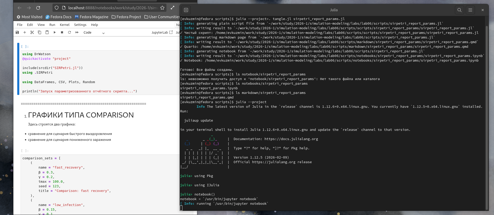{width=88%}

На рисунке показано создание параметризованной версии четвёртого скрипта и notebook.

{width=88%}

На рисунке показаны результаты параметризованной версии четвёртого отчётного скрипта.

Листинг 6.13. Параметризованная версия четвёртого скрипта

`scripts/sirpetri_report_params.jl`

```julia
using DrWatson
@quickactivate "project"

include(srcdir("SIRPetri.jl"))
using .SIRPetri

using DataFrames, CSV, Plots, Random

println("Запуск параметризованного отчётного скрипта...")

# ============================================================
# 1. ГРАФИКИ ТИПА COMPARISON
# ============================================================
# Здесь строятся два графика:
# - сравнение для сценария быстрого выздоровления
# - сравнение для сценария пониженного заражения

comparison_sets = [
    (
        name = "fast_recovery",
        β = 0.3,
        γ = 0.2,
        tmax = 100.0,
        seed = 123,
        title = "Comparison: fast recovery",
    ),
    (
        name = "low_infection",
        β = 0.15,
        γ = 0.1,
        tmax = 100.0,
        seed = 124,
        title = "Comparison: low infection",
    ),
]

comparison_summary = DataFrame(
    scenario = String[],
    β = Float64[],
    γ = Float64[],
    peak_I_det = Float64[],
    peak_I_stoch = Float64[],
    final_R_det = Float64[],
    final_R_stoch = Float64[],
)

for params in comparison_sets
    net, u0, _ = build_sir_network(params.β, params.γ)

    df_det = simulate_deterministic(
        net,
        u0,
        (0.0, params.tmax),
        saveat = 0.5,
        rates = [params.β, params.γ],
    )

    Random.seed!(params.seed)
    df_stoch = simulate_stochastic(
        net,
        u0,
        (0.0, params.tmax),
        rates = [params.β, params.γ],
    )

    p = plot(
        df_det.time,
        df_det.I,
        label = "Deterministic I",
        xlabel = "Time",
        ylabel = "Infected",
        title = params.title,
        linewidth = 2,
    )

    plot!(
        p,
        df_stoch.time,
        df_stoch.I,
        label = "Stochastic I",
        linewidth = 2,
    )

    savefig(plotsdir("comparison_$(params.name).png"))

    push!(
        comparison_summary,
        (
            params.name,
            params.β,
            params.γ,
            maximum(df_det.I),
            maximum(df_stoch.I),
            df_det.R[end],
            df_stoch.R[end],
        ),
    )
end

CSV.write(datadir("comparison_summary.csv"), comparison_summary)

# ============================================================
# 2. ГРАФИКИ ТИПА SENSITIVITY
# ============================================================
# Здесь строятся два графика чувствительности:
# - при медленном выздоровлении γ = 0.05
# - при быстром выздоровлении γ = 0.2

β_range = 0.1:0.05:0.8

sensitivity_sets = [
    (
        name = "gamma_low",
        γ = 0.05,
        tmax = 100.0,
        title = "Sensitivity: gamma = 0.05",
    ),
    (
        name = "gamma_high",
        γ = 0.2,
        tmax = 100.0,
        title = "Sensitivity: gamma = 0.2",
    ),
]

sensitivity_summary = DataFrame(
    case_name = String[],
    β = Float64[],
    γ = Float64[],
    peak_I = Float64[],
    final_R = Float64[],
)

for params in sensitivity_sets
    results = []

    for β in β_range
        net, u0, _ = build_sir_network(β, params.γ)

        df = simulate_deterministic(
            net,
            u0,
            (0.0, params.tmax),
            saveat = 0.5,
            rates = [β, params.γ],
        )

        peak_I = maximum(df.I)
        final_R = df.R[end]

        push!(results, (β = β, peak_I = peak_I, final_R = final_R))
        push!(sensitivity_summary, (params.name, β, params.γ, peak_I, final_R))
    end

    df_scan = DataFrame(results)

    p = plot(
        df_scan.β,
        df_scan.peak_I,
        marker = :circle,
        xlabel = "β",
        ylabel = "Peak I",
        title = params.title,
        label = "Peak I",
    )

    savefig(plotsdir("sensitivity_$(params.name).png"))
end

CSV.write(datadir("sensitivity_summary.csv"), sensitivity_summary)

println("Отчётные параметризованные графики сохранены в plots/")
println("Созданы файлы:")
println(" - plots/comparison_fast_recovery.png")
println(" - plots/comparison_low_infection.png")
println(" - plots/sensitivity_gamma_low.png")
println(" - plots/sensitivity_gamma_high.png")
println("Также сохранены таблицы:")
println(" - data/comparison_summary.csv")
println(" - data/sensitivity_summary.csv")
```

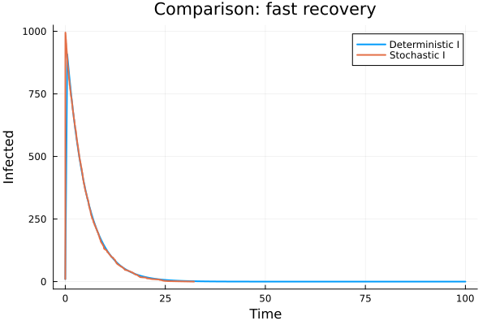{width=88%}

На графике показано сравнение детерминированной и стохастической динамики числа инфицированных при быстром выздоровлении. Ускоренное выздоровление сокращает активную фазу эпидемии.

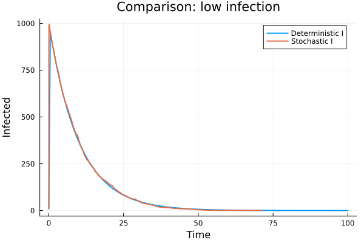{width=88%}

При меньшей интенсивности заражения эпидемический процесс развивается более плавно. Стохастическая траектория может отличаться от детерминированной из-за случайного характера событий.

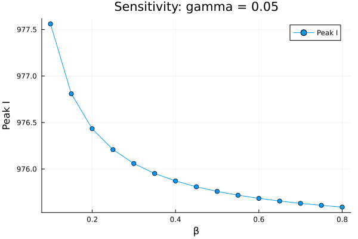{width=88%}

При медленном выздоровлении инфицированные дольше остаются в состоянии `I`, поэтому пик инфицированных выше.

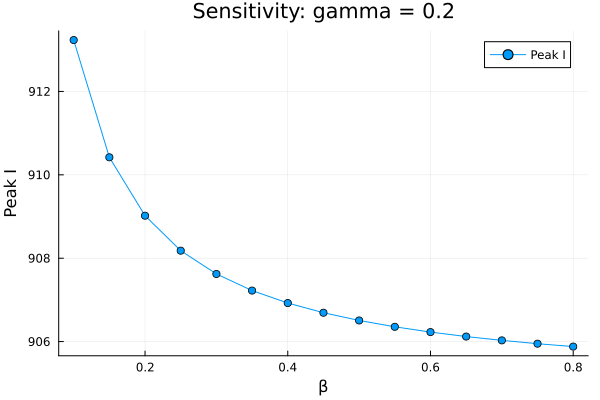{width=88%}

При более быстром выздоровлении пик инфицированных ниже, поскольку индивиды быстрее выходят из состояния инфицирования.

# Сводный анализ результатов

В ходе работы была реализована модель SIR в подходе сетей Петри. В базовом сценарии почти вся популяция переходит из состояния восприимчивых через состояние инфицированных в состояние выздоровевших. Детерминированная модель даёт гладкую усреднённую динамику, а стохастическая модель показывает один возможный случайный сценарий.

Сканирование параметра `β` показало, что в выбранном диапазоне модель находится в области выраженного распространения инфекции. Почти вся популяция в большинстве запусков переходит в состояние `R`.

Параметризованные версии показали, что коэффициенты `β` и `γ` влияют на форму и длительность эпидемического процесса. Уменьшение `β` замедляет распространение инфекции, а увеличение `γ` сокращает время пребывания индивидов в состоянии `I` и снижает пик инфицированных.

# Итоговые выводы

В результате лабораторной работы:

- реализован исходный модуль `SIRPetri.jl`;
- выполнен базовый прогон SIR-модели;
- построены детерминированная и стохастическая траектории;
- проведено сканирование параметра `β`;
- построена GIF-анимация динамики состояний;
- сформированы итоговые отчётные графики;
- подготовлены literate-версии всех основных скриптов;
- подготовлены параметризованные версии всех основных скриптов;
- сгенерированы notebook-файлы и Quarto-документация;
- результаты интегрированы в итоговый отчёт.

Работа показала, что аппарат сетей Петри можно использовать не только для описания дискретных процессов, но и для построения моделей, связанных с распространением инфекции. Такой подход позволяет объединять структурное описание модели, детерминированную динамику, стохастические события и параметрический анализ.

# Список литературы

::: {#refs}
:::

 
