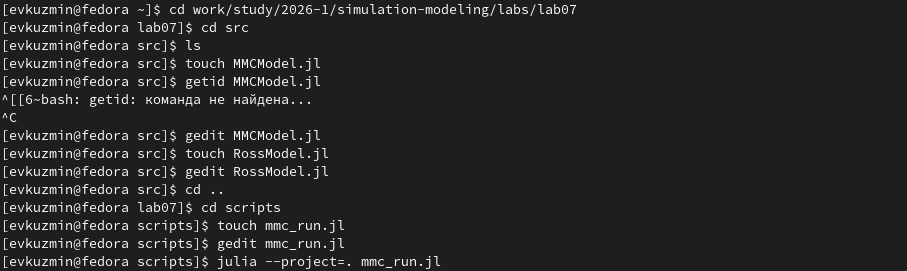
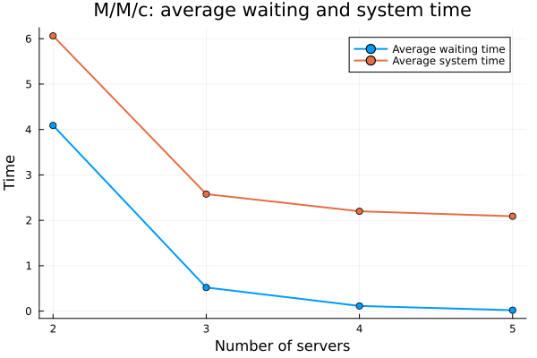
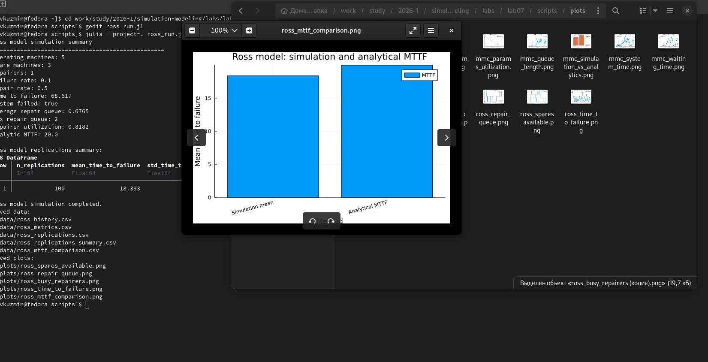
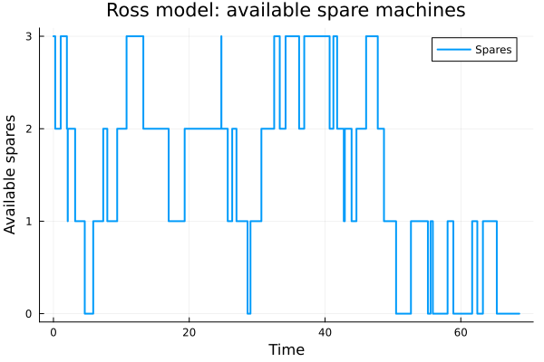
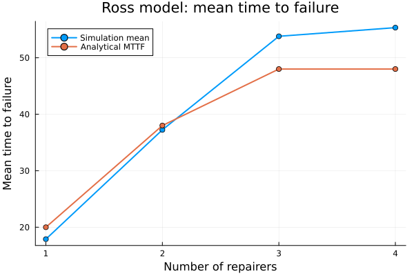
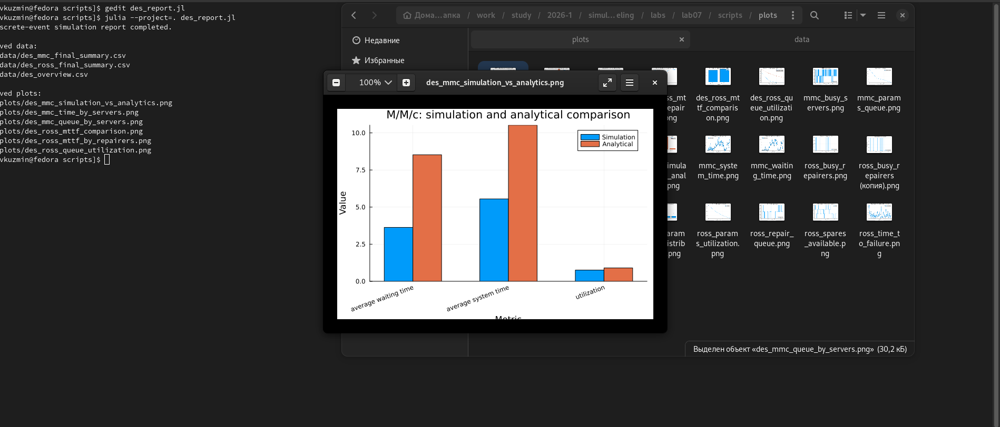

---
## Author
author:
  name: Кузьмин Егор Витальевич
  email: 1132236046@rudn.ru
  affiliation:
    - name: Российский университет дружбы народов
      country: Российская Федерация
      postal-code: 117198
      city: Москва
      address: ул. Миклухо-Маклая, д. 6

## Title
title: Презентация по лабораторной работе №7
date: today
---

## Цель работы

Цель работы — реализовать и исследовать дискретно-событийные модели на языке Julia.

В работе рассмотрены две модели:

- система массового обслуживания M/M/c;
- модель Росса для анализа надёжности системы с резервом и ремонтом.

Основное внимание уделено не только базовому запуску моделей, но и параметризованным экспериментам.

## Используемый подход

В работе была использована структура проекта DrWatson.

Основная логика моделей вынесена в исходные файлы:

- `src/MMCModel.jl` — модель M/M/c;
- `src/RossModel.jl` — модель Росса.

Для каждой модели были подготовлены обычные скрипты, literate-версии, notebook-файлы и параметризованные эксперименты.

## Модель M/M/c

Модель M/M/c описывает систему массового обслуживания с несколькими параллельными каналами.

В модели:

- заявки поступают случайным образом;
- время обслуживания также случайно;
- если все серверы заняты, заявка ожидает в очереди;
- анализируются очередь, время ожидания, время пребывания в системе и загрузка серверов.

## Базовый запуск M/M/c

{width=86%}

## Результаты M/M/c

При базовых параметрах система работает с высокой загрузкой.

Среднее время ожидания и время пребывания в системе заметно возрастают в периоды накопления очереди.

{width=82%}

## Очередь и ожидание в M/M/c

Графики показывают, что очередь возникает не постоянно, а отдельными волнами.

Это связано со случайным характером поступления заявок: иногда входящий поток временно превышает возможности обслуживания.

{width=82%}

## Параметризованный эксперимент M/M/c

В параметризованной версии изменялось число серверов:

`c = 2, 3, 4, 5`.

Остальные параметры оставались фиксированными. Эксперимент показывает, как добавление каналов обслуживания влияет на очередь и время ожидания.

{width=86%}

## Влияние числа серверов

Увеличение числа серверов резко снижает среднее время ожидания и максимальную длину очереди.

Наиболее заметный эффект наблюдается при переходе от двух серверов к трём.

{width=78%}

## Модель Росса

Модель Росса используется для анализа надёжности системы с работающими машинами, резервом и ремонтом.

В модели:

- работающая машина может выйти из строя;
- отказавшая машина заменяется резервной;
- сломанная машина отправляется в ремонт;
- если резерва не осталось, система отказывает.

## Базовый запуск модели Росса

{width=86%}

## Доступный резерв и очередь на ремонт

Число резервных машин изменяется скачками: уменьшается при отказах и увеличивается после завершения ремонта.

Очередь на ремонт возникает, если ремонтник занят и новая сломанная машина не может сразу попасть в ремонт.

{width=78%}

## Время до отказа

Время до отказа имеет заметный разброс по независимым повторам.

Это ожидаемо, потому что моменты отказов и ремонтов задаются случайными величинами.

{width=78%}

## Параметризованный эксперимент модели Росса

В параметризованной версии изменялось число ремонтников:

`num_repairers = 1, 2, 3, 4`.

Эксперимент показывает, как ремонтный ресурс влияет на среднее время до отказа, очередь на ремонт и загрузку ремонтников.

{width=86%}

## Влияние числа ремонтников

Увеличение числа ремонтников повышает среднее время до отказа и резко уменьшает очередь на ремонт.

При этом средняя загрузка одного ремонтника снижается, потому что ремонтная нагрузка распределяется между большим количеством ресурсов.

{width=78%}

## Итоговый отчётный скрипт

Итоговый скрипт `des_report.jl` не запускает модели заново.

Он читает сохранённые CSV-файлы, формирует сводные таблицы и строит итоговые графики для сравнения результатов двух моделей.

{width=86%}

## Сравнение моделей

Для M/M/c добавление серверов уменьшает очередь и время ожидания.

Для модели Росса добавление ремонтников увеличивает среднее время до отказа и уменьшает очередь на ремонт.

{width=78%}

## Основные выводы

В ходе работы были реализованы две дискретно-событийные модели и проведены параметризованные эксперименты.

Для M/M/c подтверждено, что увеличение числа серверов снижает очередь и время ожидания.

Для модели Росса показано, что увеличение числа ремонтников повышает надёжность системы и уменьшает очередь на ремонт.

В обеих моделях наблюдается эффект насыщения: после добавления достаточного количества ресурсов дальнейшее улучшение становится менее выраженным.
