# Цель работы

Целью лабораторной работы является изучение методов дискретно-событийного моделирования и их практическая реализация на языке Julia. В работе рассматриваются две модели: система массового обслуживания M/M/c и модель Росса для анализа надёжности системы с резервом и ремонтом.

В ходе работы необходимо реализовать исходные модули моделей, выполнить базовые и параметризованные эксперименты, сохранить результаты в виде таблиц, построить графики, подготовить literate-версии скриптов, сформировать notebook-файлы и итоговый отчётный анализ.

# Постановка задачи

В рамках лабораторной работы требуется:

1. подготовить рабочий каталог проекта и установить необходимые пакеты Julia;
2. реализовать source-модуль модели M/M/c;
3. реализовать source-модуль модели Росса;
4. выполнить базовый запуск модели M/M/c;
5. подготовить literate- и параметризованную версии скрипта для M/M/c;
6. выполнить базовый запуск модели Росса;
7. подготовить literate- и параметризованную версии скрипта для модели Росса;
8. подготовить итоговый отчётный скрипт, который объединяет результаты двух моделей;
9. подготовить literate- и параметризованную версии итогового отчётного скрипта;
10. сохранить результаты моделирования в формате CSV;
11. построить графики и включить их в отчёт;
12. сформулировать выводы по каждой модели и по работе в целом.

# Теоретические сведения

Дискретно-событийное моделирование применяется для систем, состояние которых меняется не непрерывно, а в отдельные моменты времени при наступлении событий. Такими событиями могут быть поступление заявки, начало обслуживания, завершение обслуживания, отказ оборудования, начало ремонта или завершение ремонта.

В отличие от непрерывных динамических моделей, дискретно-событийные модели описывают последовательность событий во времени. Такой подход удобен для анализа очередей, технических систем, процессов обслуживания, систем с ограниченными ресурсами и систем надёжности.

В лабораторной работе используются две модели.

Первая модель — M/M/c. Она описывает систему массового обслуживания, в которую поступают заявки. Заявки обслуживаются несколькими параллельными каналами. Если все каналы заняты, заявка ожидает в очереди. В обозначении M/M/c первая буква `M` означает пуассоновский входящий поток, вторая `M` — экспоненциальное распределение времени обслуживания, а `c` — число обслуживающих каналов.

Вторая модель — модель Росса. Она описывает систему с работающими машинами, резервными машинами и ремонтниками. Если работающая машина выходит из строя, она заменяется резервной машиной, а сломанная машина отправляется в ремонт. Если свободного ремонтника нет, машина становится в очередь на ремонт. Если резервных машин не остаётся, следующий отказ приводит к отказу всей системы.

# Структура проекта

В работе использовалась проектная структура DrWatson. Основная вычислительная логика была вынесена в каталог `src`, а скрипты запуска и анализа — в каталог `scripts`.

Основные source-файлы:

```text
src/MMCModel.jl
src/RossModel.jl
```

Основные скрипты:

```text
scripts/mmc_run.jl
scripts/mmc_run_literate.jl
scripts/mmc_run_params.jl
scripts/ross_run.jl
scripts/ross_run_literate.jl
scripts/ross_run_params.jl
scripts/des_report.jl
scripts/des_report_literate.jl
scripts/des_report_params.jl
```

Результаты сохранялись в каталоги:

```text
data/
plots/
report/image/
```

# Ход выполнения работы

## Базовая реализация и запуск модели M/M/c

На первом этапе была подготовлена базовая реализация модели M/M/c. Основная логика вынесена в source-модуль `MMCModel.jl`, а запуск эксперимента выполнен через скрипт `mmc_run.jl`.

В базовом эксперименте использовались следующие параметры:

```text
num_customers = 200
num_servers = 2
lambda = 0.9
mu = 0.5
seed = 123
```

Скрипт выполняет имитационное моделирование, рассчитывает показатели системы, сохраняет CSV-файлы и строит графики очереди, занятости серверов, времени ожидания, времени пребывания в системе и сравнения с аналитическими значениями.

{width=88%}

На изображении показан успешный запуск базового эксперимента M/M/c. По выводу в терминале видно, что скрипт завершился корректно, а таблицы и графики были сохранены в каталоги `data` и `plots`.

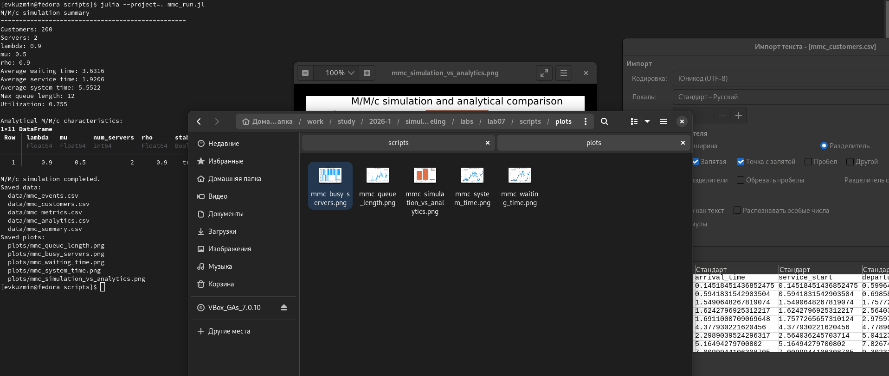{width=88%}

На изображении приведены результаты базового эксперимента. Были получены основные характеристики системы: среднее время ожидания, среднее время обслуживания, среднее время пребывания заявки в системе, максимальная длина очереди и загрузка каналов обслуживания.

### Листинг 1. Source-модуль модели M/M/c

```julia
module MMCModel

using ConcurrentSim
using ResumableFunctions
using Distributions
using StableRNGs
using DataFrames
using Statistics

export MMCParameters
export run_mmc_simulation
export mmc_analytics
export print_mmc_summary

"""
    MMCParameters

Структура параметров модели M/M/c.

Поля:
- `num_customers` — количество заявок, которые будут сгенерированы;
- `num_servers` — число параллельных каналов обслуживания;
- `lambda` — интенсивность входящего потока заявок;
- `mu` — интенсивность обслуживания одним каналом;
- `seed` — зерно генератора случайных чисел.
"""
struct MMCParameters
    num_customers::Int
    num_servers::Int
    lambda::Float64
    mu::Float64
    seed::Int
end

"""
    MMCParameters(; num_customers=100, num_servers=2, lambda=0.9, mu=0.5, seed=123)

Конструктор параметров модели M/M/c со значениями по умолчанию.

Параметры по умолчанию близки к примеру из методички:
- `num_servers = 2`;
- `lambda = 0.9`;
- `mu = 0.5`.
"""
function MMCParameters(;
    num_customers = 100,
    num_servers = 2,
    lambda = 0.9,
    mu = 0.5,
    seed = 123,
)
    return MMCParameters(
        Int(num_customers),
        Int(num_servers),
        Float64(lambda),
        Float64(mu),
        Int(seed),
    )
end

"""
    MMCState

Внутренняя структура состояния симуляции.

Она нужна, чтобы собирать события и метрики во время работы модели.
"""
mutable struct MMCState
    events::Vector{NamedTuple}
    customers::Vector{NamedTuple}
    queue_length::Int
    busy_servers::Int
end

"""
    MMCState()

Создаёт пустое состояние симуляции.
"""
function MMCState()
    return MMCState(
        NamedTuple[],
        NamedTuple[],
        0,
        0,
    )
end

"""
    record_event!(state, customer_id, event, time; ...)

Добавляет событие в журнал событий модели.

События:
- `arrival` — заявка прибыла в систему;
- `service_start` — заявка начала обслуживание;
- `departure` — заявка завершила обслуживание.
"""
function record_event!(
    state::MMCState,
    customer_id::Int,
    event::String,
    time::Float64;
    queue_length = state.queue_length,
    busy_servers = state.busy_servers,
    waiting_time = NaN,
    service_time = NaN,
    system_time = NaN,
)
    push!(
        state.events,
        (
            customer_id = customer_id,
            event = event,
            time = time,
            queue_length = Int(queue_length),
            busy_servers = Int(busy_servers),
            waiting_time = Float64(waiting_time),
            service_time = Float64(service_time),
            system_time = Float64(system_time),
        ),
    )

    return nothing
end

"""
    customer_process(env, server, id, arrival_time, service_dist, rng, params, state)

Процесс одной заявки в модели M/M/c.

Логика процесса:
1. заявка появляется в момент `arrival_time`;
2. если все каналы заняты, заявка попадает в очередь;
3. заявка запрашивает свободный канал обслуживания;
4. после получения канала начинается обслуживание;
5. после завершения обслуживания канал освобождается.
"""
@resumable function customer_process(
    env,
    server,
    id::Int,
    arrival_time::Float64,
    service_dist,
    rng,
    params::MMCParameters,
    state::MMCState,
)
    # Заявка появляется в системе в заранее рассчитанный момент времени.
    @yield timeout(env, arrival_time)

    arrival_moment = now(env)

    # Если все серверы заняты, заявка будет ожидать в очереди.
    if state.busy_servers >= params.num_servers
        state.queue_length += 1
    end

    record_event!(
        state,
        id,
        "arrival",
        arrival_moment,
    )

    # Запрос свободного канала обслуживания.
    @yield request(server)

    service_start = now(env)
    waiting_time = service_start - arrival_moment

    # Если заявка реально ожидала, уменьшаем длину очереди.
    if waiting_time > 1.0e-9 && state.queue_length > 0
        state.queue_length -= 1
    end

    state.busy_servers += 1

    service_time = rand(rng, service_dist)

    record_event!(
        state,
        id,
        "service_start",
        service_start;
        waiting_time = waiting_time,
        service_time = service_time,
    )

    # Обслуживание заявки.
    @yield timeout(env, service_time)

    departure_time = now(env)
    system_time = departure_time - arrival_moment

    state.busy_servers -= 1

    record_event!(
        state,
        id,
        "departure",
        departure_time;
        waiting_time = waiting_time,
        service_time = service_time,
        system_time = system_time,
    )

    push!(
        state.customers,
        (
            customer_id = id,
            arrival_time = arrival_moment,
            service_start = service_start,
            departure_time = departure_time,
            waiting_time = waiting_time,
            service_time = service_time,
            system_time = system_time,
        ),
    )

    # Освобождение канала обслуживания.
    @yield unlock(server)

    return nothing
end

"""
    run_mmc_simulation(params)

Запускает дискретно-событийную симуляцию M/M/c.

Возвращает именованный кортеж:
- `events` — журнал событий;
- `customers` — таблица заявок;
- `metrics` — сводные показатели;
- `params` — использованные параметры.
"""
function run_mmc_simulation(params::MMCParameters)
    rng = StableRNG(params.seed)

    # Интервалы между поступлениями заявок имеют экспоненциальное распределение.
    arrival_dist = Exponential(1.0 / params.lambda)

    # Время обслуживания также имеет экспоненциальное распределение.
    service_dist = Exponential(1.0 / params.mu)

    sim = Simulation()
    server = Resource(sim, params.num_servers)

    state = MMCState()

    arrival_time = 0.0

    # Создаём процессы заявок.
    for id in 1:params.num_customers
        arrival_time += rand(rng, arrival_dist)

        @process customer_process(
            sim,
            server,
            id,
            arrival_time,
            service_dist,
            rng,
            params,
            state,
        )
    end

    # Запускаем симуляцию до завершения всех событий.
    run(sim)

    events_df = DataFrame(state.events)
    customers_df = DataFrame(state.customers)

    metrics_df = build_mmc_metrics(params, events_df, customers_df)

    return (
        events = events_df,
        customers = customers_df,
        metrics = metrics_df,
        params = params,
    )
end

"""
    run_mmc_simulation(; kwargs...)

Удобный вариант запуска симуляции без явного создания `MMCParameters`.
"""
function run_mmc_simulation(; kwargs...)
    params = MMCParameters(; kwargs...)
    return run_mmc_simulation(params)
end

"""
    build_mmc_metrics(params, events_df, customers_df)

Вычисляет основные показатели работы системы M/M/c.
"""
function build_mmc_metrics(
    params::MMCParameters,
    events_df::DataFrame,
    customers_df::DataFrame,
)
    if nrow(customers_df) == 0
        return DataFrame()
    end

    last_time = maximum(customers_df.departure_time)

    avg_waiting_time = mean(customers_df.waiting_time)
    avg_service_time = mean(customers_df.service_time)
    avg_system_time = mean(customers_df.system_time)

    max_waiting_time = maximum(customers_df.waiting_time)
    max_queue_length = maximum(events_df.queue_length)
    max_busy_servers = maximum(events_df.busy_servers)

    # Оценка загрузки каналов:
    # суммарное время обслуживания / (число каналов * время наблюдения).
    utilization = sum(customers_df.service_time) /
                  (params.num_servers * last_time)

    metrics = DataFrame(
        num_customers = [params.num_customers],
        num_servers = [params.num_servers],
        lambda = [params.lambda],
        mu = [params.mu],
        rho = [params.lambda / (params.num_servers * params.mu)],
        simulation_time = [last_time],
        avg_waiting_time = [avg_waiting_time],
        avg_service_time = [avg_service_time],
        avg_system_time = [avg_system_time],
        max_waiting_time = [max_waiting_time],
        max_queue_length = [max_queue_length],
        max_busy_servers = [max_busy_servers],
        utilization = [utilization],
    )

    return metrics
end

"""
    mmc_analytics(params)

Вычисляет аналитические характеристики M/M/c для стационарного режима.

Используются стандартные формулы для M/M/c:
- загрузка `rho`;
- вероятность ожидания `P_wait`;
- среднее число заявок в очереди `Lq`;
- среднее время ожидания `Wq`;
- среднее время пребывания в системе `W`;
- среднее число заявок в системе `L`.

Если `rho >= 1`, стационарный режим не существует.
"""
function mmc_analytics(params::MMCParameters)
    λ = params.lambda
    μ = params.mu
    c = params.num_servers

    ρ = λ / (c * μ)

    if ρ >= 1.0
        return DataFrame(
            lambda = [λ],
            mu = [μ],
            num_servers = [c],
            rho = [ρ],
            stable = [false],
            P0 = [NaN],
            P_wait = [NaN],
            Lq = [NaN],
            Wq = [NaN],
            W = [NaN],
            L = [NaN],
        )
    end

    a = λ / μ

    first_sum = sum((a^n) / factorial(n) for n in 0:(c - 1))
    second_part = (a^c) / (factorial(c) * (1.0 - ρ))

    P0 = 1.0 / (first_sum + second_part)
    P_wait = second_part * P0

    Lq = (ρ / (1.0 - ρ)) * P_wait
    Wq = Lq / λ
    W = Wq + 1.0 / μ
    L = λ * W

    return DataFrame(
        lambda = [λ],
        mu = [μ],
        num_servers = [c],
        rho = [ρ],
        stable = [true],
        P0 = [P0],
        P_wait = [P_wait],
        Lq = [Lq],
        Wq = [Wq],
        W = [W],
        L = [L],
    )
end

"""
    print_mmc_summary(result)

Печатает краткую сводку по результатам симуляции.
"""
function print_mmc_summary(result)
    metrics = result.metrics

    if nrow(metrics) == 0
        println("Нет данных для вывода.")
        return nothing
    end

    println("M/M/c simulation summary")
    println("="^50)
    println("Customers: ", metrics.num_customers[1])
    println("Servers: ", metrics.num_servers[1])
    println("lambda: ", metrics.lambda[1])
    println("mu: ", metrics.mu[1])
    println("rho: ", round(metrics.rho[1], digits = 4))
    println("Average waiting time: ", round(metrics.avg_waiting_time[1], digits = 4))
    println("Average service time: ", round(metrics.avg_service_time[1], digits = 4))
    println("Average system time: ", round(metrics.avg_system_time[1], digits = 4))
    println("Max queue length: ", metrics.max_queue_length[1])
    println("Utilization: ", round(metrics.utilization[1], digits = 4))

    return nothing
end

end # module
```

### Листинг 2. Базовый скрипт модели M/M/c

```julia
using DrWatson
@quickactivate "project"

include(srcdir("MMCModel.jl"))
using .MMCModel

using DataFrames
using CSV
using Plots

# Параметры модели M/M/c
params = MMCParameters(
    num_customers = 200,
    num_servers = 2,
    lambda = 0.9,
    mu = 0.5,
    seed = 123,
)

# Запуск симуляции
result = run_mmc_simulation(params)

# Печать краткой сводки
print_mmc_summary(result)

# Аналитические характеристики M/M/c
analytics = mmc_analytics(params)

println()
println("Analytical M/M/c characteristics:")
println(analytics)

# Сохранение таблиц
CSV.write(datadir("mmc_events.csv"), result.events)
CSV.write(datadir("mmc_customers.csv"), result.customers)
CSV.write(datadir("mmc_metrics.csv"), result.metrics)
CSV.write(datadir("mmc_analytics.csv"), analytics)

# Сравнительная таблица имитационных и аналитических значений
summary = DataFrame(
    metric = [
        "average waiting time",
        "average system time",
        "utilization",
    ],
    simulation = [
        result.metrics.avg_waiting_time[1],
        result.metrics.avg_system_time[1],
        result.metrics.utilization[1],
    ],
    analytical = [
        analytics.Wq[1],
        analytics.W[1],
        analytics.rho[1],
    ],
)

CSV.write(datadir("mmc_summary.csv"), summary)

# График длины очереди во времени
p_queue = plot(
    result.events.time,
    result.events.queue_length,
    seriestype = :steppost,
    xlabel = "Time",
    ylabel = "Queue length",
    title = "M/M/c queue length",
    label = "Queue",
    linewidth = 2,
)

savefig(p_queue, plotsdir("mmc_queue_length.png"))

# График числа занятых каналов обслуживания
p_busy = plot(
    result.events.time,
    result.events.busy_servers,
    seriestype = :steppost,
    xlabel = "Time",
    ylabel = "Busy servers",
    title = "M/M/c busy servers",
    label = "Busy servers",
    linewidth = 2,
)

savefig(p_busy, plotsdir("mmc_busy_servers.png"))

# График времени ожидания заявок
p_wait = plot(
    result.customers.customer_id,
    result.customers.waiting_time,
    xlabel = "Customer ID",
    ylabel = "Waiting time",
    title = "M/M/c waiting time by customer",
    label = "Waiting time",
    marker = :circle,
    linewidth = 2,
)

savefig(p_wait, plotsdir("mmc_waiting_time.png"))

# График времени пребывания заявок в системе
p_system = plot(
    result.customers.customer_id,
    result.customers.system_time,
    xlabel = "Customer ID",
    ylabel = "System time",
    title = "M/M/c system time by customer",
    label = "System time",
    marker = :circle,
    linewidth = 2,
)

savefig(p_system, plotsdir("mmc_system_time.png"))

# Сравнение имитационных и аналитических значений
p_compare = bar(
    summary.metric,
    [summary.simulation summary.analytical],
    label = ["Simulation" "Analytical"],
    xlabel = "Metric",
    ylabel = "Value",
    title = "M/M/c simulation and analytical comparison",
    xrotation = 20,
)

savefig(p_compare, plotsdir("mmc_simulation_vs_analytics.png"))

println()
println("M/M/c simulation completed.")
println("Saved data:")
println("  data/mmc_events.csv")
println("  data/mmc_customers.csv")
println("  data/mmc_metrics.csv")
println("  data/mmc_analytics.csv")
println("  data/mmc_summary.csv")
println("Saved plots:")
println("  plots/mmc_queue_length.png")
println("  plots/mmc_busy_servers.png")
println("  plots/mmc_waiting_time.png")
println("  plots/mmc_system_time.png")
println("  plots/mmc_simulation_vs_analytics.png")
```

## Документированная версия запуска M/M/c

После базового запуска была подготовлена literate-версия для модели M/M/c. В ней код сопровождается поясняющими блоками, поэтому такой файл можно использовать и как исполняемый скрипт, и как основу для notebook-версии и Quarto-документации.

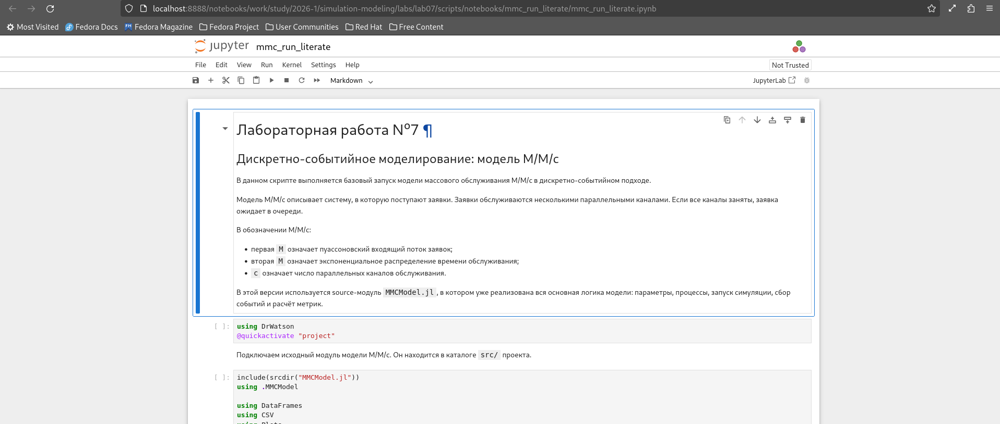{width=88%}

На изображении показан notebook, сформированный из literate-версии. Такой формат удобен для проверки кода и последовательного просмотра пояснений к эксперименту.

### Листинг 3. Literate-версия запуска M/M/c

```julia
# # Лабораторная работа №7
# ## Дискретно-событийное моделирование: модель M/M/c
#
# В данном скрипте выполняется базовый запуск модели массового обслуживания
# M/M/c в дискретно-событийном подходе.
#
# Модель M/M/c описывает систему, в которую поступают заявки. Заявки обслуживаются
# несколькими параллельными каналами. Если все каналы заняты, заявка ожидает
# в очереди.
#
# В обозначении M/M/c:
#
# - первая `M` означает пуассоновский входящий поток заявок;
# - вторая `M` означает экспоненциальное распределение времени обслуживания;
# - `c` означает число параллельных каналов обслуживания.
#
# В этой версии используется source-модуль `MMCModel.jl`, в котором уже реализована
# вся основная логика модели: параметры, процессы, запуск симуляции, сбор событий
# и расчёт метрик.

using DrWatson
@quickactivate "project"

# Подключаем исходный модуль модели M/M/c.
# Он находится в каталоге `src/` проекта.

include(srcdir("MMCModel.jl"))
using .MMCModel

using DataFrames
using CSV
using Plots

# ## Задание параметров модели
#
# Зададим параметры базового эксперимента.
#
# В данном запуске моделируется система с двумя каналами обслуживания.
# Входящий поток имеет интенсивность `lambda = 0.9`, а интенсивность обслуживания
# одного канала равна `mu = 0.5`.
#
# Загрузка системы вычисляется по формуле:
#
# $$
# \rho = \frac{\lambda}{c \mu}.
# $$
#
# Для выбранных параметров:
#
# $$
# \rho = \frac{0.9}{2 \cdot 0.5} = 0.9.
# $$
#
# Значение меньше единицы, поэтому стационарный режим теоретически существует,
# однако система работает при высокой загрузке.

params = MMCParameters(
    num_customers = 200,
    num_servers = 2,
    lambda = 0.9,
    mu = 0.5,
    seed = 123,
)

# ## Запуск симуляции
#
# Запустим дискретно-событийную симуляцию M/M/c.
#
# Внутри функции `run_mmc_simulation` происходит:
#
# - генерация моментов поступления заявок;
# - запрос свободного канала обслуживания;
# - ожидание в очереди, если все каналы заняты;
# - обслуживание заявки;
# - фиксация событий прибытия, начала обслуживания и завершения обслуживания.

result = run_mmc_simulation(params)

# Выведем краткую сводку по результатам симуляции.

print_mmc_summary(result)

# ## Аналитические характеристики
#
# Для модели M/M/c можно также вычислить аналитические характеристики
# стационарного режима.
#
# Эти значения далее используются для сравнения с результатами имитационного
# моделирования.

analytics = mmc_analytics(params)

println()
println("Analytical M/M/c characteristics:")
println(analytics)

# ## Сохранение результатов
#
# Сохраним таблицы в каталог `data/`.
#
# В результате формируются:
#
# - `mmc_events.csv` — журнал событий модели;
# - `mmc_customers.csv` — таблица заявок;
# - `mmc_metrics.csv` — сводные метрики симуляции;
# - `mmc_analytics.csv` — аналитические характеристики;
# - `mmc_summary.csv` — таблица сравнения симуляции и аналитики.

CSV.write(datadir("mmc_events.csv"), result.events)
CSV.write(datadir("mmc_customers.csv"), result.customers)
CSV.write(datadir("mmc_metrics.csv"), result.metrics)
CSV.write(datadir("mmc_analytics.csv"), analytics)

# ## Сравнительная таблица
#
# Сформируем небольшую сравнительную таблицу по трём ключевым метрикам:
#
# - среднее время ожидания;
# - среднее время пребывания заявки в системе;
# - загрузка каналов обслуживания.

summary = DataFrame(
    metric = [
        "average waiting time",
        "average system time",
        "utilization",
    ],
    simulation = [
        result.metrics.avg_waiting_time[1],
        result.metrics.avg_system_time[1],
        result.metrics.utilization[1],
    ],
    analytical = [
        analytics.Wq[1],
        analytics.W[1],
        analytics.rho[1],
    ],
)

CSV.write(datadir("mmc_summary.csv"), summary)

# ## График длины очереди
#
# Первый график показывает изменение длины очереди во времени.
#
# Так как модель является дискретно-событийной, длина очереди меняется скачками:
# при поступлении заявки очередь может увеличиться, а при начале обслуживания —
# уменьшиться.

p_queue = plot(
    result.events.time,
    result.events.queue_length,
    seriestype = :steppost,
    xlabel = "Time",
    ylabel = "Queue length",
    title = "M/M/c queue length",
    label = "Queue",
    linewidth = 2,
)

savefig(p_queue, plotsdir("mmc_queue_length.png"))

# ## График занятости серверов
#
# Следующий график показывает число занятых каналов обслуживания во времени.
#
# Поскольку в модели используется два канала обслуживания, значение на графике
# может принимать значения от 0 до 2.

p_busy = plot(
    result.events.time,
    result.events.busy_servers,
    seriestype = :steppost,
    xlabel = "Time",
    ylabel = "Busy servers",
    title = "M/M/c busy servers",
    label = "Busy servers",
    linewidth = 2,
)

savefig(p_busy, plotsdir("mmc_busy_servers.png"))

# ## График времени ожидания
#
# Построим график времени ожидания каждой заявки.
#
# Время ожидания равно разности между моментом начала обслуживания и моментом
# прибытия заявки в систему.

p_wait = plot(
    result.customers.customer_id,
    result.customers.waiting_time,
    xlabel = "Customer ID",
    ylabel = "Waiting time",
    title = "M/M/c waiting time by customer",
    label = "Waiting time",
    marker = :circle,
    linewidth = 2,
)

savefig(p_wait, plotsdir("mmc_waiting_time.png"))

# ## График времени пребывания в системе
#
# Время пребывания в системе включает время ожидания и время обслуживания.
#
# Поэтому этот показатель обычно больше или равен времени ожидания.

p_system = plot(
    result.customers.customer_id,
    result.customers.system_time,
    xlabel = "Customer ID",
    ylabel = "System time",
    title = "M/M/c system time by customer",
    label = "System time",
    marker = :circle,
    linewidth = 2,
)

savefig(p_system, plotsdir("mmc_system_time.png"))

# ## Сравнение симуляции и аналитики
#
# Последний график сравнивает имитационные и аналитические значения.
#
# Аналитические значения соответствуют стационарному режиму M/M/c, а симуляция
# выполняется для конечного числа заявок. Поэтому результаты могут отличаться,
# особенно при высокой загрузке системы.

p_compare = bar(
    summary.metric,
    [summary.simulation summary.analytical],
    label = ["Simulation" "Analytical"],
    xlabel = "Metric",
    ylabel = "Value",
    title = "M/M/c simulation and analytical comparison",
    xrotation = 20,
)

savefig(p_compare, plotsdir("mmc_simulation_vs_analytics.png"))

# ## Итог
#
# В результате работы скрипта были получены таблицы с событиями и заявками,
# рассчитаны основные метрики модели M/M/c и построены графики:
#
# - длина очереди во времени;
# - число занятых каналов обслуживания;
# - время ожидания заявок;
# - время пребывания заявок в системе;
# - сравнение имитационных и аналитических характеристик.

println()
println("M/M/c simulation completed.")
println("Saved data:")
println("  data/mmc_events.csv")
println("  data/mmc_customers.csv")
println("  data/mmc_metrics.csv")
println("  data/mmc_analytics.csv")
println("  data/mmc_summary.csv")
println("Saved plots:")
println("  plots/mmc_queue_length.png")
println("  plots/mmc_busy_servers.png")
println("  plots/mmc_waiting_time.png")
println("  plots/mmc_system_time.png")
println("  plots/mmc_simulation_vs_analytics.png")
```

## Параметрический эксперимент для M/M/c

В параметрическом эксперименте для модели M/M/c исследовалось влияние числа серверов на поведение системы. Изменяемым параметром было число каналов обслуживания:

```text
num_servers = 2, 3, 4, 5
```

Остальные параметры оставались фиксированными:

```text
num_customers = 200
lambda = 0.9
mu = 0.5
```

Для каждого значения числа серверов выполнялось несколько независимых повторов, после чего результаты усреднялись.

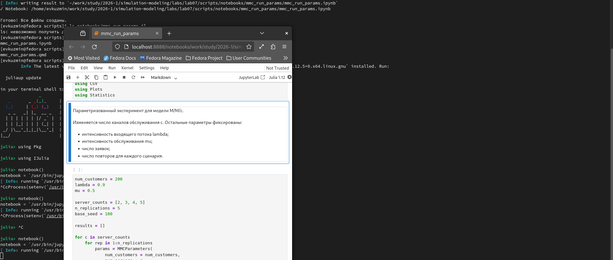{width=88%}

На изображении показана подготовка параметрической версии для M/M/c и формирование notebook-файла на её основе.

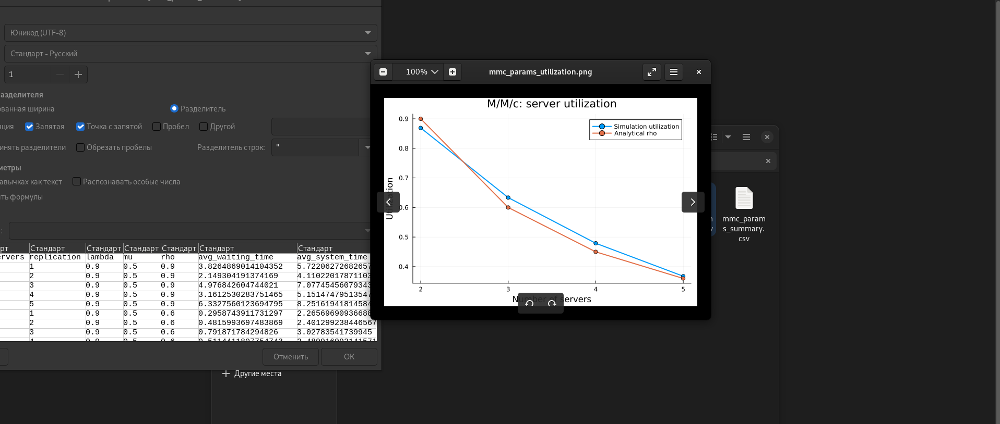{width=88%}

На изображении представлены результаты параметрического эксперимента M/M/c. Видно, что увеличение числа серверов уменьшает время ожидания, очередь и загрузку одного обслуживающего ресурса.

### Листинг 4. Параметризованная версия M/M/c

```julia
using DrWatson
@quickactivate "project"

include(srcdir("MMCModel.jl"))
using .MMCModel

using DataFrames
using CSV
using Plots
using Statistics

# Параметризованный эксперимент для модели M/M/c.
#
# Изменяется число каналов обслуживания c.
# Остальные параметры фиксированы:
# - интенсивность входящего потока lambda;
# - интенсивность обслуживания mu;
# - число заявок;
# - число повторов для каждого сценария.

num_customers = 200
lambda = 0.9
mu = 0.5

server_counts = [2, 3, 4, 5]
n_replications = 5
base_seed = 100

results = []

for c in server_counts
    for rep in 1:n_replications
        params = MMCParameters(
            num_customers = num_customers,
            num_servers = c,
            lambda = lambda,
            mu = mu,
            seed = base_seed + 100 * c + rep,
        )

        result = run_mmc_simulation(params)
        metrics = result.metrics

        push!(
            results,
            (
                num_servers = c,
                replication = rep,
                lambda = lambda,
                mu = mu,
                rho = metrics.rho[1],
                avg_waiting_time = metrics.avg_waiting_time[1],
                avg_system_time = metrics.avg_system_time[1],
                max_queue_length = metrics.max_queue_length[1],
                utilization = metrics.utilization[1],
            ),
        )
    end
end

df_results = DataFrame(results)

# Сводная таблица по каждому числу серверов.
df_summary = combine(
    groupby(df_results, :num_servers),
    :lambda => first => :lambda,
    :mu => first => :mu,
    :rho => mean => :rho_mean,
    :avg_waiting_time => mean => :avg_waiting_time_mean,
    :avg_waiting_time => std => :avg_waiting_time_std,
    :avg_system_time => mean => :avg_system_time_mean,
    :avg_system_time => std => :avg_system_time_std,
    :max_queue_length => mean => :max_queue_length_mean,
    :utilization => mean => :utilization_mean,
)

# Аналитические характеристики для каждого значения c.
analytics_rows = []

for c in server_counts
    params = MMCParameters(
        num_customers = num_customers,
        num_servers = c,
        lambda = lambda,
        mu = mu,
        seed = base_seed,
    )

    analytics = mmc_analytics(params)

    push!(
        analytics_rows,
        (
            num_servers = c,
            rho_analytical = analytics.rho[1],
            Wq_analytical = analytics.Wq[1],
            W_analytical = analytics.W[1],
            stable = analytics.stable[1],
        ),
    )
end

df_analytics = DataFrame(analytics_rows)

# Объединяем имитационную и аналитическую сводки.
df_compare = leftjoin(df_summary, df_analytics, on = :num_servers)

CSV.write(datadir("mmc_params_results.csv"), df_results)
CSV.write(datadir("mmc_params_summary.csv"), df_summary)
CSV.write(datadir("mmc_params_analytics.csv"), df_analytics)
CSV.write(datadir("mmc_params_compare.csv"), df_compare)

println("M/M/c parameter experiment summary:")
println(df_compare)

# График 1.
# Среднее время ожидания и среднее время пребывания в системе.
p_time = plot(
    df_compare.num_servers,
    [df_compare.avg_waiting_time_mean df_compare.avg_system_time_mean],
    marker = :circle,
    xlabel = "Number of servers",
    ylabel = "Time",
    title = "M/M/c: average waiting and system time",
    label = ["Average waiting time" "Average system time"],
    linewidth = 2,
)

savefig(p_time, plotsdir("mmc_params_time.png"))

# График 2.
# Средняя максимальная длина очереди.
p_queue = plot(
    df_compare.num_servers,
    df_compare.max_queue_length_mean,
    marker = :circle,
    xlabel = "Number of servers",
    ylabel = "Average max queue length",
    title = "M/M/c: max queue length",
    label = "Max queue length",
    linewidth = 2,
)

savefig(p_queue, plotsdir("mmc_params_queue.png"))

# График 3.
# Загрузка каналов обслуживания.
p_util = plot(
    df_compare.num_servers,
    [df_compare.utilization_mean df_compare.rho_analytical],
    marker = :circle,
    xlabel = "Number of servers",
    ylabel = "Utilization",
    title = "M/M/c: server utilization",
    label = ["Simulation utilization" "Analytical rho"],
    linewidth = 2,
)

savefig(p_util, plotsdir("mmc_params_utilization.png"))

println()
println("Parameterized M/M/c experiment completed.")
println("Saved data:")
println("  data/mmc_params_results.csv")
println("  data/mmc_params_summary.csv")
println("  data/mmc_params_analytics.csv")
println("  data/mmc_params_compare.csv")
println("Saved plots:")
println("  plots/mmc_params_time.png")
println("  plots/mmc_params_queue.png")
println("  plots/mmc_params_utilization.png")
```

# Анализ результатов модели M/M/c

## Длина очереди

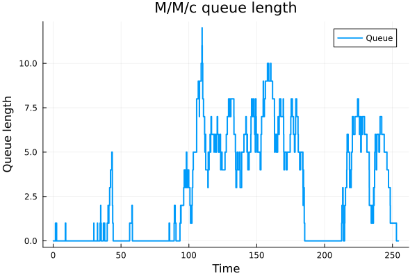{width=88%}

На графике показано изменение длины очереди во времени. Очередь возникает в периоды, когда входящий поток заявок временно превышает возможности двух каналов обслуживания. Максимальная длина очереди достигает заметных значений, что объясняется высокой загрузкой системы.

## Занятость серверов

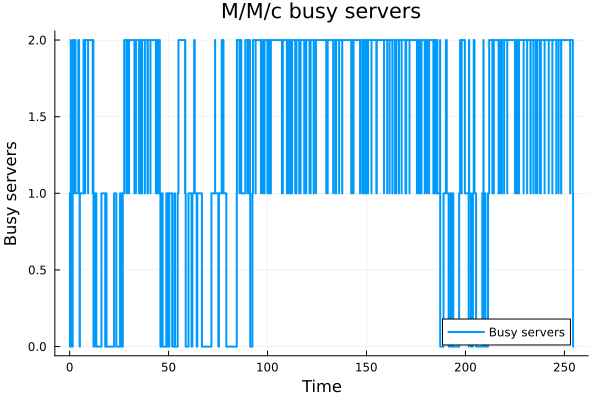{width=88%}

На графике показано число занятых каналов обслуживания во времени. Значительная часть времени оба сервера заняты, что подтверждает высокую загрузку системы.

## Время ожидания заявок

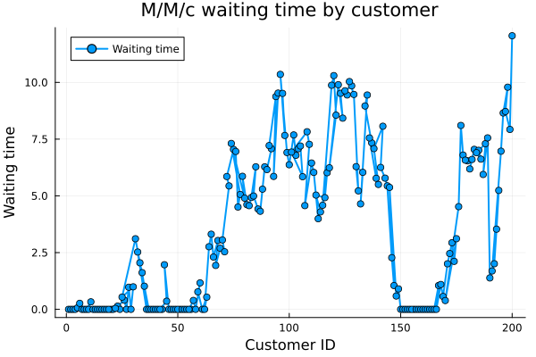{width=88%}

На графике показано время ожидания каждой заявки перед началом обслуживания. В периоды роста очереди время ожидания резко увеличивается.

## Время пребывания заявок в системе

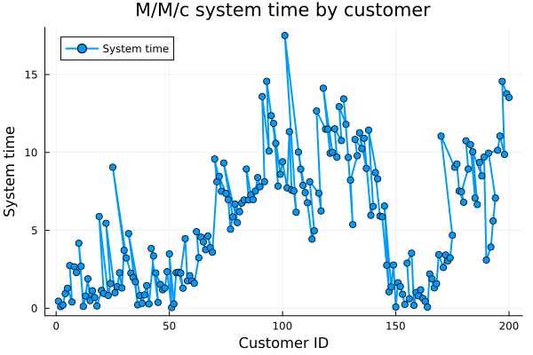{width=88%}

Время пребывания в системе включает и ожидание, и обслуживание. Поэтому значения на этом графике обычно выше, чем значения времени ожидания.

## Сравнение симуляции и аналитики для M/M/c

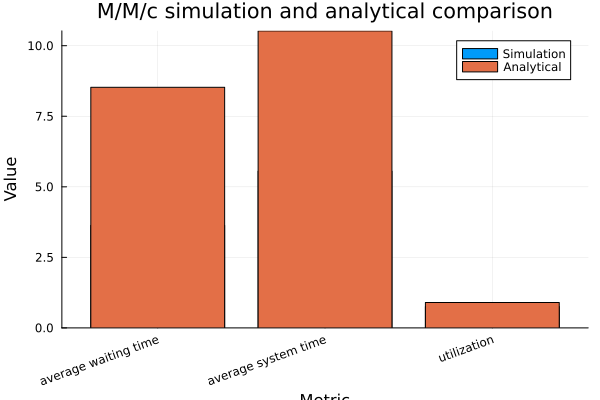{width=88%}

На графике показано сравнение имитационных и аналитических характеристик модели M/M/c. Аналитические значения соответствуют стационарному режиму, а имитационная модель выполняется для конечного числа заявок, поэтому значения могут отличаться.

## Параметризованный анализ M/M/c

{width=88%}

При увеличении числа серверов среднее время ожидания и среднее время пребывания заявки в системе уменьшаются. Наиболее заметное улучшение наблюдается при переходе от двух серверов к трём.

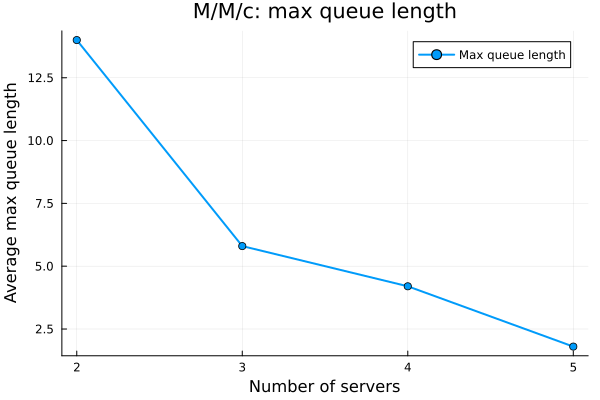{width=88%}

График показывает, что максимальная очередь уменьшается при увеличении числа каналов обслуживания. Это подтверждает ожидаемое поведение системы массового обслуживания.

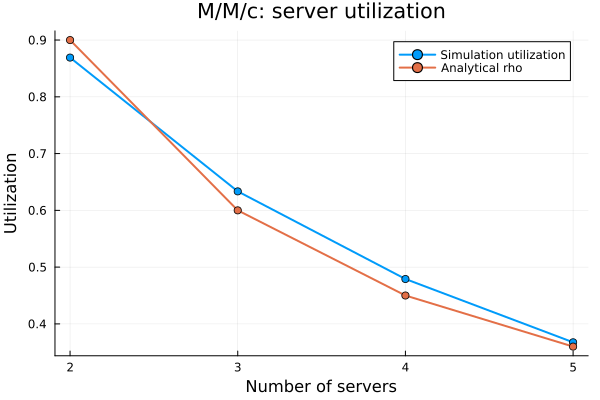{width=88%}

При увеличении числа серверов загрузка каждого канала обслуживания уменьшается, так как один и тот же входящий поток распределяется между большим числом ресурсов.

# Модель Росса

## Базовая реализация и запуск модели Росса

На следующем этапе была подготовлена модель Росса. Основная логика отказов, ремонта и восстановления резерва вынесена в source-модуль `RossModel.jl`, а базовый эксперимент выполнен через скрипт `ross_run.jl`.

В базовом эксперименте использовались параметры:

```text
num_operating = 5
num_spares = 3
num_repairers = 1
failure_rate = 0.1
repair_rate = 0.5
max_time = 1000.0
```

{width=88%}

На изображении показан базовый запуск модели Росса. В результате была смоделирована работа системы с резервными машинами и ремонтником, а также проведены повторные прогоны для оценки среднего времени до отказа.

### Листинг 5. Source-модуль модели Росса

```julia
module RossModel

using Distributions
using StableRNGs
using DataFrames
using Statistics
using LinearAlgebra

export RossParameters
export run_ross_simulation
export run_ross_replications
export ross_analytic_mttf
export print_ross_summary

"""
    RossParameters

Параметры модели Росса.

Поля:
- `num_operating` — число машин, которые должны постоянно работать;
- `num_spares` — число резервных машин;
- `num_repairers` — число ремонтников;
- `failure_rate` — интенсивность отказа одной работающей машины;
- `repair_rate` — интенсивность ремонта одной машины одним ремонтником;
- `seed` — зерно генератора случайных чисел;
- `max_time` — максимальное время моделирования.
"""
struct RossParameters
    num_operating::Int
    num_spares::Int
    num_repairers::Int
    failure_rate::Float64
    repair_rate::Float64
    seed::Int
    max_time::Float64
end

"""
    RossParameters(; kwargs...)

Конструктор параметров модели Росса со значениями по умолчанию.
"""
function RossParameters(;
    num_operating = 5,
    num_spares = 3,
    num_repairers = 1,
    failure_rate = 0.1,
    repair_rate = 0.5,
    seed = 123,
    max_time = 1000.0,
)
    return RossParameters(
        Int(num_operating),
        Int(num_spares),
        Int(num_repairers),
        Float64(failure_rate),
        Float64(repair_rate),
        Int(seed),
        Float64(max_time),
    )
end

"""
    RossState

Внутреннее состояние модели Росса.

Поля:
- `spares_available` — число доступных резервных машин;
- `repair_queue` — длина очереди на ремонт;
- `repair_completions` — запланированные завершения ремонтов;
- `failed` — флаг отказа системы.
"""
mutable struct RossState
    spares_available::Int
    repair_queue::Int
    repair_completions::Vector{Tuple{Int, Float64}}
    failed::Bool
end

"""
    RossState(params)

Создаёт начальное состояние системы.
"""
function RossState(params::RossParameters)
    return RossState(
        params.num_spares,
        0,
        Tuple{Int, Float64}[],
        false,
    )
end

"""
    busy_repairers(state)

Возвращает число занятых ремонтников.
"""
function busy_repairers(state::RossState)
    return length(state.repair_completions)
end

"""
    find_free_repairer(state, params)

Находит номер свободного ремонтника.
"""
function find_free_repairer(state::RossState, params::RossParameters)
    busy_ids = [item[1] for item in state.repair_completions]

    for id in 1:params.num_repairers
        if !(id in busy_ids)
            return id
        end
    end

    return 0
end

"""
    start_repair!(state, params, current_time, repair_dist, rng)

Запускает ремонт одной сломанной машины, если есть свободный ремонтник.
"""
function start_repair!(
    state::RossState,
    params::RossParameters,
    current_time::Float64,
    repair_dist,
    rng,
)
    if busy_repairers(state) >= params.num_repairers
        return false
    end

    repairer_id = find_free_repairer(state, params)

    if repairer_id == 0
        return false
    end

    repair_time = rand(rng, repair_dist)
    completion_time = current_time + repair_time

    push!(state.repair_completions, (repairer_id, completion_time))

    return true
end

"""
    next_repair_completion(state)

Возвращает индекс и время ближайшего завершения ремонта.
"""
function next_repair_completion(state::RossState)
    if isempty(state.repair_completions)
        return 0, Inf
    end

    completion_times = [item[2] for item in state.repair_completions]
    idx = argmin(completion_times)

    return idx, completion_times[idx]
end

"""
    record_state!(history, event, time, params, state)

Добавляет текущее состояние системы в историю моделирования.
"""
function record_state!(
    history::Vector{NamedTuple},
    event::String,
    time::Float64,
    params::RossParameters,
    state::RossState,
)
    push!(
        history,
        (
            time = Float64(time),
            event = event,
            operating_machines = Int(params.num_operating),
            spares_available = Int(state.spares_available),
            repair_queue = Int(state.repair_queue),
            repairers_busy = Int(busy_repairers(state)),
            broken_total = Int(params.num_spares - state.spares_available),
            failed = Bool(state.failed),
        ),
    )

    return nothing
end

"""
    run_ross_simulation(params)

Запускает одну симуляцию модели Росса.

Логика модели:
1. в системе постоянно должны работать `num_operating` машин;
2. при отказе работающей машины используется резервная машина;
3. сломанная машина отправляется в ремонт;
4. если свободного ремонтника нет, машина становится в очередь;
5. если отказ происходит при отсутствии резерва, система считается отказавшей.

Возвращает именованный кортеж:
- `history` — история изменения состояния системы;
- `metrics` — основные показатели моделирования;
- `params` — использованные параметры.
"""
function run_ross_simulation(params::RossParameters)
    rng = StableRNG(params.seed)

    # Отказы происходят среди работающих машин.
    # Так как одновременно должно работать num_operating машин,
    # общий поток отказов имеет интенсивность num_operating * failure_rate.
    total_failure_rate = params.num_operating * params.failure_rate

    failure_dist = Exponential(1.0 / total_failure_rate)
    repair_dist = Exponential(1.0 / params.repair_rate)

    state = RossState(params)
    history = NamedTuple[]

    current_time = 0.0
    next_failure_time = rand(rng, failure_dist)

    record_state!(history, "start", current_time, params, state)

    while current_time < params.max_time && !state.failed
        repair_idx, next_repair_time = next_repair_completion(state)

        next_event_time = min(next_failure_time, next_repair_time)

        # Если следующее событие выходит за предел max_time,
        # моделирование останавливается как цензурированное.
        if next_event_time > params.max_time
            current_time = params.max_time
            record_state!(history, "censored", current_time, params, state)
            break
        end

        current_time = next_event_time

        if next_failure_time <= next_repair_time
            # Событие отказа машины.

            if state.spares_available == 0
                # Резервных машин нет, поэтому система отказывает.
                state.failed = true
                record_state!(history, "system_failure", current_time, params, state)
                break
            end

            # Резервная машина заменяет отказавшую.
            state.spares_available -= 1

            # Сломанная машина отправляется в ремонт или в очередь.
            started = start_repair!(
                state,
                params,
                current_time,
                repair_dist,
                rng,
            )

            if started
                record_state!(
                    history,
                    "machine_failure_start_repair",
                    current_time,
                    params,
                    state,
                )
            else
                state.repair_queue += 1
                record_state!(
                    history,
                    "machine_failure_queue_repair",
                    current_time,
                    params,
                    state,
                )
            end

            # Планируем следующий отказ.
            next_failure_time = current_time + rand(rng, failure_dist)
        else
            # Событие завершения ремонта.

            deleteat!(state.repair_completions, repair_idx)

            # Отремонтированная машина возвращается в резерв.
            state.spares_available += 1

            if state.repair_queue > 0
                # Если есть очередь на ремонт, следующий ремонт начинается сразу.
                state.repair_queue -= 1

                start_repair!(
                    state,
                    params,
                    current_time,
                    repair_dist,
                    rng,
                )

                record_state!(
                    history,
                    "repair_complete_start_next",
                    current_time,
                    params,
                    state,
                )
            else
                record_state!(
                    history,
                    "repair_complete",
                    current_time,
                    params,
                    state,
                )
            end
        end
    end

    history_df = DataFrame(history)
    metrics_df = build_ross_metrics(params, history_df)

    return (
        history = history_df,
        metrics = metrics_df,
        params = params,
    )
end

"""
    run_ross_simulation(; kwargs...)

Удобный запуск модели без явного создания `RossParameters`.
"""
function run_ross_simulation(; kwargs...)
    params = RossParameters(; kwargs...)
    return run_ross_simulation(params)
end

"""
    build_ross_metrics(params, history_df)

Рассчитывает основные метрики модели Росса.
"""
function build_ross_metrics(params::RossParameters, history_df::DataFrame)
    if nrow(history_df) == 0
        return DataFrame()
    end

    final_time = history_df.time[end]
    failed = history_df.failed[end]

    avg_queue = time_weighted_average(
        history_df.time,
        history_df.repair_queue,
    )

    avg_busy_repairers = time_weighted_average(
        history_df.time,
        history_df.repairers_busy,
    )

    avg_spares_available = time_weighted_average(
        history_df.time,
        history_df.spares_available,
    )

    repairer_utilization = avg_busy_repairers / params.num_repairers

    max_queue = maximum(history_df.repair_queue)
    max_busy_repairers = maximum(history_df.repairers_busy)

    analytic_mttf = ross_analytic_mttf(params)

    return DataFrame(
        num_operating = [params.num_operating],
        num_spares = [params.num_spares],
        num_repairers = [params.num_repairers],
        failure_rate = [params.failure_rate],
        repair_rate = [params.repair_rate],
        seed = [params.seed],
        time_to_failure = [final_time],
        failed = [failed],
        avg_repair_queue = [avg_queue],
        max_repair_queue = [max_queue],
        avg_busy_repairers = [avg_busy_repairers],
        max_busy_repairers = [max_busy_repairers],
        repairer_utilization = [repairer_utilization],
        avg_spares_available = [avg_spares_available],
        analytic_mttf = [analytic_mttf],
    )
end

"""
    time_weighted_average(times, values)

Считает среднее значение величины по времени.

Значение на интервале [t_i, t_{i+1}] считается равным values[i].
"""
function time_weighted_average(times, values)
    n = length(times)

    if n <= 1
        return Float64(values[1])
    end

    total_time = times[end] - times[1]

    if total_time <= 0
        return Float64(values[end])
    end

    acc = 0.0

    for i in 1:(n - 1)
        dt = times[i + 1] - times[i]
        acc += Float64(values[i]) * dt
    end

    return acc / total_time
end

"""
    ross_analytic_mttf(params)

Вычисляет аналитическую оценку среднего времени до отказа системы.

Используется марковская модель по числу доступных резервных машин.
Состояние `s` означает количество доступных резервных машин.

Если `s > 0`, отказ рабочей машины уменьшает число резервных машин.
Если `s = 0`, следующий отказ приводит к отказу всей системы.
Ремонт увеличивает число доступных резервных машин.
"""
function ross_analytic_mttf(params::RossParameters)
    S = params.num_spares
    R = params.num_repairers

    λ = params.num_operating * params.failure_rate
    μ = params.repair_rate

    # Неизвестные: E[0], E[1], ..., E[S]
    # где E[s] — среднее время до отказа при s доступных резервах.
    A = zeros(Float64, S + 1, S + 1)
    b = ones(Float64, S + 1)

    for s in 0:S
        row = s + 1

        broken = S - s
        busy = min(R, broken)
        repair_intensity = busy * μ

        total_rate = λ + repair_intensity

        A[row, row] = total_rate

        # Переход по отказу:
        # если s > 0, переходим в состояние s - 1;
        # если s = 0, отказ ведёт в поглощающее состояние и в систему уравнений
        # дополнительный член не добавляется.
        if s > 0
            A[row, row - 1] -= λ
        end

        # Переход по ремонту:
        # если есть сломанные машины, ремонт увеличивает число резервов.
        if s < S && repair_intensity > 0
            A[row, row + 1] -= repair_intensity
        end
    end

    E = A \ b

    # Начальное состояние: все резервные машины доступны.
    return E[S + 1]
end

"""
    run_ross_replications(params; n_replications=100)

Запускает несколько независимых повторов модели Росса.

Это нужно для оценки среднего времени до отказа системы.
"""
function run_ross_replications(
    params::RossParameters;
    n_replications = 100,
)
    rows = NamedTuple[]

    for i in 1:n_replications
        p = RossParameters(
            num_operating = params.num_operating,
            num_spares = params.num_spares,
            num_repairers = params.num_repairers,
            failure_rate = params.failure_rate,
            repair_rate = params.repair_rate,
            seed = params.seed + i - 1,
            max_time = params.max_time,
        )

        result = run_ross_simulation(p)
        m = result.metrics

        push!(
            rows,
            (
                replication = i,
                seed = p.seed,
                time_to_failure = m.time_to_failure[1],
                failed = m.failed[1],
                avg_repair_queue = m.avg_repair_queue[1],
                repairer_utilization = m.repairer_utilization[1],
            ),
        )
    end

    df = DataFrame(rows)

    summary = DataFrame(
        n_replications = [n_replications],
        mean_time_to_failure = [mean(df.time_to_failure)],
        std_time_to_failure = [std(df.time_to_failure)],
        min_time_to_failure = [minimum(df.time_to_failure)],
        max_time_to_failure = [maximum(df.time_to_failure)],
        mean_repair_queue = [mean(df.avg_repair_queue)],
        mean_repairer_utilization = [mean(df.repairer_utilization)],
        analytic_mttf = [ross_analytic_mttf(params)],
    )

    return (
        replications = df,
        summary = summary,
        params = params,
    )
end

"""
    print_ross_summary(result)

Печатает краткую сводку по результатам одной симуляции.
"""
function print_ross_summary(result)
    metrics = result.metrics

    if nrow(metrics) == 0
        println("Нет данных для вывода.")
        return nothing
    end

    println("Ross model simulation summary")
    println("="^50)
    println("Operating machines: ", metrics.num_operating[1])
    println("Spare machines: ", metrics.num_spares[1])
    println("Repairers: ", metrics.num_repairers[1])
    println("Failure rate: ", metrics.failure_rate[1])
    println("Repair rate: ", metrics.repair_rate[1])
    println("Time to failure: ", round(metrics.time_to_failure[1], digits = 4))
    println("System failed: ", metrics.failed[1])
    println("Average repair queue: ", round(metrics.avg_repair_queue[1], digits = 4))
    println("Max repair queue: ", metrics.max_repair_queue[1])
    println("Repairer utilization: ", round(metrics.repairer_utilization[1], digits = 4))
    println("Analytic MTTF: ", round(metrics.analytic_mttf[1], digits = 4))

    return nothing
end

end # module
```

### Листинг 6. Базовый скрипт модели Росса

```julia
using DrWatson
@quickactivate "project"

include(srcdir("RossModel.jl"))
using .RossModel

using DataFrames
using CSV
using Plots

# Параметры базового запуска модели Росса.
params = RossParameters(
    num_operating = 5,
    num_spares = 3,
    num_repairers = 1,
    failure_rate = 0.1,
    repair_rate = 0.5,
    seed = 123,
    max_time = 1000.0,
)

# Запуск одной симуляции модели Росса.
result = run_ross_simulation(params)

# Краткая сводка по базовому запуску.
print_ross_summary(result)

# Серия независимых повторов для оценки среднего времени до отказа.
replications = run_ross_replications(params; n_replications = 100)

println()
println("Ross model replications summary:")
println(replications.summary)

# Сохранение результатов моделирования.
CSV.write(datadir("ross_history.csv"), result.history)
CSV.write(datadir("ross_metrics.csv"), result.metrics)
CSV.write(datadir("ross_replications.csv"), replications.replications)
CSV.write(datadir("ross_replications_summary.csv"), replications.summary)

# Сравнение среднего времени до отказа по симуляции и аналитической оценки.
comparison = DataFrame(
    metric = ["Simulation mean", "Analytical MTTF"],
    value = [
        replications.summary.mean_time_to_failure[1],
        replications.summary.analytic_mttf[1],
    ],
)

CSV.write(datadir("ross_mttf_comparison.csv"), comparison)

# График числа доступных резервных машин во времени.
p_spares = plot(
    result.history.time,
    result.history.spares_available,
    seriestype = :steppost,
    xlabel = "Time",
    ylabel = "Available spares",
    title = "Ross model: available spare machines",
    label = "Spares",
    linewidth = 2,
)

savefig(p_spares, plotsdir("ross_spares_available.png"))

# График длины очереди на ремонт.
p_queue = plot(
    result.history.time,
    result.history.repair_queue,
    seriestype = :steppost,
    xlabel = "Time",
    ylabel = "Repair queue length",
    title = "Ross model: repair queue",
    label = "Repair queue",
    linewidth = 2,
)

savefig(p_queue, plotsdir("ross_repair_queue.png"))

# График числа занятых ремонтников.
p_busy = plot(
    result.history.time,
    result.history.repairers_busy,
    seriestype = :steppost,
    xlabel = "Time",
    ylabel = "Busy repairers",
    title = "Ross model: busy repairers",
    label = "Busy repairers",
    linewidth = 2,
)

savefig(p_busy, plotsdir("ross_busy_repairers.png"))

# График времени до отказа по независимым повторам.
p_ttf = plot(
    replications.replications.replication,
    replications.replications.time_to_failure,
    xlabel = "Replication",
    ylabel = "Time to failure",
    title = "Ross model: time to failure by replication",
    label = "Time to failure",
    marker = :circle,
    linewidth = 2,
)

savefig(p_ttf, plotsdir("ross_time_to_failure.png"))

# Сравнение среднего времени до отказа с аналитическим значением.
p_compare = bar(
    comparison.metric,
    comparison.value,
    xlabel = "Method",
    ylabel = "Mean time to failure",
    title = "Ross model: simulation and analytical MTTF",
    label = "MTTF",
    xrotation = 15,
)

savefig(p_compare, plotsdir("ross_mttf_comparison.png"))

println()
println("Ross model simulation completed.")
println("Saved data:")
println("  data/ross_history.csv")
println("  data/ross_metrics.csv")
println("  data/ross_replications.csv")
println("  data/ross_replications_summary.csv")
println("  data/ross_mttf_comparison.csv")
println("Saved plots:")
println("  plots/ross_spares_available.png")
println("  plots/ross_repair_queue.png")
println("  plots/ross_busy_repairers.png")
println("  plots/ross_time_to_failure.png")
println("  plots/ross_mttf_comparison.png")
```

## Документированная версия модели Росса

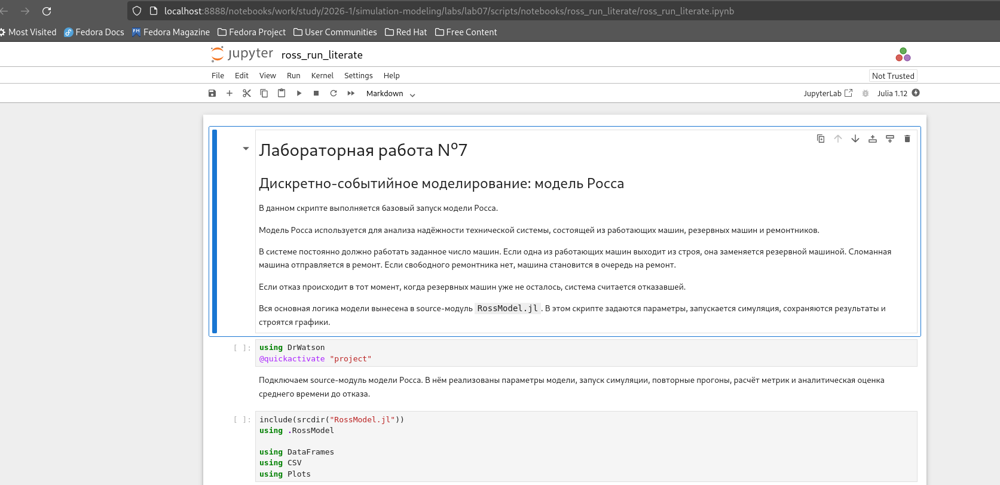{width=88%}

На изображении показан notebook, сформированный из literate-версии модели Росса.

### Листинг 7. Literate-версия модели Росса

```julia
# # Лабораторная работа №7
# ## Дискретно-событийное моделирование: модель Росса
#
# В данном скрипте выполняется базовый запуск модели Росса.
#
# Модель Росса используется для анализа надёжности технической системы,
# состоящей из работающих машин, резервных машин и ремонтников.
#
# В системе постоянно должно работать заданное число машин. Если одна из
# работающих машин выходит из строя, она заменяется резервной машиной.
# Сломанная машина отправляется в ремонт. Если свободного ремонтника нет,
# машина становится в очередь на ремонт.
#
# Если отказ происходит в тот момент, когда резервных машин уже не осталось,
# система считается отказавшей.
#
# Вся основная логика модели вынесена в source-модуль `RossModel.jl`.
# В этом скрипте задаются параметры, запускается симуляция, сохраняются
# результаты и строятся графики.

using DrWatson
@quickactivate "project"

# Подключаем source-модуль модели Росса.
# В нём реализованы параметры модели, запуск симуляции, повторные прогоны,
# расчёт метрик и аналитическая оценка среднего времени до отказа.

include(srcdir("RossModel.jl"))
using .RossModel

using DataFrames
using CSV
using Plots

# ## Задание параметров модели
#
# Зададим параметры базового эксперимента.
#
# В данном запуске используются:
#
# - `num_operating = 5` — число машин, которые должны постоянно работать;
# - `num_spares = 3` — число резервных машин;
# - `num_repairers = 1` — число ремонтников;
# - `failure_rate = 0.1` — интенсивность отказа одной работающей машины;
# - `repair_rate = 0.5` — интенсивность ремонта одной машины;
# - `seed = 123` — зерно генератора случайных чисел;
# - `max_time = 1000.0` — максимальное время моделирования.
#
# Фиксация `seed` нужна для воспроизводимости результата.

params = RossParameters(
    num_operating = 5,
    num_spares = 3,
    num_repairers = 1,
    failure_rate = 0.1,
    repair_rate = 0.5,
    seed = 123,
    max_time = 1000.0,
)

# ## Запуск одной симуляции
#
# Запустим одну дискретно-событийную симуляцию модели Росса.
#
# Внутри функции `run_ross_simulation` последовательно обрабатываются события:
#
# - отказ работающей машины;
# - начало ремонта;
# - ожидание ремонта в очереди;
# - завершение ремонта;
# - возврат машины в резерв;
# - отказ всей системы при отсутствии резерва.
#
# Результатом работы функции является история состояний системы и таблица
# основных метрик.

result = run_ross_simulation(params)

# Выведем краткую сводку по базовому запуску.

print_ross_summary(result)

# ## Повторные прогоны модели
#
# Один запуск модели Росса зависит от случайных моментов отказов и ремонтов.
# Поэтому по одному запуску нельзя надёжно оценивать среднее время до отказа.
#
# Для более устойчивой оценки выполним серию независимых повторов модели.
# В данном случае используется `100` повторов.

replications = run_ross_replications(params; n_replications = 100)

println()
println("Ross model replications summary:")
println(replications.summary)

# ## Сохранение результатов
#
# Сохраним результаты моделирования в каталог `data/`.
#
# Формируются следующие файлы:
#
# - `ross_history.csv` — история одного базового запуска;
# - `ross_metrics.csv` — метрики одного базового запуска;
# - `ross_replications.csv` — результаты независимых повторов;
# - `ross_replications_summary.csv` — сводка по серии повторов.

CSV.write(datadir("ross_history.csv"), result.history)
CSV.write(datadir("ross_metrics.csv"), result.metrics)
CSV.write(datadir("ross_replications.csv"), replications.replications)
CSV.write(datadir("ross_replications_summary.csv"), replications.summary)

# ## Сравнение имитационного и аналитического MTTF
#
# Для модели рассчитывается среднее время до отказа.
#
# В имитационном подходе оно оценивается по серии повторов.
# В аналитическом подходе используется функция `ross_analytic_mttf`,
# реализованная в source-модуле.
#
# Создадим таблицу для сравнения этих двух значений.

comparison = DataFrame(
    metric = ["Simulation mean", "Analytical MTTF"],
    value = [
        replications.summary.mean_time_to_failure[1],
        replications.summary.analytic_mttf[1],
    ],
)

CSV.write(datadir("ross_mttf_comparison.csv"), comparison)

# ## График доступных резервных машин
#
# Первый график показывает, как во времени меняется количество доступных
# резервных машин.
#
# При отказе работающей машины резерв уменьшается, потому что одна резервная
# машина используется для замены. После завершения ремонта отремонтированная
# машина возвращается в резерв.

p_spares = plot(
    result.history.time,
    result.history.spares_available,
    seriestype = :steppost,
    xlabel = "Time",
    ylabel = "Available spares",
    title = "Ross model: available spare machines",
    label = "Spares",
    linewidth = 2,
)

savefig(p_spares, plotsdir("ross_spares_available.png"))

# ## График очереди на ремонт
#
# Второй график показывает длину очереди на ремонт.
#
# Если ремонтник свободен, сломанная машина сразу попадает в ремонт.
# Если ремонтник занят, машина становится в очередь.
#
# В базовом сценарии используется один ремонтник, поэтому при накоплении
# отказов очередь может возрастать.

p_queue = plot(
    result.history.time,
    result.history.repair_queue,
    seriestype = :steppost,
    xlabel = "Time",
    ylabel = "Repair queue length",
    title = "Ross model: repair queue",
    label = "Repair queue",
    linewidth = 2,
)

savefig(p_queue, plotsdir("ross_repair_queue.png"))

# ## График занятости ремонтников
#
# Третий график показывает число занятых ремонтников во времени.
#
# Поскольку в базовом варианте ремонтник один, график принимает значения
# `0` или `1`.
#
# Значение `1` означает, что ремонтник занят. Значение `0` означает, что
# в данный момент ремонтник свободен.

p_busy = plot(
    result.history.time,
    result.history.repairers_busy,
    seriestype = :steppost,
    xlabel = "Time",
    ylabel = "Busy repairers",
    title = "Ross model: busy repairers",
    label = "Busy repairers",
    linewidth = 2,
)

savefig(p_busy, plotsdir("ross_busy_repairers.png"))

# ## График времени до отказа
#
# Построим график времени до отказа по независимым повторам.
#
# Каждая точка соответствует одному прогону модели. Разброс значений возникает
# из-за случайного характера отказов и ремонтов.

p_ttf = plot(
    replications.replications.replication,
    replications.replications.time_to_failure,
    xlabel = "Replication",
    ylabel = "Time to failure",
    title = "Ross model: time to failure by replication",
    label = "Time to failure",
    marker = :circle,
    linewidth = 2,
)

savefig(p_ttf, plotsdir("ross_time_to_failure.png"))

# ## Сравнение среднего времени до отказа
#
# Последний график сравнивает среднее время до отказа по серии имитационных
# прогонов и аналитическую оценку MTTF.
#
# Небольшое различие между этими значениями нормально, так как имитационная
# оценка строится по конечному числу случайных повторов.

p_compare = bar(
    comparison.metric,
    comparison.value,
    xlabel = "Method",
    ylabel = "Mean time to failure",
    title = "Ross model: simulation and analytical MTTF",
    label = "MTTF",
    xrotation = 15,
)

savefig(p_compare, plotsdir("ross_mttf_comparison.png"))

# ## Итог
#
# В результате работы скрипта были получены:
#
# - история изменения состояния системы;
# - таблица метрик одного запуска;
# - результаты серии независимых повторов;
# - сравнение имитационного и аналитического среднего времени до отказа;
# - графики доступного резерва, очереди на ремонт, занятости ремонтников
#   и времени до отказа.
#
# Полученные результаты позволяют проанализировать надёжность системы,
# влияние резерва и загрузку ремонтного ресурса.

println()
println("Ross model simulation completed.")
println("Saved data:")
println("  data/ross_history.csv")
println("  data/ross_metrics.csv")
println("  data/ross_replications.csv")
println("  data/ross_replications_summary.csv")
println("  data/ross_mttf_comparison.csv")
println("Saved plots:")
println("  plots/ross_spares_available.png")
println("  plots/ross_repair_queue.png")
println("  plots/ross_busy_repairers.png")
println("  plots/ross_time_to_failure.png")
println("  plots/ross_mttf_comparison.png")
```

## Параметрический эксперимент для модели Росса

В параметрическом эксперименте для модели Росса исследовалось влияние числа ремонтников:

```text
num_repairers = 1, 2, 3, 4
```

Фиксированными оставались число работающих машин, число резервных машин, интенсивность отказа и интенсивность ремонта.

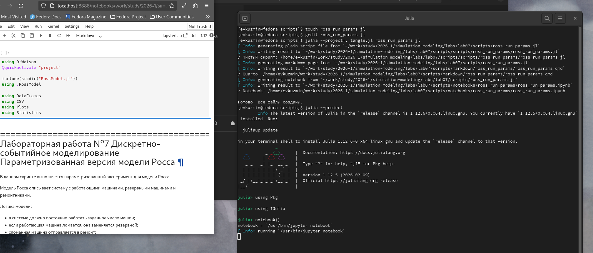{width=88%}

На изображении показана подготовка параметрической версии модели Росса и notebook-файла.

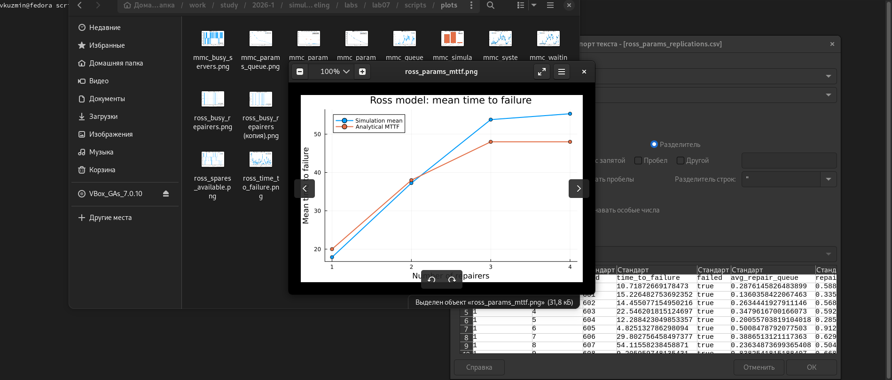{width=88%}

На изображении приведены результаты параметрического анализа модели Росса. Добавление ремонтников повышает среднее время до отказа и снижает очередь на ремонт.

### Листинг 8. Параметризованная версия модели Росса

```julia
using DrWatson
@quickactivate "project"

include(srcdir("RossModel.jl"))
using .RossModel

using DataFrames
using CSV
using Plots
using Statistics
using StatsPlots

# =============================================================================
# Лабораторная работа №7
# Дискретно-событийное моделирование
# Параметризованная версия модели Росса
# =============================================================================
#
# В данном скрипте выполняется параметризованный эксперимент для модели Росса.
#
# Модель Росса описывает систему с работающими машинами, резервными машинами
# и ремонтниками.
#
# Логика модели:
# - в системе должно постоянно работать заданное число машин;
# - если работающая машина ломается, она заменяется резервной;
# - сломанная машина отправляется в ремонт;
# - если свободного ремонтника нет, машина становится в очередь;
# - если резервных машин не осталось, система считается отказавшей.
#
# В этой параметризованной версии исследуется влияние числа ремонтников
# на характеристики системы.
#
# Изменяемый параметр:
# - num_repairers = 1, 2, 3, 4
#
# Фиксированные параметры:
# - число работающих машин;
# - число резервных машин;
# - интенсивность отказов;
# - интенсивность ремонта;
# - максимальное время моделирования.
#
# Для каждого значения числа ремонтников выполняется серия независимых
# повторов. Это нужно, потому что модель стохастическая, и один запуск
# может дать случайно завышенное или заниженное время до отказа.

# =============================================================================
# Общие параметры эксперимента
# =============================================================================

num_operating = 5
num_spares = 3

failure_rate = 0.1
repair_rate = 0.5

repairer_counts = [1, 2, 3, 4]

n_replications = 100
base_seed = 500
max_time = 1000.0

# =============================================================================
# Таблицы для сохранения результатов
# =============================================================================
#
# all_replications — подробная таблица всех повторов.
# summary_rows — сводная таблица по каждому количеству ремонтников.
# analytics_rows — аналитические значения MTTF для каждого сценария.
# sample_history_rows — история одного демонстрационного запуска для каждого
# значения числа ремонтников.

all_replications = []
summary_rows = []
analytics_rows = []
sample_history_rows = []

# =============================================================================
# Запуск параметризованного эксперимента
# =============================================================================

for repairers in repairer_counts
    params = RossParameters(
        num_operating = num_operating,
        num_spares = num_spares,
        num_repairers = repairers,
        failure_rate = failure_rate,
        repair_rate = repair_rate,
        seed = base_seed + 100 * repairers,
        max_time = max_time,
    )

    # Один демонстрационный запуск нужен для сохранения истории состояний.
    sample_result = run_ross_simulation(params)

    for row in eachrow(sample_result.history)
        push!(
            sample_history_rows,
            (
                num_repairers = repairers,
                time = row.time,
                event = row.event,
                operating_machines = row.operating_machines,
                spares_available = row.spares_available,
                repair_queue = row.repair_queue,
                repairers_busy = row.repairers_busy,
                broken_total = row.broken_total,
                failed = row.failed,
            ),
        )
    end

    # Серия независимых повторов для устойчивой оценки времени до отказа.
    replications = run_ross_replications(
        params;
        n_replications = n_replications,
    )

    for row in eachrow(replications.replications)
        push!(
            all_replications,
            (
                num_repairers = repairers,
                replication = row.replication,
                seed = row.seed,
                time_to_failure = row.time_to_failure,
                failed = row.failed,
                avg_repair_queue = row.avg_repair_queue,
                repairer_utilization = row.repairer_utilization,
            ),
        )
    end

    summary = replications.summary
    analytic_mttf = ross_analytic_mttf(params)

    push!(
        summary_rows,
        (
            num_repairers = repairers,
            num_operating = num_operating,
            num_spares = num_spares,
            failure_rate = failure_rate,
            repair_rate = repair_rate,
            n_replications = n_replications,
            mean_time_to_failure = summary.mean_time_to_failure[1],
            std_time_to_failure = summary.std_time_to_failure[1],
            min_time_to_failure = summary.min_time_to_failure[1],
            max_time_to_failure = summary.max_time_to_failure[1],
            mean_repair_queue = summary.mean_repair_queue[1],
            mean_repairer_utilization = summary.mean_repairer_utilization[1],
            analytic_mttf = analytic_mttf,
        ),
    )

    push!(
        analytics_rows,
        (
            num_repairers = repairers,
            analytic_mttf = analytic_mttf,
        ),
    )
end

# =============================================================================
# Формирование итоговых таблиц
# =============================================================================

df_replications = DataFrame(all_replications)
df_summary = DataFrame(summary_rows)
df_analytics = DataFrame(analytics_rows)
df_sample_history = DataFrame(sample_history_rows)

# Дополнительная таблица сравнения имитационного и аналитического MTTF.
df_compare = DataFrame(
    num_repairers = df_summary.num_repairers,
    simulation_mttf = df_summary.mean_time_to_failure,
    analytical_mttf = df_summary.analytic_mttf,
    absolute_difference = abs.(
        df_summary.mean_time_to_failure .- df_summary.analytic_mttf,
    ),
)

# Сохраняем подробные результаты в data/.
CSV.write(datadir("ross_params_replications.csv"), df_replications)
CSV.write(datadir("ross_params_summary.csv"), df_summary)
CSV.write(datadir("ross_params_analytics.csv"), df_analytics)
CSV.write(datadir("ross_params_sample_history.csv"), df_sample_history)
CSV.write(datadir("ross_params_mttf_compare.csv"), df_compare)

println("Ross model parameter experiment summary:")
println(df_summary)

println()
println("Simulation and analytical MTTF comparison:")
println(df_compare)

# =============================================================================
# График 1. Среднее время до отказа
# =============================================================================
#
# Первый график показывает, как число ремонтников влияет на среднее время
# до отказа системы.
#
# Чем больше ремонтников, тем быстрее сломанные машины возвращаются в резерв.
# Поэтому система должна в среднем работать дольше.

p_mttf = plot(
    df_summary.num_repairers,
    [df_summary.mean_time_to_failure df_summary.analytic_mttf],
    marker = :circle,
    xlabel = "Number of repairers",
    ylabel = "Mean time to failure",
    title = "Ross model: mean time to failure",
    label = ["Simulation mean" "Analytical MTTF"],
    linewidth = 2,
)

savefig(p_mttf, plotsdir("ross_params_mttf.png"))

# =============================================================================
# График 2. Средняя очередь на ремонт
# =============================================================================
#
# Второй график показывает среднюю длину очереди на ремонт.
#
# При одном ремонтнике очередь может накапливаться, потому что ремонтный
# ресурс ограничен. При увеличении числа ремонтников очередь должна снижаться.

p_queue = plot(
    df_summary.num_repairers,
    df_summary.mean_repair_queue,
    marker = :circle,
    xlabel = "Number of repairers",
    ylabel = "Mean repair queue",
    title = "Ross model: mean repair queue",
    label = "Repair queue",
    linewidth = 2,
)

savefig(p_queue, plotsdir("ross_params_queue.png"))

# =============================================================================
# График 3. Средняя загрузка ремонтников
# =============================================================================
#
# Третий график показывает среднюю загрузку ремонтников.
#
# При увеличении числа ремонтников общая ремонтная нагрузка распределяется
# между большим количеством ресурсов. Поэтому средняя загрузка одного
# ремонтного ресурса обычно уменьшается.

p_util = plot(
    df_summary.num_repairers,
    df_summary.mean_repairer_utilization,
    marker = :circle,
    xlabel = "Number of repairers",
    ylabel = "Repairer utilization",
    title = "Ross model: repairer utilization",
    label = "Utilization",
    linewidth = 2,
)

savefig(p_util, plotsdir("ross_params_utilization.png"))

# =============================================================================
# График 4. Разброс времени до отказа по повторам
# =============================================================================
#
# Четвёртый график показывает значения времени до отказа по всем независимым
# повторам для каждого количества ремонтников.
#
# Такой график нужен, чтобы увидеть не только среднее значение, но и разброс
# результатов. Для стохастической модели это важно, потому что отдельные
# запуски могут существенно отличаться.

p_box = boxplot(
    string.(df_replications.num_repairers),
    df_replications.time_to_failure,
    xlabel = "Number of repairers",
    ylabel = "Time to failure",
    title = "Ross model: time to failure distribution",
    label = "Replications",
)

savefig(p_box, plotsdir("ross_params_ttf_distribution.png"))

# =============================================================================
# Итог
# =============================================================================

println()
println("Parameterized Ross model experiment completed.")
println("Saved data:")
println("  data/ross_params_replications.csv")
println("  data/ross_params_summary.csv")
println("  data/ross_params_analytics.csv")
println("  data/ross_params_sample_history.csv")
println("  data/ross_params_mttf_compare.csv")
println("Saved plots:")
println("  plots/ross_params_mttf.png")
println("  plots/ross_params_queue.png")
println("  plots/ross_params_utilization.png")
println("  plots/ross_params_ttf_distribution.png")
```

# Анализ результатов модели Росса

## Доступные резервные машины

{width=88%}

На графике показано, как во времени меняется число доступных резервных машин. При отказе работающей машины резерв уменьшается, а после завершения ремонта отремонтированная машина возвращается в резерв.

## Очередь на ремонт

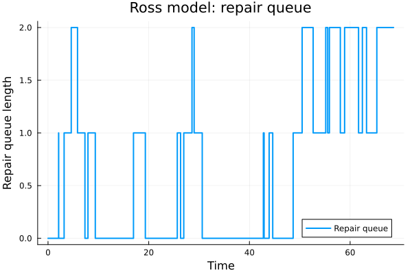{width=88%}

Очередь на ремонт возникает, когда отказавшая машина появляется в момент, когда ремонтник уже занят. В базовом сценарии ремонтник один, поэтому очередь периодически возникает.

## Занятость ремонтников

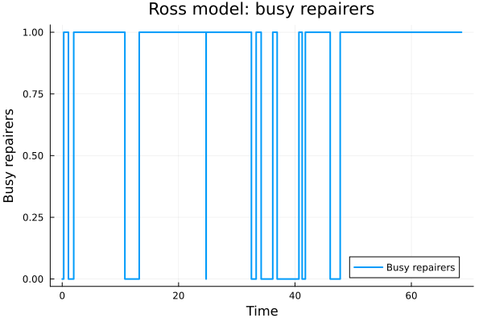{width=88%}

На графике показано число занятых ремонтников во времени. Так как в базовом сценарии ремонтник один, значение принимает 0 или 1.

## Время до отказа по повторам

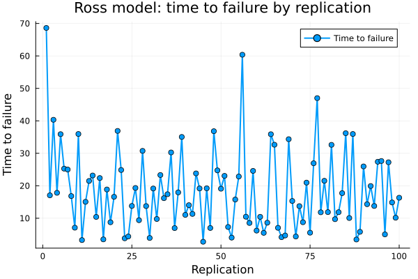{width=88%}

На графике показано время до отказа системы по независимым повторам. Разброс значений объясняется случайным характером отказов и ремонтов.

## Сравнение имитационного и аналитического MTTF

{width=88%}

Имитационная оценка среднего времени до отказа близка к аналитическому значению. Небольшие различия связаны с конечным числом повторов.

## Параметризованный анализ модели Росса

{width=88%}

При увеличении числа ремонтников среднее время до отказа возрастает. Это связано с тем, что неисправные машины быстрее возвращаются в резерв.

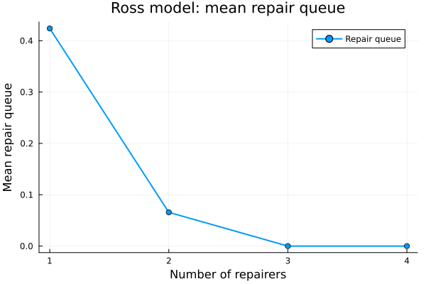{width=88%}

Средняя очередь на ремонт резко уменьшается уже при добавлении второго ремонтника. При трёх и четырёх ремонтниках очередь практически исчезает.

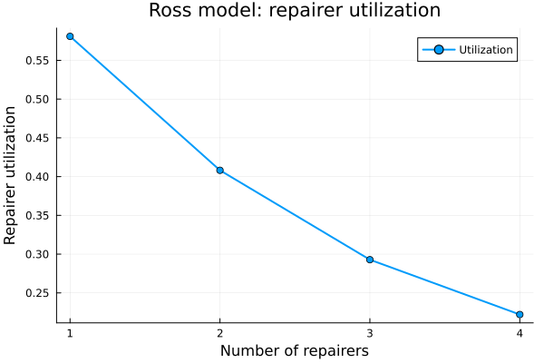{width=88%}

При увеличении числа ремонтников средняя загрузка каждого ремонтника уменьшается, так как общая ремонтная нагрузка распределяется между большим числом ресурсов.

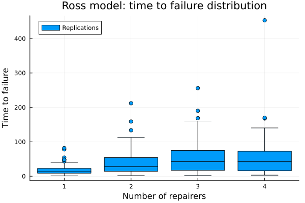{width=88%}

График показывает разброс времени до отказа по независимым повторам. При большем числе ремонтников система может работать значительно дольше, но разброс также увеличивается.

# Итоговый отчётный скрипт

## Итоговая обработка результатов

Скрипт `des_report.jl` выполняет итоговую обработку результатов. Он не запускает модели заново, а читает ранее сохранённые CSV-файлы, формирует сводные таблицы и строит итоговые графики.

{width=88%}

На изображении показано выполнение итогового отчётного скрипта.

### Листинг 9. Итоговый отчётный скрипт

```
using DrWatson
@quickactivate "project"

using DataFrames
using CSV
using Plots

# Загрузка результатов M/M/c
mmc_metrics = CSV.read(datadir("mmc_metrics.csv"), DataFrame)
mmc_analytics = CSV.read(datadir("mmc_analytics.csv"), DataFrame)
mmc_summary = CSV.read(datadir("mmc_summary.csv"), DataFrame)
mmc_params_compare = CSV.read(datadir("mmc_params_compare.csv"), DataFrame)

# Загрузка результатов модели Росса
ross_metrics = CSV.read(datadir("ross_metrics.csv"), DataFrame)
ross_replications_summary = CSV.read(datadir("ross_replications_summary.csv"), DataFrame)
ross_mttf_comparison = CSV.read(datadir("ross_mttf_comparison.csv"), DataFrame)
ross_params_summary = CSV.read(datadir("ross_params_summary.csv"), DataFrame)
ross_params_mttf_compare = CSV.read(datadir("ross_params_mttf_compare.csv"), DataFrame)

# Итоговая сводка по базовой модели M/M/c
mmc_final_summary = DataFrame(
    model = ["M/M/c"],
    num_customers = [mmc_metrics.num_customers[1]],
    num_servers = [mmc_metrics.num_servers[1]],
    lambda = [mmc_metrics.lambda[1]],
    mu = [mmc_metrics.mu[1]],
    rho_simulation = [mmc_metrics.utilization[1]],
    rho_analytical = [mmc_analytics.rho[1]],
    avg_waiting_time_simulation = [mmc_metrics.avg_waiting_time[1]],
    avg_waiting_time_analytical = [mmc_analytics.Wq[1]],
    avg_system_time_simulation = [mmc_metrics.avg_system_time[1]],
    avg_system_time_analytical = [mmc_analytics.W[1]],
    max_queue_length = [mmc_metrics.max_queue_length[1]],
)

CSV.write(datadir("des_mmc_final_summary.csv"), mmc_final_summary)

# Итоговая сводка по базовой модели Росса
ross_final_summary = DataFrame(
    model = ["Ross model"],
    num_operating = [ross_metrics.num_operating[1]],
    num_spares = [ross_metrics.num_spares[1]],
    num_repairers = [ross_metrics.num_repairers[1]],
    failure_rate = [ross_metrics.failure_rate[1]],
    repair_rate = [ross_metrics.repair_rate[1]],
    time_to_failure_single_run = [ross_metrics.time_to_failure[1]],
    mean_time_to_failure_simulation = [
        ross_replications_summary.mean_time_to_failure[1],
    ],
    mean_time_to_failure_analytical = [
        ross_replications_summary.analytic_mttf[1],
    ],
    avg_repair_queue = [ross_metrics.avg_repair_queue[1]],
    repairer_utilization = [ross_metrics.repairer_utilization[1]],
)

CSV.write(datadir("des_ross_final_summary.csv"), ross_final_summary)

# Общая текстовая сводка по двум моделям
des_overview = DataFrame(
    model = [
        "M/M/c",
        "Ross model",
    ],
    object = [
        "Queueing system with several service channels",
        "Reliability system with spare machines and repairers",
    ],
    main_variable = [
        "Number of servers",
        "Number of repairers",
    ],
    main_metric = [
        "Waiting time and queue length",
        "Mean time to failure and repair queue",
    ],
    conclusion = [
        "Increasing the number of servers reduces waiting time and queue length.",
        "Increasing the number of repairers increases mean time to failure and reduces repair queue.",
    ],
)

CSV.write(datadir("des_overview.csv"), des_overview)

# График 1: сравнение симуляции и аналитики для M/M/c
x_mmc = collect(1:nrow(mmc_summary))

p_mmc_compare = bar(
    x_mmc .- 0.15,
    mmc_summary.simulation,
    bar_width = 0.3,
    label = "Simulation",
    xlabel = "Metric",
    ylabel = "Value",
    title = "M/M/c: simulation and analytical comparison",
    xticks = (x_mmc, mmc_summary.metric),
    xrotation = 20,
)

bar!(
    p_mmc_compare,
    x_mmc .+ 0.15,
    mmc_summary.analytical,
    bar_width = 0.3,
    label = "Analytical",
)

savefig(p_mmc_compare, plotsdir("des_mmc_simulation_vs_analytics.png"))

# График 2: влияние числа серверов на время ожидания и время в системе
x_servers = collect(mmc_params_compare.num_servers)

p_mmc_time = plot(
    x_servers,
    mmc_params_compare.avg_waiting_time_mean,
    marker = :circle,
    xlabel = "Number of servers",
    ylabel = "Time",
    title = "M/M/c: effect of servers on time metrics",
    label = "Average waiting time",
    linewidth = 2,
)

plot!(
    p_mmc_time,
    x_servers,
    mmc_params_compare.avg_system_time_mean,
    marker = :circle,
    label = "Average system time",
    linewidth = 2,
)

savefig(p_mmc_time, plotsdir("des_mmc_time_by_servers.png"))

# График 3: влияние числа серверов на максимальную очередь
p_mmc_queue = plot(
    x_servers,
    mmc_params_compare.max_queue_length_mean,
    marker = :circle,
    xlabel = "Number of servers",
    ylabel = "Average max queue length",
    title = "M/M/c: effect of servers on queue length",
    label = "Max queue length",
    linewidth = 2,
)

savefig(p_mmc_queue, plotsdir("des_mmc_queue_by_servers.png"))

# График 4: сравнение среднего времени до отказа для модели Росса
x_ross = collect(1:nrow(ross_mttf_comparison))

p_ross_compare = bar(
    x_ross,
    ross_mttf_comparison.value,
    xlabel = "Method",
    ylabel = "Mean time to failure",
    title = "Ross model: simulation and analytical MTTF",
    label = "MTTF",
    xticks = (x_ross, ross_mttf_comparison.metric),
    xrotation = 15,
)

savefig(p_ross_compare, plotsdir("des_ross_mttf_comparison.png"))

# График 5: влияние числа ремонтников на среднее время до отказа
x_repairers_compare = collect(ross_params_mttf_compare.num_repairers)

p_ross_mttf = plot(
    x_repairers_compare,
    ross_params_mttf_compare.simulation_mttf,
    marker = :circle,
    xlabel = "Number of repairers",
    ylabel = "Mean time to failure",
    title = "Ross model: effect of repairers on MTTF",
    label = "Simulation mean",
    linewidth = 2,
)

plot!(
    p_ross_mttf,
    x_repairers_compare,
    ross_params_mttf_compare.analytical_mttf,
    marker = :circle,
    label = "Analytical MTTF",
    linewidth = 2,
)

savefig(p_ross_mttf, plotsdir("des_ross_mttf_by_repairers.png"))

# График 6: очередь на ремонт и загрузка ремонтников
x_repairers = collect(ross_params_summary.num_repairers)

p_ross_queue = plot(
    x_repairers,
    ross_params_summary.mean_repair_queue,
    marker = :circle,
    xlabel = "Number of repairers",
    ylabel = "Value",
    title = "Ross model: repair queue and utilization",
    label = "Mean repair queue",
    linewidth = 2,
)

plot!(
    p_ross_queue,
    x_repairers,
    ross_params_summary.mean_repairer_utilization,
    marker = :circle,
    label = "Repairer utilization",
    linewidth = 2,
)

savefig(p_ross_queue, plotsdir("des_ross_queue_utilization.png"))

println("Discrete-event simulation report completed.")

println()
println("Saved data:")
println("  data/des_mmc_final_summary.csv")
println("  data/des_ross_final_summary.csv")
println("  data/des_overview.csv")

println()
println("Saved plots:")
println("  plots/des_mmc_simulation_vs_analytics.png")
println("  plots/des_mmc_time_by_servers.png")
println("  plots/des_mmc_queue_by_servers.png")
println("  plots/des_ross_mttf_comparison.png")
println("  plots/des_ross_mttf_by_repairers.png")
println("  plots/des_ross_queue_utilization.png")
```

## Документированная версия итогового анализа

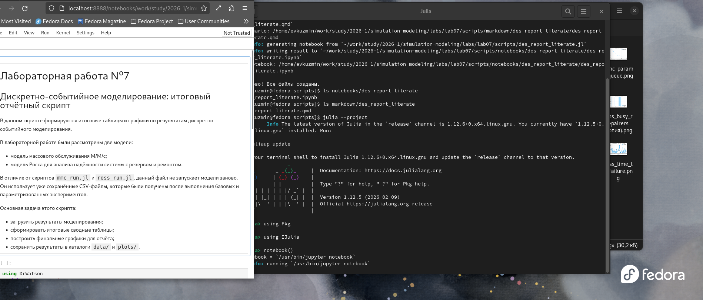{width=88%}

На изображении показано подготовка literate-версии итогового анализа и notebook-файла.

### Листинг 10. Literate-версия итогового анализа

```julia
# # Лабораторная работа №7
# ## Дискретно-событийное моделирование: итоговый отчётный скрипт
#
# В данном скрипте формируются итоговые таблицы и графики по результатам
# дискретно-событийного моделирования.
#
# В лабораторной работе были рассмотрены две модели:
#
# - модель массового обслуживания M/M/c;
# - модель Росса для анализа надёжности системы с резервом и ремонтом.
#
# В отличие от скриптов `mmc_run.jl` и `ross_run.jl`, данный файл не запускает
# модели заново. Он использует уже сохранённые CSV-файлы, которые были получены
# после выполнения базовых и параметризованных экспериментов.
#
# Основная задача этого скрипта:
#
# - загрузить результаты моделирования;
# - сформировать итоговые сводные таблицы;
# - построить финальные графики для отчёта;
# - сохранить результаты в каталоги `data/` и `plots/`.

using DrWatson
@quickactivate "project"

using DataFrames
using CSV
using Plots

# ## Загрузка результатов модели M/M/c
#
# Сначала загрузим результаты, полученные для модели M/M/c.
#
# Используются следующие файлы:
#
# - `mmc_metrics.csv` — метрики базовой симуляции;
# - `mmc_analytics.csv` — аналитические характеристики M/M/c;
# - `mmc_summary.csv` — сравнение симуляции и аналитики;
# - `mmc_params_compare.csv` — результаты параметризованного эксперимента.

mmc_metrics = CSV.read(datadir("mmc_metrics.csv"), DataFrame)
mmc_analytics = CSV.read(datadir("mmc_analytics.csv"), DataFrame)
mmc_summary = CSV.read(datadir("mmc_summary.csv"), DataFrame)
mmc_params_compare = CSV.read(datadir("mmc_params_compare.csv"), DataFrame)

# ## Загрузка результатов модели Росса
#
# Далее загрузим результаты для модели Росса.
#
# Используются следующие файлы:
#
# - `ross_metrics.csv` — метрики одного базового запуска;
# - `ross_replications_summary.csv` — сводка по серии повторов;
# - `ross_mttf_comparison.csv` — сравнение имитационного и аналитического MTTF;
# - `ross_params_summary.csv` — результаты параметризованного эксперимента;
# - `ross_params_mttf_compare.csv` — сравнение MTTF при разном числе ремонтников.

ross_metrics = CSV.read(datadir("ross_metrics.csv"), DataFrame)
ross_replications_summary = CSV.read(datadir("ross_replications_summary.csv"), DataFrame)
ross_mttf_comparison = CSV.read(datadir("ross_mttf_comparison.csv"), DataFrame)
ross_params_summary = CSV.read(datadir("ross_params_summary.csv"), DataFrame)
ross_params_mttf_compare = CSV.read(datadir("ross_params_mttf_compare.csv"), DataFrame)

# ## Итоговая сводка по модели M/M/c
#
# Сформируем таблицу с основными характеристиками базового запуска M/M/c.
#
# В таблицу включаются:
#
# - число заявок;
# - число серверов;
# - параметры `lambda` и `mu`;
# - имитационная и аналитическая загрузка;
# - среднее время ожидания;
# - среднее время пребывания заявки в системе;
# - максимальная длина очереди.

mmc_final_summary = DataFrame(
    model = ["M/M/c"],
    num_customers = [mmc_metrics.num_customers[1]],
    num_servers = [mmc_metrics.num_servers[1]],
    lambda = [mmc_metrics.lambda[1]],
    mu = [mmc_metrics.mu[1]],
    rho_simulation = [mmc_metrics.utilization[1]],
    rho_analytical = [mmc_analytics.rho[1]],
    avg_waiting_time_simulation = [mmc_metrics.avg_waiting_time[1]],
    avg_waiting_time_analytical = [mmc_analytics.Wq[1]],
    avg_system_time_simulation = [mmc_metrics.avg_system_time[1]],
    avg_system_time_analytical = [mmc_analytics.W[1]],
    max_queue_length = [mmc_metrics.max_queue_length[1]],
)

CSV.write(datadir("des_mmc_final_summary.csv"), mmc_final_summary)

# ## Итоговая сводка по модели Росса
#
# Теперь сформируем таблицу с основными характеристиками модели Росса.
#
# В таблицу включаются:
#
# - число работающих машин;
# - число резервных машин;
# - число ремонтников;
# - интенсивность отказов;
# - интенсивность ремонта;
# - время до отказа в одном запуске;
# - среднее время до отказа по серии повторов;
# - аналитическое значение MTTF;
# - средняя очередь на ремонт;
# - загрузка ремонтника.

ross_final_summary = DataFrame(
    model = ["Ross model"],
    num_operating = [ross_metrics.num_operating[1]],
    num_spares = [ross_metrics.num_spares[1]],
    num_repairers = [ross_metrics.num_repairers[1]],
    failure_rate = [ross_metrics.failure_rate[1]],
    repair_rate = [ross_metrics.repair_rate[1]],
    time_to_failure_single_run = [ross_metrics.time_to_failure[1]],
    mean_time_to_failure_simulation = [
        ross_replications_summary.mean_time_to_failure[1],
    ],
    mean_time_to_failure_analytical = [
        ross_replications_summary.analytic_mttf[1],
    ],
    avg_repair_queue = [ross_metrics.avg_repair_queue[1]],
    repairer_utilization = [ross_metrics.repairer_utilization[1]],
)

CSV.write(datadir("des_ross_final_summary.csv"), ross_final_summary)

# ## Общая обзорная таблица
#
# Создадим небольшую итоговую таблицу, которая кратко сравнивает две модели.
#
# Эта таблица нужна для финального раздела отчёта: она показывает, какой объект
# моделировался, какой параметр изменялся и какой общий вывод был получен.

des_overview = DataFrame(
    model = [
        "M/M/c",
        "Ross model",
    ],
    object = [
        "Queueing system with several service channels",
        "Reliability system with spare machines and repairers",
    ],
    main_variable = [
        "Number of servers",
        "Number of repairers",
    ],
    main_metric = [
        "Waiting time and queue length",
        "Mean time to failure and repair queue",
    ],
    conclusion = [
        "Increasing the number of servers reduces waiting time and queue length.",
        "Increasing the number of repairers increases mean time to failure and reduces repair queue.",
    ],
)

CSV.write(datadir("des_overview.csv"), des_overview)

# ## График 1. Сравнение симуляции и аналитики для M/M/c
#
# Первый график сравнивает имитационные и аналитические значения для базовой
# модели M/M/c.
#
# Для большей устойчивости используется числовая ось `x` и подписи через
# `xticks`. Это позволяет избежать ошибок backend `GR` при работе со строковыми
# подписями на оси X.

x_mmc = collect(1:nrow(mmc_summary))

p_mmc_compare = bar(
    x_mmc .- 0.15,
    mmc_summary.simulation,
    bar_width = 0.3,
    label = "Simulation",
    xlabel = "Metric",
    ylabel = "Value",
    title = "M/M/c: simulation and analytical comparison",
    xticks = (x_mmc, mmc_summary.metric),
    xrotation = 20,
)

bar!(
    p_mmc_compare,
    x_mmc .+ 0.15,
    mmc_summary.analytical,
    bar_width = 0.3,
    label = "Analytical",
)

savefig(p_mmc_compare, plotsdir("des_mmc_simulation_vs_analytics.png"))

# ## График 2. Влияние числа серверов на временные характеристики
#
# Следующий график показывает, как изменение числа серверов влияет на:
#
# - среднее время ожидания заявки;
# - среднее время пребывания заявки в системе.
#
# Ожидаемый результат: при увеличении числа серверов обе характеристики должны
# уменьшаться, так как система получает больше каналов обслуживания.

x_servers = collect(mmc_params_compare.num_servers)

p_mmc_time = plot(
    x_servers,
    mmc_params_compare.avg_waiting_time_mean,
    marker = :circle,
    xlabel = "Number of servers",
    ylabel = "Time",
    title = "M/M/c: effect of servers on time metrics",
    label = "Average waiting time",
    linewidth = 2,
)

plot!(
    p_mmc_time,
    x_servers,
    mmc_params_compare.avg_system_time_mean,
    marker = :circle,
    label = "Average system time",
    linewidth = 2,
)

savefig(p_mmc_time, plotsdir("des_mmc_time_by_servers.png"))

# ## График 3. Влияние числа серверов на очередь
#
# Этот график показывает зависимость средней максимальной длины очереди
# от числа серверов.
#
# При увеличении числа серверов очередь должна сокращаться, потому что заявки
# быстрее получают свободный канал обслуживания.

p_mmc_queue = plot(
    x_servers,
    mmc_params_compare.max_queue_length_mean,
    marker = :circle,
    xlabel = "Number of servers",
    ylabel = "Average max queue length",
    title = "M/M/c: effect of servers on queue length",
    label = "Max queue length",
    linewidth = 2,
)

savefig(p_mmc_queue, plotsdir("des_mmc_queue_by_servers.png"))

# ## График 4. Сравнение MTTF для модели Росса
#
# Для модели Росса сравним среднее время до отказа, полученное по серии
# имитационных прогонов, с аналитической оценкой MTTF.
#
# Если значения близки, это подтверждает корректность реализации модели.

x_ross = collect(1:nrow(ross_mttf_comparison))

p_ross_compare = bar(
    x_ross,
    ross_mttf_comparison.value,
    xlabel = "Method",
    ylabel = "Mean time to failure",
    title = "Ross model: simulation and analytical MTTF",
    label = "MTTF",
    xticks = (x_ross, ross_mttf_comparison.metric),
    xrotation = 15,
)

savefig(p_ross_compare, plotsdir("des_ross_mttf_comparison.png"))

# ## График 5. Влияние числа ремонтников на MTTF
#
# Теперь рассмотрим параметризованный эксперимент модели Росса.
#
# На графике показано, как число ремонтников влияет на среднее время до отказа.
# При увеличении числа ремонтников сломанные машины быстрее возвращаются в
# резерв, поэтому система в среднем должна работать дольше.

x_repairers_compare = collect(ross_params_mttf_compare.num_repairers)

p_ross_mttf = plot(
    x_repairers_compare,
    ross_params_mttf_compare.simulation_mttf,
    marker = :circle,
    xlabel = "Number of repairers",
    ylabel = "Mean time to failure",
    title = "Ross model: effect of repairers on MTTF",
    label = "Simulation mean",
    linewidth = 2,
)

plot!(
    p_ross_mttf,
    x_repairers_compare,
    ross_params_mttf_compare.analytical_mttf,
    marker = :circle,
    label = "Analytical MTTF",
    linewidth = 2,
)

savefig(p_ross_mttf, plotsdir("des_ross_mttf_by_repairers.png"))

# ## График 6. Очередь на ремонт и загрузка ремонтников
#
# Последний график объединяет две характеристики модели Росса:
#
# - среднюю очередь на ремонт;
# - среднюю загрузку ремонтников.
#
# При увеличении числа ремонтников очередь должна уменьшаться. При этом средняя
# загрузка каждого ремонтника также снижается, так как ремонтная нагрузка
# распределяется между большим количеством ресурсов.

x_repairers = collect(ross_params_summary.num_repairers)

p_ross_queue = plot(
    x_repairers,
    ross_params_summary.mean_repair_queue,
    marker = :circle,
    xlabel = "Number of repairers",
    ylabel = "Value",
    title = "Ross model: repair queue and utilization",
    label = "Mean repair queue",
    linewidth = 2,
)

plot!(
    p_ross_queue,
    x_repairers,
    ross_params_summary.mean_repairer_utilization,
    marker = :circle,
    label = "Repairer utilization",
    linewidth = 2,
)

savefig(p_ross_queue, plotsdir("des_ross_queue_utilization.png"))

# ## Итог
#
# В результате работы итогового отчётного скрипта были сформированы:
#
# - сводная таблица по модели M/M/c;
# - сводная таблица по модели Росса;
# - общая обзорная таблица по двум моделям;
# - итоговые графики для отчёта.
#
# Полученные результаты подтверждают, что увеличение числа серверов в модели
# M/M/c снижает очередь и время ожидания, а увеличение числа ремонтников в модели
# Росса повышает среднее время до отказа и уменьшает очередь на ремонт.

println("Discrete-event simulation report completed.")

println()
println("Saved data:")
println("  data/des_mmc_final_summary.csv")
println("  data/des_ross_final_summary.csv")
println("  data/des_overview.csv")

println()
println("Saved plots:")
println("  plots/des_mmc_simulation_vs_analytics.png")
println("  plots/des_mmc_time_by_servers.png")
println("  plots/des_mmc_queue_by_servers.png")
println("  plots/des_ross_mttf_comparison.png")
println("  plots/des_ross_mttf_by_repairers.png")
println("  plots/des_ross_queue_utilization.png")
```

## Параметризованная версия итогового анализа

Параметризованная версия итогового анализа не повторяет напрямую отдельные графики предыдущих экспериментов, а выполняет нормированное сравнение результатов по двум моделям.

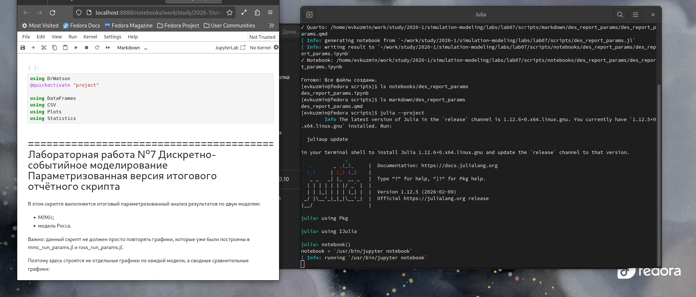{width=88%}

На изображении показана подготовка параметризованной версии итогового анализа.

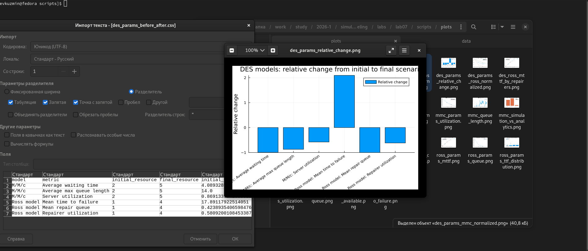{width=88%}

На изображении показаны результаты параметризованной версии итогового анализа.

### Листинг 11. Параметризованная версия итогового анализа

```julia
using DrWatson
@quickactivate "project"

using DataFrames
using CSV
using Plots
using Statistics

# =============================================================================
# Лабораторная работа №7
# Дискретно-событийное моделирование
# Параметризованная версия итогового отчётного скрипта
# =============================================================================
#
# В этом скрипте выполняется итоговый параметризованный анализ результатов
# по двум моделям:
#
# - M/M/c;
# - модель Росса.
#
# Важно:
# данный скрипт не должен просто повторять графики, которые уже были построены
# в mmc_run_params.jl и ross_run_params.jl.
#
# Поэтому здесь строятся не отдельные графики по каждой модели, а сводные
# сравнительные графики:
#
# 1. нормированное улучшение ключевых показателей;
# 2. итоговое сравнение начального и лучшего сценария;
# 3. сравнительная таблица эффекта добавления ресурсов;
# 4. общий индекс улучшения для двух моделей.
#
# Скрипт использует уже готовые CSV-файлы и не запускает модели заново.

# =============================================================================
# Загрузка параметризованных результатов
# =============================================================================

mmc_params = CSV.read(datadir("mmc_params_compare.csv"), DataFrame)
ross_params = CSV.read(datadir("ross_params_summary.csv"), DataFrame)
ross_mttf_compare = CSV.read(datadir("ross_params_mttf_compare.csv"), DataFrame)

# =============================================================================
# Подготовка данных для M/M/c
# =============================================================================
#
# Для M/M/c основным изменяемым ресурсом является число серверов.
#
# Ключевые показатели:
# - среднее время ожидания;
# - средняя максимальная длина очереди;
# - загрузка серверов.
#
# Чем меньше время ожидания и очередь, тем лучше работает система.

mmc_resource = mmc_params.num_servers
mmc_waiting = mmc_params.avg_waiting_time_mean
mmc_queue = mmc_params.max_queue_length_mean
mmc_utilization = mmc_params.utilization_mean

# Нормированное улучшение времени ожидания:
# начальное значение принимается за 1.
mmc_waiting_norm = mmc_waiting ./ mmc_waiting[1]
mmc_queue_norm = mmc_queue ./ mmc_queue[1]
mmc_utilization_norm = mmc_utilization ./ mmc_utilization[1]

# =============================================================================
# Подготовка данных для модели Росса
# =============================================================================
#
# Для модели Росса основным изменяемым ресурсом является число ремонтников.
#
# Ключевые показатели:
# - среднее время до отказа;
# - средняя очередь на ремонт;
# - загрузка ремонтников.
#
# Для времени до отказа рост является улучшением.
# Для очереди и загрузки снижение является улучшением.

ross_resource = ross_params.num_repairers
ross_mttf = ross_params.mean_time_to_failure
ross_queue = ross_params.mean_repair_queue
ross_utilization = ross_params.mean_repairer_utilization

# Нормированное изменение показателей.
# Для MTTF используем обратное отношение, чтобы уменьшение значения на графике
# также означало улучшение риска отказа.
ross_mttf_inverse_norm = ross_mttf[1] ./ ross_mttf
ross_queue_norm = ross_queue ./ ross_queue[1]
ross_utilization_norm = ross_utilization ./ ross_utilization[1]

# =============================================================================
# Итоговая таблица "начальный сценарий — лучший сценарий"
# =============================================================================
#
# Сформируем таблицу, где видно, как изменились ключевые показатели
# от минимального количества ресурсов к максимальному.

summary_before_after = DataFrame(
    model = [
        "M/M/c",
        "M/M/c",
        "M/M/c",
        "Ross model",
        "Ross model",
        "Ross model",
    ],
    metric = [
        "Average waiting time",
        "Average max queue length",
        "Server utilization",
        "Mean time to failure",
        "Mean repair queue",
        "Repairer utilization",
    ],
    initial_resource = [
        mmc_resource[1],
        mmc_resource[1],
        mmc_resource[1],
        ross_resource[1],
        ross_resource[1],
        ross_resource[1],
    ],
    final_resource = [
        mmc_resource[end],
        mmc_resource[end],
        mmc_resource[end],
        ross_resource[end],
        ross_resource[end],
        ross_resource[end],
    ],
    initial_value = [
        mmc_waiting[1],
        mmc_queue[1],
        mmc_utilization[1],
        ross_mttf[1],
        ross_queue[1],
        ross_utilization[1],
    ],
    final_value = [
        mmc_waiting[end],
        mmc_queue[end],
        mmc_utilization[end],
        ross_mttf[end],
        ross_queue[end],
        ross_utilization[end],
    ],
)

summary_before_after.relative_change = (
    summary_before_after.final_value .-
    summary_before_after.initial_value
) ./ summary_before_after.initial_value

CSV.write(datadir("des_params_before_after.csv"), summary_before_after)

# =============================================================================
# Таблица нормированных показателей M/M/c
# =============================================================================

mmc_normalized = DataFrame(
    num_servers = mmc_resource,
    waiting_time_norm = mmc_waiting_norm,
    queue_norm = mmc_queue_norm,
    utilization_norm = mmc_utilization_norm,
)

CSV.write(datadir("des_params_mmc_normalized.csv"), mmc_normalized)

# =============================================================================
# Таблица нормированных показателей модели Росса
# =============================================================================

ross_normalized = DataFrame(
    num_repairers = ross_resource,
    mttf_inverse_norm = ross_mttf_inverse_norm,
    queue_norm = ross_queue_norm,
    utilization_norm = ross_utilization_norm,
)

CSV.write(datadir("des_params_ross_normalized.csv"), ross_normalized)

# =============================================================================
# Общая таблица эффективности ресурсов
# =============================================================================
#
# Здесь показатели приводятся к единой логике:
# чем меньше нормированное значение, тем лучше.
#
# Для M/M/c:
# - waiting_time_norm;
# - queue_norm.
#
# Для Росса:
# - mttf_inverse_norm;
# - queue_norm.
#
# Общий индекс считается как среднее двух ключевых нормированных показателей.

mmc_efficiency_index = (
    mmc_waiting_norm .+
    mmc_queue_norm
) ./ 2

ross_efficiency_index = (
    ross_mttf_inverse_norm .+
    ross_queue_norm
) ./ 2

efficiency_summary = DataFrame(
    model = [
        fill("M/M/c", length(mmc_resource));
        fill("Ross model", length(ross_resource))
    ],
    resource_count = [
        mmc_resource;
        ross_resource
    ],
    efficiency_index = [
        mmc_efficiency_index;
        ross_efficiency_index
    ],
)

CSV.write(datadir("des_params_efficiency_index.csv"), efficiency_summary)

# =============================================================================
# График 1. Нормированные показатели M/M/c
# =============================================================================
#
# Этот график не повторяет обычные графики M/M/c.
# Здесь все показатели приведены к начальному значению.
#
# Значение 1 означает уровень при минимальном числе серверов.
# Снижение линии показывает улучшение характеристики.

p_mmc_norm = plot(
    mmc_resource,
    mmc_waiting_norm,
    marker = :circle,
    xlabel = "Number of servers",
    ylabel = "Normalized value",
    title = "M/M/c: normalized improvement",
    label = "Waiting time",
    linewidth = 2,
)

plot!(
    p_mmc_norm,
    mmc_resource,
    mmc_queue_norm,
    marker = :circle,
    label = "Queue length",
    linewidth = 2,
)

plot!(
    p_mmc_norm,
    mmc_resource,
    mmc_utilization_norm,
    marker = :circle,
    label = "Utilization",
    linewidth = 2,
)

savefig(p_mmc_norm, plotsdir("des_params_mmc_normalized.png"))

# =============================================================================
# График 2. Нормированные показатели модели Росса
# =============================================================================
#
# Для модели Росса время до отказа является положительной характеристикой:
# чем оно больше, тем лучше.
#
# Чтобы сохранить единую интерпретацию графика, используется обратная нормировка:
# начальное MTTF делится на текущее MTTF.
#
# Поэтому снижение линии MTTF inverse означает улучшение надёжности.

p_ross_norm = plot(
    ross_resource,
    ross_mttf_inverse_norm,
    marker = :circle,
    xlabel = "Number of repairers",
    ylabel = "Normalized value",
    title = "Ross model: normalized improvement",
    label = "MTTF inverse",
    linewidth = 2,
)

plot!(
    p_ross_norm,
    ross_resource,
    ross_queue_norm,
    marker = :circle,
    label = "Repair queue",
    linewidth = 2,
)

plot!(
    p_ross_norm,
    ross_resource,
    ross_utilization_norm,
    marker = :circle,
    label = "Repairer utilization",
    linewidth = 2,
)

savefig(p_ross_norm, plotsdir("des_params_ross_normalized.png"))

# =============================================================================
# График 3. Сравнение общего индекса улучшения
# =============================================================================
#
# Здесь сравнивается общий нормированный индекс для двух моделей.
#
# Для M/M/c индекс основан на времени ожидания и очереди.
# Для модели Росса индекс основан на обратном MTTF и очереди на ремонт.
#
# Чем ниже индекс, тем лучше состояние системы по сравнению с начальным сценарием.

p_efficiency = plot(
    mmc_resource,
    mmc_efficiency_index,
    marker = :circle,
    xlabel = "Resource count",
    ylabel = "Efficiency index",
    title = "DES models: normalized efficiency index",
    label = "M/M/c",
    linewidth = 2,
)

plot!(
    p_efficiency,
    ross_resource,
    ross_efficiency_index,
    marker = :circle,
    label = "Ross model",
    linewidth = 2,
)

savefig(p_efficiency, plotsdir("des_params_efficiency_index.png"))

# =============================================================================
# График 4. Изменение ключевых показателей от начального к лучшему сценарию
# =============================================================================
#
# Последний график показывает относительное изменение показателей.
#
# Отрицательные значения означают снижение показателя.
# Для времени ожидания, очередей и загрузки это обычно хорошо.
#
# Для MTTF значение положительное, потому что рост времени до отказа является
# улучшением надёжности.

x_change = collect(1:nrow(summary_before_after))

labels_change = string.(
    summary_before_after.model,
    ": ",
    summary_before_after.metric,
)

p_change = bar(
    x_change,
    summary_before_after.relative_change,
    xlabel = "Metric",
    ylabel = "Relative change",
    title = "DES models: relative change from initial to final scenario",
    label = "Relative change",
    xticks = (x_change, labels_change),
    xrotation = 35,
)

savefig(p_change, plotsdir("des_params_relative_change.png"))

# =============================================================================
# Итоговый вывод
# =============================================================================

println("Parameterized DES report completed.")

println()
println("Saved data:")
println("  data/des_params_before_after.csv")
println("  data/des_params_mmc_normalized.csv")
println("  data/des_params_ross_normalized.csv")
println("  data/des_params_efficiency_index.csv")

println()
println("Saved plots:")
println("  plots/des_params_mmc_normalized.png")
println("  plots/des_params_ross_normalized.png")
println("  plots/des_params_efficiency_index.png")
println("  plots/des_params_relative_change.png")
```

# Итоговые графики отчётного скрипта

## M/M/c: сравнение симуляции и аналитики

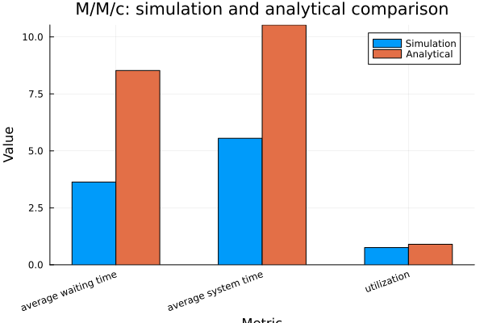{width=88%}

График показывает сравнение имитационных и аналитических характеристик модели M/M/c. Аналитические значения относятся к стационарному режиму, а симуляция выполнена для конечного числа заявок.

## M/M/c: влияние числа серверов на время

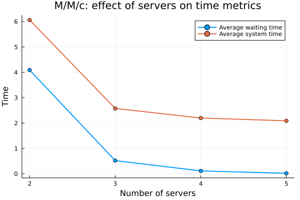{width=88%}

При увеличении числа серверов уменьшается среднее время ожидания и среднее время пребывания заявки в системе.

## M/M/c: влияние числа серверов на очередь

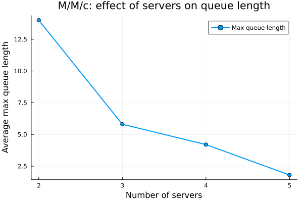{width=88%}

График показывает, что увеличение числа каналов обслуживания приводит к снижению максимальной очереди.

## Модель Росса: сравнение MTTF

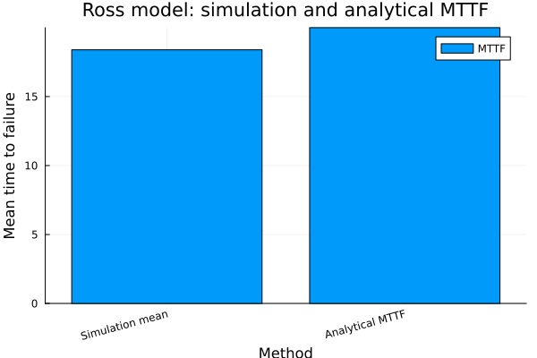{width=88%}

График сравнивает среднее время до отказа по симуляции и аналитическую оценку MTTF.

## Модель Росса: влияние числа ремонтников на MTTF

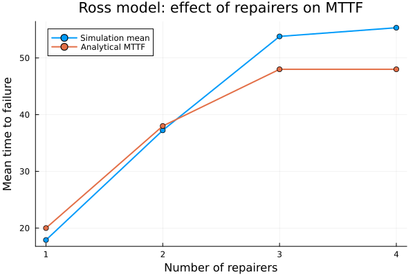{width=88%}

Увеличение числа ремонтников повышает среднее время до отказа системы, так как неисправные машины быстрее возвращаются в резерв.

## Модель Росса: очередь на ремонт и загрузка ремонтников

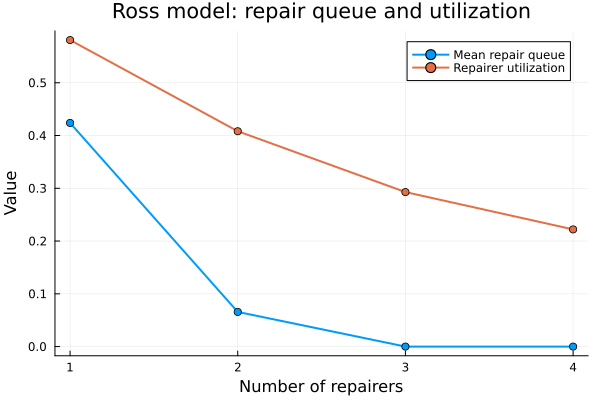{width=88%}

График показывает, что при увеличении числа ремонтников очередь на ремонт и загрузка каждого ремонтника снижаются.

# Итоговый параметризованный анализ

## Нормированные показатели M/M/c

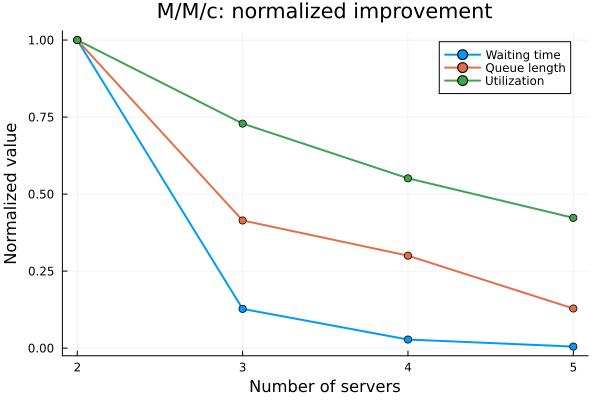{width=88%}

На графике начальный сценарий принят за 1. При увеличении числа серверов время ожидания, очередь и загрузка снижаются.

## Нормированные показатели модели Росса

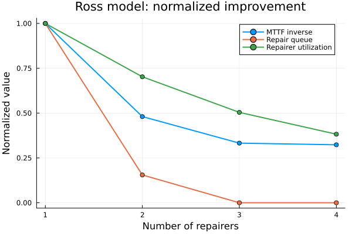{width=88%}

Для среднего времени до отказа используется обратная нормировка. Поэтому снижение линии `MTTF inverse` означает рост надёжности системы.

## Индекс эффективности

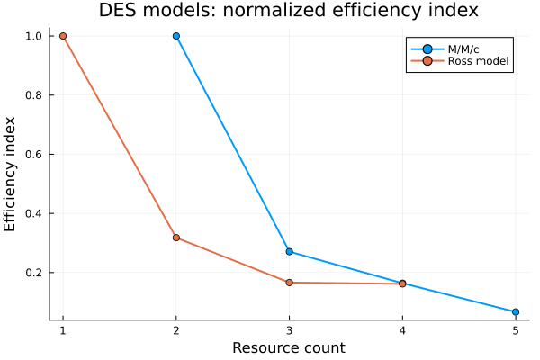{width=88%}

Индекс эффективности показывает общее улучшение систем при добавлении ресурсов. Чем ниже значение индекса, тем лучше состояние системы относительно начального сценария.

## Относительное изменение показателей

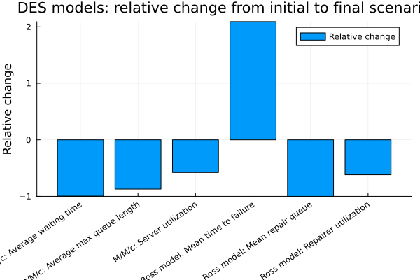{width=88%}

На графике показано изменение ключевых показателей от начального к конечному сценарию. Для M/M/c снижение времени ожидания и очереди является положительным результатом. Для модели Росса положительное изменение среднего времени до отказа означает рост надёжности.

# Выводы

В ходе лабораторной работы была выполнена реализация двух дискретно-событийных моделей: модели M/M/c и модели Росса. Для каждой модели была создана отдельная source-реализация, что позволило не дублировать код в обычных, literate- и параметризованных скриптах.

Для модели M/M/c было показано, что при высокой загрузке системы возникают очереди и увеличивается время ожидания заявок. Параметризованный эксперимент подтвердил, что увеличение числа серверов снижает среднее время ожидания, время пребывания заявки в системе и максимальную длину очереди.

Для модели Росса было показано, как система расходует и восстанавливает резервные машины. Серия независимых повторов позволила оценить среднее время до отказа. Параметризованный эксперимент показал, что увеличение числа ремонтников повышает надёжность системы, снижает очередь на ремонт и уменьшает загрузку каждого ремонтника.

Итоговый отчётный скрипт объединил результаты двух моделей и позволил выполнить сравнительный анализ. Нормированные графики показали, что добавление ресурсов улучшает работу обеих систем, но после определённого момента наблюдается эффект насыщения: дальнейшее увеличение числа ресурсов даёт менее выраженный прирост качества.

Таким образом, лабораторная работа продемонстрировала возможности дискретно-событийного моделирования для анализа систем массового обслуживания и систем надёжности с ремонтом.

# Список литературы

::: {#refs}
:::
