---
## Author
author:
  name: Кузьмин Егор Витальевич
  email: 1132236046@rudn.ru
  affiliation:
    - name: Российский университет дружбы народов
      country: Российская Федерация
      postal-code: 117198
      city: Москва
      address: ул. Миклухо-Маклая, д. 6

## Title
title: Презентация по лабораторной работе №8
date: today
---

## Цель работы

Цель лабораторной работы — реализовать и исследовать SIR-модель в дискретно-событийном подходе.

В работе необходимо было:

- подготовить source-модель SIR;
- выполнить базовую DES-симуляцию;
- создать literate- и параметризованные версии;
- провести анализ чувствительности;
- выполнить дополнительные сценарии: вакцинация, фиксированная длительность болезни, демография и SEIR;
- сохранить результаты в CSV и построить графики.

## Проверка окружения

Перед выполнением работы была проверена среда Julia и наличие необходимых пакетов.

Использовались `DrWatson`, `CSV`, `DataFrames`, `Plots`, `DifferentialEquations`, `Distributions`, `Literate` и другие пакеты, установленные в окружении проекта.

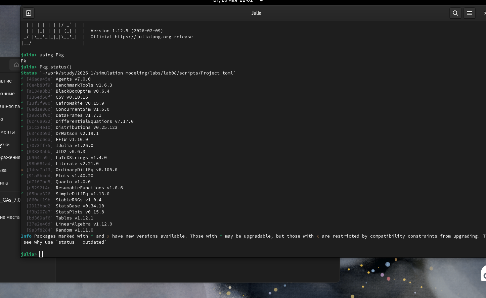{width=86%}

## Структура проекта

Лабораторная работа была оформлена в структуре проекта DrWatson.

Основные файлы:

- `src/sir_model.jl` — source-модуль модели;
- `scripts/sir_des.jl` — базовый запуск;
- `scripts/sir_des_literate.jl` — literate-версия базового запуска;
- `scripts/sir_des_params.jl` — параметризованный анализ базовой модели;
- `scripts/sir_des_analysis.jl` — аналитический скрипт;
- `scripts/sir_des_analysis_literate.jl` — literate-версия аналитического скрипта;
- `scripts/sir_des_analysis_params.jl` — параметризованный анализ дополнительных сценариев.

## Source-модель SIR

В файле `src/sir_model.jl` была реализована базовая дискретно-событийная SIR-модель.

Популяция делится на три группы:

- `S` — восприимчивые агенты;
- `I` — инфицированные агенты;
- `R` — выздоровевшие или удалённые из процесса заражения.

Состояние системы изменяется только в моменты событий: заражения, выздоровления или вакцинации.

## Базовый запуск SIR DES

В первом скрипте `sir_des.jl` выполняется базовый запуск модели с фиксированными параметрами.

Начальные условия:

```text
S0 = 990
I0 = 10
R0 = 0
beta = 0.05
c = 10.0
gamma = 0.25
tmax = 100.0
```

{width=86%}

## Динамика SIR-модели

Базовый запуск показывает типичную эпидемическую динамику.

Сначала число восприимчивых агентов уменьшается, число инфицированных растёт и достигает пика, после чего постепенно снижается. Число агентов в состоянии `R` монотонно увеличивается.

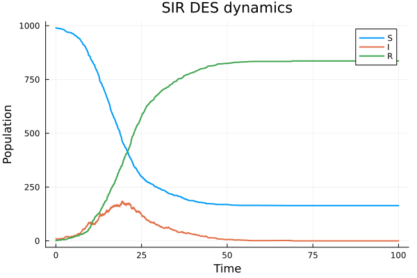{width=80%}

## Динамика инфицированных

Отдельный график инфицированных показывает выраженную эпидемическую волну.

Пик инфекции достигается в первой части моделирования, после чего количество инфицированных снижается почти до нуля.

{width=80%}

## Финальное состояние

К концу базового моделирования активных инфицированных не остаётся.

Большая часть популяции переходит в состояние `R`, а часть агентов остаётся восприимчивой.

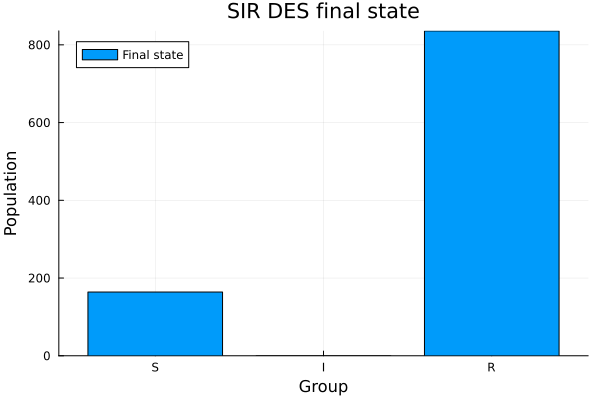{width=78%}

## Literate-версия базового скрипта

После базового запуска была подготовлена literate-версия `sir_des_literate.jl`.

Она содержит не только код, но и поясняющий текст. Такой формат удобен для генерации notebook и Quarto-документации.

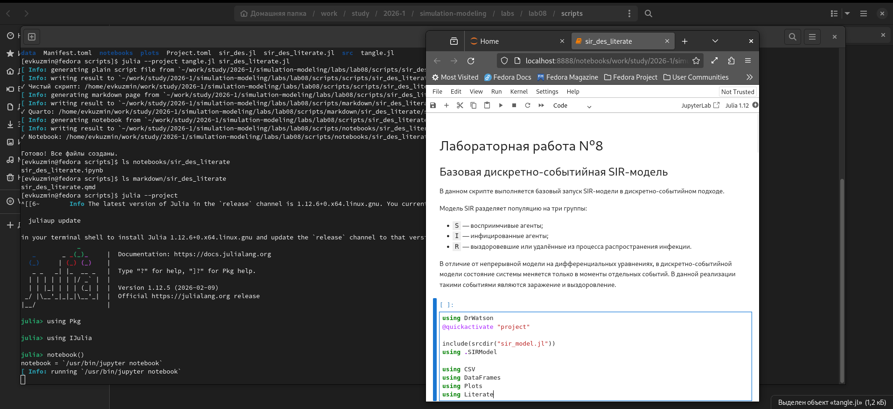{width=86%}

## Параметризованная версия базовой модели

В параметризованной версии `sir_des_params.jl` исследовалось влияние трёх параметров:

- `beta` — вероятность передачи инфекции;
- `c` — среднее число контактов;
- `gamma` — интенсивность выздоровления.

Для каждого сценария выполнялось несколько повторов с разными `seed`.

{width=86%}

## Влияние beta

При увеличении `beta` пик инфицированных возрастает.

Это ожидаемо: чем выше вероятность передачи инфекции при контакте, тем быстрее инфекция распространяется по популяции.

{width=80%}

## Влияние числа контактов

Увеличение среднего числа контактов `c` также повышает пик инфицированных.

Большое число контактов создаёт больше возможностей для заражения восприимчивых агентов.

{width=80%}

## Влияние gamma

Параметр `gamma` отвечает за интенсивность выздоровления.

При увеличении `gamma` пик инфицированных снижается, потому что агенты быстрее переходят из состояния `I` в состояние `R`.

{width=80%}

## Итоговый размер эпидемии

Параметризованный эксперимент также сравнивает итоговый размер эпидемии.

Наибольший итоговый размер наблюдается при параметрах, усиливающих распространение инфекции: высокой вероятности заражения и большом числе контактов.

{width=82%}

## Результаты параметризованной версии

Параметризованный запуск подтвердил ожидаемое поведение SIR-модели.

Параметры `beta` и `c` усиливают распространение инфекции, а увеличение `gamma` снижает интенсивность эпидемического процесса.

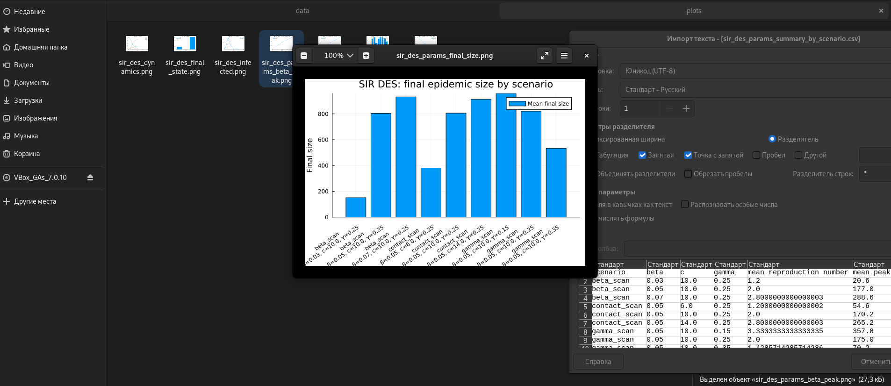{width=86%}

## Аналитический скрипт

Второй основной скрипт `sir_des_analysis.jl` выполняет расширенный анализ.

В нём рассмотрены:

- сравнение DES и ODE;
- сценарий вакцинации;
- фиксированная длительность болезни;
- сравнение пиков инфекции;
- сравнение итогового размера эпидемии;
- оценка производительности.

{width=86%}

## Сравнение DES и ODE

DES-модель сравнивается с детерминированной SIR-моделью на дифференциальных уравнениях.

Обе модели дают похожую форму эпидемической волны, но DES-кривая имеет случайные колебания, а ODE-кривая является гладкой.

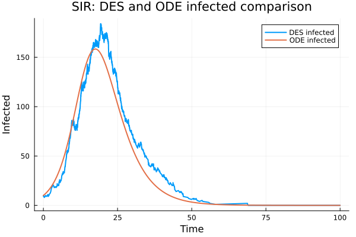{width=80%}

## Сценарий вакцинации

В сценарии вакцинации часть восприимчивых агентов переводится в состояние `R`.

Это снижает число доступных для заражения агентов и уменьшает пик инфицированных.

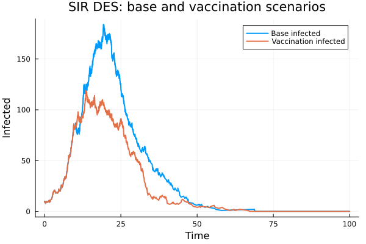{width=80%}

## Фиксированная длительность болезни

В дополнительном сценарии случайное время выздоровления заменяется фиксированной длительностью болезни.

При фиксированной длительности пик получается более резким и высоким, потому что инфицированные агенты одновременно дольше остаются в состоянии `I`.

{width=80%}

## Сравнение пиков инфекции

На диаграмме видно, что сценарий вакцинации снижает пик инфекции.

Самый высокий пик наблюдается при фиксированной длительности болезни, так как инфицированные накапливаются быстрее.

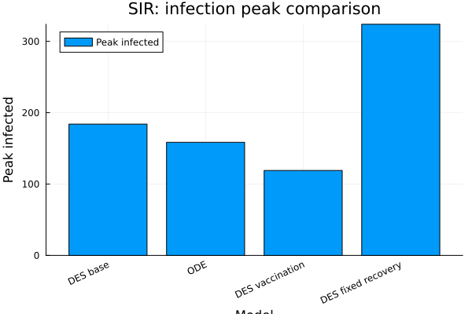{width=80%}

## Сравнение итогового размера эпидемии

Итоговый размер эпидемии показывает число агентов, перешедших в состояние `R`.

Различия между сценариями по итоговому размеру менее резкие, чем по пику инфекции, но вакцинация всё равно уменьшает масштаб распространения.

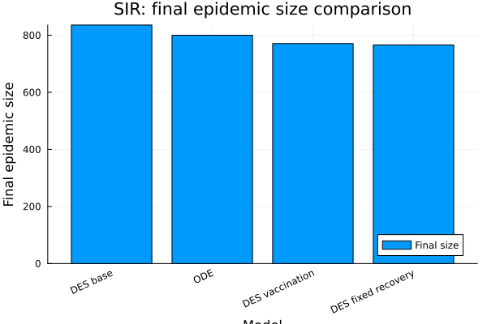{width=80%}

## Производительность модели

Производительность оценивалась при разных размерах популяции.

Время выполнения возрастает с увеличением числа агентов, что связано с ростом количества событий, которые должна обработать DES-модель.

{width=80%}

## Literate-версия аналитического скрипта

Для второго скрипта также была подготовлена literate-версия `sir_des_analysis_literate.jl`.

Она документирует сравнение моделей и дополнительные сценарии, а также используется для формирования notebook.

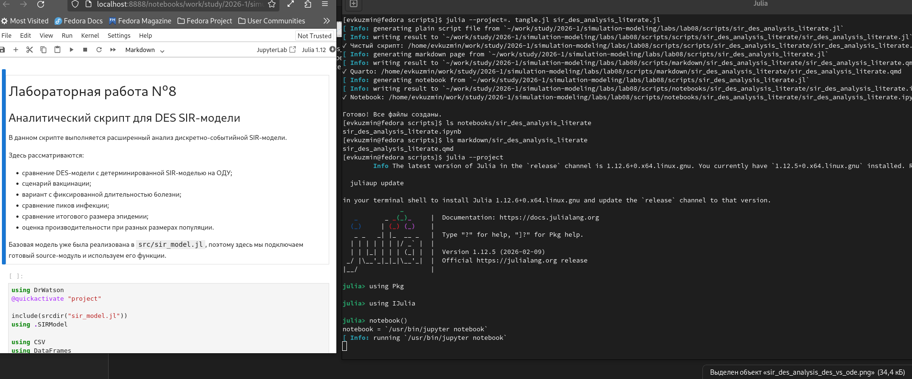{width=86%}

## Параметризованная аналитическая версия

В файле `sir_des_analysis_params.jl` выполнен параметризованный анализ дополнительных сценариев.

Исследованы:

- доля вакцинации;
- фиксированная длительность болезни;
- параметр демографии `mu`;
- параметр SEIR-модели `sigma`;
- размер популяции для оценки производительности.

{width=86%}

## Демографический сценарий

Демографический сценарий учитывает рождения и смерти.

При увеличении `mu` финальная численность популяции меняется, а пик инфицированных остаётся сравнительно близким к базовому уровню.

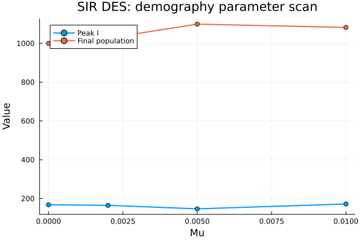{width=80%}

## Фиксированная длительность болезни: параметры

При увеличении фиксированной длительности болезни растут и пик инфицированных, и итоговый размер эпидемии.

Чем дольше агент остаётся инфицированным, тем больше времени он может заражать других.

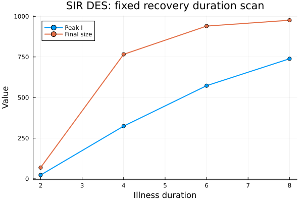{width=80%}

## SEIR-расширение

В SEIR-модели добавлено состояние `E`: заражённые, но ещё не инфекционные агенты.

При росте `sigma` агенты быстрее переходят из `E` в `I`, поэтому пик `E` уменьшается, а пик `I` растёт.

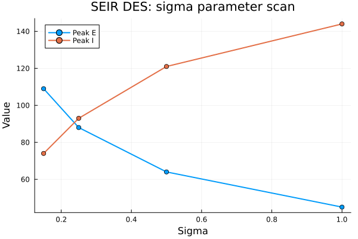{width=80%}

## Производительность в параметризованной версии

Дополнительно была повторена оценка производительности.

Результат подтверждает, что время выполнения увеличивается при росте размера популяции.

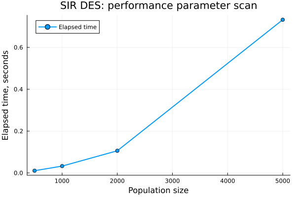{width=80%}

## Результаты параметризованной аналитической версии

Параметризованная аналитическая версия закрывает дополнительные задания и показывает влияние расширений модели на результаты DES-моделирования.

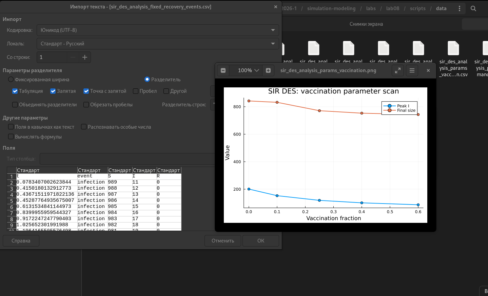{width=86%}

## Выполнение дополнительных заданий

В работе были выполнены дополнительные пункты:

- анализ чувствительности к `beta`, `c`, `gamma`;
- фиксированная длительность болезни;
- оценка производительности;
- сохранение результатов в CSV;
- демография;
- вакцинация;
- SEIR-расширение.

## Основные выводы

В ходе работы была реализована дискретно-событийная SIR-модель и проведены несколько групп экспериментов.

DES-модель воспроизводит типичную эпидемическую волну и согласуется по форме с детерминированной SIR-моделью.

Параметры заражения и контактов усиливают эпидемию, а увеличение скорости выздоровления снижает её интенсивность.

## Итог

Дополнительные сценарии показали, что структура модели существенно влияет на результаты.

Вакцинация снижает пик инфекции, фиксированная длительность болезни может формировать более резкий пик, демография меняет численность популяции, а SEIR-расширение позволяет учитывать скрытую стадию заражения.

Лабораторная работа демонстрирует, как DES-подход можно использовать для гибкого моделирования эпидемических процессов.
