# Цель работы

Цель лабораторной работы — реализовать и исследовать SIR-модель в дискретно-событийном подходе. В ходе работы была создана базовая source-модель, выполнен запуск основной DES-симуляции, подготовлены literate- и параметризованные версии скриптов, а также проведён расширенный анализ дополнительных сценариев.

В работе рассматриваются следующие группы агентов:

- `S` — восприимчивые агенты;
- `I` — инфицированные агенты;
- `R` — выздоровевшие или удалённые из процесса распространения инфекции.

Дискретно-событийный подход отличается от непрерывного тем, что состояние системы изменяется не на каждом малом шаге времени, а только в моменты наступления событий. В данной реализации такими событиями являются заражение, выздоровление, вакцинация, а в дополнительных сценариях также демографические события и переходы SEIR-модели.

# Используемые файлы и структура работы

В лабораторной работе были подготовлены следующие основные файлы:

| Файл | Назначение |
|---|---|
| `src/sir_model.jl` | source-модуль с базовой DES SIR-моделью и вспомогательными функциями |
| `scripts/sir_des.jl` | обычный базовый запуск DES SIR-модели |
| `scripts/sir_des_literate.jl` | literate-версия базового запуска |
| `scripts/sir_des_params.jl` | параметризованная версия базового запуска |
| `scripts/sir_des_analysis.jl` | второй аналитический скрипт со сравнением и дополнительными сценариями |
| `scripts/sir_des_analysis_literate.jl` | literate-версия аналитического скрипта |
| `scripts/sir_des_analysis_params.jl` | параметризованная аналитическая версия |
| `scripts/tangle.jl` | вспомогательный файл для генерации производных файлов из literate-скриптов |

На первом этапе была реализована базовая модель, затем выполнен запуск `sir_des.jl`. После этого были подготовлены literate- и параметризованные версии первого скрипта. На втором этапе был создан аналитический скрипт `sir_des_analysis.jl`, в котором выполнено сравнение с детерминированной SIR-моделью, рассмотрена вакцинация, фиксированная длительность болезни и оценена производительность. Затем для него также были подготовлены literate- и параметризованные версии.

# Проверка окружения Julia

Перед выполнением моделирования была проверена установка необходимых пакетов Julia. На скриншоте показано, что в окружении проекта присутствуют библиотеки, необходимые для работы: `DataFrames`, `CSV`, `Plots`, `DrWatson`, `DifferentialEquations`, `Distributions`, `Random`, `Literate` и другие.

{width=88%}

Наличие этих пакетов позволяет запускать дискретно-событийную модель, сохранять результаты в CSV, строить графики, решать детерминированную систему ОДУ и формировать literate-версии скриптов.

# Source-модель `sir_model.jl`

Основная логика модели вынесена в файл `src/sir_model.jl`. Такой подход позволяет отделить вычислительную модель от скриптов запуска и анализа. В модуле определены структуры параметров, агента и результата симуляции, а также функции для запуска базовой DES SIR-модели, сценария вакцинации и формирования итоговых таблиц.

```{.julia code-line-numbers=true}

```

В source-файле реализована функция `simulate_sir_des`, которая выполняет стохастическое дискретно-событийное моделирование. На каждом шаге рассчитываются интенсивности заражения и выздоровления, затем случайным образом определяется время до следующего события и тип события. После этого состояние популяции обновляется, а значения `S`, `I`, `R` сохраняются во временные ряды.

Также в source-модуль добавлена функция `simulate_sir_des_vaccination`, которая моделирует вакцинацию: в заданный момент времени часть восприимчивых агентов переводится из состояния `S` в состояние `R`.

# Базовый запуск DES SIR-модели

## Скрипт `sir_des.jl`

Файл `scripts/sir_des.jl` выполняет базовый запуск модели. В нём задаются начальные параметры, запускается симуляция, формируются таблицы и строятся основные графики.

```{.julia code-line-numbers=true}

```

Для базового запуска были использованы параметры:

| Параметр | Значение | Смысл |
|---|---:|---|
| `S0` | 990 | начальное число восприимчивых |
| `I0` | 10 | начальное число инфицированных |
| `R0` | 0 | начальное число выздоровевших |
| `beta` | 0.05 | вероятность передачи инфекции |
| `c` | 10.0 | среднее число контактов |
| `gamma` | 0.25 | интенсивность выздоровления |
| `tmax` | 100.0 | время моделирования |
| `seed` | 123 | начальное значение генератора случайных чисел |

При таких параметрах базовое репродуктивное число равно:

$$
R_0 = \frac{\beta c}{\gamma} =
\frac{0.05 \cdot 10}{0.25} = 2.
$$

Так как $R_0 > 1$, инфекция в начале моделирования распространяется, а не затухает сразу.

## Выполнение базового скрипта

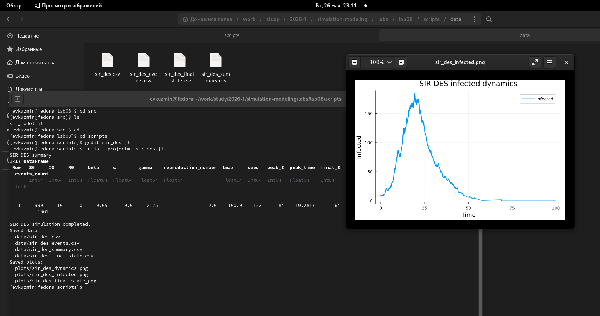{width=88%}

По результатам выполнения базового скрипта были сохранены таблицы с временными рядами, событиями и итоговой сводкой. Также были построены графики динамики `S`, `I`, `R`, отдельная динамика инфицированных и финальное состояние системы.

## Динамика SIR-модели

{width=88%}

На графике общей динамики видно классическое поведение SIR-модели. Число восприимчивых агентов `S` постепенно уменьшается, так как часть агентов заражается и переходит в состояние `I`. Число инфицированных сначала растёт, затем достигает пика и после этого снижается. Число агентов в состоянии `R` монотонно увеличивается, поскольку выздоровевшие агенты больше не участвуют в распространении инфекции.

## Динамика инфицированных

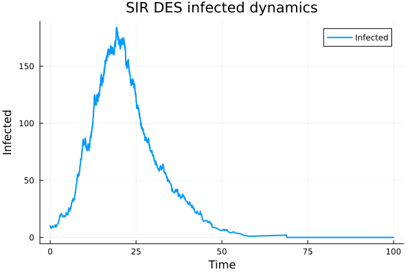{width=88%}

Отдельный график инфицированных показывает эпидемическую волну. На начальном участке число инфицированных растёт, затем достигает максимума, после чего начинает снижаться. Снижение связано с тем, что восприимчивых агентов становится меньше, а инфицированные постепенно переходят в состояние `R`.

## Финальное состояние

{width=75%}

Финальное состояние показывает распределение агентов по группам в конце моделирования. В базовом сценарии активных инфицированных к концу моделирования практически не остаётся, а основная часть популяции переходит в состояние `R`. Это означает, что эпидемия завершилась естественным образом.

# Literate-версия первого скрипта

Для базового запуска была подготовлена literate-версия `scripts/sir_des_literate.jl`. Она содержит тот же вычислительный сценарий, но оформлена как пояснительный документ: перед блоками кода добавлены текстовые комментарии, описывающие смысл выполняемых действий.

```{.julia code-line-numbers=true}

```

{width=88%}

Literate-версия нужна для того, чтобы из одного файла можно было получить чистый Julia-скрипт, Jupyter Notebook и Quarto-документ. Генерация производных файлов выполнялась отдельно через `tangle.jl`.

# Параметризованная версия первого скрипта

## Скрипт `sir_des_params.jl`

Параметризованная версия первого скрипта предназначена для анализа чувствительности модели к основным параметрам SIR-модели: `beta`, `c` и `gamma`.

```{.julia code-line-numbers=true}

```

В этом скрипте формируются несколько сценариев:

| Группа сценариев | Изменяемый параметр | Значения |
|---|---|---|
| `beta_scan` | `beta` | 0.03, 0.05, 0.07 |
| `contact_scan` | `c` | 6.0, 10.0, 14.0 |
| `gamma_scan` | `gamma` | 0.15, 0.25, 0.35 |

Для каждого сценария выполняется несколько повторов с разными `seed`, так как DES-модель является стохастической. После этого рассчитываются средние значения пика инфицированных, времени пика, итогового размера эпидемии и числа событий.

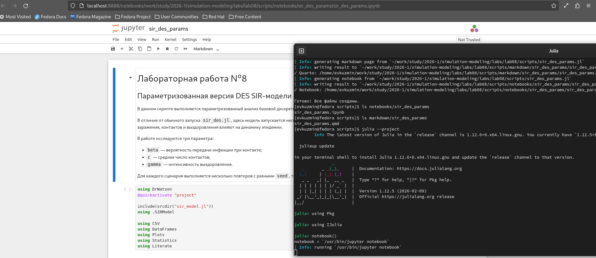{width=88%}

{width=88%}

## Влияние `beta`

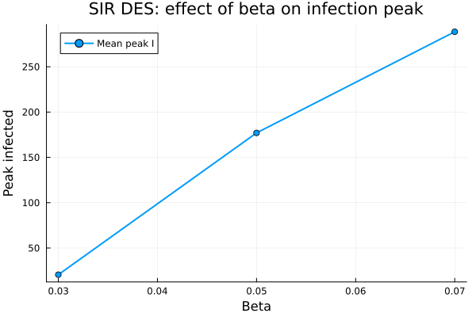{width=80%}

Параметр `beta` отвечает за вероятность передачи инфекции при контакте. На графике видно, что при увеличении `beta` пик инфицированных возрастает. Это объясняется тем, что при большей вероятности передачи инфекции каждый контакт чаще приводит к заражению, поэтому эпидемия развивается быстрее и достигает более высокого максимума.

## Влияние среднего числа контактов

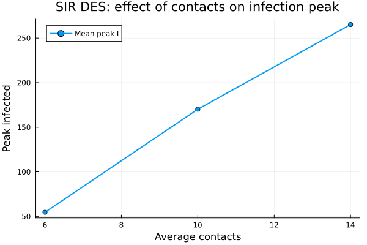{width=80%}

Параметр `c` задаёт среднее число контактов. При росте числа контактов максимальное количество инфицированных увеличивается. Это связано с тем, что большее число контактов повышает частоту потенциальных заражений.

## Влияние `gamma`

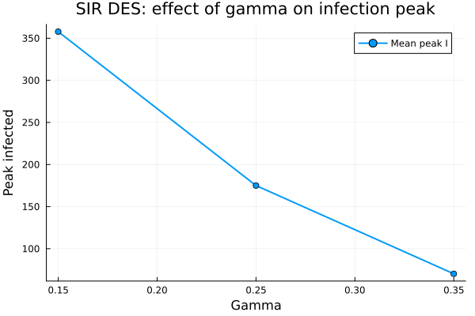{width=80%}

Параметр `gamma` отвечает за интенсивность выздоровления. При увеличении `gamma` максимальное число инфицированных снижается. Инфицированные агенты быстрее переходят в состояние `R`, меньше времени остаются источниками заражения и поэтому заражают меньше восприимчивых агентов.

## Итоговый размер эпидемии по сценариям

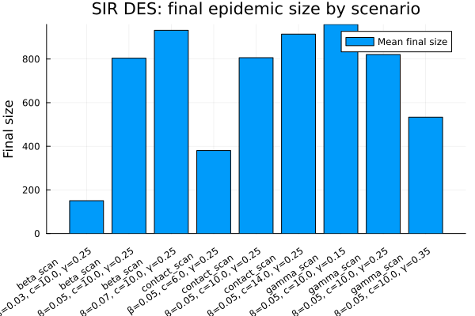{width=88%}

Столбчатая диаграмма показывает итоговый размер эпидемии для разных сценариев. Наибольшие значения наблюдаются при увеличении вероятности передачи инфекции и числа контактов. При увеличении интенсивности выздоровления итоговый размер эпидемии уменьшается, так как инфицированные быстрее выходят из процесса распространения инфекции.

# Аналитический скрипт

## Скрипт `sir_des_analysis.jl`

Второй основной скрипт `scripts/sir_des_analysis.jl` выполняет расширенный анализ модели. В нём реализованы сравнение DES-модели с детерминированной SIR-моделью на ОДУ, сценарий вакцинации, вариант с фиксированной длительностью болезни и оценка производительности.

```{.julia code-line-numbers=true}

```

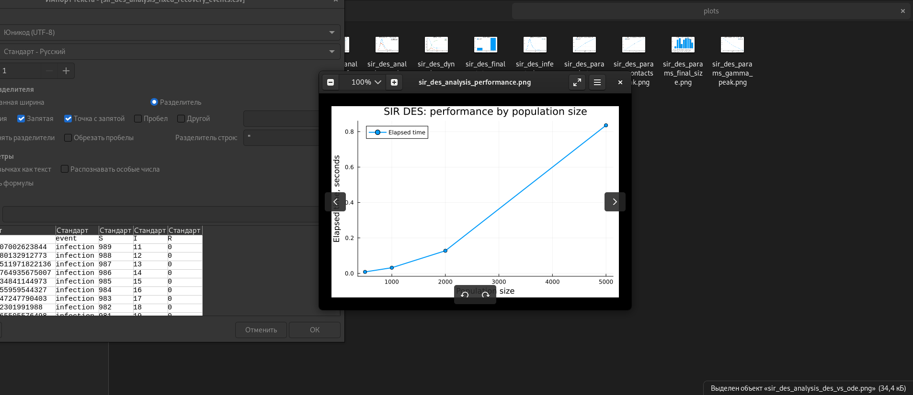{width=88%}

## Сравнение DES и ODE

{width=82%}

График показывает, что DES и ODE дают похожую форму эпидемической волны: число инфицированных сначала растёт, затем достигает пика и постепенно снижается. При этом DES-кривая имеет случайные колебания, так как события заражения и выздоровления происходят стохастически. ODE-кривая является гладкой, поскольку описывает усреднённую непрерывную динамику.

## Сценарий вакцинации

{width=82%}

На графике сравниваются базовый DES-сценарий и сценарий вакцинации. В сценарии вакцинации часть восприимчивых агентов переводится в состояние `R`, то есть исключается из дальнейшего процесса заражения. Поэтому пик инфицированных становится ниже, а эпидемическая волна менее выраженной.

## Фиксированная длительность болезни

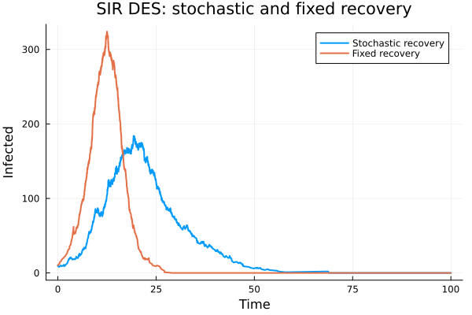{width=82%}

На этом графике сравниваются стохастическое выздоровление и фиксированная длительность болезни. В варианте с фиксированным временем болезни пик получается более резким и высоким, так как агенты остаются инфицированными одинаковое время. Это показывает, что распределение времени болезни влияет на форму эпидемической кривой.

## Сравнение пиков инфекции

{width=82%}

Диаграмма показывает максимальное число инфицированных для разных вариантов модели. Самый низкий пик наблюдается в сценарии вакцинации, так как часть восприимчивых агентов заранее исключается из процесса распространения инфекции. Самый высокий пик возникает в модели с фиксированным временем выздоровления.

## Сравнение итогового размера эпидемии

{width=82%}

На графике итогового размера эпидемии видно, что все сценарии приводят к значительному числу агентов в состоянии `R`. Сценарий вакцинации снижает итоговый размер эпидемии по сравнению с базовым DES-сценарием. Различия по итоговому размеру меньше, чем различия по пику инфекции, что означает: форма волны может сильно меняться даже при близком итоговом числе затронутых агентов.

## Производительность

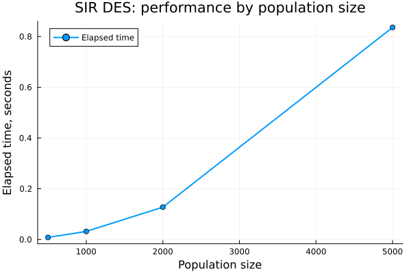{width=82%}

График показывает зависимость времени выполнения модели от размера популяции. При малом числе агентов модель выполняется почти мгновенно. При увеличении популяции время выполнения возрастает, поскольку необходимо обрабатывать больше событий заражения и выздоровления.

# Literate-версия аналитического скрипта

Для аналитического скрипта была подготовлена literate-версия `scripts/sir_des_analysis_literate.jl`. Она сохраняет вычислительную логику обычного аналитического скрипта, но дополнена пояснениями для дальнейшей генерации notebook и Quarto-документа.

```{.julia code-line-numbers=true}

```

{width=88%}

# Параметризованная аналитическая версия

## Скрипт `sir_des_analysis_params.jl`

Параметризованная аналитическая версия используется для исследования дополнительных сценариев: вакцинации, фиксированной длительности болезни, демографии, SEIR-расширения и производительности.

```{.julia code-line-numbers=true}

```

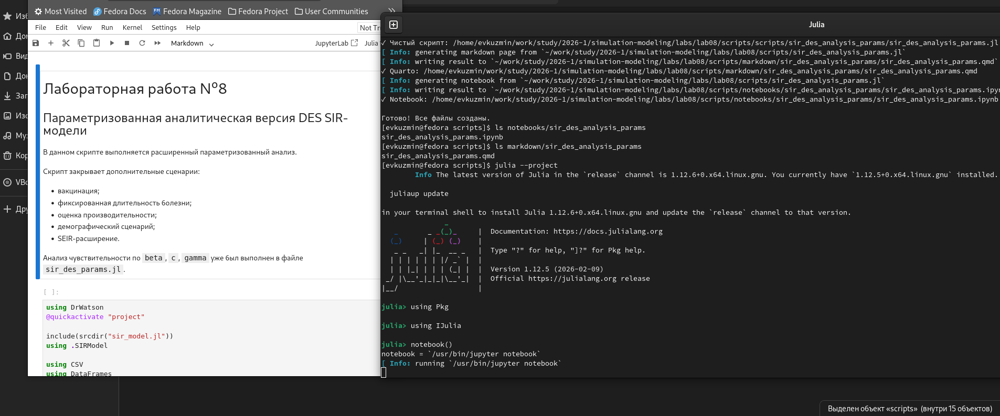{width=88%}

{width=88%}

## Параметризованный сценарий вакцинации

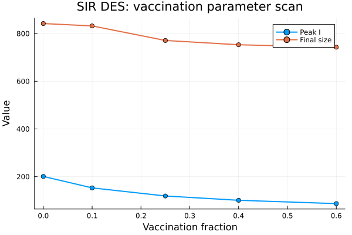{width=82%}

В этом сценарии изменяется доля вакцинированных агентов. Чем больше доля вакцинации, тем меньше восприимчивых агентов остаётся в системе, поэтому пик инфицированных и итоговый размер эпидемии снижаются.

## Фиксированная длительность болезни

{width=82%}

График показывает, что при увеличении фиксированной длительности болезни растёт и пик инфицированных, и итоговый размер эпидемии. Чем дольше агент остаётся инфицированным, тем больше времени он может заражать других.

## Демографический сценарий

{width=82%}

В демографическом сценарии изменяется параметр `mu`, отвечающий за интенсивность рождений и смертей. При увеличении `mu` финальная численность популяции может возрастать, поскольку в модель добавляются новые восприимчивые агенты. Пик инфицированных меняется слабее, чем финальная численность.

## SEIR-сценарий

{width=82%}

В SEIR-модели добавляется промежуточное состояние `E` — заражённые, но ещё не инфекционные агенты. Параметр `sigma` отвечает за скорость перехода из состояния `E` в состояние `I`. При увеличении `sigma` пик скрыто заражённых уменьшается, а пик инфицированных возрастает, так как агенты быстрее становятся инфекционными.

## Производительность в параметризованной версии

{width=82%}

График подтверждает, что при увеличении размера популяции время выполнения возрастает. Это ожидаемо для DES-подхода, так как большее число агентов приводит к увеличению числа событий, которые нужно обработать.

# Выполнение дополнительных заданий

В рамках лабораторной работы были закрыты дополнительные задания:

| Пункт | Реализация |
|---|---|
| Анализ чувствительности к `beta`, `c`, `gamma` | `sir_des_params.jl` |
| Детерминированная длительность болезни | `sir_des_analysis.jl`, `sir_des_analysis_params.jl` |
| Оценка производительности | `sir_des_analysis.jl`, `sir_des_analysis_params.jl` |
| Сохранение результатов в CSV | все основные и параметризованные скрипты |
| Демографический сценарий | `sir_des_analysis_params.jl` |
| Вакцинация | `sir_des_analysis.jl`, `sir_des_analysis_params.jl` |
| SEIR-расширение | `sir_des_analysis_params.jl` |

Таким образом, дополнительные задания были выполнены в рамках параметризованной и аналитической частей работы.

# Итоговый вывод

В ходе лабораторной работы была реализована SIR-модель в дискретно-событийном подходе. Базовый запуск показал типичную эпидемическую динамику: рост числа инфицированных, достижение пика и последующее снижение. Параметризованный анализ подтвердил, что увеличение вероятности заражения и числа контактов усиливает эпидемию, а увеличение интенсивности выздоровления снижает пик инфекции.

Аналитическая часть показала, что DES-модель согласуется с детерминированной ODE-моделью по общей форме эпидемической волны, но отличается случайными колебаниями. Сценарий вакцинации снижает пик инфекции и итоговый масштаб эпидемии. Вариант с фиксированной длительностью болезни показал, что механизм выздоровления влияет на форму эпидемической кривой. Дополнительно были рассмотрены демографический сценарий и SEIR-расширение. Оценка производительности показала, что время выполнения увеличивается при росте размера популяции, что соответствует особенностям дискретно-событийного моделирования.

# Список литературы

::: {#refs}
:::
